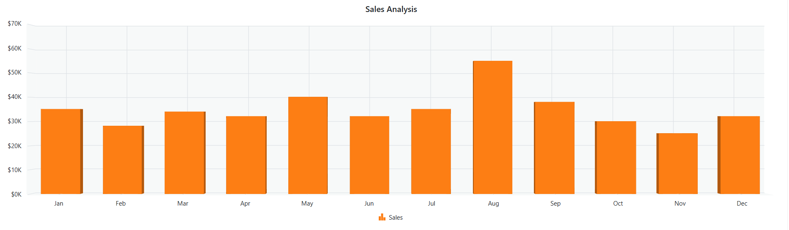

# Getting Started with Syncfusion® JavaScript (ES5) 3D Chart Control

Build your first Syncfusion JavaScript (ES5) application with a simple 3D Chart in just a few minutes. This quickstart guides you through creating a minimal, runnable HTML page that loads the Syncfusion EJ2 (ES5) 3D Chart from the CDN, initializes it with sample data, and renders an interactive Column chart with a title.

## Prerequisites

* [Visual Studio Code](https://code.visualstudio.com) (or any text editor)
* A web browser to view the result
* A local web server such as the VS Code [Live Server](https://marketplace.visualstudio.com/items?itemName=ritwickdey.LiveServer) extension

## Dependencies

The 3D Chart control ships as part of the `@syncfusion/ej2-charts` package. Below is the list of minimum dependencies required.

```
|-- @syncfusion/ej2-charts
    |-- @syncfusion/ej2-base
    |-- @syncfusion/ej2-data
    |-- @syncfusion/ej2-pdf-export
    |-- @syncfusion/ej2-file-utils
    |-- @syncfusion/ej2-compression
    |-- @syncfusion/ej2-svg-base
```


## Quick Setup

### Step 1: Create Folder and HTML file

* Create a folder named `quickstart` in your desired directory.
* Inside the `quickstart` folder, create two new files: `index.html` and `index.js`.

### Step 2: Add Syncfusion<sup style="font-size:70%">&reg;</sup> CDN Resources

Include the following JavaScript links in the `<head>` section.

**Scripts (JavaScript):**
```html
<script src="https://cdn.syncfusion.com/ej2/33.2.3/ej2-base/dist/global/ej2-base.min.js" type="text/javascript"></script>
<script src="https://cdn.syncfusion.com/ej2/33.2.3/ej2-data/dist/global/ej2-data.min.js" type="text/javascript"></script>
<script src="https://cdn.syncfusion.com/ej2/33.2.3/ej2-svg-base/dist/global/ej2-svg-base.min.js" type="text/javascript"></script>
<script src="https://cdn.syncfusion.com/ej2/33.2.3/ej2-charts/dist/global/ej2-charts.min.js" type="text/javascript"></script>
```

**Or**, to load all Syncfusion components in a single combined bundle:

```html
<script src="https://cdn.syncfusion.com/ej2/33.2.3/dist/ej2.min.js" type="text/javascript"></script>
```

### Step 3: Add the Syncfusion<sup style="font-size:70%">&reg;</sup> 3D Chart Control to the Application

The `index.html` file references a separate `index.js` file that contains the 3D Chart initialization. This keeps your markup and script logic cleanly separated, which is the recommended pattern for Syncfusion<sup style="font-size:70%">&reg;</sup> JavaScript (ES5) apps.

The global scripts added in Step 2 register the `ej.charts.Chart3D` class on the `ej` namespace, so `index.js` does not import anything manually. The script then builds the 3D Chart with sample monthly sales data, applies a value-type of `'Category'` to the horizontal axis, formats the vertical axis labels, sets a chart title, and renders the control into the `#element` container defined in `index.html`.

Key options used in the configuration object:

- [`primaryXAxis.valueType`](https://ej2.syncfusion.com/javascript/documentation/api/chart3d/chart3daxismodel#valuetype) — Axis data type. Set to `'Category'` because the sample data uses month names.
- [`primaryYAxis.labelFormat`](https://ej2.syncfusion.com/javascript/documentation/api/chart3d/chart3daxismodel#labelformat) — Format string applied to the axis labels. The example uses `'${value}K'` to add a `$` prefix and `K` suffix to each label, where `{value}` is a placeholder for the raw number.
- [`series`](https://ej2.syncfusion.com/javascript/documentation/api/chart3d/chart3daxismodel#labelformat) — Array of series to render. Each series has a [`dataSource`](https://ej2.syncfusion.com/javascript/documentation/api/chart3d/chart3daxismodel#labelformat), [`xName`](https://ej2.syncfusion.com/javascript/documentation/api/chart3d/chart3dseriesmodel#xname), [`yName`](https://ej2.syncfusion.com/javascript/documentation/api/chart3d/chart3dseriesmodel#yname), [`type`](https://ej2.syncfusion.com/javascript/documentation/api/chart3d/chart3dseriesmodel#type) (e.g. `'Column'`), and an optional [`name`](https://ej2.syncfusion.com/javascript/documentation/api/chart3d/chart3dseriesmodel#name) used by the legend.
- [`title`](https://ej2.syncfusion.com/javascript/documentation/api/chart3d/chart3daxismodel#title) — Text shown above the 3D Chart.

Finally, `chart3D.appendTo('#element')` renders the control into the `<div id="element">` element declared in `index.html`.

Copy the snippets below into the matching files in your `quickstart` folder.










### Step 4: Open in Browser

Open `quickstart/index.html` through a local web server. With the VS Code **Live Server** extension installed, right-click `index.html` in the Explorer and choose **Open with Live Server**, then visit the URL it prints (for example, `http://127.0.0.1:5500/`). You should see the Syncfusion 3D Chart control displaying the sample sales data.

## Output

The 3D Chart shows 12 months of sales data rendered as 3D columns. The title "Sales Analysis" appears above the chart.





## Troubleshooting

- **The page is blank.** Open the page through a local web server (for example, the VS Code **Live Server** extension) instead of double-clicking the file. Syncfusion charts require an `http://` or `https://` origin.
- **`ej is not defined`.** Confirm that `ej2-charts.min.js` is loaded before your script. Place the `<script>` tag inside the `<head>` or just before your own `<script src="index.js">` tag.
- **The container is empty.** Make sure the `id` in your markup (`#element`) matches the selector passed to `appendTo('#element')`.
- **The axis labels are missing the `$`/`K` prefix/suffix.** Verify that `primaryYAxis.labelFormat` is set to `'${value}K'` (with the curly braces preserved).
