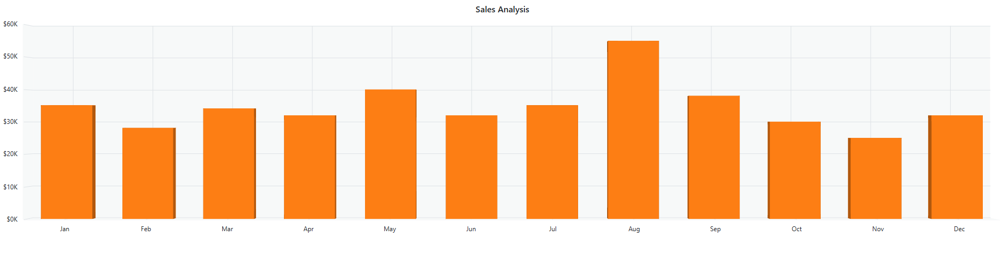

# Getting started with ##Platform_Name## 3D Chart control

This document explains how to create a simple 3D Chart and configure its features in TypeScript using the Essential JS 2 webpack [quickstart](https://github.com/SyncfusionExamples/ej2-quickstart-webpack) seed repository.

> This application is integrated with the `webpack.config.js` configuration and uses the latest version of the [webpack-cli](https://webpack.js.org/api/cli/#commands). It requires node `v14.15.0` or higher. For more information about webpack and its features, refer to the [webpack getting-started guide](https://webpack.js.org/guides/getting-started/).

## Prerequisites

Before you begin, ensure you have the following installed on your machine:

* [Node.js](https://nodejs.org/) (v14.15.0 or higher)
* [Visual Studio Code](https://code.visualstudio.com) (or any text editor)
* [Git](https://git-scm.com/) for cloning the quickstart repository
* A modern web browser (Chrome, Edge, Firefox, or Safari) to view the result

## Dependencies

The 3D Chart control ships as part of the `@syncfusion/ej2-charts` package. Below is the list of minimum dependencies required.

```
|-- @syncfusion/ej2-charts
    |-- @syncfusion/ej2-base
    |-- @syncfusion/ej2-data
    |-- @syncfusion/ej2-pdf-export
    |-- @syncfusion/ej2-file-utils
    |-- @syncfusion/ej2-compression
    |-- @syncfusion/ej2-svg-base
```


## Quick Setup

### Step 1: Create a Project Folder

Create a folder named `my-3d-chart` in your desired location. This folder will contain your Syncfusion 3D Chart TypeScript project.

### Step 2: Open Command Prompt

Open the command prompt and navigate to `my-3d-chart` folder created in Step 1. You can do this by:

* **For Windows**: Open Command Prompt (cmd) or PowerShell and use the `cd` command to navigate to `my-3d-chart` folder.
* **For macOS/Linux**: Open Terminal and use the `cd` command to navigate to `my-3d-chart` folder.

### Step 3: Clone the Quickstart Repository

Run the following command to clone the Syncfusion JavaScript (Essential JS 2) quickstart project from [GitHub](https://github.com/SyncfusionExamples/ej2-quickstart-webpack).




git clone https://github.com/SyncfusionExamples/ej2-quickstart-webpack ej2-quickstart




### Step 4: Navigate to Project Folder

After cloning the application in the `ej2-quickstart` folder, run the following command to navigate to the project directory.




cd ej2-quickstart




### Step 5: Install Required Packages

Syncfusion JavaScript (Essential JS 2) packages are available on the [npmjs.com](https://www.npmjs.com/~syncfusionorg) public registry. You can install all Syncfusion JavaScript (Essential JS 2) controls in a single [@syncfusion/ej2](https://www.npmjs.com/package/@syncfusion/ej2) package or individual packages for each control.

The quickstart application is already preconfigured with the dependent [@syncfusion/ej2](https://www.npmjs.com/package/@syncfusion/ej2) package in the `~/package.json` file. Use the following command to install all the dependent npm packages from the command prompt:




npm install




This command will download and install all necessary dependencies for your project.

### Step 6: Update the HTML Template

Open the `ej2-quickstart` folder in Visual Studio Code or any text editor of your choice.

Locate the `~/src/index.html` file in the project, preserve any existing `<link>` and `<script>` tags that were generated by the seed, and add the HTML `div` tag with its `id` attribute as `element` inside `<body>` to initialize the 3D Chart container.




<!DOCTYPE html>
<html lang="en">

<head>
    <title>Essential JS 2 3D Chart</title>
    <meta charset="utf-8" />
    <meta name="viewport" content="width=device-width, initial-scale=1.0" />
    <meta name="description" content="TypeScript UI Controls" />
    <meta name="author" content="Syncfusion" />
    <!-- existing head content from the seed template remains here -->
</head>

<body>
    <h1>Syncfusion 3D Chart</h1>
    <!--container which is going to render the 3D Chart-->
    <div id='element'>
    </div>
</body>

</html>




### Step 7: Create the 3D Chart Component with Data

Locate the `src/app/app.ts` file in your project and add the 3D Chart component with module injection and sample data.

**Module Injection**: The 3D Chart component is split into individual feature modules. To use a particular feature, inject its module using the `Chart3D.Inject()` method. The example below injects `ColumnSeries3D` and `Category3D`; add the others as needed.

**Populate 3D Chart with Data**: Create a `chartData` array of objects (each with a `month` and a `sales` field) and a single `series` object on the chart. Map the `month` and `sales` fields to the series [`xName`](https://ej2.syncfusion.com/documentation/api/chart3d/chart3dseriesmodel#xname) and [`yName`](https://ej2.syncfusion.com/documentation/api/chart3d/chart3dseriesmodel#yname) properties, and set the array as the [`dataSource`](https://ej2.syncfusion.com/documentation/api/chart3d/chart3dseriesmodel#datasource). Since the `month` field contains category data, set the [`valueType`](https://ej2.syncfusion.com/documentation/api/chart3d/chart3daxismodel#valuetype) for [`primaryXAxis`](https://ej2.syncfusion.com/documentation/api/chart3d/index-default#primaryxaxis) to `'Category'`. The sales values are in thousands, so set `primaryYAxis.labelFormat` to `'${value}K'` to add a `$` prefix and `K` suffix. Finally, set a chart [`title`](https://ej2.syncfusion.com/documentation/api/chart3d/index-default#title) for quick context.







> You can refer to our [JavaScript 3D Charts](https://www.syncfusion.com/javascript-ui-controls/js-3d-charts) feature tour page for its groundbreaking feature representations. You can also explore our [JavaScript 3D Charts example](https://ej2.syncfusion.com/demos/#/bootstrap5/three-dimension-chart/column.html) that shows various 3D Chart types.

### Step 8: Run the Application

Open the integrated terminal in Visual Studio Code or use your command prompt to run the application. Use the `npm run start` command:




npm run start




The application will compile and automatically start in your default web browser. The application typically runs at `http://localhost:4000`. You should see the Syncfusion<sup style="font-size:70%">&reg;</sup> 3D Chart control displayed on the page. To stop the dev server, press `Ctrl+C` in the terminal. For a production build, use `npm run build`.

### Step 9: View Your 3D Chart

Wait for the webpack dev server to complete the build process. Once completed, you will see the 3D Chart control rendering in your browser with the sample monthly sales data, a Column series, a "Sales Analysis" title, and formatted axis labels.

## Output

The following screenshot shows the output of the Syncfusion 3D Chart quick start application — a Column series rendering 12 months of sample sales data with a Category axis on the x-axis and a formatted vertical axis.





## Troubleshooting

* **Blank page, no 3D Chart** — The npm package failed to load. Verify the network tab and that `npm install` finished successfully.
* **`Cannot find module '@syncfusion/ej2-charts'`** — Dependencies were not installed. Re-run `npm install`.
* **`Chart3D is undefined`** — `Chart3D.Inject(...)` was not called before the `new Chart3D(...)` call. Add the `Inject` line at the top of `app.ts`.
* **The 3D chart renders without data** — Mismatched `xName`/`yName` and the field names in the data source. Ensure every series field matches the data keys exactly.
* **TypeScript compile errors after `npm install`** — Run `npm run build` to see the full error; common causes are mismatched `ej2-charts` and theme package versions.
> You can refer to our [JavaScript 3D Charts](https://www.syncfusion.com/javascript-ui-controls/js-3d-charts) feature tour page for its groundbreaking feature representations. You can also explore our [JavaScript 3D Charts example](https://ej2.syncfusion.com/demos/#/bootstrap5/three-dimension-chart/column.html) that shows various 3D Chart types and how to represent time-dependent data, showing trends in data at equal intervals.
