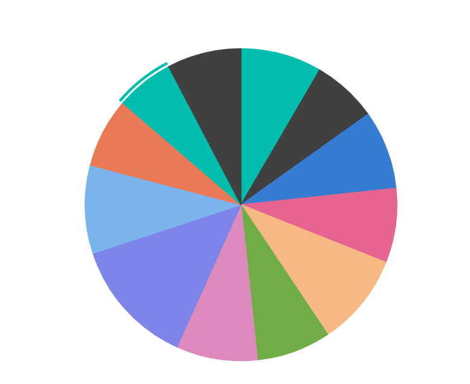

<!-- markdownlint-disable MD036 -->

# Getting started with ##Platform_Name## Accumulation Chart control

This document explains how to create a simple Accumulation Chart and configure its features in TypeScript using the Essential JS 2 webpack [quickstart](https://github.com/SyncfusionExamples/ej2-quickstart-webpack) seed repository.

> This application is integrated with the `webpack.config.js` configuration and uses the latest version of the [webpack-cli](https://webpack.js.org/api/cli/#commands). It requires node `v14.15.0` or higher. For more information about webpack and its features, refer to the [webpack getting-started guide](https://webpack.js.org/guides/getting-started/).

## Prerequisites

Before you begin, ensure you have the following installed on your machine:

* [Node.js](https://nodejs.org/) (v14.15.0 or higher)
* [Visual Studio Code](https://code.visualstudio.com) (or any text editor)
* [Git](https://git-scm.com/) (for cloning the quickstart repository)
* A web browser to view the result

## Dependencies

Below is the list of minimum dependencies required to use the Accumulation Chart.

```
|-- @syncfusion/ej2-charts
    |-- @syncfusion/ej2-base
    |-- @syncfusion/ej2-data
    |-- @syncfusion/ej2-pdf-export
    |-- @syncfusion/ej2-file-utils
    |-- @syncfusion/ej2-compression
    |-- @syncfusion/ej2-svg-base
```
Note: @syncfusion/ej2-pdf-export, @syncfusion/ej2-file-utils, and @syncfusion/ej2-compression are optional—required only for PDF export features. Omit if not using exports.

## Quick Setup

### Step 1: Create a Project Folder

Create a folder named `my-accumulation-chart` in your desired location. This folder will contain your Syncfusion Accumulation Chart TypeScript project.

### Step 2: Open Command Prompt

Open the command prompt and navigate to your desired directory where you want to create the project. You can do this by:

* **For Windows**: Open Command Prompt (cmd) or PowerShell and use `cd` command to navigate to your desired directory
* **For macOS/Linux**: Open Terminal and use `cd` command to navigate to your desired directory

### Step 3: Clone the Quickstart Repository

Run the following command to clone the Syncfusion JavaScript (Essential JS 2) quickstart project from [GitHub](https://github.com/SyncfusionExamples/ej2-quickstart-webpack).




git clone https://github.com/SyncfusionExamples/ej2-quickstart-webpack ej2-quickstart




### Step 4: Navigate to Project Folder

After cloning the application in the `ej2-quickstart` folder, run the following command to navigate to the project directory.




cd ej2-quickstart




### Step 5: Install Required Packages

Syncfusion JavaScript (Essential JS 2) packages are available on the [npmjs.com](https://www.npmjs.com/~syncfusionorg) public registry. You can install all Syncfusion JavaScript (Essential JS 2) controls in a single [@syncfusion/ej2](https://www.npmjs.com/package/@syncfusion/ej2) package or individual packages for each control.

The quickstart application is already preconfigured with the dependent [@syncfusion/ej2](https://www.npmjs.com/package/@syncfusion/ej2) package in the `~/package.json` file. Use the following command to install all the dependent npm packages from the command prompt.




npm install




This command will download and install all necessary dependencies for your project.

### Step 6: Update the HTML Template

Open the `ej2-quickstart` folder in Visual Studio Code or any text editor of your choice.

> Note: Code snippets here use webpack for local development. For online demos or StackBlitz, SystemJS may be used—ignore loader/helper scripts in rendered previews.

Locate the `~/src/index.html` file in the project. Add the HTML div tag with its `id` attribute as `element` to initialize the Accumulation Chart container.




<!DOCTYPE html>
<html lang="en">

<head>
    <title>Essential JS 2 Accumulation Chart</title>
    <meta charset="utf-8" />
    <meta name="viewport" content="width=device-width, initial-scale=1.0" />
    <meta name="description" content="TypeScript UI Controls" />
    <meta name="author" content="Syncfusion" />
    ....
    ....
</head>

<body>
     <h1>Syncfusion Accumulation Chart</h1>
     <!--container which is going to render the Accumulation chart-->
     <div id='element'>
     </div>
</body>

</html>




### Step 7: Create the Accumulation Chart Component with Data

Locate the `src/app/app.ts` file in your project and import the AccumulationChart component to instantiate and render it with sample data.

**Pie Series**: By default, a pie series is rendered when JSON data is assigned to the series [`dataSource`](../api/accumulation-chart/accumulationseries#datasource) property. Map JSON fields to the series [`xName`](../api/accumulation-chart/accumulationseries#xname) and [`yName`](../api/accumulation-chart/accumulationseries#yname) properties to bind data correctly.




import { AccumulationChart } from '@syncfusion/ej2-charts';

// Sample data for the Accumulation Chart
let pieData: Object[] = [
    { month: 'Jan', sales: 35 },
    { month: 'Feb', sales: 28 },
    { month: 'Mar', sales: 34 },
    { month: 'Apr', sales: 32 },
    { month: 'May', sales: 40 },
    { month: 'Jun', sales: 32 },
    { month: 'Jul', sales: 35 },
    { month: 'Aug', sales: 55 },
    { month: 'Sep', sales: 38 },
    { month: 'Oct', sales: 30 },
    { month: 'Nov', sales: 25 },
    { month: 'Dec', sales: 32 }
];

// Initialize and render Accumulation Chart
let chart: AccumulationChart = new AccumulationChart({
    series: [
        {
            dataSource: pieData,
            xName: 'month',
            yName: 'sales',
            type: 'Pie'
        }
    ],
    title: 'Sales Data'
}, '#element');




### Step 8: Run the Application

Open the integrated terminal in Visual Studio Code or use your command prompt to run the application. Use the `npm run start` command:




npm run start




The application will compile and automatically start in your default web browser. The application typically runs at `http://localhost:4000`. You should see the Syncfusion<sup style="font-size:70%">&reg;</sup> Accumulation Chart control displayed on the page.

### Step 9: View Your Chart

Wait for the webpack dev server to complete the build process. Once completed, you will see the Accumulation Chart control rendering in your browser. The chart is now successfully initialized with a pie chart displaying the sample sales data and is ready for further customization.

## Output

The following screenshot shows the output of the Syncfusion Accumulation Chart quick start application:

