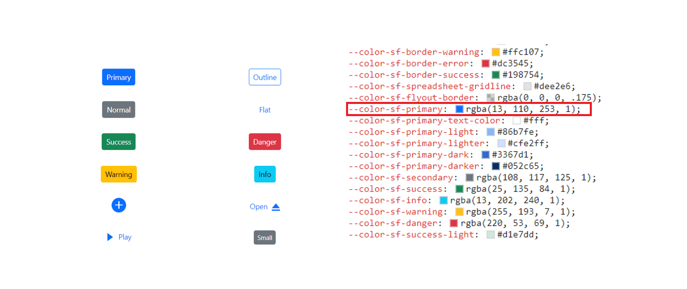
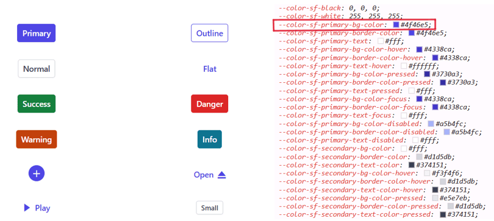
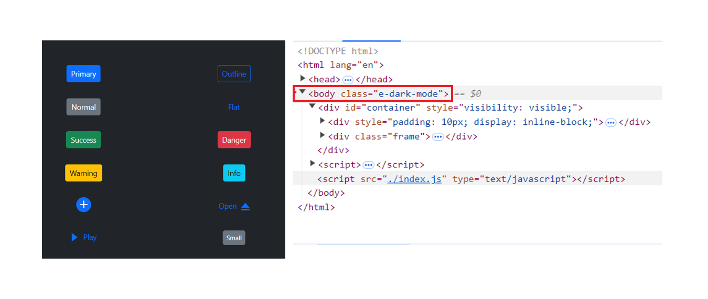

# About CSS Variables in themes

[CSS variables](https://developer.mozilla.org/en-US/docs/Web/CSS/Using_CSS_custom_properties), also known as custom properties, are entities defined by CSS authors that contain specific values that can be reused throughout a CSS file. They are identified by their name, which must begin with two hyphens (--) followed by an identifier. These variables can be assigned any valid CSS value, such as colors, lengths, or fonts. To retrieve the value of a CSS variable, the var() function is used.

Syncfusion currently offers two modern and highly customizable themes using CSS variables. These themes are designed to provide a consistent and visually appealing look and feel across all Syncfusion components. The themes available are:

* Material 3 Theme
* Fluent 2 Theme
* Bootstrap 5.3 Theme
* Tailwind 3.4 Theme

## CSS themes - Syncfusion ##Platform_Name## Controls

[Material 3](https://m3.material.io/), [Fluent 2](https://fluent2.microsoft.design/get-started/whatisnew), [Bootstrap 5.3](https://getbootstrap.com/docs/5.3/getting-started/introduction/) and [Tailwind 3.4](https://tailwindcss.com/docs/installation) themes have been introduced across all EJ2 Controls, featuring both `light` and `dark` variants. This themes utilizes `CSS variables` to allow easy customization of control colors in CSS format. With this implementation, users can seamlessly switch between light and dark color schemes, providing a flexible solution to meet their preferences and application needs.

> Kindly note that in the Material 3 theme, CSS variables with rgb() values are used for color variables. The use of hex values in this context may lead to improper functionality. For example, in previous versions of the Material theme or other themes, the primary color variable was defined as follows: $primary: #6200ee;. However, in the Material 3 theme, the primary color variable is defined as follows: --color-sf-primary: 98, 0, 238;.

### Utilization of CSS variables in modern themes

Modern themes make it easy to change the colors of controls using CSS variables. Each theme has its own way of setting these variables, so it's important to follow the specific instructions for each theme. Doing this helps keep the styling consistent and efficient across different parts of your application.

Below are examples of how CSS variables can be defined for these themes:

















        



















### How to get these themes?

To access themes provided by Syncfusion, you have two primary options,

* Package
* CDN links

|    |  Light  |  Dark  |
|-----------|---------|--------|
|Package  | [Material 3 Light](https://www.npmjs.com/package/@syncfusion/ej2-material3-theme) | [Material 3 Dark](https://www.npmjs.com/package/@syncfusion/ej2-material3-dark-theme) |
|  | [Fluent 2 Light](https://www.npmjs.com/package/@syncfusion/ej2-fluent2-theme) | [Fluent 2 Dark](https://www.npmjs.com/package/@syncfusion/ej2-fluent2-dark-theme) |
|  | [Bootstrap 5.3 Light](https://www.npmjs.com/package/@syncfusion/ej2-bootstrap5.3-theme) | [Bootstrap 5.3 Dark](https://www.npmjs.com/package/@syncfusion/ej2-bootstrap5.3-dark-theme) |
|  | [Tailwind 3.4 Light](https://www.npmjs.com/package/@syncfusion/ej2-tailwind3-theme) | [Tailwind 3.4 Dark](https://www.npmjs.com/package/@syncfusion/ej2-tailwind3-dark-theme) |
| CDN  | [Material 3 Light](https://cdn.syncfusion.com/ej2/27.1.48/material3.css)  |  [Material 3 Dark](https://cdn.syncfusion.com/ej2/27.1.48/material3-dark.css)  |
|  |  [Fluent 2 light](https://cdn.syncfusion.com/ej2/27.1.48/fluent2.css)  |  [Fluent 2 Dark](https://cdn.syncfusion.com/ej2/27.1.48/fluent2-dark.css)  |
|  |  [Bootstrap5.3 light](https://cdn.syncfusion.com/ej2/27.1.48/bootstrap5.3.css)  |  [Bootstrap 5.3 Dark](https://cdn.syncfusion.com/ej2/27.1.48/bootstrap5.3-dark.css)  |
|  | [Tailwind 3.4 Light](https://cdn.syncfusion.com/ej2/28.1.33/tailwind3.css) | [Tailwind 3.4 Dark](https://cdn.syncfusion.com/ej2/28.1.33/tailwind3-dark.css) |

### Color Customization in themes

CSS variables allows you to dynamically change color values in real-time using JavaScript. This flexibility enables you to create interactive experiences where colors can adjust based on user interactions or other dynamic factors.

#### Customization using CSS

Here you can find the example for `Material 3` customization using CSS class.














        



















Example for `Fluent 2` customization using Css class.














        



















Example for `Bootstrap 5.3` customization using Css class.


































Here you can find the example for `Tailwind 3.4` customization using CSS class.














        



















#### Customization using JavaScript

Here you can find the example for `Material 3` customization using JavaScript.











        
















**Default Material 3 primary value**

**Customized Material 3 primary value**

Example for `Fluent 2` customization using JavaScript.











        
















**Default Fluent 2 primary value**

**Customized Fluent 2 primary value**

Example for `Bootstrap 5.3` customization using JavaScript.




























**Default Bootstrap 5.3 primary value**

**Customized Bootstrap 5.3 primary value**

Example for `Tailwind 3.4` customization using JavaScript.











        
















**Default Tailwind 3.4 primary value**

**Customized Tailwind 3.4 primary value**

With this CSS variable support, you can effortlessly customize the color variable values for Syncfusion JavaScript controls.

### Switching Light and Dark mode with CSS variables

Switching between modes has become easier with the updated modern themes, which offer Light and Dark variants. In all themes, there are distinct class variables for light and dark modes in a `single file`, providing flexibility for seamless switching between the two modes within your application.











        
















### Mode switching in Fluent 2 theme

Similar to `Material 3`, we offer both Light and Dark variants with `Fluent 2`. In the Fluent 2 theme, there are distinct class variables for light and dark modes, as shown in the preview below.











        
















### Mode switching in Bootstrap 5.3 theme

Similar to `Material 3`, we offer both Light and Dark variants with `Bootstrap 5.3`. In the Bootsrap 5.3 theme, there are distinct class variables for light and dark modes, as shown in the preview below.




























### Mode switching in Tailwind 3.4 theme

Similar to `Material 3`, we offer both Light and Dark variants with `Tailwind 3.4`. In the Tailwind 3.4 theme, there are distinct class variables for light and dark modes, as shown in the preview below.




























### How to switch dark mode?

To activate dark mode, just append the `e-dark-mode` class to the body section of your application for `Material 3`, `Fluent 2`, `Bootstrap 5.3` and `Tailwind 3.4` themes. Once applied, the theme seamlessly switches to dark mode. Please refer to the example image below for visual guidance.

`Material 3` dark mode

`Fluent 2` dark mode

`Bootstrap5.3` dark mode

`Tailwind 3.4` dark mode

### ThemeStudio Application

The ThemeStudio application now includes seamless integration with the Material 3, Fluent 2, Bootstrap 5.3 and Tailwind 3.4 themes, offering a comprehensive solution for customization requirements. This enhancement enables users to effortlessly customize and personalize their themes.

Access the Syncfusion ThemeStudio application, featuring our themes, via the following link: [Link to Syncfusion ThemeStudio](https://ej2.syncfusion.com/themestudio/?theme=material3)
