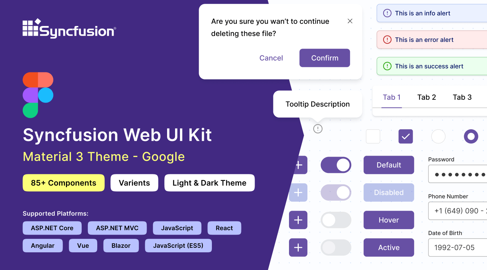

# Figma UI Kits for Syncfusion Components

Figma is a versatile design tool revolutionizing collaboration on web and mobile app interfaces. As an all-in-one platform for design and prototyping, it allows designers to create, share, and collaborate on projects in real time, making it indispensable for both designers and developers.

[Syncfusion Figma UI kits](https://www.figma.com/@syncfusion_inc) are comprehensive collections of user interface components designed to streamline website development. These kits include a wide range of pre-designed components, such as Buttons, Charts, Grids, and more, all meticulously crafted to ensure consistency and usability across web applications. By integrating Syncfusion's UI kits into your website design process, you can accelerate development, maintain design coherence, and create visually appealing and user-friendly interfaces with ease. It includes:

- 80+ visual components
- 300+ icons

## Usage of UI kits

The Syncfusion Figma UI kit contains a collection of assets, including icons, UI components, fonts, and other elements, that are used by designers to build user interfaces and prototypes. Instead of designing from scratch, designers can drag and drop elements from the UI kit to create the desired interface. Figma UI kits seamlessly design Syncfusion components within applications, facilitating quick prototyping, real-time collaboration, and efficient design system management.

The benefits of utilizing UI kits include:

- Speed up the design process.
- View all UI component appearances in a single file.
- Ensure design consistency.
- Streamlined design workflow.

## Advantages of UI kits

UI kits offer numerous benefits for both designers and developers, streamlining the design and development process for web and mobile applications. Here’s a detailed look at the key advantages of utilizing Syncfusion’s Figma UI Kits:

- **Wide Range of Components:** Supports over 80 components, providing a diverse selection for designing interfaces.
- **Themes:** Choose from various themes such as Material 3, Fluent, Tailwind, and Bootstrap 5 for different design needs.
- **Icon Libraries:** Access to over 300 icons enhances design capabilities by providing a wide variety of visual symbols for use in applications.
- **Customization:** Syncfusion offers extensive customization options for fonts, colors, shapes, shadows, and more, allowing tailored designs.
- **Ease of Use:** Simple interface with drag-and-drop functionality.
- **Preview Designs:** Instant visualization of design changes allows designers to see the impact of their adjustments in real time.
- **Collaboration-Friendly:** Facilitate real-time collaboration with team members, enabling seamless communication and efficient design iterations.
- **Global Changes:** Effortlessly apply global changes to multiple components simultaneously, ensuring consistency across your entire design system.
- **Export Options:** Export your designs as image files or in the Figma (.fig) format, allowing for easy integration into other projects or workflows.
- **Support:** Benefit from Syncfusion's dedicated support team, ensuring timely assistance and guidance throughout your design journey.

## Downloading the UI kits

Syncfusion provides various theme UI kits tailored to different needs. You can download them from the following links:

- [Material 3](https://www.figma.com/community/file/1385969023252455137/syncfusion-ui-kit-material-3-theme)
- [Fluent](https://www.figma.com/community/file/1385969120047188707/syncfusion-ui-kit-fluent-theme)
- [Tailwind](https://www.figma.com/community/file/1385969065626384098/syncfusion-ui-kit-tailwind-theme)
- [Bootstrap 5](https://www.figma.com/community/file/1385968977953858272/syncfusion-ui-kit-bootstrap-5-theme)

## Structure of the UI kits

The structure of Syncfusion’s Figma UI kit is organized to provide a comprehensive and user-friendly layout, making it easy to navigate and explore the various components. Here’s an in-depth look at each section within the UI kits:

**Index**

This page includes a comprehensive list of all component names, allowing users to easily identify and locate the components available in the Syncfusion kit.

**Icons**

The Icons section provides a comprehensive library of over 300 icons, organized into categories for easy navigation. Key categories include:

* Action: Icons for actions like delete, edit, save, filter, etc.
* Navigation: Icons for navigation elements like arrows, home, menu, etc.
* Media: Icons for media control such as play, pause, volume, etc.

**UI Components**

This section is the core of the UI kit, containing a variety of essential UI components. Each component is categorized and includes multiple variants and states to suit different use cases, like below:

* Buttons: Variants include primary, secondary, and different states such as hover and disabled.
* Inputs: Includes text fields, dropdowns, radio buttons, checkboxes, and sliders.
* Grids: Ready-to-use grid layouts and table structures for data representation.

  

## How do we use UI kits?

You can use the Syncfusion Figma UI kit in a friendly manner. Follow the below simple steps to utilize it.

1. Visit our [UI kits](#downloading-the-ui-kits) and choose your preferred theme and download it.
2. Open the Figma desktop or web app.
3. Click the **Import** button in the top-right corner of the page.
4. Select the downloaded Syncfusion fig file you want to import and click the **Open** button.
5. Customize components by changing colors, sizes, etc.
6. Click the **Local variables** option, which contains the design token for the color variables.
7. By changing the desired colors, it will reflect the components simultaneously.
8. Preview the design to ensure appearance and functionality align with expectations.

## Customizing the UI kits

The Syncfusion Kits for Figma are highly flexible and fully customizable to suit your vision and needs. Let's see how to customize the button colors within your layout:

1. Identify the buttons you wish to customize within your layout.

2. On the right side of the Figma interface, find the color variable options listed. For example, the variable for a particular button color might be labeled as `$primary-bg-color`. It was derived from the primary color variable.

3. To customize this primary button component color, click outside the button to see the **Local variables** option on the right side of the Figma interface. It contains the design token for the color variables. Click the **Local variables** option.

4. It will show the design token list in the popup. You can change the primary color using a color palette.

5. Once you've selected the new color (pink) of the primary variable, the button's color pattern will be updated accordingly. You'll see the changes reflected in real-time within your design.

In addition to changing the button colors, you can also customize other aspects of the UI components:

- **Font**: Adjust the font style and size to align with your design preferences.
- **Shape**: Modify the shape of components such as buttons, containers, or icons.
- **Spacing**: Fine-tune the spacing between elements to achieve the desired layout.
- **Shadow**: Add or adjust shadow effects to enhance the visual depth of UI elements.

Feel free to experiment with these customization options to create a design that perfectly matches your requirements.

## Upgrading the UI kits

To upgrade UI kits, download the latest version from the provided links. Follow these guidelines for a seamless upgrade process:

- Stay informed about updates or new versions of UI kits from Syncfusion.
- Prior to upgrading, back up ongoing projects to prevent data loss or compatibility issues.
- Provide feedback to Syncfusion regarding your experience with the upgraded UI kits, including any issues encountered or improvement suggestions.

## See also

* [Available themes](https://ej2.syncfusion.com/documentation/appearance/theme)
* [Customizing themes](https://ej2.syncfusion.com/documentation/appearance/theme-studio#customizing-theme-color-from-theme-studio)
