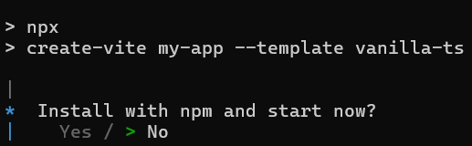

# Getting started in ##Platform_Name## BlockEditor control

This section explains the steps to create a simple Block Editor and demonstrates the basic usage of the Block Editor control using a Vite-based TypeScript project scaffolded with latest vite version.

## Prerequisites

This guide uses Vite as the bundler and development environment. Install Node.js 24.13.0 or higher before proceeding. For detailed information about Vite’s capabilities and configuration options, refer to the [Vite documentation](https://vitejs.dev/).

## Create a TypeScript application

To set up a TypeScript application in a TypeScript environment, run the following command.

```bash
npm create vite@latest my-app -- --template vanilla-ts
```
This command will prompt you to install the required packages and start the application. Select the options as shown below.



As Syncfusion packages are not installed yet, currently, the `No` option will be selected. Then, navigate to the project directory and install the dependencies using the following commands:

```bash
cd my-app
npm install
```

## Adding Syncfusion<sup style="font-size:70%">&reg;</sup> Block Editor packages

All the available Essential<sup style="font-size:70%">&reg;</sup> JS 2 packages are published in [`npmjs.com`](https://www.npmjs.com/~syncfusionorg) public registry.
To install Block Editor component, use the following command

```bash
npm install @syncfusion/ej2-blockeditor
```

## Adding CSS reference

Syncfusion provides multiple themes for the Block Editor control. For a complete list of available themes, refer to the [themes packages](https://ej2.syncfusion.com/documentation/appearance/theme#theme-packages).

To apply the [Tailwind 3](https://www.npmjs.com/package/@syncfusion/ej2-tailwind3-theme) theme, install the corresponding theme package by using the following command:

```bash
npm install @syncfusion/ej2-tailwind3-theme --save
```

Then add the following CSS reference to the `src/style.css` file:

```css
@import "../node_modules/@syncfusion/ej2-tailwind3-theme/styles/blockeditor/index.css";
```

I> To apply the application-specific styles correctly, import `./style.css` into **src/main.ts**, remove the default Vite styles from **src/style.css**, and keep the Block Editor styles shown above. You can also refer to the [themes section](https://ej2.syncfusion.com/documentation/appearance/theme) for details about built-in themes and CSS references for individual controls.

## Adding Block Editor control

To get started, add the Block Editor control in `main.ts` and `index.html` files. Block Editor can be initialized through a div element.




import './style.css';
import { BlockEditor } from '@syncfusion/ej2-blockeditor';

const blockEditor: BlockEditor = new BlockEditor({});
blockEditor.appendTo('#blockeditor_default');





@import "../node_modules/@syncfusion/ej2-tailwind3-theme/styles/blockeditor/index.css";





<!DOCTYPE html>
<html lang="en">

<head>
  <meta charset="UTF-8" />
  <link rel="icon" type="image/svg+xml" href="/vite.svg" />
  <meta name="viewport" content="width=device-width, initial-scale=1.0" />
  <title>Syncfusion Typescript Block Editor</title>
</head>

<body>
    <div id="blockeditor_default"></div>
    <script type="module" src="/src/main.ts"></script>
</body>

</html>






## Run the application

Use the following command to run the application in the browser.

```bash
npm run dev
```

