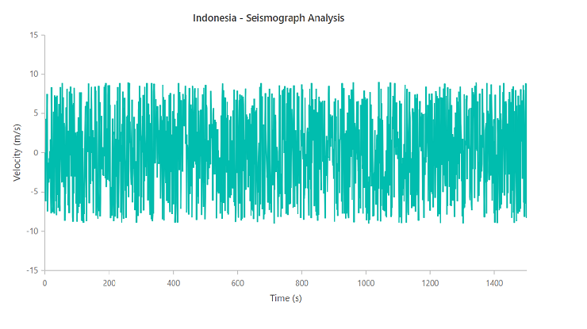
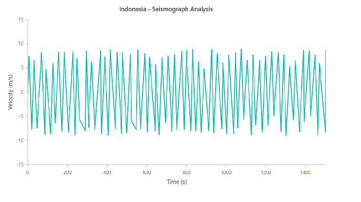

# Down sampling in ##Platform_Name## Chart control

Downsampling is the process of reducing the data rate. We have given a 2000 data points for chart. After applying downsampling algorithm, chart data points has been reduced  and rendered with 400 data points.

Downsampling data using the "Largest-Triangle-Three-Buckets algorithm"[`LTTB`](https://bl.ocks.org/FraserChapman/649f1aba28f6bc941d5c) which describes the point in the bucket that forms the largest triangle using the area of the triangles. This helps to reducing the number of points.

In Downsampling when we perform zooming, particular level of zoomed chart we can see the chart clearly with original data, so we can use original data for that level of zooming. This can be achieved by [`zoomComplete`](../../api/chart/#zoomcomplete) event. Refer the below sample for downsampling with zooming feature.



 







        















**Before applying downsampling algorithm**

**After applying downsampling algorithm**

