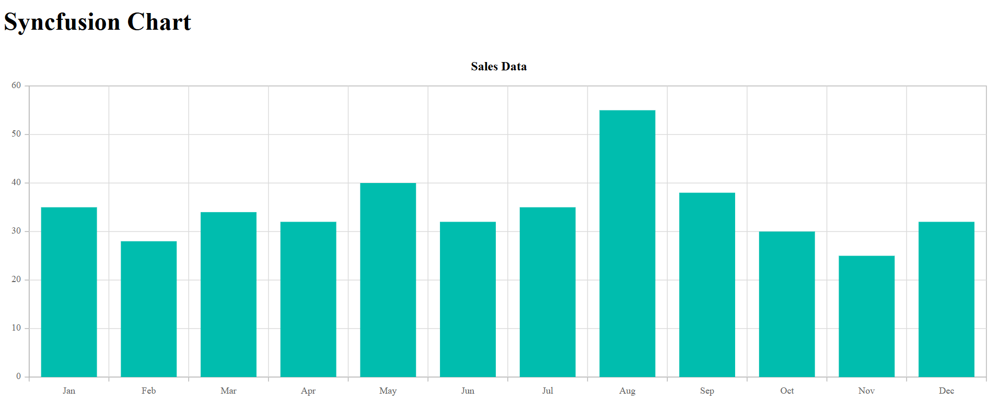

# Getting Started with Syncfusion® JavaScript (ES5) Chart Control

Build your first Syncfusion JavaScript (ES5) application with a simple Chart control in just a few minutes. This quickstart guides you through creating a minimal, runnable HTML page that loads the Syncfusion EJ2 (ES5) Chart from the CDN, initializes it with sample data, and renders an interactive chart.

> The `33.2.3` version segment in the CDN URLs is shown for reference. Replace it with the latest published version from the [Syncfusion EJ2 CDN](https://cdn.syncfusion.com/ej2/) when you start a new project.

## Prerequisites

* [Visual Studio Code](https://code.visualstudio.com) (or any text editor)
* A modern web browser (Chrome, Edge, Firefox, or Safari)
* An active internet connection to fetch the CDN scripts

## Quick Setup

### Step 1: Create a folder and an HTML file

* Create a folder named `quickstart` in your desired directory.
* Inside the `quickstart` folder, create a new file named `index.html`.

### Step 2: Add Syncfusion<sup style="font-size:70%">&reg;</sup> CDN resources

The Chart needs the EJ2 script bundles. Add the following to the `<head>` of `index.html`:

**Scripts (JavaScript):**
```
https://cdn.syncfusion.com/ej2/33.2.3/ej2-base/dist/global/ej2-base.min.js
https://cdn.syncfusion.com/ej2/33.2.3/ej2-data/dist/global/ej2-data.min.js
https://cdn.syncfusion.com/ej2/33.2.3/ej2-pdf-export/dist/global/ej2-pdf-export.min.js
https://cdn.syncfusion.com/ej2/33.2.3/ej2-svg-base/dist/global/ej2-svg-base.min.js
https://cdn.syncfusion.com/ej2/33.2.3/ej2-charts/dist/global/ej2-charts.min.js
```

Load the scripts in the order shown: `ej2-base` → `ej2-data` → `ej2-svg-base` → `ej2-charts`. `ej2-pdf-export` is only required if you use the PDF export feature; it is omitted from the example below.

### Step 3: Add the Chart control to the application

Replace the contents of `index.html` with the following complete code. This loads the required EJ2 scripts, defines the chart container, and renders a Column chart with category-axis data.

```html
<!DOCTYPE html>
<html lang="en">
  <head>
    <meta charset="utf-8" />
    <meta name="viewport" content="width=device-width, initial-scale=1.0" />
    <title>Syncfusion Chart - Quick Start</title>

    <!-- Scripts -->
    <script src="https://cdn.syncfusion.com/ej2/33.2.3/ej2-base/dist/global/ej2-base.min.js"></script>
    <script src="https://cdn.syncfusion.com/ej2/33.2.3/ej2-data/dist/global/ej2-data.min.js"></script>
    <script src="https://cdn.syncfusion.com/ej2/33.2.3/ej2-svg-base/dist/global/ej2-svg-base.min.js"></script>
    <script src="https://cdn.syncfusion.com/ej2/33.2.3/ej2-charts/dist/global/ej2-charts.min.js"></script>
  </head>

  <body>
    <h1>Syncfusion Chart</h1>

    <!-- Container which renders the Chart -->
    <div id="element"></div>

    <script>
      // Sample data
      var chartData = [
        { month: 'Jan', sales: 35 },
        { month: 'Feb', sales: 28 },
        { month: 'Mar', sales: 34 },
        { month: 'Apr', sales: 32 },
        { month: 'May', sales: 40 },
        { month: 'Jun', sales: 32 },
        { month: 'Jul', sales: 35 },
        { month: 'Aug', sales: 55 },
        { month: 'Sep', sales: 38 },
        { month: 'Oct', sales: 30 },
        { month: 'Nov', sales: 25 },
        { month: 'Dec', sales: 32 }
      ];

      // Initialize the Chart
      var chart = new ej.charts.Chart({
        primaryXAxis: {
          valueType: 'Category'
        },
        series: [
          {
            dataSource: chartData,
            xName: 'month',
            yName: 'sales',
            type: 'Column'
          }
        ],
        title: 'Sales Data'
      });

      // Render the chart to the target container
      chart.appendTo('#element');
    </script>
  </body>
</html>
```

The series properties [`dataSource`](../api/chart/series#datasource), [`xName`](../api/chart/series#xname), and [`yName`](../api/chart/series#yname) bind the JSON fields to the chart. The [`primaryXAxis`](../api/chart/chartModel#primaryxaxis) is configured with [`valueType: 'Category'`](../api/chart/axisModel#valuetype) because the X-axis contains month labels; the default value type is `Numeric`.

### Step 4: Open in browser

Open the `quickstart/index.html` file in your web browser. You can either double-click the file or right-click in VS Code and choose **Open with Live Server** (requires the [Live Server](https://marketplace.visualstudio.com/items?itemName=ritwickdey.LiveServer) extension). The chart renders the sample data on the page.

If the chart does not appear, open the browser's developer console to check for runtime errors.

## Output

The following screenshot shows the output of the Syncfusion Chart quick start application:



## Troubleshooting

* **Chart does not render** — Verify that the scripts load in the order `ej2-base` → `ej2-data` → `ej2-svg-base` → `ej2-charts`. Open the browser's developer console and check for `404` or `ReferenceError` messages.
* **`ej is not defined`** — One of the CDN script tags failed to load. Check your network connection and verify the CDN URLs are correct.
* **CORS or `file://` errors** — Some browsers block ES5 module loading from `file://`. Serve the file from a local HTTP server (for example, the VS Code **Live Server** extension).
* **Wrong chart type** — Confirm the `type` property in the series matches the expected chart (for example, `Line`, `Column`, `Area`, `Bar`).
* **Category axis not displaying labels** — Confirm `primaryXAxis.valueType` is set to `'Category'`.

## See also

* [Line Series](../chart-types/line.md)
* [Column Series](../chart-types/column.md)
* [Category Axis](../category-axis.md)
* [Chart Title and Subtitle](../title-subtitle.md)
* [Chart Legend](../legend.md)
* [Chart Tooltip](../tool-tip.md)
* [Working with Data](../working-with-data.md)

> **Ready to streamline your Syncfusion<sup style="font-size:70%">&reg;</sup> JavaScript development?** Discover the full potential of Syncfusion<sup style="font-size:70%">&reg;</sup> JavaScript controls with Syncfusion<sup style="font-size:70%">&reg;</sup> AI Coding Assistant. [Explore Syncfusion<sup style="font-size:70%">&reg;</sup> AI Coding Assistant](https://ej2.syncfusion.com/javascript/documentation/ai-coding-assistant/overview)
