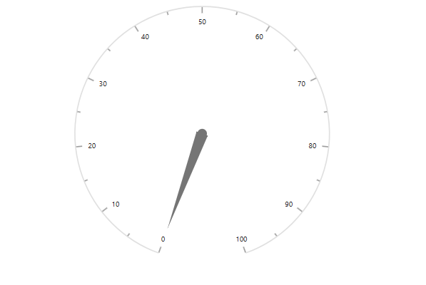

# Getting Started with Syncfusion® JavaScript (ES5) Circular Gauge Control

Build your first Syncfusion JavaScript (ES5) application with a simple Circular Gauge in just a few minutes. This quickstart guides you through creating a minimal, runnable HTML page that loads the Syncfusion EJ2 Circular Gauge control from the CDN, initializes it, and displays a pointer value.

## Prerequisites

* [Visual Studio Code](https://code.visualstudio.com) or another text editor
* A modern web browser
* A local web server, such as the Visual Studio Code [Live Server](https://marketplace.visualstudio.com/items?itemName=ritwickdey.LiveServer) extension

## Dependencies

The Circular Gauge control is available in the `@syncfusion/ej2-circulargauge` package. The following dependencies are required:

```text
|-- @syncfusion/ej2-circulargauge
    |-- @syncfusion/ej2-base
    |-- @syncfusion/ej2-svg-base
    |-- @syncfusion/ej2-pdf-export
```

## Quick Setup

### Step 1: Create the Folder and Files

Create a folder named `quickstart` in your preferred directory.

Inside the `quickstart` folder, create the following files:

* `index.html`
* `index.js`

### Step 2: Add Syncfusion® CDN Resources

You can load the Circular Gauge control by using individual package scripts or the combined Syncfusion bundle. Choose only one of these approaches.

#### Individual Package Scripts

Add the following script references to the `<head>` section of `index.html`. Load the dependencies before the Circular Gauge control script.

```html
<script src="https://cdn.syncfusion.com/ej2/33.2.3/ej2-base/dist/global/ej2-base.min.js" type="text/javascript"></script>
<script src="https://cdn.syncfusion.com/ej2/33.2.3/ej2-svg-base/dist/global/ej2-svg-base.min.js" type="text/javascript"></script>
<script src="https://cdn.syncfusion.com/ej2/33.2.3/ej2-circulargauge/dist/global/ej2-circulargauge.min.js" type="text/javascript"></script>
```

If the application uses PDF export, add the following script before the Circular Gauge script:

```html
<script src="https://cdn.syncfusion.com/ej2/33.2.3/ej2-pdf-export/dist/global/ej2-pdf-export.min.js" type="text/javascript"></script>
```

#### Combined Bundle

Alternatively, load all Syncfusion JavaScript components from a single combined bundle:

```html
<script src="https://cdn.syncfusion.com/ej2/33.2.3/dist/ej2.min.js" type="text/javascript"></script>
```

### Step 3: Add the Syncfusion<sup style="font-size:70%">&reg;</sup> Circular Gauge Control

The `index.html` file contains the gauge container and references `index.js`, which contains the Circular Gauge initialization.

The global scripts added in Step 2 register the `ej.circulargauge.CircularGauge` class in the `ej` namespace. Therefore, no module imports are required.










The `new ej.circulargauge.CircularGauge({...})` call creates the Circular Gauge. 

`circulargauge.appendTo('#element')` renders the control inside the `<div id="element">` element declared in `index.html`.

### Step 4: Open the Application in a Browser

Open `quickstart/index.html` through a local web server.

If you are using the Visual Studio Code **Live Server** extension:

1. Right-click `index.html` in the Explorer.
2. Select **Open with Live Server**.
3. Open the URL displayed by Live Server, such as `http://127.0.0.1:5500/`.

The browser displays the initialized Circular Gauge.

## Output

The following screenshot shows the output of the Syncfusion Circular Gauge quick start application:





## Troubleshooting

- **The page is blank.** Open `index.html` through a local web server instead of opening the file directly from the file system.
- **`ej is not defined`.** Ensure that the Syncfusion CDN scripts are loaded before `index.js`.
- **`ej.circulargauge` is undefined.** Verify that `ej2-circulargauge.min.js` is loaded after its required dependencies.
- **The gauge is not displayed.** Make sure the container ID in `index.html` matches the selector passed to `appendTo('#element')`.
- **The pointer does not appear at the expected position.** Confirm that the pointer `value` is within the axis `minimum` and `maximum` range.
