# Custom Resource Generator for Syncfusion&reg; for EJ2 JavaScript ES5.

Syncfusion&reg; provides an option to generate a selective controls script (JavaScript ES5) and styles by using the [Custom Resource Generator](https://crg.syncfusion.com/) (CRG). 

##  Control Search and Selection.

Using our CRG site, you can effortlessly navigate through our comprehensive list of controls, where those compatible with `Injectable Modules` are presented in a treeview format with checkboxes and the components not supported with `Injectable Modules` are displayed only with checkboxes. You can seamlessly search, select, and tailor your choices to find minified or unminified scripts and styles that precisely match your requirements.

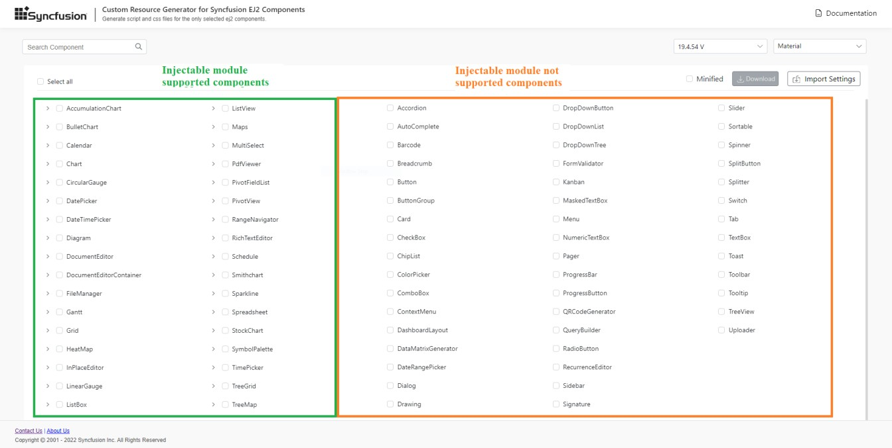

Refer to the following steps to search and select the controls in CRG.

1. Open [Syncfusion&reg; Custom Resource Generator](https://crg.syncfusion.com/) (CRG) application.
2. Type the required control name in the search bar and select the check box. The dependency of the selected control is resolved in the application itself, so it does not need to choose each dependent control by manually.
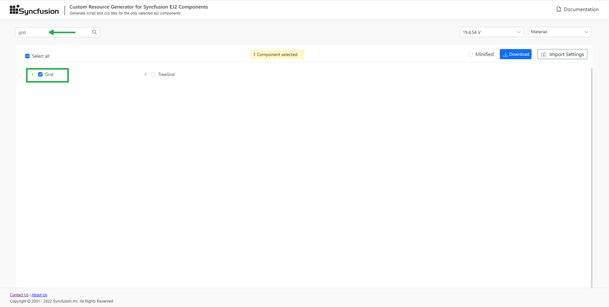
3. Click the expand icon and select the required feature for the injectable module supported controls.
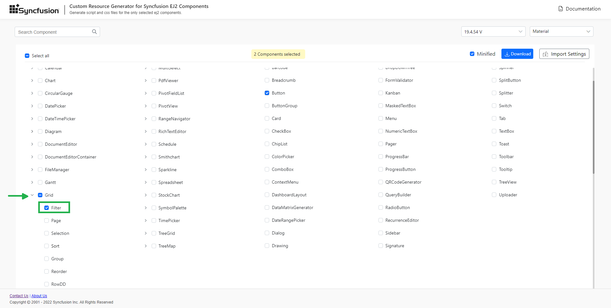
4. If the entire modules of the controls are needed, then click the specific control's check box to select all injectable modules.
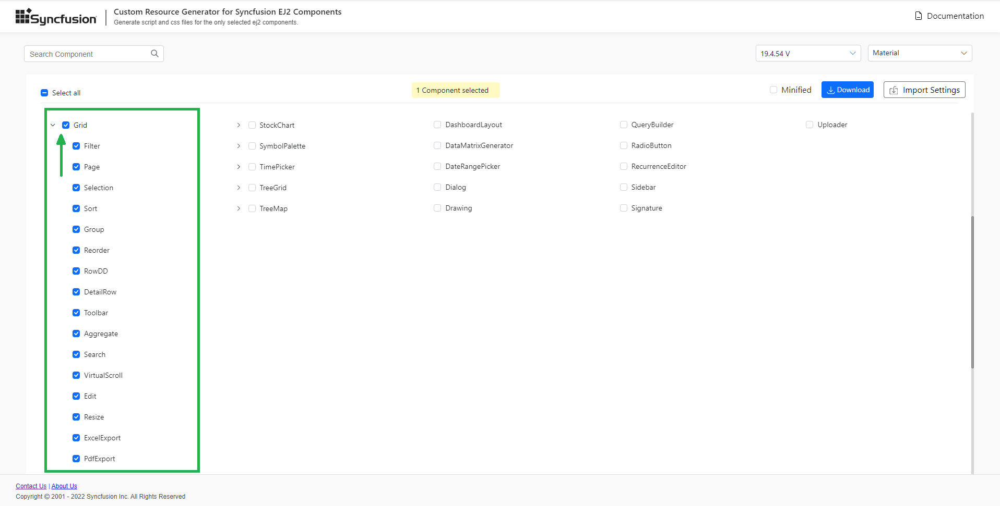
5. Select the required built-in themes from the **Select Themes** option. This provides an option to select more than one theme.
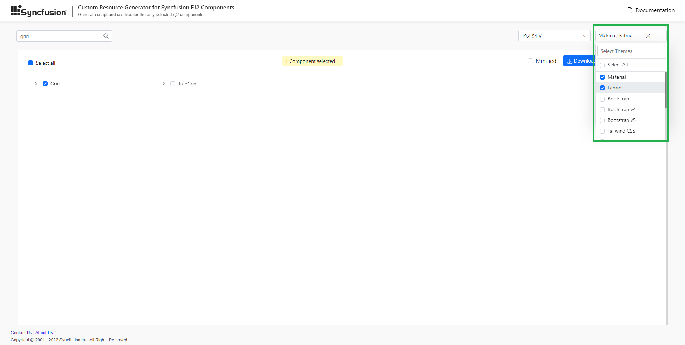

## Download the selected control resources

After selecting the required control resources, download the custom script and styles from CRG.

Refer to the following steps to download the custom resources in CRG.

1. Select the **Minified** option to generate the minified file output for production and select the desired version. Click the **DOWNLOAD** button at the bottom of the page
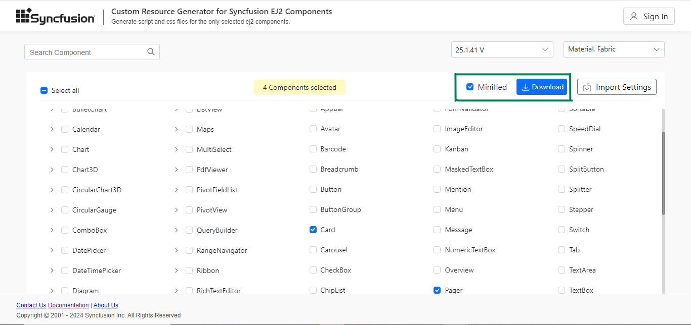
2. Enter the file name as you desire and valid mail ID, click **GENERATE** button in the pop-up.
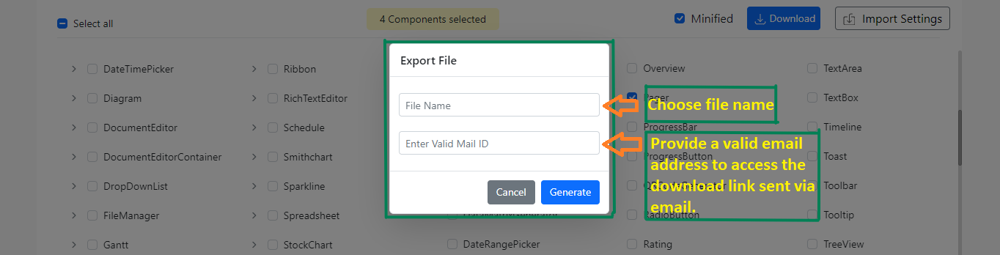
3. You will receive a mail with a download link within a few minutes explaining with control included, version details, and whether or not styles are included.
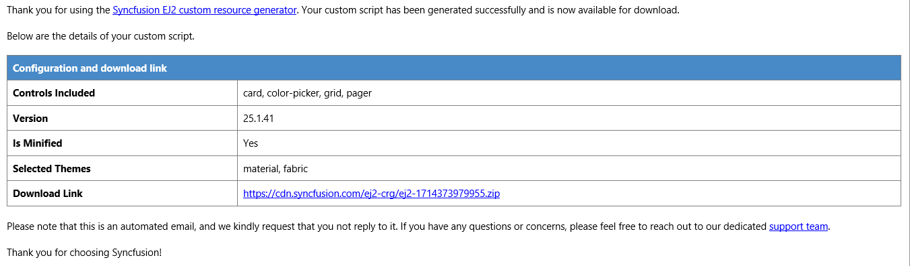
4. The downloaded file contains the script and styles for the selected controls and a **import.json** file, which stores the current settings. You can use theme files in the **customized** folder if you don't want google fonts references. For now, Material and tailwind themes only generate like below.
   
   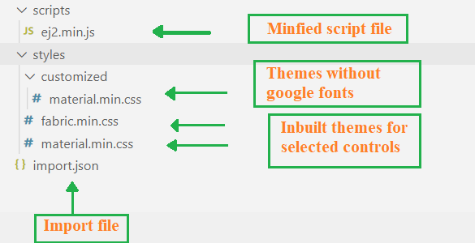

## How to use custom resources in the JavaScript application

1. Extract the downloaded script and styles into the project.

2. Refer the script and style in `<head>` section of `index.html` file.

   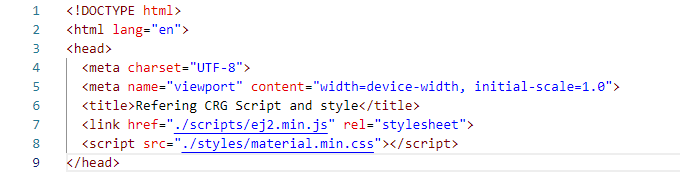

3. Run the application and it will load the resources with application required controls.

## Import previously generated settings into the CRG

To add more controls or upgrade the latest Syncfusion&reg; scripts, it is not necessary to generate it from the scratch in the CRG. Just import the old **import.json** file and make the changes, then download it again from the CRG application.

Refer to the following steps to import previous **import.json** file in the CRG.

1.	Click the **IMPORT SETTINGS** button at the bottom of the page.
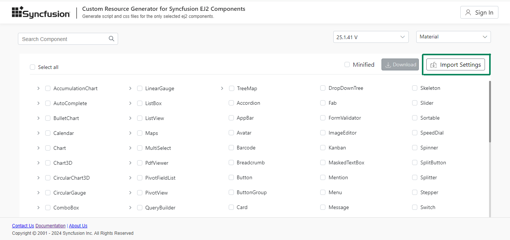
2. Upload the **import.json** file so that the previously stored data will be restored in the CRG application. Now, add more controls and export the resources again.
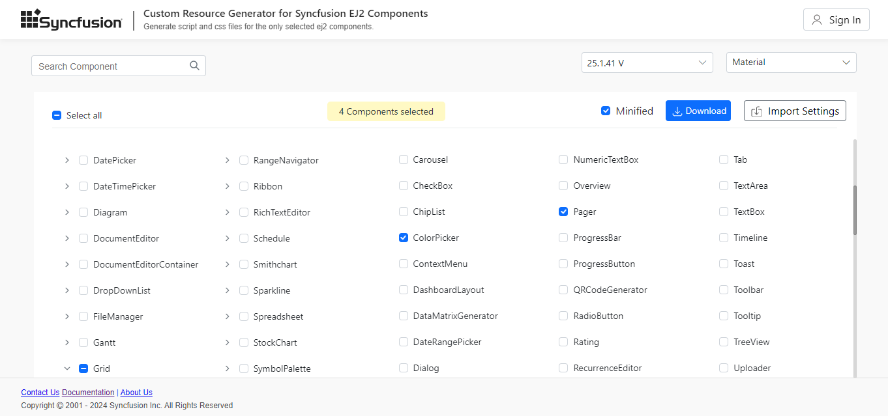

## To download a licensed script

If you prefer to utilize a licensed script, As a licensed user, you can download a licensed script from the Custom Resource Generator (CRG) by logging into your CRG account, as illustrated below.

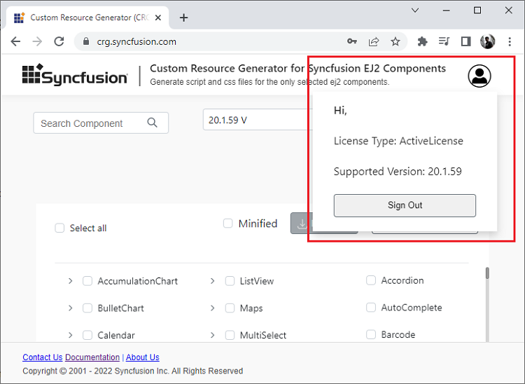

Licensed scripts generated through the Custom Resource Generator (CRG) do not require additional license registration when downloaded by authenticated users. But if you are not downloading a licensed script, you need to register the license key in your application. For more information, refer to the [Licensing section](../js/licensing/license-key-registration.md).

Also when you log in and download the script, the license registration code is intentionally removed to prevent redundancy, ensuring that your licensed script is ready to use without extra steps. This design choice brings ease to our licensed users.

