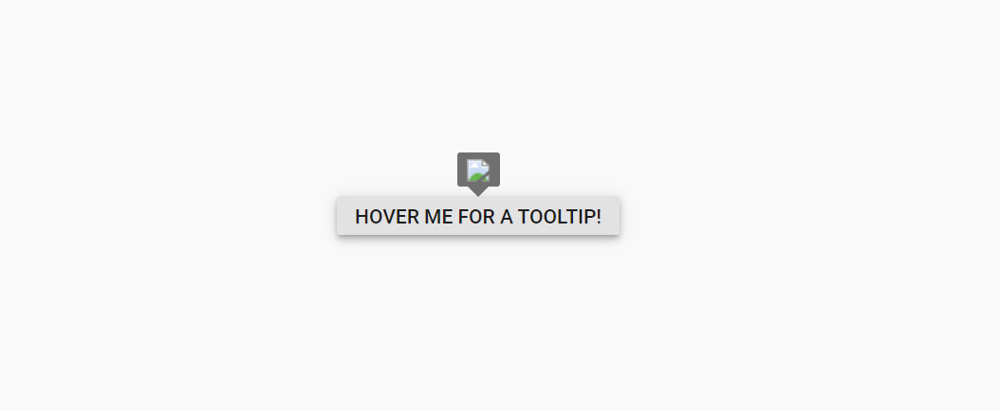
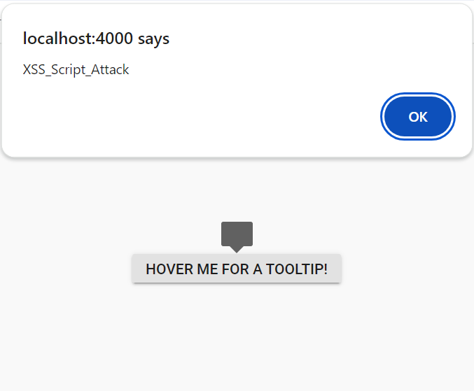

# Syncfusion JavaScript - Security Considerations

Security is a critical aspect of web applications to protect them from various threats and vulnerabilities. Using HTTPS to encrypt data, checking and cleaning user inputs, and setting up robust authentication methods like multi-factor authentication are essential steps.

Syncfusion JavaScript controls are implemented with these security considerations.

## Security Vulnerabilities

Security vulnerabilities in web applications refer to weaknesses or flaws in the design, implementation, or configuration of a web application that can be exploited by attackers to compromise the application's integrity, confidentiality, or availability. Here we can see some of the vulnerabilities.

* Cross-Site Scripting- XSS ([Cross-Site Scripting](https://developer.mozilla.org/en-US/docs/Glossary/Cross-site_scripting)) is a security vulnerability that can occur in web applications. It allows an attacker to inject malicious code into a web page, which is then executed in the browser of a user who visits the page. JavaScript is commonly used to carry out XSS attacks because it can be easily injected into a web page and executed in the user's browser.

To implement the web application with secured aspects, Syncfusion JavaScript controls are supported.

## Security Considerations

Security holds significant importance in software development, and the incorporation of security measures from the outset of the development process is vital for the protection of applications. Syncfusion takes a thorough approach to security in the development of JavaScript controls, encompassing all critical aspects. The following considerations provide a comprehensive overview of security measures implemented by Syncfusion.

* Content Security Policy
* HTML Sanitizer
* Function Template
* Browser Storage
* Memory Cache

### Content Security Policy

[Content Security Policy](https://developer.mozilla.org/en-US/docs/Web/HTTP/CSP) (CSP) is a one of the security feature, that helps the detect the cross-site-scripting(XSS) attacks and malicious code injection. It will throw the errors and warnings while using the inline-styles and inline scripts, eval, new Function, etc in your applications.

To implement Content Security Policy (CSP) in your application, include a `<meta>` tag with specified CSP directives. Syncfusion JavaScript controls have been designed and implemented with adherence to these CSP directives, ensuring enhanced security. These directives are below.

#### CSP Directives

Below are the mandatory directives for the Syncfusion Javascript Controls.

|    Directives    |    Description    |    Examples    |
|------------------|-------------------|----------------|
|  `style-src`  | Defines the allowed sources for loading stylesheets. This helps mitigate style-based attacks by restricting the locations from which styles can be applied. | `style-src 'self' https://cdn.syncfusion.com/ https://fonts.googleapis.com/ 'unsafe-inline';`|
|  `font-src`  | Defines the allowed sources for loading fonts. It helps prevent font-related security issues by restricting the locations from which fonts can be loaded. | `font-src 'self' https://fonts.googleapis.com/ https://fonts.gstatic.com/ data: cdn.syncfusion.com 'unsafe-inline';` |
|  `img-src`  | Specifies the allowed sources for loading images. It helps control from where images can be displayed on the web page. | `img-src 'self' data:"` |

> Utilizing a web worker within the spreadsheet component for exporting necessitates the addition of a specific directive to ensure proper functionality during the export process.
`worker-src 'self' 'unsafe-inline' * blob:;`

#### CSP Sources

|  Source  |  Description  | Examples  |
|----------|---------------|-----------|
|  `self`  |  Refers to the origin from which the protected document is being served, including the same URL scheme and port number  |  `style-src 'self'`  |
|  `data`  | Enables a website to fetch resources using the data scheme, such as loading Base64-encoded images.  |  `img-src 'self' data:`  |
|  `unsafe-inline`  | Allows the use of inline resources, such as inline `style` elements.  |  `style-src 'self' https://fonts.googleapis.com/ 'unsafe-inline'`  |

To know more information about the CSP, refer this [documentation](https://ej2.syncfusion.com/documentation/common/troubleshoot/content-security-policy).

### HTML Sanitizer

An HTML sanitizer is a tool or program that helps remove potentially malicious or harmful code from HTML documents. This type of sanitizer is commonly used in web applications to prevent cross-site scripting (XSS) attacks, which can inject malicious code into a website and compromise user data. HTML sanitizers typically work by analyzing HTML code and removing any potentially dangerous or unwanted elements, such as script tags, inline styles, or event handlers. They may also modify or clean up other aspects of the HTML, such as removing extra whitespace or fixing malformed code.

To avoid the risk of code injection, Syncfusion has provided the [enableHtmlSanitizer](https://ej2.syncfusion.com/javascript/documentation/api/button#enablehtmlsanitizer) API into its UI controls. This ensures that HTML strings submitted by users are sanitized, enhancing security measures against potential threats.

When this property is enabled, the HTML string undergoes a thorough sanitization process before being rendered in the component. This approach ensures that user inputs containing potential security threats are meticulously filtered, addressing the risk of XSS and contributing to the overall security robustness of our components in the face of potential attacks.

To sanitize input values in a web application using Syncfusion sanitizer, you can use the following code.

```ts
import { SanitizeHtmlHelper } from '@syncfusion/ej2-base';

let html: string = '<script>alert("XSS");</script>';

let sanitizedHtml: string = SanitizeHtmlHelper.sanitize(html);
```

To sanitize the template content with Syncfusion JavaScript controls, please refer the below code.

```ts
import { Dialog } from '@syncfusion/ej2-popups'; 
import { Button } from '@syncfusion/ej2-buttons'; 
import { SanitizeHtmlHelper } from '@syncfusion/ej2-base'; 

let dialog: Dialog = new Dialog({ 
  header: SanitizeHtmlHelper.sanitize( 
    headerimg + 
      '<div id="dlg-template" title="Nancy" class="e-icon-settings"> Nancy </div><div onmousemove=function(){alert("XSS")}>XSS</div>') 
  }); 
```
When `enableHtmlSanitizer` is `true`, the content will be sanitized and displays the code.



When `enableHtmlSanitizer` is `false` or not included this property, the malicious code will be interpreted as script, and the alert pop-up window will be open.





 







        
















### Function Template

Syncfusion Javascript controls has Function Template support that accept one or more UI segments as input and can be rendered as part of the controls during control rendering. For more information, you can refer this [documentation](https://ej2.syncfusion.com/documentation/common/template#function-template).

### Browser Storage

Browser storage refers to the mechanisms provided by web browsers to store data locally on a user's device. Syncfusion Javascript controls utilize the following storage options only.

* Local Storage

#### Local Storage

[Local Storage](https://developer.mozilla.org/en-US/docs/Web/API/Web_Storage_API) is a type of web storage mechanism provided by web browsers that allows web applications to store data locally on a user's device. It provides a simple key-value pair storage interface and is accessible via JavaScript.

Syncfusion JavaScript controls utilize local storage only when persistence is enabled.
