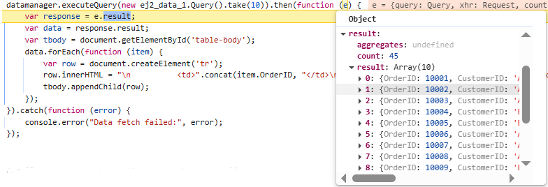
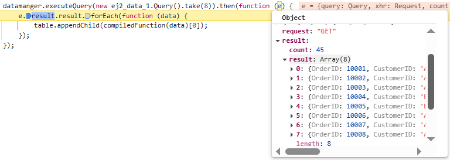
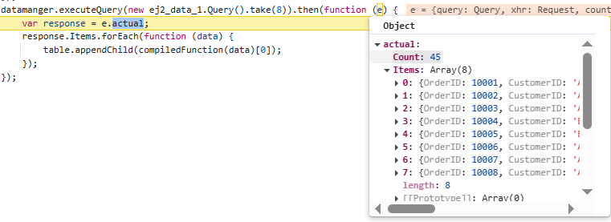
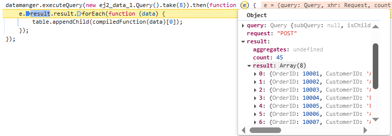

# Adaptors in ##Platform_Name## DataManager

Different data sources and remote services often follow distinct protocols for handling requests and returning responses. While the DataManager is designed to support a wide range of data services, it cannot natively interpret every possible data format or communication pattern.

To tackle this challenge, the DataManager leverages a flexible adaptor system. Adaptors act as intermediaries that translate requests and responses between the DataManager and the data service, ensuring seamless interaction regardless of the backend’s architecture.

Adaptors in Syncfusion’s DataManager act as communication bridges between the component and various data sources. They format queries and interpret responses appropriately depending on whether the data source is local or remote.

**Purpose of Adaptors:**

**For local data sources:** An adaptor facilitates the management of data that is already present within the application, such as a list or table maintained in memory. It handles operations like searching, sorting, filtering, and paging directly on this local dataset, eliminating the need for communication with an external server.

For example, imagine you have a contact list saved on your phone. If you want to quickly find all contacts with the name "John" or sort them by last called date, the adaptor handles this immediately on your phone without needing internet or asking a server.

**For remote data sources:** An adaptor serves as a bridge between the application and the server, translating data operations into appropriate request formats. It constructs and sends queries to the server using protocols like REST, OData, or GraphQL. Once the server responds, the adaptor processes and formats the data so the application can understand and use it.

For example, in an online shopping app where product information is stored on a remote server, when you search for products or browse pages, the adaptor formats your request properly, sends it to the server, and then converts the returned data into a list that the app can display.

**Types of Adaptors:**

Syncfusion provides several built-in adaptors to work with different data sources:

| Adaptor          | Description                                |
|------------------|--------------------------------------------|
| JsonAdaptor      | Works with local JavaScript arrays.        |
| ODataAdaptor     | Communicates with OData v3 services.       |
| ODataV4Adaptor   | For OData v4 endpoints.                     |
| WebApiAdaptor    | Integrates with ASP.NET Web API.            |
| WebMethodAdaptor | Integrates with web methods (e.g., ASP.NET server methods). |
| UrlAdaptor       | A generic adaptor for RESTful endpoints.   |
| CustomAdaptor    | Enables fully custom data processing logic.|
| GraphQLAdaptor   | Used to communicate with GraphQL services.|

## Json adaptor

The `JsonAdaptor` is a built-in adaptor provided by Syncfusion DataManager module. It is specifically designed to work with local data sources, such as JavaScript arrays or in-memory collections.  It allows you to perform various data operations like filtering, sorting, paging, and grouping directly on the client-side, without the need for server-side requests.

If you're building a feature like a product listing or a customer table where data is already available on the client-side (e.g., fetched once from an API or stored locally), the `JsonAdaptor` allows you to perform data operations directly in the browser, eliminating unnecessary server requests and improving performance.

To achieve the manipulation of local data using `JsonAdaptor`, follow these steps:

**Step 1:** Import **DataManager**, **Query**, **JsonAdaptor** modules from **@syncfusion/ej2-data**, and the **compile** module from **@syncfusion/ej2-base**.

  ```ts

  import { DataManager, Query, JsonAdaptor } from '@syncfusion/ej2-data';
  import { compile } from '@syncfusion/ej2-base';

  ```

**Step 2:** Provide your local data array to `json` of **DataManager**.

  ```ts

  const data: Object[] = [
    { OrderID: 10248, CustomerID: 'VINET', EmployeeID: 5 },
    { OrderID: 10249, CustomerID: 'TOMSP', EmployeeID: 6 },
    { OrderID: 10250, CustomerID: 'HANAR', EmployeeID: 4 },
    // ... more data items.
  ];

  ```

**Step 3: Configure the DataManager:**

  Assign your local data array to the `json` property and set the `adaptor` to an instance of `JsonAdaptor`.

  ```ts

  const dataManager = new DataManager({
    json: data,
    adaptor: new JsonAdaptor()
  });

  ```

**Step 4: Apply a query using executeLocal method:**

  Use the [executeLocal](../../api/data/dataManager/#executelocal) method with a [Query](../../api/data/query/) object to retrieve and manipulate data directly on the client-side. This method allows you to perform operations like filtering, sorting, paging, and grouping on local data without any server requests. For example, to retrieve the first 8 records.

  ```ts

  const result: Object[] = dataManager.executeLocal(new Query().take(8));

  ```

Here is an example that demonstrates how to use the `JsonAdaptor`:














        



















## Url adaptor

The `UrlAdaptor` is a built-in adaptor in Syncfusion's DataManager module designed to interact with remote web services such as RESTful APIs. It acts as the base class for many other adaptors (like WebApiAdaptor and ODataAdaptor), providing core functionality for HTTP communication.

This adaptor is especially useful when your data resides on a server and you need to perform operations like filtering, sorting, paging, or grouping on that remote data.

The `UrlAdaptor` expects the server's response to be a JSON object containing two primary properties:

- **result:**
    An array that contains the actual data records to be processed or displayed.

- **count:**
    A number representing the total count of records available on the server. This is especially important for enabling accurate pagination.

A sample response object should look like this:



To achieve this, follow these steps:



**Step 1:** Import **DataManager**, **Query**, **UrlAdaptor** modules from **@syncfusion/ej2-data**.

```ts

import { DataManager, Query, UrlAdaptor, ReturnOption } from '@syncfusion/ej2-data';

```
**Step 2: Configure the DataManager:**

Assign your API endpoint to the `url` property and use `UrlAdaptor` as the `adaptor`.

```ts

const datamanger = new DataManager({
    // Use remote server host and port instead of 'xxxx'.
    url: 'https://localhost:xxxx/api/Orders',
    adaptor: new UrlAdaptor(),
});

```

**Step 3: Apply a query using executeQuery:**

Use the [executeQuery](../../api/data/dataManager/#executequery) method with a [Query](../../api/data/query/) object to retrieve data. This enables you to perform server-side operations such as paging, filtering, or sorting. For example, the following code retrieves the first 10 records from the remote data source in the form of `result` and `count`.

```ts

datamanger.executeQuery(new Query().take(10)).then((e: ReturnOption) => {
    const response = e.result as { result: Order[] };
    const data = response.result;
    const tbody = document.getElementById('table-body');
    data.forEach((item: Order) => {
        const row = document.createElement('tr');
        row.innerHTML = `
          <td>${item.OrderID}</td>
          <td>${item.CustomerID}</td>
          <td>${item.EmployeeID}</td>
          <td>${item.ShipCity}</td>
          <td>${item.ShipCountry}</td>
      `;
        tbody.appendChild(row);
    });
}).catch(error => {
    console.error("Data fetch failed:", error);
});

```



**Step 1: Configure the DataManager:**

Assign your API endpoint to the `url` property and use `UrlAdaptor` as the `adaptor`.

```js

const datamanger = new ej.data.DataManager({
    // Use remote server host and port instead of 'xxxx'.
    url: 'https://localhost:xxxx/api/Orders',
    adaptor: new ej.data.UrlAdaptor(),
});

```

**Step 2: Apply a query using executeQuery:**

Use the [executeQuery](../../api/data/dataManager/#executequery) method with a [Query](../../api/data/query/) object to retrieve data. This enables you to perform server-side operations such as paging, filtering, or sorting. For example, the following code retrieves the first 10 records from the remote data source in the form of `result` and `count`.

```js
datamanger.executeQuery(new ej.data.Query().take(10)).then((e) => {
    const data = e.result.result;
    const tbody = document.getElementById('table-body');
    data.forEach((item) => {
        const row = document.createElement('tr');
        row.innerHTML = `
          <td>${item.OrderID}</td>
          <td>${item.CustomerID}</td>
          <td>${item.EmployeeID}</td>
          <td>${item.ShipCity}</td>
          <td>${item.ShipCountry}</td>
      `;
        tbody.appendChild(row);
    });
}).catch(error => {
    console.error("Data fetch failed:", error);
});

```



Here is an example that demonstrates how to use the `UrlAdaptor`:

















        



















## OData adaptor

The `ODataAdaptor` in Syncfusion's DataManager facilitates seamless integration with [OData](http://www.odata.org/documentation/odata-version-3-0/) services, which are standardized RESTful APIs designed for querying and manipulating data over HTTP. This adaptor streamlines operations such as querying, filtering, sorting, and paging data from OData endpoints, making it especially suitable for enterprise applications that require standardized and interoperable data access.

This adaptor is especially useful when:

* Connecting to an OData-compliant REST API.

* Utilizing built-in support for `OData` query options such as **$filter**, **$orderby**, **$top**, and **$skip**.

* Performing efficient server-side data operations, including paging, sorting, and filtering.

The `ODataAdaptor` automatically translates DataManager query operations into OData-compliant HTTP requests. It manages response parsing and maps the server data into the format expected by Syncfusion components, enabling smooth client-server communication.

The `ODataAdaptor` expects the server's response to be a JSON object containing two primary properties:

- **result:**
    An array that contains the actual data records to be processed or displayed.

- **count:**
    A number representing the total count of records available on the server. This is especially important for enabling accurate pagination.

A sample response object should look like this:




To retrieve data from an OData service using the DataManager, follow these steps:



**Step 1:** Import **DataManager**, **Query**, **ODataAdaptor** modules from **@syncfusion/ej2-data**, and the **compile** module from **@syncfusion/ej2-base**.

```ts

import { DataManager, Query, ODataAdaptor, ReturnOption } from '@syncfusion/ej2-data';
import { compile } from '@syncfusion/ej2-base';

```
**Step 2: Configure the DataManager:**

Assign your API endpoint to the `url` property and use `ODataAdaptor` as the `adaptor`.

```ts

const datamanger = new DataManager({
    // Use remote server host and port instead of 'xxxx'.
    url: 'https://localhost:xxxx/api/Orders',
    adaptor: new ODataAdaptor(),
});

```

**Step 3: Apply a query using executeQuery:**

Use the [executeQuery](../../api/data/dataManager/#executequery) method with a [Query](../../api/data/query/) object to retrieve data. This enables you to perform server-side operations such as paging, filtering, or sorting. For example, the following code retrieves the first 8 records from the remote data source in the form of `result` and `count`.

```ts

datamanger.executeQuery(new Query().take(8)).then((e: ReturnOption) => {
    (<Object[]>e.result.result).forEach((data: Object) => {
        table.appendChild(compiledFunction(data)[0]);
    });
});

```



**Step 1: Configure the DataManager:**

Assign your API endpoint to the `url` property and use `ODataAdaptor` as the `adaptor`.

```js

const datamanger = new ej.data.DataManager({
    // Use remote server host and port instead of 'xxxx'.
    url: 'https://localhost:xxxx/api/Orders',
    adaptor: new ej.data.ODataAdaptor(),
});

```

**Step 2: Apply a query using executeQuery:**

Use the [executeQuery](../../api/data/dataManager/#executequery) method with a [Query](../../api/data/query/) object to retrieve data. This enables you to perform server-side operations such as paging, filtering, or sorting. For example, the following code retrieves the first 8 records from the remote data source in the form of `result` and `count`.

```js
datamanger.executeQuery(new ej.data.Query().take(8)).then((e) => {

    e.result.result.forEach((data) => {
        table.appendChild(compiledFunction(data)[0]);
    });
});

```


Here is an example that demonstrates how to use the `ODataAdaptor`:





































> By default, `ODataAdaptor` is used by **DataManager**.

## ODataV4 adaptor

The `ODataV4Adaptor` is a specialized adaptor in Syncfusion's DataManager module, designed for interacting with OData v4 services. OData (Open Data Protocol) is a standardized protocol for creating and consuming RESTful APIs. The ODataV4 protocol is an improved version of previous OData protocols, offering enhanced capabilities and better support for modern web standards.

Syncfusion’s `ODataV4Adaptor` allows the DataManager to communicate with OData V4-compliant services, performing operations like filtering, sorting, paging, and grouping directly via OData query options in the URL. These operations are translated into OData query options and appended to the request URL, allowing the server to process them efficiently. This adaptor is particularly useful when integrating enterprise-grade OData services, such as those provided by Microsoft Dynamics 365, Azure, or SAP.

If you're building a reporting dashboard that connects to a Microsoft Dynamics 365 service (which exposes data via OData V4), you can use the `ODataV4Adaptor` to retrieve and manipulate data like customer orders, sales reports, or invoices directly from the OData-compliant API.

For more information on OData v4 protocol, refer to the official [OData V4 documentation](http://docs.oasis-open.org/odata/odata/v4.0/errata03/os/complete/part1-protocol/odata-v4.0-errata03-os-part1-protocol-complete.html#_Toc453752197).

To achieve this, follow these steps:



**Step 1:** Import **DataManager**, **Query**, **ODataV4Adaptor** modules from **@syncfusion/ej2-data**, and the **compile** module from **@syncfusion/ej2-base**.

```ts

import { DataManager, Query, ReturnOption, ODataV4Adaptor } from '@syncfusion/ej2-data';
import { compile } from '@syncfusion/ej2-base';

```
**Step 2: Configure the DataManager:**

Assign your API endpoint to the `url` property and use `ODataV4Adaptor` as the `adaptor`.

```ts

const datamanger = new DataManager({
    // Use remote server host and port instead of 'xxxx'.
    url: "https://localhost:xxxx/odata/Orders/", 
    adaptor: new ODataV4Adaptor 
});

```

**Step 3: Apply a query using executeQuery:**

Use the [executeQuery](../../api/data/dataManager/#executequery) method with a [Query](../../api/data/query/) object to retrieve data. This enables you to perform server-side operations such as paging, filtering, or sorting. For example, the following code retrieves the first 8 records from the remote data source.

```ts

datamanger.executeQuery(new Query().take(8)).then((e: ReturnOption) => {

    (<Object[]>e.result).forEach((data: Object) => {
        table.appendChild(compiledFunction(data)[0]);
    });
});

```



**Step 1: Configure the DataManager:**

Assign your API endpoint to the `url` property and use `ODataV4Adaptor` as the `adaptor`.

```js

const datamanger= new ej.data.DataManager({ 
    // Use remote server host and port instead of 'xxxx'.
    url: 'https://localhost:xxxx/odata/Orders/', 
    adaptor: new ej.data.ODataV4Adaptor 
});


```

**Step 2: Apply a query using executeQuery:**

Use the [executeQuery](../../api/data/dataManager/#executequery) method with a [Query](../../api/data/query/) object to retrieve data. This enables you to perform server-side operations such as paging, filtering, or sorting. For example, the following code retrieves the first 8 records from the remote data source.

```js
datamanger.executeQuery(new ej.data.Query().take(8))
    .then((e) => {
    (e.result).forEach((data) => {
            table.appendChild(compiledFunction(data)[0]);
    });
});

```



Here is an example that demonstrates how to use the `ODataV4Adaptor`:




















        






















## Web API adaptor

The `WebApiAdaptor` is a specialized adaptor in Syncfusion's DataManager module designed to interact with Web APIs, particularly those that support OData query options. Since the `WebApiAdaptor` is extended from the `ODataAdaptor`, it requires that the remote service endpoint understands and can process OData-formatted queries sent along with the request.

Since `WebApiAdaptor` inherits from `ODataAdaptor`, it expects the API endpoint to understand and process OData-formatted queries such as **$top**, **$**, **$filter**, sent along with the request.

For example, if you are fetching employee records from a Web API that accepts OData queries (like $top, $skip, $filter, etc.), the `WebApiAdaptor` automatically formats and sends these queries and parses the response appropriately.

To enable OData query options for your Web API, you need to ensure that the Web API is configured to understand OData requests. For more information on how to implement OData in a Web API, refer to the [documentation](https://docs.microsoft.com/en-us/aspnet/web-api/overview/odata-support-in-aspnet-web-api/supporting-odata-query-options).

The `WebApiAdaptor` expects the server's response to be a JSON object containing two primary properties:

- **Items:**
    An array that contains the actual data records to be displayed or processed.

- **Count:**
    A number representing the total count of records available on the server. This is especially important for enabling accurate pagination.

A sample response object should look like this:



To achieve this, follow these steps:



**Step 1:** Import **DataManager**, **Query**, **WebApiAdaptor** modules from **@syncfusion/ej2-data**, and the **compile** module from **@syncfusion/ej2-base**.


```ts

import { DataManager, Query, WebApiAdaptor, ReturnOption } from '@syncfusion/ej2-data';
import { compile } from '@syncfusion/ej2-base';

```
**Step 2: Configure the DataManager:**

Assign your API endpoint to the `url` property and use `WebApiAdaptor` as the `adaptor`.

```ts

const datamanger = new DataManager({
    // Use remote server host and port instead of 'xxxx'.
    url: 'https://localhost:xxxx/api/Orders',
    adaptor: new WebApiAdaptor(),
});

```

**Step 3: Apply a query using executeQuery:**

Use the [executeQuery](../../api/data/dataManager/#executequery) method with a [Query](../../api/data/query/) object to retrieve data. This enables you to perform server-side operations such as paging, filtering, or sorting. For example, the following code retrieves the first 8 records from the remote data source in the form of `Items` and `Count`.

```ts

datamanger.executeQuery(new Query().take(8)).then((e: ReturnOption) => {

    ((e as any).actual.Items.).forEach((data: Object) => {
        table.appendChild(compiledFunction(data)[0]);
    });
});

```



**Step 1: Configure the DataManager:**

Assign your API endpoint to the `url` property and use `WebApiAdaptor` as the `adaptor`.

```js

const datamanger = new ej.data.DataManager({
    // Use remote server host and port instead of 'xxxx'.
    url: 'https://localhost:xxxx/api/Orders',
    adaptor: new ej.data.WebApiAdaptor(),
});

```

**Step 2: Apply a query using executeQuery:**

Use the [executeQuery](../../api/data/dataManager/#executequery) method with a [Query](../../api/data/query/) object to retrieve data. This enables you to perform server-side operations such as paging, filtering, or sorting. For example, the following code retrieves the first 8 records from the remote data source in the form of `Items` and `Count`.

```js
datamanger.executeQuery(new ej.data.Query().take(8)).then((e) => {

    e.actual.Items.forEach((data) => {
        table.appendChild(compiledFunction(data)[0]);
    });
});

```


Here is an example that demonstrates how to use the `WebApiAdaptor`:





































## WebMethod Adaptor

The `WebMethodAdaptor` is a powerful and flexible adaptor provided by Syncfusion's DataManager module, specifically designed to interact with remote services or server-side methods that accept data via HTTP POST requests. Unlike adaptors that communicate with standard REST or OData services, the `WebMethodAdaptor` enables seamless data binding from custom server-side logic such as controller actions, web services, or business-layer functions.

This adaptor is ideal for applications where server-side methods are responsible for data retrieval and business logic processing. It ensures that data operations such as paging, sorting, filtering, and grouping are handled on the server and returned to the client in a structured format.

The `WebMethodAdaptor` expects the server's response to be a JSON object containing two primary properties:

- **result:**
    An array that contains the actual data records to be displayed or processed.

- **count:**
    A number representing the total count of records available on the server. This is especially important for enabling accurate pagination.

A sample response object should look like this:



To achieve this, follow these steps:



**Step 1:** Import **DataManager**, **Query**, **WebMethodAdaptor** modules from **@syncfusion/ej2-data**, and the **compile** module from **@syncfusion/ej2-base**.

```ts

import { DataManager, Query, WebMethodAdaptor, ReturnOption } from '@syncfusion/ej2-data';
import { compile } from '@syncfusion/ej2-base';

```
**Step 2: Configure the DataManager:**

Assign your API endpoint to the `url` property and use `WebMethodAdaptor` as the `adaptor`.

```ts

const datamanger = new DataManager({
    // Use remote server host and port instead of 'xxxx'.
    url: "https://localhost:xxxx/api/Orders",
    adaptor: new WebMethodAdaptor()
});

```

**Step 3: Apply a query using executeQuery:**

Use the [executeQuery](../../api/data/dataManager/#executequery) method with a [Query](../../api/data/query/) object to retrieve data. This enables you to perform server-side operations such as paging, filtering, or sorting. For example, the following code retrieves the first 8 records from the remote data source in the form of `result` and `count`.

```ts

datamanger.executeQuery(new Query().take(8)).then((e: ReturnOption) => {

    (<Object[]>e.result.result).forEach((data: Object) => {
        table.appendChild(compiledFunction(data)[0]);
    });
})

```



**Step 1: Configure the DataManager:**

Assign your API endpoint to the `url` property and use `WebMethodAdaptor` as the `adaptor`.

```js

const datamanger = new ej.data.DataManager({
    // Use remote server host and port instead of 'xxxx'.
    url: "https://localhost:xxxx/api/Orders",
    adaptor: new ej.data.WebMethodAdaptor()
});

```

**Step 2: Apply a query using executeQuery:**

Use the [executeQuery](../../api/data/dataManager/#executequery) method with a [Query](../../api/data/query/) object to retrieve data. This enables you to perform server-side operations such as paging, filtering, or sorting. For example, the following code retrieves the first 8 records from the remote data source in the form of `result` and `count`.

```js

datamanger.executeQuery(new ej.data.Query().take(8)).then((e) => {

    (e.result.result).forEach((data) => {
        table.appendChild(compiledFunction(data)[0]);
    });
});

```


> The server-side method must accept a parameter named `value` to receive the request payload from the client.

Here is an example that demonstrates how to use the `WebMethodAdaptor`:





































## RemoteSaveAdaptor

The `RemoteSaveAdaptor` is a specialized adaptor in Syncfusion’s DataManager module designed to perform actions such as sorting, filtering, searching and paging primarily on the client-side while handling CRUD operations(Create, Read, Update, and Delete), on the server-side for data persistence. This approach optimizes your experience by minimizing unnecessary server interactions.

For example, if you are building a dashboard that displays order data stored remotely and users need to add, edit, or delete records with changes saved back to the server, the `RemoteSaveAdaptor` helps manage these interactions effectively.

To achieve this, follow these steps:



**Step 1:** Import **DataManager**, **Query**, **RemoteSaveAdaptor** modules from **@syncfusion/ej2-data**, and the **compile** module from **@syncfusion/ej2-base**.

```ts

import { DataManager, Query, RemoteSaveAdaptor, ReturnOption } from '@syncfusion/ej2-data';
import { compile } from '@syncfusion/ej2-base';

```
**Step 2: Configure the DataManager:**

Assign your API endpoint to the `url` property and use `RemoteSaveAdaptor` as the `adaptor`.

```ts

const datamanger = new DataManager({
    // Use remote server host and port instead of 'xxxx'.
    url: "https://localhost:xxxx/api/Orders",
    adaptor: new RemoteSaveAdaptor()
});
```

**Step 3: Apply a query using executeQuery:**

Use the [executeQuery](../../api/data/dataManager/#executequery) method with a [Query](../../api/data/query/) object to retrieve data. This enables you to perform server-side operations such as paging, filtering, or sorting. For example, the following code retrieves the first 8 records from the remote data source.

```ts

datamanger.executeQuery(new Query().take(8)).then((e: ReturnOption) => {

    (<Object[]>e.result).forEach((data: Object) => {
        table.appendChild(compiledFunction(data)[0]);
    });
})

```



**Step 1: Configure the DataManager:**

Assign your API endpoint to the `url` property and use `RemoteSaveAdaptor` as the `adaptor`.

```js

const datamanger = new ej.data.DataManager({
    // Use remote server host and port instead of 'xxxx'.
    url: "https://localhost:xxxx/api/Orders",
    adaptor: new ej.data.RemoteSaveAdaptor()
});

```

**Step 2: Apply a query using executeQuery:**

Use the [executeQuery](../../api/data/dataManager/#executequery) method with a [Query](../../api/data/query/) object to retrieve data. This enables you to perform server-side operations such as paging, filtering, or sorting. For example, the following code retrieves the first 8 records from the remote data source.

```js

datamanger.executeQuery(new ej.data.Query().take(8)).then((e) => {

    e.result.forEach((data) => {
        table.appendChild(compiledFunction(data)[0]);
    });
});

```


Here is an example that demonstrates how to use the `RemoteSaveAdaptor`:





































## GraphQL Adaptor

The `GraphQLAdaptor` enables seamless data retrieval and manipulation from a GraphQL server. It allows you to precisely fetch the data you need, reducing over-fetching and under-fetching of data. GraphQL provides a flexible and expressive syntax for querying, enabling clients to request only the specific data they require. It allows efficient data retrieval with support for various operations like CRUD (Create, Read, Update, and Delete), paging, sorting, and filtering.

The adaptor extends the `UrlAdaptor`, which means it expects the server to return responses in a specific JSON format for proper data processing.

To achieve this, follow these steps:

**Step 1: Create service for GraphQL:**

**1:** Create a new folder named **GraphQLServer** specifically for your GraphQL server.

**2:** Install the [graph pack](https://www.npmjs.com/package/graphpack) npm package. Open your terminal and navigate to the server folder, then run:

  ```bash
  npm i graphpack
  ```

**3:** To utilize Syncfusion's  **ej2-data** package, you need to include it as a dependency in your project's **package.json** file. Here's how you can mention it in the configuration:
  
  ```json
    {
        "name": "graphql-server",
        "version": "1.0.0",
        "description": "",
        "scripts": {
        "dev": "graphpack --port 4205",
        "build": "graphpack build"
        },
        "devDependencies": {
        "graphpack": "^1.0.9"
        },
        "dependencies": {
        "@syncfusion/ej2-data": "24.1.41"
        }
    }
  ```

**4:** Create a schema file (e.g., **src/schema.graphql**) in your GraphQL server project and write the schema definition.

  * **Define Types:** Create types representing the structure of data retrieved from GraphQL queries. Since the `GraphQLAdaptor` in  Syncfusion extends from `UrlAdaptor`, it expects a JSON response with specific properties:

    **result:** An array containing the data entities.
    **count:** The total number of records.
    **aggregates:** Contains total aggregate data(optional).

  * **Define Queries:** Define queries to retrieve data from the server. Whether using a normal table or Syncfusion controls, you can define a query to fetch orders, accepting parameters such as a DataManager for advanced data operations.

  * **Define DataManager Input:** Define input types for DataManager, specifying parameters for sorting, filtering, paging, aggregates, etc., to be used in queries. The query parameters will be send in a string format which contains the below details.

  | Parameters       | Description                                                                     |
  | ---------------- | ------------------------------------------------------------------------------- |
  | `requiresCounts` | If it is **true** then the total count of records will be included in response. |
  | `skip`           | Holds the number of records to skip.                                            |
  | `take`           | Holds the number of records to take.                                            |
  | `sorted`         | Contains details about current sorted column and its direction.                 |
  | `where`          | Contains details about current filter column name and its constraints.          |
  | `group`          | Contains details about current grouped column names.                            |
  | `search`         | Contains details about current search data.                                     |
  | `aggregates`     | Contains details about aggregate data.                                          |

  
  
  
  
  

**5:** Create a resolver file (e.g., **src/resolvers.js**) to handle GraphQL queries and fetch data from your database or data source. Resolver functions are responsible for processing incoming GraphQL requests and returning the appropriate data in the expected `result` and `count` format.  To efficiently handle filtering, sorting, searching, and paging, you can use the utilities from the **@syncfusion/ej2-data** package such as **DataUtil**, [Query](../../api/data/query/), and **DataManager**.

    
    
    
    
    

**6:** Create a simple data file **src/db.js** that exports your data array.

    
    
    
    
    

**7:** Install required packages and start the GraphQL server by running the following commands in your terminal:

  ```bash
    npm install
    npm run dev
  ```
The server will be hosted at **http://localhost:xxxx/**. (where xxxx represents the port number).


**Step 2: Connect Syncfusion DataManager to GraphQL:**



**1:** Open the command prompt from the required directory, and run the following command to clone the Syncfusion JavaScript (Essential JS 2) quickstart project from GitHub.

```bash
git clone https://github.com/SyncfusionExamples/ej2-quickstart-webpack- ClientApp
cd ClientApp
```

**2: Add Syncfusion packages:**

```bash
npm install
```



**1:** Create a root folder named `ClientApp` for your application.

**2:** Open Visual Studio Code and create `ClientApp/index.js` and `ClientApp/index.html` files to initialize either a normal table or Syncfusion controls.



**3: Configure DataManager with GraphQLAdaptor:**



**A.** Import **DataManager**, **Query**, **GraphQLAdaptor** modules from **@syncfusion/ej2-data**, and the **compile** module from **@syncfusion/ej2-base**.

```ts

import { DataManager, Query, ReturnOption, GraphQLAdaptor } from '@syncfusion/ej2-data';
import { compile } from '@syncfusion/ej2-base';

```
**B. Configure the DataManager:**

Assign your API endpoint to the `url` property and use `GraphQLAdaptor` as the `adaptor`.

```ts

let data: DataManager = new DataManager({
    // Use remote server host and port instead of 'xxxx'.
    url: "http://localhost:xxxx",
    adaptor: new GraphQLAdaptor({
        // Additional adaptor options can be specified here.
    })
});

```

**C.Define the GraphQL query and map the response:**

* The `GraphQLAdaptor` includes a `query` property where you define your GraphQL query string. The response from the server should follow this JSON structure:

  ```ts

    query: `query getOrders($datamanager: DataManager) {
      getOrders(datamanager: $datamanager) {
        count,
        result {
          OrderID,
          CustomerID,
          ShipCity,
          ShipCountry
        }
      }
    }

  ```

  ```ts

    {
     "data": {
        "getOrders": {
           "result": [...],
           "count": 100
        }
     }
    }

  ```

* To map this structure, set the `result` and `count` fields in the `response` property of the adaptor:

    ```ts

    response: {
        result: 'getOrders.result',
        count: 'getOrders.count'
    }

    ```

**D. Apply a query using executeQuery:**

Use the [executeQuery](../../api/data/dataManager/#executequery) method with a [Query](../../api/data/query/)object to retrieve data. This enables you to perform server-side operations such as paging, filtering, or sorting.  The example below retrieves the first 8 records where the **ShipCity** contains "Cunewalde" and **ShipCountry** equals "Germany," sorted by **OrderID** descending.

```ts

const query = new Query()
  .skip(0).take(8).search('Cunewalde', ['ShipCity']).where('ShipCountry', 'equal', 'Germany').sortBy('OrderID', 'descending');

data.executeQuery(query).then((e: ReturnOption) => {
  const response = e.result as { result: Order[] };
  response.result.forEach((data: Order) => {
    table.appendChild(compiledFunction(data)[0]);
  });
});

```



**A. Configure the DataManager:**

Assign your API endpoint to the `url` property and use `GraphQLAdaptor` as the `adaptor`.

```ts

let data: DataManager = new ej.data.DataManager({
    // Use remote server host and port instead of 'xxxx'.
    url: "http://localhost:xxxx",
    adaptor: new ej.data.GraphQLAdaptor({
        // Additional adaptor options can be specified here.
    })
});

```

**B. Define the GraphQL query and map the response:**

* The `GraphQLAdaptor` includes a `query` property where you define your GraphQL query string. The response from the server should follow this JSON structure:

  ```ts

    query: `query getOrders($datamanager: DataManager) {
      getOrders(datamanager: $datamanager) {
        count,
        result {
          OrderID,
          CustomerID,
          ShipCity,
          ShipCountry
        }
      }
    }

    ```

    ```ts

    {
    "data": {
        "getOrders": {
            "result": [...],
            "count": 100
        }
    }
    }

    ```

* To map this structure, set the `result` and `count` fields in the `response` property of the adaptor:

    ```ts

    response: {
        result: 'getOrders.result',
        count: 'getOrders.count'
    }

    ```

**C. Apply a query using executeQuery:**

Use the [executeQuery](../../api/data/dataManager/#executequery) method with a [Query](../../api/data/query/) object to retrieve data. This enables you to perform server-side operations such as paging, filtering, or sorting.  The example below retrieves the first 8 records where the **ShipCity** contains "Cunewalde" and **ShipCountry** equals "Germany," sorted by **OrderID** descending.

```ts

const query = new Query()
  .skip(0).take(8).search('Cunewalde', ['ShipCity']).where('ShipCountry', 'equal', 'Germany').sortBy('OrderID', 'descending');

data.executeQuery(query).then((e) => {
  const response = e.result
  response.result.forEach((data) => {
    table.appendChild(compiledFunction(data)[0]);
  });
});

```




















**5: Add HTML Table:**

Create a basic HTML structure with a <table> element where data using the GraphQL adaptor will be rendered.





















**6: Run the Application:**

Once the GraphQL server is running, assign its URL (e.g., http://localhost:xxxx/) to the `dataManager.url` property of the `DataManager` in your application.

```bash
npm start
```


### Performing CRUD action with GraphQLAdaptor

The `GraphQLAdaptor` in Syncfusion’s DataManager provides a smooth way to integrate GraphQL endpoints for performing CRUD operations (Create, Read, Update, and Delete). This adaptor requires you to supply the appropriate GraphQL queries and mutations corresponding to each CRUD action.

You perform these actions by defining mutation queries dynamically inside the `getMutation` method, which returns the correct GraphQL mutation based on the CRUD operation being performed.

To implement CRUD operations using the `GraphQLAdaptor`, follow these steps:

**Step 1: Configure the DataManager:**

  * Define the GraphQL query to fetch data via the `query` property.

  * Map the response to extract the actual data and total count using the `response` object.

  * Implement mutation queries for `insert`, `update`, and `delete` actions inside the `getMutation` method.

**Step 2: Use DataManager CRUD methods:**

Use the `insert`, `update`, and `remove` methods of the **DataManager** configured with the `GraphQLAdaptor` to perform respective CRUD operations.



















**Step 3: Implement server-side GraphQL resolvers:**

Create resolver functions on the server side to handle the GraphQL queries and mutations. These functions perform data processing using the **@syncfusion/ej2-data** library.







**Step 4: Define GraphQL schema:**

Create a schema that supports Syncfusion DataManager queries and mutations with the required input types.







**Step 5:** Create an HTML file with forms for insert, update, delete and a table to display the data:



















**Step 6:** Create a simple data file (e.g., **src/db.js**) that exports an array of order objects used by the server-side resolvers.






