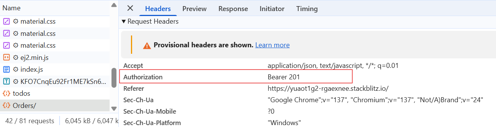
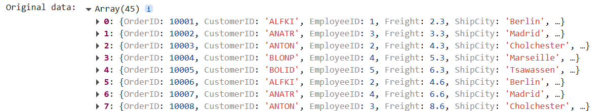
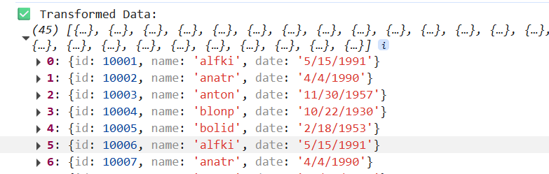
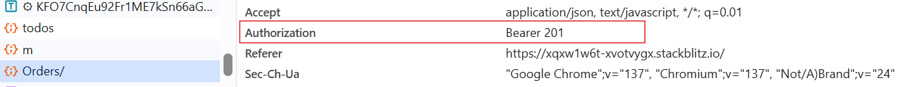
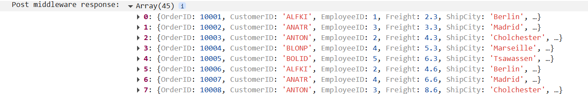
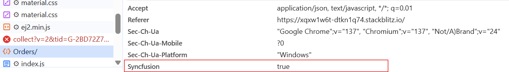
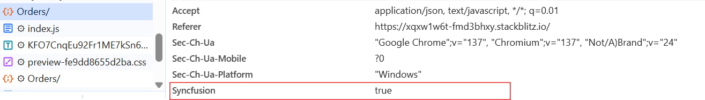
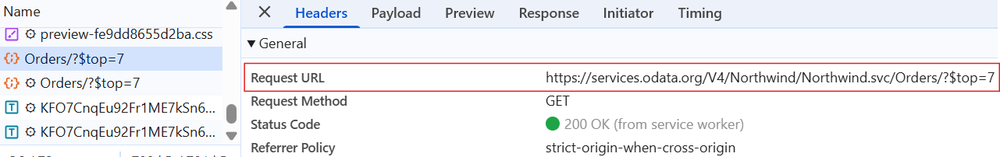

# Middleware & Request Customization

The Syncfusion ##Platform_Name## DataManager supports middleware functionality, allowing you to intercept, inspect, and manipulate data requests and responses as they flow between the client and server. This feature offers a flexible way to implement cross-cutting concerns such as authentication, input validation, request logging, header customization, data transformation, and more.

## Authorization handling

Authorization handling is one of the most essential and common use cases for middleware in Syncfusion ##Platform_Name## DataManager. It ensures that your application securely communicates with protected APIs by injecting authentication credentials such as Bearer tokens, API keys, or session identifiers into outgoing HTTP requests.

**Use of middleware for authorization:**

Implementing authorization through middleware centralizes the logic for token management and request protection, making your codebase more secure, scalable, and maintainable. With pre-request middleware, you can ensure that every request to the server includes the required credentials without modifying each request manually.

**Middleware types:**

Middleware in DataManager can be applied at two stages:

   * Pre-Request Middleware.

   * Post-Request Middleware.

## Pre-request middleware

The [applyPreRequestMiddlewares](https://ej2.syncfusion.com/javascript/documentation/api/data/dataManager/#applyprerequestmiddlewares) method enables you to intercept and customize HTTP requests before they are sent to the server. This is particularly useful for adding authorization headers (e.g., bearer token), appending custom query parameters, or modifying request payloads to meet backend expectations. It ensures secure and dynamic request configuration, especially when integrating with authenticated or complex APIs.

For example, you can programmatically inject an authentication token or enrich headers based on user context.

If you're building a SaaS admin dashboard where users log in and fetch their own data from a secured RESTful WebAPIs. Each user is issued a JWT (JSON Web Token) after authentication. Every request sent by the Syncfusion DataManager must include this token to validate the user’s identity.

By using `applyPreRequestMiddlewares`, you can automatically inject the JWT into the request headers as an authorization field. This avoids manual token handling and ensures every [DataManager](../api/data/dataManager/) request remains authenticated.



 







        
















In this example, the middleware intercepts the request object, adds an Authorization header, and then forwards the modified request to the server.

## Post-request middleware

The [applyPostRequestMiddlewares](https://ej2.syncfusion.com/javascript/documentation/api/data/dataManager/#applypostrequestmiddlewares) method allows you to intercept and manipulate the response after it’s received from the server but before it’s bound to the UI component. This is ideal for transforming API response formats, filtering unnecessary fields, renaming keys, or applying custom formatting to match the structure expected by your application.

If your API returns a nested object, but your component expects a flat array. Using `applyPostRequestMiddlewares`, you can flatten and restructure the response seamlessly.

For example, in a sales dashboard, the API may return product data with inconsistent formats such as uppercase product names, UNIX timestamps, and field names so you can use the middleware to convert names to title case, format timestamps into readable dates, and rename keys (e.g., prod_id to ProductID) before displaying the data.



 







        
















**Orginal data:**

**Transformed data:**

## Supported data adaptors

Middleware functions are compatible with various DataManager adaptors, including [WebApiAdaptor](./adaptors#web-api-adaptor), [ODataAdaptor](./adaptors#odata-adaptor), and [CustomAdaptor](./adaptors#customadaptor). They support both local and remote data processing. By leveraging middleware, you can improve the flexibility, security, and efficiency of data handling within your application.

The following code example demonstrates how to use Syncfusion's [WebApiAdaptor](./adaptors#web-api-adaptor) while applying middleware logic to modify requests and responses. Before sending a request to the backend, the [applyPreRequestMiddlewares](https://ej2.syncfusion.com/javascript/documentation/api/data/dataManager/#applyprerequestmiddlewares) method retrieves an authentication token from an external middleware server and adds it to the request headers. If the middleware server fails to return a valid token, the DataManager `failure` event is triggered to handle the error.

The [applyPostRequestMiddlewares](https://ej2.syncfusion.com/javascript/documentation/api/data/dataManager/#applypostrequestmiddlewares) method processes the server response before updating the component. This allows for any necessary transformations, such as filtering or reformatting, to be applied before the data is bound to the UI. These middleware methods enhance request lifecycle management, improve security, and offer greater control over data manipulation in applications.











        














  

**Pre middlewares request response:**

**Post middlewares request response:**

## Custom headers

The Syncfusion ##Platform_Name## DataManager allows you to add custom HTTP headers to each request, enabling advanced scenarios such as:

* Authentication (e.g., JWT Bearer tokens).

* Multi-tenant access (e.g., tenant ID headers).

* Feature flags or localization controls.

* Content-type negotiation or custom logic routing.

When making cross-origin requests with custom headers, browsers will automatically issue a preflight (options) request to verify server permissions.

**Ways to add custom headers:**

* Static headers during [DataManager](../api/data/dataManager/) initialization.

* Dynamic headers via applyPreRequestMiddlewares.

* Custom adaptor-level injection for advanced control.

### Using the headers property

You can assign custom headers directly during the initialization of the [DataManager](../api/data/dataManager/) by using the `headers` property. This approach is ideal when you have static or pre-defined headers such as authorization tokens or tenant IDs.

This method ensures that all requests made by the `DataManager` automatically include these headers without the need for additional logic or middleware handling. This is useful for sending static API keys, including content-type headers, applying application-level custom identifiers.



 







        
















### Using beforeSend

The `beforeSend` callback allows you to dynamically modify request headers just before the request is dispatched. This is useful when headers depend on runtime information, such as freshly fetched tokens or user specific data.

**Parameters:**

It accepts an three arguments:

* **DataManager (dm):** Provides the datasource and adaptor value.

* **Request (request):** Used to send custom headers, such as setting the Authorization header.

* **Settings (settings)**: An optional argument that allows additional configurations.



 







        
















## Sending additional parameters to server

When working with remote data sources, it is often necessary to send additional parameters to the server, such as filtering values, paging limits, or culture settings. The [DataManager](../api/data/dataManager/) supports this by allowing custom parameters to be appended to the query string of the request using the [addParams](https://ej2.syncfusion.com/documentation/api/data/query/#addparams) method.

The `addParams` method of the [Query](../api/data/query/) class is used to append custom query string parameters to the request sent by the `DataManager`. These parameters are useful when you want to pass additional data required by the server to process the request.

The following example demonstrates how to send an additional parameter `($top)` to limit the number of records retrieved from the server.



 







        
















