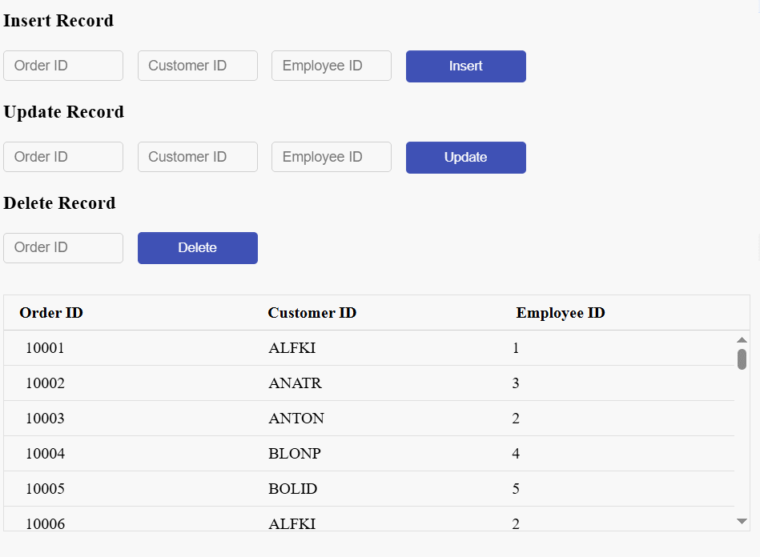

# CRUD operations in Syncfusion ##Platform_Name## DataManager

The Syncfusion ##Platform_Name## DataManager enables seamless Create, Read, Update, and Delete (CRUD) operations on data, whether it is stored locally in the browser or remotely on a server. You can manipulate data using the DataManager by calling its built-in methods and then binding it to UI components such as Grid, Gantt, or Scheduler. These components automatically trigger CRUD actions based on user interactions, such as editing a row or deleting a record.

Each datasource type handles CRUD operations differently. To manage this, DataManager uses data adaptors translate DataManager actions into the appropriate format for the target datasource.

**Data Adaptors and CRUD Translation:**

| Adaptor Type           | Target DataSource     | Notes                                                                 |
|------------------------|------------------------|-----------------------------------------------------------------------|
| `JsonAdaptor`          | Local JSON data        | All changes are made in-memory. Useful for offline scenarios.        |
| `UrlAdaptor`           | RESTful WebAPIs endpoints      | Sends GET/POST/PUT/DELETE requests to remote URLs.                   |
| `WebApiAdaptor`        | ASP.NET Web API        | Formats requests per Web API standards (e.g., OData-style queries).  |
| `ODataAdaptor` / V4    | OData services         | Compatible with OData-compliant services and supports query options. |
| `RemoteSaveAdaptor`    | Remote, batch updates  | Batches multiple CRUD operations into a single request.              |
| `CustomAdaptor`        | Developer-defined      | Extend the base class to fully control how CRUD requests behave.     |

## Performing CRUD operations

The process of performing CRUD operations varies depending on the datasource:

* For local data, operations are performed directly on in-memory or client-side collections.

* For remote data, CRUD actions are translated into HTTP requests sent to specified service endpoints, allowing interaction with centralized servers or cloud databases.

### Local data

Local data CRUD operations allow you to efficiently manage and manipulate data stored in your application without the need for external servers or APIs. This is useful for smaller applications, offline use cases, or situations where you want to quickly manipulate temporary datasets within your application.

To perform CRUD operations on local data using Syncfusion ##Platform_Name## DataManager, follow these steps:

**1. Initialize the DataManager with local data:**

  You can initialize the DataManager with a dataset by either:

  * Assigning a JavaScript object array to the `json` property.
    
  * Passing the dataset directly to the `DataManager` constructor.

**2. Perform CRUD operations using the following DataManager methods:**

  * [insert](../api/data/dataManager/#insert) : The JSON data passed as a parameter to the insert method that is inserted to the datasource of the dataManager.

  * [update](../api/data/dataManager/#update): Modifies or updates an existing record in the datasource using a unique key.

  * [remove](../api/data/dataManager/#remove) : Removes a record from the local datasource using a unique key.











        
















> * Primary key name is required by the [update](../api/data/dataManager/#update) method to find the record to be updated.
> * Primary key name and its value are required to find the record to be removed.

### Remote data

Remote data CRUD operations allow you to manage data hosted on a remote server or external API using the Syncfusion ##Platform_Name## DataManager. This is especially useful for modern web applications that interact with centralized databases or cloud services, ensuring seamless synchronization between client and server.

To perform CRUD operations on remote data using DataManager, follow these steps:

**1. Initialize the DataManager with remote data:**

  You can bind the DataManager to a remote datasource by specifying the service endpoint URL in the `url` property. Additionally, to handle CRUD operations properly, you should specify separate URLs for insert, update, and remove actions using the properties:

   * `insertUrl`: The endpoint URL to insert (create) new records.

   * `updateUrl`: The endpoint URL to update existing records.

   * `removeUrl`: The endpoint URL to delete records.

  The **DataManager** uses these URLs to perform the respective operations by sending appropriate HTTP requests to the server.

  To retrieve data from the remote server, use the DataManager’s [executeQuery](../api/data/dataManager/#executequery) method. This method converts the **Query** object into a server request and sends it to the specified endpoint. It then waits for the server response in JSON format and returns the resulting data.

**2. Perform CRUD operations using the following DataManager methods:**

  Use the following DataManager methods to perform client-side CRUD actions, which are automatically translated into HTTP requests to the corresponding remote URLs:

| Method | Description                                                                                   |
|--------|-----------------------------------------------------------------------------------------------|
| [insert](../api/data/dataManager/#insert) | Sends a POST request to `insertUrl` to create a new record.                                    |
| [update](../api/data/dataManager/#update) | Sends a PUT/PATCH request to `updateUrl` to modify an existing record, identified by a primary key. |
| [remove](../api/data/dataManager/#remove) | Sends a DELETE request to `removeUrl` to remove a record, using a primary key to identify it.  |

















        



















> * The [update](../api/data/dataManager/#update) method requires the primary key name to locate the record to be modified, while the remove method requires both the primary key name and its value to identify the record to be deleted.
>* In remote datasources, when the primary key field is an identity field, then it is advised to return the created data in the response.

## Handling batch operations

The Syncfusion ##Platform_Name## DataManager supports batch operations, allowing multiple CRUD actions such as create, update, and delete to be submitted in a single request. This feature improves performance by minimizing the number of HTTP requests sent to the datasource, reducing network overhead and enhancing efficiency.

Use the [saveChanges](../api/data/dataManager/#savechanges) method to commit all pending changes (insertions, updates, and deletions) in a single call. This eliminates the need for individual requests for each action.

**How Batch processing works:**

Batch processing involves maintaining three separate arrays to track different types of data modifications:

* **addedRecords** — Records to add.

* **changedRecords** — Records to update.

* **deletedRecords** — Records to delete.

These arrays are then passed to the DataManager’s `saveChanges` method along with the primary key field name, which uniquely identifies each record.

Below is an example demonstrating batch CRUD operations using local data:


























## Handling server errors

When performing data operations using Syncfusion's DataManager, such as fetching, inserting, updating, or deleting data from a remote server, these operations are asynchronous and can encounter errors due to server issues, network problems, or invalid requests.

To manage these failures effectively, you can use the [catch](../api/data/deferred/#catch) method available on the promise returned by the DataManager operation. The `catch` block allows you to gracefully handle errors by:

* Identify and capture failures caused by unreachable endpoints, timeouts, or server-side issues.

* Prevent application crashes by safely intercepting unhandled promise rejections.

* Display user-friendly error messages (e.g., "Failed to load data. Please try again later.") to inform the user of the problem.

* Log error details for developers to analyze, helping with faster debugging and resolution.

* Trigger fallback logic, such as retry mechanisms or offline storage access.

The following sample demonstrates how to use the `catch` block to manage errors during DataManager operations.

















        



















