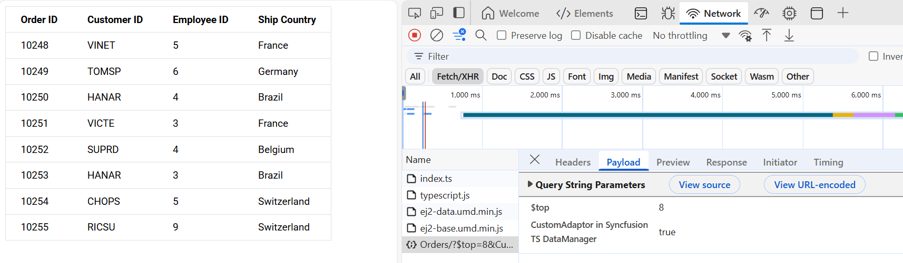
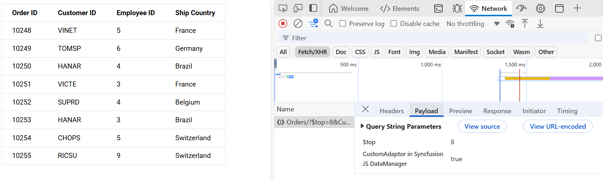
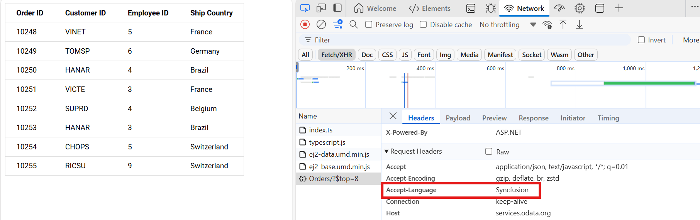
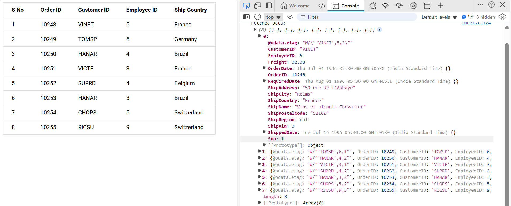

# Customization in Syncfusion ##Platform_Name## DataManager

The Syncfusion ##Platform_Name## DataManager offers powerful customization options for interacting with various data sources through `CustomAdaptor` or `CustomDataAdaptor`. These adaptors are ideal when the default adaptors do not align with your backend's API structure or business logic.

By customizing these adaptors, you can define how data is read, inserted, updated, or deleted, as well as how requests and responses are handled. This flexibility allows seamless integration with diverse data services and supports advanced scenarios such as modifying HTTP headers, transforming data formats, and implementing custom error handling.

## CustomDataAdaptor

The `CustomDataAdaptor` in Syncfusion ##Platform_Name## DataManager provides an option to send your own request and manually manage all data operations. It offers complete control over the way data is retrieved, processed, and transmitted between client and server. This adaptor is especially valuable when working with APIs that have non-standard request structures, authentication requirements, or custom business rules.

By extending the `UrlAdaptor`, `CustomDataAdaptor` inherits support for RESTful endpoints while allowing deep customization through method overrides.

**Custom request construction**

Within the `getData` method of `CustomDataAdaptor`, you can inspect the `option` object to access details about the current action, such as:

- Filtering: `option.queries.where`
- Sorting: `option.queries.sort`
- Paging: `option.queries.skip`, `option.queries.take`
- Searching: `option.queries.search`

Use this information to build a custom request payload that matches your backend API requirements.

**Handling the server response**

After fetching data from your service, you must notify the DataManager of the result:

- On success, call:  
    `option.onSuccess(responseData, additionalArgs);`
- On failure, call:  
    `option.onFailure(additionalArgs, error);`

Alternatively, you can use `this.processResponse(data, dataSource, option)` if you need to process the response before passing it to the DataManager.

**Expected server response format**

Since `CustomDataAdaptor` extends `UrlAdaptor`, it expects the server to return a JSON object with the following structure:

- **result:** An array of data objects representing the records.
- **count:** The total number of records (for paging support).

Example:

```json
{
        "result": [
                { /* record 1 */ },
                { /* record 2 */ }
                // ...
        ],
        "count": 67
}
```

This structure ensures that DataManager can correctly handle data binding, paging, and other operations.



### Connecting to an API service

This section demonstrates how to implement a `CustomDataAdaptor` in TypeScript for consuming data from an ASP.NET Core Web API service.

**Step 1:** Set up your development environment.

Ensure you have the following installed:

- .NET Core SDK
- Node.js
- Visual Studio or another preferred code editor

**Step 2:** Create a new ASP.NET Core project.

Open Visual Studio and create an ASP.NET Core Web API project named **CustomDataAdaptor**.

**Step 3:** Add the Microsoft.TypeScript.MSBuild NuGet package.

In Visual Studio, use the NuGet Package Manager (Tools → NuGet Package Manager → Manage NuGet Packages for Solution) to install the [Microsoft.TypeScript.MSBuild](https://www.nuget.org/packages/Microsoft.TypeScript.MSBuild/) package.

**Step 4:** Create the model class.

Add a class named **OrdersDetails.cs** in the **Models** folder to represent order data.




using System.ComponentModel.DataAnnotations;

namespace CustomDataAdaptor.Models
{
    public class OrdersDetails
    {
        public static List<OrdersDetails> order = new List<OrdersDetails>();

        public OrdersDetails() { }

        public OrdersDetails(int OrderID, string CustomerId, int EmployeeId, string ShipCountry)
        {
            this.OrderID = OrderID;
            this.CustomerID = CustomerId;
            this.EmployeeID = EmployeeId;
            this.ShipCountry = ShipCountry;
        }

        public static List<OrdersDetails> GetAllRecords()
        {
            if (order.Count == 0)
            {
                int code = 10000;
                for (int i = 1; i < 10; i++)
                {
                    order.Add(new OrdersDetails(code + 1, "ALFKI", i + 0, "Denmark"));
                    order.Add(new OrdersDetails(code + 2, "ANATR", i + 2, "Brazil"));
                    order.Add(new OrdersDetails(code + 3, "ANTON", i + 1, "Germany"));
                    order.Add(new OrdersDetails(code + 4, "BLONP", i + 3, "Austria"));
                    order.Add(new OrdersDetails(code + 5, "BOLID", i + 4, "Switzerland"));
                    code += 5;
                }
            }
            return order;
        }

        [Key]
        public int? OrderID { get; set; }
        public string? CustomerID { get; set; }
        public int? EmployeeID { get; set; }
        public string? ShipCountry { get; set; }
    }
}




**Step 5:** Add the controller.

Add a controller named **HomeController.cs** under the **Controllers** folder to handle data requests:




using CustomDataAdaptor.Models;
using Microsoft.AspNetCore.Mvc;

namespace CustomDataAdaptor.Controllers
{
    public class HomeController : Controller
    {
        public IActionResult Index()
        {
            return View();
        }

        [HttpPost]
        public IActionResult UrlDatasource()
        {
            var data = OrdersDetails.GetAllRecords();
            var totalRecordsCount = data.Count;
            return Json(new { result = data, count = totalRecordsCount });
        }
    }
}




**Step 6:** Configure the server to serve static files.

Update your `Program.cs` file as follows:

```csharp
var builder = WebApplication.CreateBuilder(args);

// Add services to the container.
builder.Services.AddControllersWithViews();

var app = builder.Build();

// Configure the HTTP request pipeline.
if (!app.Environment.IsDevelopment())
{
    app.UseExceptionHandler("/Home/Error");
    app.UseHsts();
}
app.UseDefaultFiles();
app.UseStaticFiles();
app.UseHttpsRedirection();
app.UseRouting();
app.UseAuthorization();

app.MapStaticAssets();

app.MapControllerRoute(
    name: "default",
    pattern: "{controller=Home}/{action=Index}/{id?}")
    .WithStaticAssets();

app.Run();
```

In `launchSettings.json`, set `launchBrowser` to `true`:

```json
"https": {
  "commandName": "Project",
  "dotnetRunMessages": true,
  "launchBrowser": true,
  "applicationUrl": "https://localhost:xxxx;http://localhost:xxxx",
  "environmentVariables": {
    "ASPNETCORE_ENVIRONMENT": "Development"
  }
}
```

This configuration allows the server to locate and serve the `index.html` file.

**Step 7:** Set up the client-side environment.

1. Initialize a `package.json` file in the project root:

    ```bash
    npm init -y
    ```

2. Install webpack and related dependencies:

    ```bash
    npm i -D -E clean-webpack-plugin css-loader html-webpack-plugin mini-css-extract-plugin ts-loader typescript webpack webpack-cli
    ```

3. Create a `wwwroot` folder in the project root to serve static files, and add an `index.html` file inside `wwwroot`:

    ```html
    <!DOCTYPE html>
    <html lang="en">
    <head>
        <meta charset="UTF-8">
        <title>CustomDataAdaptor in Syncfusion TS DataManager</title>
    </head>
    <body>
        <div id="container">
            <table id="datatable" class="e-table" border="1">
                <thead>
                    <tr>
                        <th>Order ID</th>
                        <th>Customer ID</th>
                        <th>Employee ID</th>
                        <th>Ship Country</th>
                    </tr>
                </thead>
                <tbody>
                </tbody>
            </table>
        </div>
        <script src="js/index.js"></script>
    </body>
    </html>
    ```

4. Add a `webpack.config.js` file in the project root:

    ```js
    const path = require('path');

    module.exports = {
        mode: 'development',
        entry: './src/index.ts',
        output: {
            filename: 'index.js',
            path: path.resolve(__dirname, 'wwwroot/js'),
        },
        resolve: {
            extensions: ['.ts', '.js'],
        },
        module: {
            rules: [
                {
                    test: /\.ts$/,
                    use: 'ts-loader',
                    exclude: /node_modules/,
                },
            ],
        }
    };
    ```

5. Install the Syncfusion DataManager package:

    ```bash
    npm install @syncfusion/ej2-data --save
    ```

6. Create a `src/tsconfig.json` file:

    ```json
    {
      "compilerOptions": {
        "target": "ES6",
        "module": "ESNext",
        "strict": true,
        "moduleResolution": "node",
        "esModuleInterop": true,
        "forceConsistentCasingInFileNames": true,
        "outDir": "./wwwroot/js",
        "rootDir": "./src"
      },
      "include": [ "src" ]
    }
    ```

**Step 8:** Implement the CustomDataAdaptor.

Use the following steps in your `src/index.ts` to fetch and display data with a `CustomDataAdaptor`:

**1. Import required modules:**

Import the necessary classes from the Syncfusion packages:

```ts
import { CustomDataAdaptor, DataManager, Query, ReturnOption } from "@syncfusion/ej2-data";
import { compile } from "@syncfusion/ej2-base";
```

**2. Set up the CustomDataAdaptor with a getData function:**

Define how data is fetched from the server using the fetch API inside the `CustomDataAdaptor`.

```ts
const SERVICE_URI = '/Home/UrlDatasource';

new DataManager({
    adaptor: new CustomDataAdaptor({
        getData: function (option: {
            onSuccess: (data: any, args: object) => void;
            onFailure: (args: object, error: any) => void;
        }): void {
            fetch(SERVICE_URI, {
                method: 'POST',
                headers: {
                    'Content-Type': 'application/json; charset=utf-8',
                },
                body: JSON.stringify(option)
            }).then((response: Response) => {
                if (response.ok) {
                    return response.json();
                }
                throw new Error('Network response was not ok.');
            }).then((data: any) => {
                option.onSuccess(data, {});
            }).catch((error: any) => {
                option.onFailure({}, error);
            });
        },
    }),
}).executeQuery(new Query())
    .then((e: ReturnOption) => {
        console.log("Fetched Data:", e.result);
        (e.result as Object[]).forEach((data: Object) => {
            table!.innerHTML += compiledFunction(data)[0].outerHTML;
        });
    })
    .catch((error) => {
        console.error('Data fetch error:', error);
    });
```




import { CustomDataAdaptor, DataManager, Query, ReturnOption } from "@syncfusion/ej2-data";
import { compile } from "@syncfusion/ej2-base";

let template: string = '<tr><td>${orderID}</td><td>${customerID}</td><td>${employeeID}</td><td>${shipCountry}</td></tr>';

const compiledFunction: Function = compile(template);

let table: HTMLElement = document.getElementById('datatable') as HTMLElement;

const SERVICE_URI: string = '/Home/UrlDatasource';

new DataManager({
    adaptor: new CustomDataAdaptor({
        getData: function (option: {
            onSuccess: (data: any, args: object) => void;
            onFailure: (args: object, error: any) => void;
        }): void {
            fetch(SERVICE_URI, {
                method: 'POST',
                headers: {
                    'Content-Type': 'application/json; charset=utf-8',
                },
                body: JSON.stringify(option)
            }).then((response: Response) => {
                if (response.status >= 200 && response.status <= 299) {
                    return response.json();
                }
                throw new Error('Network response was not ok.');
            }).then((data: any) => {
                option.onSuccess(data, {});
            }).catch((error: any) => {
                option.onFailure({}, error);
            });
        },
    }),
}).executeQuery(new Query())
    .then((e: ReturnOption) => {
        console.log("Fetched Data:", e.result);
        (e.result as Object[]).forEach((data: Object) => {
            table!.innerHTML += compiledFunction(data)[0].outerHTML;
        });
    })
    .catch((error) => {
        console.error('Data fetch error:', error);
    });





<!DOCTYPE html>
<html lang="en">
<head>
    <meta charset="UTF-8">
    <title>CustomDataAdaptor in TS DataManager</title>
</head>
<body>
	<div id='container'>
		<table id="datatable" class="e-table" border="1">
			<thead>
				<tr><th>Order ID</th><th>Customer ID</th><th>Employee ID</th><th>Ship Country</th></tr>
			</thead>
			<tbody>
			</tbody>
		</table>
	</div>
	<script src="js/index.js"></script>
</body>
</html>





using System.Diagnostics;
using CustomDataAdaptor.Models;
using Microsoft.AspNetCore.Mvc;

namespace CustomDataAdaptor.Controllers
{
    public class HomeController : Controller
    {
        public IActionResult Index()
        {
            return View();
        }

        [HttpPost]
        public IActionResult UrlDatasource()
        {
            var data = OrdersDetails.GetAllRecords();
            var totalRecordsCount = data.Count();
            return Json(new { result = data, count = totalRecordsCount });
        }
    }
}





using System.ComponentModel.DataAnnotations;

namespace CustomDataAdaptor.Models
{
    public class OrdersDetails
    {
        public static List<OrdersDetails> order = new List<OrdersDetails>();
        public OrdersDetails()
        {

        }
        public OrdersDetails(
        int OrderID, string CustomerId, int EmployeeId, string ShipCountry)
        {
            this.OrderID = OrderID;
            this.CustomerID = CustomerId;
            this.EmployeeID = EmployeeId;
            this.ShipCountry = ShipCountry;
        }

        public static List<OrdersDetails> GetAllRecords()
        {
            if (order.Count() == 0)
            {
                int code = 10000;
                for (int i = 1; i < 10; i++)
                {
                    order.Add(new OrdersDetails(code + 1, "ALFKI", i + 0, "Denmark"));
                    order.Add(new OrdersDetails(code + 2, "ANATR", i + 2, "Brazil"));
                    order.Add(new OrdersDetails(code + 3, "ANTON", i + 1, "Germany"));
                    order.Add(new OrdersDetails(code + 4, "BLONP", i + 3, "Austria"));
                    order.Add(new OrdersDetails(code + 5, "BOLID", i + 4, "Switzerland"));
                    code += 5;
                }
            }
            return order;
        }
        [Key]
        public int? OrderID { get; set; }
        public string? CustomerID { get; set; }
        public int? EmployeeID { get; set; }
        public string? ShipCountry { get; set; }
    }
}





**Step 9:** Build and run the application.

```bash
npx webpack
```

Next, run the project in Visual Studio. Once the application is running, open your browser and navigate to the application URL (for example, `https://localhost:xxxx`). The `wwwroot/index.html` file will be served, and you will see the DataManager working with your `CustomDataAdaptor`.



### Connecting to an API service

Follow these steps to create an ASP.NET Core Web App project and connect it to the Syncfusion ##Platform_Name## DataManager using a custom API service.

**Step 1:** Create a new ASP.NET Core Web App project.

1. Open Visual Studio.
2. Select **Create a new project**.
3. Choose the **ASP.NET Core Web App** project template.
4. Name the project **CustomDataAdaptor**.
5. Click **Create**.

**Step 2:** Configure the server.

In your `Program.cs` file, configure the server to serve static files and set up routing:

```csharp
var builder = WebApplication.CreateBuilder(args);

// Add services to the container.
builder.Services.AddControllersWithViews();

var app = builder.Build();

// Configure the HTTP request pipeline.
if (!app.Environment.IsDevelopment())
{
    app.UseExceptionHandler("/Home/Error");
    app.UseHsts();
}
app.UseDefaultFiles();
app.UseStaticFiles();
app.UseHttpsRedirection();
app.UseRouting();
app.UseAuthorization();

app.MapStaticAssets();

app.MapControllerRoute(
    name: "default",
    pattern: "{controller=Home}/{action=Index}/{id?}")
    .WithStaticAssets();

app.Run();
```

In your `launchSettings.json`, ensure `launchBrowser` is set to `true`:

```json
"https": {
  "commandName": "Project",
  "dotnetRunMessages": true,
  "launchBrowser": true,
  "applicationUrl": "https://localhost:xxxx;http://localhost:xxxx",
  "environmentVariables": {
    "ASPNETCORE_ENVIRONMENT": "Development"
  }
}
```

This configuration allows the server to locate and serve the `index.html` file.

**Step 3:** Create the model class.

Add a model class named **OrdersDetails.cs** in the **Models** folder to represent order data:




using System.ComponentModel.DataAnnotations;

namespace CustomDataAdaptor.Models
{
    public class OrdersDetails
    {
        public static List<OrdersDetails> order = new List<OrdersDetails>();
        public OrdersDetails()
        {

        }
        public OrdersDetails(
        int OrderID, string CustomerId, int EmployeeId, string ShipCountry)
        {
            this.OrderID = OrderID;
            this.CustomerID = CustomerId;
            this.EmployeeID = EmployeeId;
            this.ShipCountry = ShipCountry;
        }

        public static List<OrdersDetails> GetAllRecords()
        {
            if (order.Count() == 0)
            {
                int code = 10000;
                for (int i = 1; i < 10; i++)
                {
                    order.Add(new OrdersDetails(code + 1, "ALFKI", i + 0, "Denmark"));
                    order.Add(new OrdersDetails(code + 2, "ANATR", i + 2, "Brazil"));
                    order.Add(new OrdersDetails(code + 3, "ANTON", i + 1, "Germany"));
                    order.Add(new OrdersDetails(code + 4, "BLONP", i + 3, "Austria"));
                    order.Add(new OrdersDetails(code + 5, "BOLID", i + 4, "Switzerland"));
                    code += 5;
                }
            }
            return order;
        }
        [Key]
        public int? OrderID { get; set; }
        public string? CustomerID { get; set; }
        public int? EmployeeID { get; set; }
        public string? ShipCountry { get; set; }
    }
}




**Step 4:** Create the Controller.

Add a controller named **HomeController.cs** under the **Controllers** folder to handle data requests:




using CustomDataAdaptor.Models;
using Microsoft.AspNetCore.Mvc;

namespace CustomDataAdaptor.Controllers
{
    public class HomeController : Controller
    {
        public IActionResult Index()
        {
            return View();
        }

        [HttpPost]
        public IActionResult UrlDatasource()
        {
            var data = OrdersDetails.GetAllRecords();
            var totalRecordsCount = data.Count;
            return Json(new { result = data, count = totalRecordsCount });
        }
    }
}




**Step 5:** Set up static files.

1. Create a folder named `wwwroot` in the project root directory. This folder will contain static files served by the web server.
2. Inside `wwwroot`, create `js` and `css` folders for JavaScript and CSS files.

**Step 6:** Create the HTML file.

Add an `index.html` file under the `wwwroot` folder with the following structure:




<!DOCTYPE html>
<html lang="en">
<head>
    <title>CustomDataAdaptor in Syncfusion JS DataManager</title>
    <meta charset="utf-8">
    <meta name="viewport" content="width=device-width, initial-scale=1.0">
    <meta name="description" content="JavaScript DataManager Example">
    <meta name="author" content="Syncfusion">
</head>
<body>
    <div id="container">
        <table border="1" id="datatable">
            <thead>
                <tr>
                    <th>Order ID</th>
                    <th>Customer ID</th>
                    <th>Employee ID</th>
                    <th>Ship Country</th>
                </tr>
            </thead>
            <tbody id="table-body"></tbody>
        </table>
    </div>
    <script src="js/index.js" type="text/javascript"></script>
</body>
</html>




**Step 7:** Add the JavaScript file.

Use the following code in your `wwwroot/js/index.js` file to fetch and display data using a `CustomDataAdaptor`. Set up the DataManager with a `CustomDataAdaptor` to retrieve data from your API and render it in the table.

```js
let template = '<tr><td>${orderID}</td><td>${customerID}</td><td>${employeeID}</td><td>${shipCountry}</td></tr>';
let compiledFunction = ej.base.compile(template);
let table = document.getElementById('datatable');

const SERVICE_URI = '/Home/UrlDatasource';

new ej.data.DataManager({
    adaptor: new ej.data.CustomDataAdaptor({
        getData: function (option) {
            fetch(SERVICE_URI, {
                method: 'POST',
                headers: {
                    'Content-Type': 'application/json; charset=utf-8',
                },
                body: JSON.stringify(option)
            }).then((response) => {
                if (response.status >= 200 && response.status <= 299) {
                    return response.json();
                }
                throw new Error('Network response was not ok.');
            }).then((data) => {
                option.onSuccess(data, {});
            }).catch((error) => {
                option.onFailure({}, error);
            });
        },
    }),
}).executeQuery(new ej.data.Query()).then((e) => {
    e.result.result.forEach((data) => {
        table.appendChild(compiledFunction(data)[0]);
    });
});
```




let template = '<tr><td>${orderID}</td><td>${customerID}</td><td>${employeeID}</td><td>${shipCountry}</td></tr>';

let compiledFunction = ej.base.compile(template);

let table = document.getElementById('datatable');

const SERVICE_URI = '/Home/UrlDatasource';

new ej.data.DataManager({
    adaptor: new ej.data.CustomDataAdaptor({
        getData: function (option) {
            fetch(SERVICE_URI, {
                method: 'POST',
                headers: {
                    'Content-Type': 'application/json; charset=utf-8',
                },
                body: JSON.stringify(option)
            }).then((response) => {
                if (response.status >= 200 && response.status <= 299) {
                    return response.json();
                }
                throw new Error('Network response was not ok.');
            }).then((data) => {
                option.onSuccess(data, {});
            }).catch((error) => {
                option.onFailure({}, error);
            });
        },
    }),
}).executeQuery(new ej.data.Query()).then((e) => {
    e.result.result.forEach((data) => {
        table.appendChild(compiledFunction(data)[0]);
    });
});





<!DOCTYPE html>
<html lang="en">
<head>
    <title>CustomDataAdaptor in Syncfusion JS DataManager</title>
    <meta charset="utf-8">
    <meta name="viewport" content="width=device-width, initial-scale=1.0">
    <meta name="description" content="JavaScript DataManager Example">
    <meta name="author" content="Syncfusion">
</head>
<body>
    <div id="container">
        <table border="1" id="datatable">
            <thead>
                <tr>
                    <th>Order ID</th>
                    <th>Customer ID</th>
                    <th>Employee ID</th>
                    <th>Ship Country</th>
                </tr>
            </thead>
            <tbody id="table-body"></tbody>
        </table>
    </div>
    <script src="js/index.js" type="text/javascript"></script>
</body>
</html>





using System.Diagnostics;
using CustomDataAdaptor.Models;
using Microsoft.AspNetCore.Mvc;

namespace CustomDataAdaptor.Controllers
{
    public class HomeController : Controller
    {
        public IActionResult Index()
        {
            return View();
        }

        [HttpPost]
        public IActionResult UrlDatasource()
        {
            var data = OrdersDetails.GetAllRecords();
            var totalRecordsCount = data.Count();
            return Json(new { result = data, count = totalRecordsCount });
        }
    }
}






using System.ComponentModel.DataAnnotations;

namespace CustomDataAdaptor.Models
{
    public class OrdersDetails
    {
        public static List<OrdersDetails> order = new List<OrdersDetails>();
        public OrdersDetails()
        {

        }
        public OrdersDetails(
        int OrderID, string CustomerId, int EmployeeId, string ShipCountry)
        {
            this.OrderID = OrderID;
            this.CustomerID = CustomerId;
            this.EmployeeID = EmployeeId;
            this.ShipCountry = ShipCountry;
        }

        public static List<OrdersDetails> GetAllRecords()
        {
            if (order.Count() == 0)
            {
                int code = 10000;
                for (int i = 1; i < 10; i++)
                {
                    order.Add(new OrdersDetails(code + 1, "ALFKI", i + 0, "Denmark"));
                    order.Add(new OrdersDetails(code + 2, "ANATR", i + 2, "Brazil"));
                    order.Add(new OrdersDetails(code + 3, "ANTON", i + 1, "Germany"));
                    order.Add(new OrdersDetails(code + 4, "BLONP", i + 3, "Austria"));
                    order.Add(new OrdersDetails(code + 5, "BOLID", i + 4, "Switzerland"));
                    code += 5;
                }
            }
            return order;
        }
        [Key]
        public int? OrderID { get; set; }
        public string? CustomerID { get; set; }
        public int? EmployeeID { get; set; }
        public string? ShipCountry { get; set; }
    }
}





**Step 8: Run the Project**

Build and run the project in Visual Studio. Once the application is running, open your browser and navigate to the application URL (for example, `https://localhost:xxxx`). The `wwwroot/index.html` file will be served, and you will see the DataManager working with your `CustomDataAdaptor`.



## CustomAdaptor

The `CustomAdaptor` in Syncfusion ##Platform_Name## DataManager allows you to extend built-in adaptors (like UrlAdaptor) and override specific methods to customize the data communication between the client and server. This adaptor is useful when integrating with non-standard APIs or when the server's request and response formats do not match DataManager's default expectations.

With a `CustomAdaptor`, you have control over:

* Query translation: Customize how queries (filtering, sorting, paging) are serialized into API-compatible formats.
* Request building: Modify request URLs, headers, or payloads.
* Response processing: Transform server responses into formats consumable by UI components.

### Types of CustomAdaptor methods

There are three types of methods in custom adaptors.

**processQuery**

The `processQuery` method is responsible for transforming the incoming `Query` object into a request format understood by the server. It is typically used to construct URLs, append parameters, and serialize complex queries such as filtering, sorting, paging, and grouping. The `processQuery` method accepts two arguments: 

* `DataManager`: Used to modify the URL dynamically.

* `Query`: Allows setting additional parameter values or modifying queries such as sorting, filtering, and grouping, etc.











        














        






**beforeSend**

The `beforeSend` method is called immediately before the request is sent to the server, allowing you to modify the request or perform final checks. This method is particularly useful for dynamically adding authentication headers, customizing the request payload, or injecting additional metadata. It accepts the following arguments:

* `DataManager`: Provides access to the data and the adaptor instance.
* `Request`: Represents the request object, which can be used to set custom headers (for example, the `Authorization` header).
* `Settings` (optional): Allows for further configuration of the request.

**Common use cases include:**

- Injecting a bearer token or other authentication credentials.
- Adding custom headers such as client ID, language, or tenant information.
- Performing preflight validation or logging request details before sending.











        












        






**processResponse**

The `processResponse` method is executed after data is received from the server and before it is passed to the UI component. This method is responsible for parsing, transforming, or validating the server response to match the structure expected by Syncfusion controls. It can accept multiple optional arguments, allowing for customization based on specific requirements.

**Use cases include:**

- Formatting nested or wrapped data (for example, extracting `data.items` and `data.count`).
- Normalizing inconsistent field names.
- Handling API-specific pagination or error formats.
- Removing metadata or enriching records before binding.











        












        








### Connecting to an API service

The following example demonstrates how to extend the `ODataV4Adaptor` to create a custom adaptor and bind data to a table using the Syncfusion ##Platform_Name## DataManager.

**1. Import required modules:**

```ts
import { DataManager, Query, ReturnOption, ODataV4Adaptor } from '@syncfusion/ej2-data';
import { compile } from '@syncfusion/ej2-base';
```

**2. Create a custom adaptor by extending ODataV4Adaptor:**

```ts
class CustomAdaptor extends ODataV4Adaptor {
    // Override adaptor methods here as needed
}
```

**3. Configure the DataManager:**

```ts

const template: string = '<tr><td>${OrderID}</td><td>${CustomerID}</td><td>${EmployeeID}</td><td>${ShipCountry}</td></tr>';
const compiledFunction: Function = compile(template);

const SERVICE_URI: string = 'https://localhost:xxxx/odata/orders';
const table: HTMLElement | null = document.getElementById('datatable');

new DataManager({ url: SERVICE_URI, adaptor: new CustomAdaptor() })
    .executeQuery(new Query())
    .then((e: ReturnOption) => {
        (e.result as Object[]).forEach((data: Object) => {
            if (table) {
                table.innerHTML += compiledFunction(data)[0].outerHTML;
            }
        });
    })
    .catch((error) => {
        console.error('Data fetch error:', error);
    });
```

This setup allows you to customize the adaptor's behavior by overriding methods in the `CustomAdaptor` class, while efficiently fetching and displaying data from your OData service.




const template: string = '<tr><td>${OrderID}</td><td>${CustomerID}</td><td>${EmployeeID}</td><td>${ShipCountry}</td></tr>';
const compiledFunction: Function = compile(template);

const SERVICE_URI: string = 'https://localhost:xxxx/odata/orders';
const table: HTMLElement | null = document.getElementById('datatable');

new DataManager({ url: SERVICE_URI, adaptor: new CustomAdaptor() })
    .executeQuery(new Query())
    .then((e: ReturnOption) => {
        (e.result as Object[]).forEach((data: Object) => {
            if (table) {
                table.innerHTML += compiledFunction(data)[0].outerHTML;
            }
        });
    })
    .catch((error) => {
        console.error('Data fetch error:', error);
    });





<!DOCTYPE html>
<html lang="en">
<head>
    <meta charset="UTF-8">
    <title>CustomAdaptor in Syncfusion TS DataManager</title>
</head>
<body>
	<div id='container'>
		<p id="error-message" style="text-align:center;color:red">
			<table id="datatable" class="e-table" border="1">
				<thead>
					<tr><th>Order ID</th><th>Customer ID</th><th>Employee ID</th><th>Ship Country</th></tr>
				</thead>
				<tbody>
				</tbody>
			</table>
	</div>
	<script src="js/index.js"></script>
</body>
</html>





using CustomAdaptor.Models;
using Microsoft.AspNetCore.Mvc;
using Microsoft.AspNetCore.OData.Query;

namespace CustomAdaptor.Controllers
{
    [Route("[controller]")]
    [ApiController]
    public class OrdersController : ControllerBase
    {
        /// <summary>
        /// Retrieves all orders.
        /// </summary>
        /// <returns>The collection of orders.</returns>
        [HttpGet]
        [EnableQuery]
        public IActionResult Get()
        {
            var data = OrdersDetails.GetAllRecords().AsQueryable();
            return Ok(data);
        }
    }
}




using System.ComponentModel.DataAnnotations;

namespace CustomAdaptor.Models
{
    public class OrdersDetails
    {
        public static List<OrdersDetails> order = new List<OrdersDetails>();
        public OrdersDetails()
        {

        }
        public OrdersDetails(
        int OrderID, string CustomerId, int EmployeeId, string ShipCountry)
        {
            this.OrderID = OrderID;
            this.CustomerID = CustomerId;
            this.EmployeeID = EmployeeId;
            this.ShipCountry = ShipCountry;
        }

        public static List<OrdersDetails> GetAllRecords()
        {
            if (order.Count() == 0)
            {
                int code = 10000;
                for (int i = 1; i < 10; i++)
                {
                    order.Add(new OrdersDetails(code + 1, "ALFKI", i + 0, "Denmark"));
                    order.Add(new OrdersDetails(code + 2, "ANATR", i + 2, "Brazil"));
                    order.Add(new OrdersDetails(code + 3, "ANTON", i + 1, "Germany"));
                    order.Add(new OrdersDetails(code + 4, "BLONP", i + 3, "Austria"));
                    order.Add(new OrdersDetails(code + 5, "BOLID", i + 4, "Switzerland"));
                    code += 5;
                }
            }
            return order;
        }
        [Key]
        public int? OrderID { get; set; }
        public string? CustomerID { get; set; }
        public int? EmployeeID { get; set; }
        public string? ShipCountry { get; set; }
    }
}






### Connecting to an API service

The following example demonstrates how to extend the `ODataV4Adaptor` to create a custom adaptor and bind data to a table using the Syncfusion DataManager in JavaScript.

**1. Create a custom adaptor by extending ODataV4Adaptor:**

Extend the built-in `ODataV4Adaptor` to customize data operations as needed:

```js
class CustomAdaptor extends ej.data.ODataV4Adaptor {
    // Override adaptor methods here as needed.
}
```

**2. Configure the DataManager:**

Initialize the DataManager with your custom adaptor and fetch data from the OData service.

```js
var template = '<tr><td>${OrderID}</td><td>${CustomerID}</td><td>${EmployeeID}</td><td>${ShipCountry}</td></tr>';
var compiledFunction = ej.base.compile(template);
var table = document.getElementById('datatable');

const SERVICE_URI = 'https://localhost:xxxx/odata/Orders'; // Replace xxxx with your actual port number.

new ej.data.DataManager({ url: SERVICE_URI, adaptor: new CustomAdaptor() })
    .executeQuery(new ej.data.Query())
    .then(function (e) {
        e.result.forEach(function (record) {
            table.innerHTML += compiledFunction(record)[0].outerHTML;
        });
    })
    .catch(function (error) {
        console.error('Data fetch error:', error);
    });
```

This approach allows you to fully customize the adaptor's behavior by overriding methods in the `CustomAdaptor` class, while efficiently retrieving and displaying data from your OData service.




var template = '<tr><td>${OrderID}</td><td>${CustomerID}</td><td>${EmployeeID}</td><td>${ShipCountry}</td></tr>';
var compiledFunction = ej.base.compile(template);

var table = document.getElementById('datatable');
var errorMessage = document.getElementById('error-message');

class CustomAdaptor extends ej.data.ODataV4Adaptor {
    // Override adaptor methods here if needed.
}

const SERVICE_URI = 'https://localhost:xxxx/odata/Orders'; // Replace xxxx with your actual port number.

new ej.data.DataManager({ url: SERVICE_URI, adaptor: new CustomAdaptor() })
    .executeQuery(new ej.data.Query())
    .then(function (e) {
        e.result.forEach(function (record) {
            if (table) {
                table.innerHTML += compiledFunction(record)[0].outerHTML;
            }
        });
    });





<!DOCTYPE html>
<html lang="en">
<head>
    <title>CustomAdaptor in Syncfusion JS DataManager</title>
    <meta charset="utf-8">
    <meta name="viewport" content="width=device-width, initial-scale=1.0">
    <meta name="author" content="Syncfusion">
    <script src="https://cdn.syncfusion.com/ej2/29.2.4/dist/ej2.min.js" type="text/javascript"></script>
</head>
<body>
    <div id="container">
        <p id="error-message" style="text-align:center;color:red"></p>
        <table id="datatable" class="e-table" border="1">
            <thead>
                <tr>
                    <th>Order ID</th>
                    <th>Customer ID</th>
                    <th>Employee ID</th>
                    <th>Ship Country</th>
                </tr>
            </thead>
            <tbody>
            </tbody>
        </table>
    </div>
    <script src="js/index.js" type="text/javascript"></script>
</body>
</html>





using CustomAdaptor.Models;
using Microsoft.AspNetCore.Mvc;
using Microsoft.AspNetCore.OData.Query;

namespace CustomAdaptor.Controllers
{
    [Route("[controller]")]
    [ApiController]
    public class OrdersController : ControllerBase
    {
        /// <summary>
        /// Retrieves all orders.
        /// </summary>
        /// <returns>The collection of orders.</returns>
        [HttpGet]
        [EnableQuery]
        public IActionResult Get()
        {
            var data = OrdersDetails.GetAllRecords().AsQueryable();
            return Ok(data);
        }
    }
}




using System.ComponentModel.DataAnnotations;

namespace CustomAdaptor.Models
{
    public class OrdersDetails
    {
        public static List<OrdersDetails> order = new List<OrdersDetails>();
        public OrdersDetails()
        {

        }
        public OrdersDetails(
        int OrderID, string CustomerId, int EmployeeId, string ShipCountry)
        {
            this.OrderID = OrderID;
            this.CustomerID = CustomerId;
            this.EmployeeID = EmployeeId;
            this.ShipCountry = ShipCountry;
        }

        public static List<OrdersDetails> GetAllRecords()
        {
            if (order.Count() == 0)
            {
                int code = 10000;
                for (int i = 1; i < 10; i++)
                {
                    order.Add(new OrdersDetails(code + 1, "ALFKI", i + 0, "Denmark"));
                    order.Add(new OrdersDetails(code + 2, "ANATR", i + 2, "Brazil"));
                    order.Add(new OrdersDetails(code + 3, "ANTON", i + 1, "Germany"));
                    order.Add(new OrdersDetails(code + 4, "BLONP", i + 3, "Austria"));
                    order.Add(new OrdersDetails(code + 5, "BOLID", i + 4, "Switzerland"));
                    code += 5;
                }
            }
            return order;
        }
        [Key]
        public int? OrderID { get; set; }
        public string? CustomerID { get; set; }
        public int? EmployeeID { get; set; }
        public string? ShipCountry { get; set; }
    }
}






### Error Handling

Proper error handling is essential when working with remote data sources to ensure a robust user experience and facilitate easier debugging. Syncfusion ##Platform_Name## DataManager provides built-in mechanisms to capture and respond to errors that occur during data operations.

When using a `CustomAdaptor`, you must explicitly invoke error callbacks in case of failures. This ensures that the DataManager triggers the appropriate error events on the bound UI components, such as Grid, allowing you to handle errors gracefully in the UI.

Use the following example to understand how to implement error handling in a `CustomAdaptor`:





























