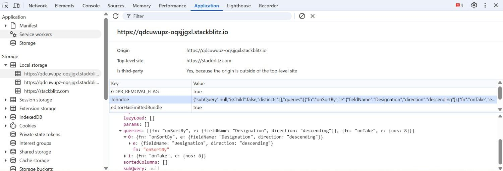
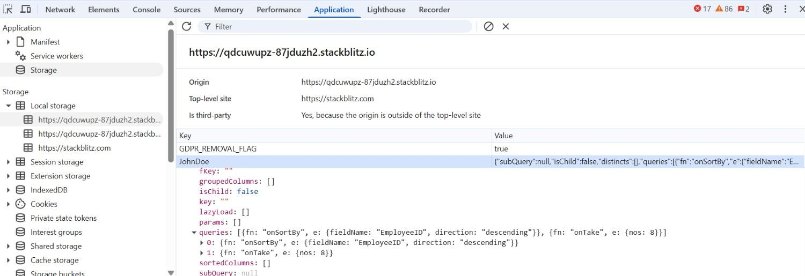
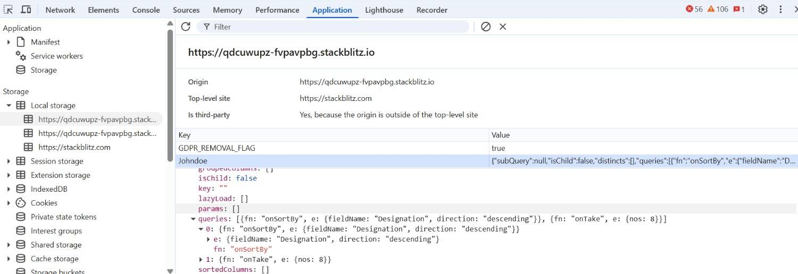
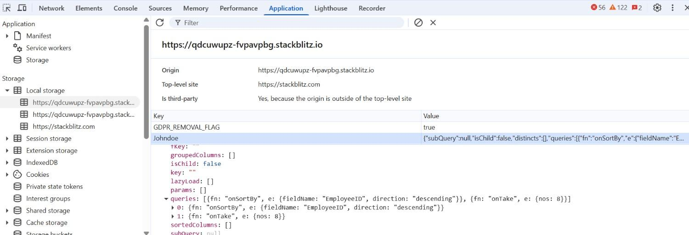
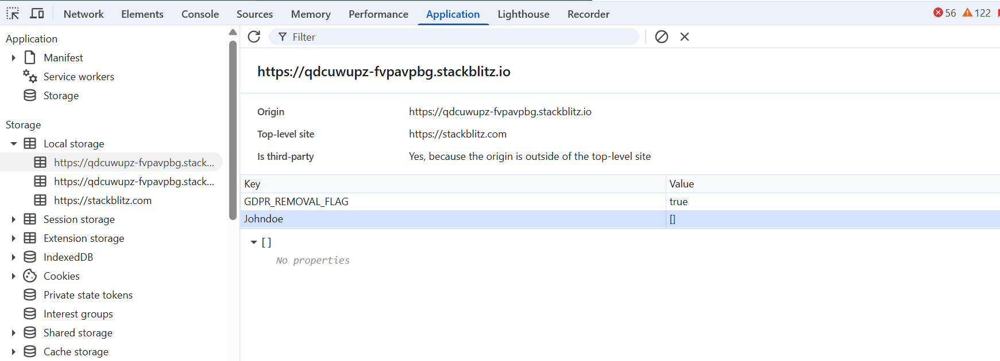

# State persistence in ##Platform_Name## DataManager

State persistence in Syncfusion ##Platform_Name## DataManager refers to its ability to retain data operation states such as sorting, filtering, paging, and grouping in the browser’s `localStorage`, even when the user refreshes the page or navigates across different views within the same browser session. This allows the DataManager’s query object to persistently store in the local storage. To enable this feature, set the `enablePersistence` property to **true** and provide a unique `id` for the DataManager.

**Benefits of enabling state persistence:**

* Seamless user experience with no loss of state across page transitions or reloads.
* Automatically reapplies the last known query state on initialization.
* Ideal for dashboards or multipage applications where consistent view state is critical.

For example, in a sales analytics dashboard, users may sort transactions by revenue and apply filters on customer regions. With state persistence enabled, these preferences remain intact even after a page reload eliminating the need to repeat the same operations, thus improving usability and efficiency.

The following sample demonstrates how to implement state persistence using DataManager and display the fetched data. In this example, an initial paging query (skip(5).take(8)) is used, and the paging state is automatically persisted across reloads.














        



















## Preventing a query from persistence

By default, the Syncfusion ##Platform_Name## DataManager can persist various types of queries, such as sorting, searching, filtering, and selection queries. However, there may be cases where you want to exclude specific queries from persistence. To achieve this, you can utilize the `ignoreOnPersist` property and specify the queries you wish to exclude. By using this property, only selected aspects of the DataManager’s state can be retained while excluding others such as sorting, searching, filtering, grouping, or selection.

The following are the query types that can be excluded using `ignoreOnPersist`. This property accepts an array of query keys representing the operations you wish to exclude from persistence which is described below as follows:

**Supported query keys:**

| Operation            | Query Key        |
|----------------------|------------------|
| Sorting              | `onSortBy`       |
| Searching            | `onSearch`       |
| Filtering            | `onWhere`        |
| Grouping             | `Grouping`       |

* The `ignoreOnPersist` property type is an array, allowing you to exclude multiple queries from persistence according to your requirements.
* Refer to the following example, which demonstrates how to exclude the sorting query ("onSortBy") and the search query ("onSearch") from being persisted in the DataManager:














        



















## Get/Set existing persisted data

The Syncfusion ##Platform_Name## DataManager provides built in methods to retrieve and update the persisted query state stored in the browser’s `localStorage`. For example, to modify, inspect, or reuse persisted configurations across sessions or user roles. 

* **getPersistedData:** This method returns the current persisted state of the DataManager, including query information like sorting, filtering, searching, and more.
* **setPersistData:** This method allows you to update or overwrite the existing persisted data with a custom state object. It is especially useful when restoring saved configurations or applying a default state programmatically.

The `getPersistedData` method retrieves the query state saved in the browser’s `localStorage` for a specific DataManager instance. It requires the `id` of the DataManager as a parameter and returns the persisted query information such as filtering, sorting, or paging configurations.

In the following example, the method is used to retrieve and log the persisted sorting state of the DataManager with the id **JohnDoe**, where the data was sorted by the **Designation** field in **descending** order.














        



















The `setPersistData` method allows adding or updating the persisted query data for the specified DataManager. It accepts the following three arguments:

* **Original event:** Set to `null` when not using within an event context.

* **id:** A string representing the unique `id` of the DataManager instance.

* **Query:** A `query` object that defines the data operation (such as sorting, filtering, etc.) to be persisted.

In this example, the existing persisted query sorted by **Designation** is updated using `setPersistData` to a new query that applies a **descending** sort on **EmployeeID**.














        



















By using the `setPersistData` method, the persisted query state of the DataManager is updated with the specified `query`.

## Restoring the initial state of Datamanager

When the `enablePersistence` feature is enabled in Syncfusion ##Platform_Name## DataManager, it automatically stores and retains the last known state (e.g., sorting, filtering, paging) in the browser’s `localStorage`. This ensures the user’s configuration persists across page reloads or browser sessions.

However, in certain scenario, such as application resets, user preference changes, or logout flows you may want to clear the persisted state and restore the DataManager to its original configuration.

To achieve this, use the `clearPersistence()` method provided by the DataManager. This will remove all persisted data associated with the DataManager id and restore it to its initial state.

The following sample demonstrates how to clear the persisted state in the DataManager using the `clearPersistence` method:














        



















In this sample, the DataManager is initially configured to sort the data by the **Designation** field in descending order. This query is executed on load, and the resulting state is automatically stored in the browser’s `localStorage` due to the `enablePersistence` setting.

When the Apply Query button is clicked, a new query is applied. This updates the table content by sorting based on the **EmployeeID** field and again stores the latest query state in `localStorage`.

When the Clear Persistence button is clicked, the `clearPersistence()` method is called, which removes the stored query state from `localStorage`. This restores the DataManager to its original state, so any previously applied queries such as sorting will no longer be retained after a page reload.

## Use case example demonstrating state persistence with the DataManager

This demonstration involves two controls, namely the **Grid** and the **Chart**, which both fetch data from the same instance of the DataManager, which has the state persistence feature enabled.

The Grid is responsible for displaying the entire dataset, while the Chart presents user reviews based on specific data from the "column name" field. Both controls are associated with the same DataManager instance and it has enabled the state persistence feature. The query state of the DataManager is automatically saved in the browser's local storage as the user applies filtering and sorting actions. In both controls are reloaded the data with the last persisted state while refreshing or reloading the browser.

In this demo, the filter query and sort query are persisted, whereas the search query is not persisted. The onSearch query is excluded from persistence by setting it in the ignoreOnPersist property of the DataManager.

For a more detailed explanation and steps of this use case, refer to the following:

**Step 1:** To initiate the demo, users are required to select a username from the dropdown list. After making a selection, the Grid and Chart controls will load with initial data using the Datamanager. Specifically for this demo, the Datamanager's id will be set to the chosen username. The Datamanager will then store the query with this id in the window.localStorage. Refer to the code example for your reference:

**Step 2:** This demo allows you to select Grid items by clicking checkboxes and adding them to your cart using the "Add" button in the toolbar. Additionally, you can sort the products from high price to low price by clicking the "Price Low-High" and "Price High-Low" buttons. Furthermore, you can view the added products from the wishlist by clicking the wishlist icon. All this information is persisted and stored by the DataManager based on the user ID.

You also can filter the product items using the product category filter. However, this category filter is also not persisted.

The Chart allows you to see the product reviews.

**Step 3:** To log out, simply use the "Logout" button.

**Step 4:** After logging out or refreshing the browser, you will need to select a username from the dropdown list once again (repeat step 1). However, the Grid data will now be loaded based on the last persisted wishlist, associated with the chosen username. The complete example is as follows:

To clear the wishlist for a specific user, click the "Clear Wishlist" button. This will remove all the saved wishlist items for that user.

[Here](https://github.com/SyncfusionExamples/EJ2-DataManager-peristence-cart-sample), you can find the Use case example demonstrating sate persistence with the DataManager.