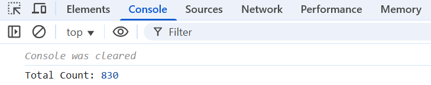
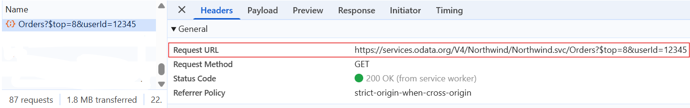

# Querying in ##Platform_Name## DataManager

The Syncfusion ##Platform_Name## DataManager includes a [Query](../api/data/query/) class for building and executing LINQ-style or chainable queries on local arrays, RESTful Web APIs and Odata Services.

A `Query` is a set of instructions that defines what data to retrieve from a datasource and how the returned data should be structured and organized. Using `Query` class in DataManager, you can build simple and complex queries in a streamlined manner, enabling consistent and efficient data access.

For example, using the `Query` class is like ordering food from a digital menu. You can filter for vegetarian items, sort them by price, and pick the top few and the system instantly gives you only the results you need, without going through everything manually.

## How query processing works

The [Query](../api/data/query/) class in Syncfusion ##Platform_Name## DataManager provides a fluent interface for defining and executing complex data operations, such as filtering, sorting, grouping, and paging. Each method in the `Query` class adds a logical layer of transformation, and the entire query is processed through the [executeQuery()](../api/data/dataManager/#executequery) method.

The processing flow generally follows these steps:

* **Query definition:**

  Construct your query using chained methods such as:

    1. [from](../api/data/query/#from) – Defines the datasource.

    2. [select](../api/data/query/#select) – Specifies the fields to retrieve.

    3. [where](../api/data/query/#where) – Filters records based on conditions.

    4. [sortBy](../api/data/query/#sortby) – Sorts the data by one or more fields.

    5. [take](../api/data/query/#take) – Limits the number of records returned.

* **Execution:**

  * The query is then passed to DataManager's method such as `executeLocal` and `executeQuery` for processing.(either local or remote)
  * Then the Adaptor of DataManager converts query into format compatible with dataservices (such as RESTful Web APIs, OData, or other Web APIs).

* **Result handling:**

  Once the response is received, the DataManager processes and maps the data to match the query structure. The result can then be rendered or further processed in your application.

This modular and extensible approach simplifies data interactions, promotes maintainability, and supports dynamic data shaping tailored to your application’s needs.

## Creating and executing queries

The Syncfusion [Query](../api/data/query/) class, available in the [@syncfusion/ej2-data package](https://www.npmjs.com/package/@syncfusion/ej2-data), provides a flexible way to construct data queries using methods like `select`, `from`, `take`, `skip`, and `using`. It also enables powerful data operations such as filtering, sorting, grouping, and aggregation. These queries can be applied to data before binding it to UI components like Grids, Lists, or Charts, ensuring efficient and dynamic data handling.

Queries are executed using the [executeQuery](../api/data/dataManager/#executequery) or [executeLocal](../api/data/query/#executelocal) methods of the DataManager, depending on whether you're using a remote or local datasource.

| Method         | Usage              | Description                                                                                                                 |
| -------------- | ------------------ | --------------------------------------------------------------------------------------------------------------------------- |
| `executeQuery` | Local datasource and Remote datasource | Sends the query to a remote server or web service and gets the results asynchronously.                 |
| `executeLocal` | Local datasource  | Runs the query directly on local data in memory, processing it instantly without server calls. |

The `Query` class provides several methods to build and manipulate data queries. Below is a list of the available query methods that help shape data before it's used in UI components.

## select

The [select](../api/data/query/#select) method is helpful for displaying a specific number of columns from a large dataset with multiple columns, which reduces the amount of data transferred and improves the performance of your application.


 
```ts
let query = new Query().select(['OrderID', 'CustomerID', 'EmployeeID']);
``` 


 
```js
let query = new ej.data.Query().select(['OrderID', 'CustomerID', 'EmployeeID']);
``` 
 


## using

The `using` method is used to associate a query with a specific DataManager instance. This is useful when you want to execute a query using a particular datasource or configuration. 


 
```ts
let dataManager = new DataManager({
    url: SERVICE_URI,
    adaptor: new ODataV4Adaptor()
});

let query = new Query().using(dataManager);
```


 
```js
let dataManager = new ej.data.DataManager({
    url: SERVICE_URI,
    adaptor: new ej.data.ODataV4Adaptor()
});

let query = new ej.data.Query().using(dataManager);
``` 


## from

The [from](../api/data/query/#from) method in the Syncfusion ##Platform_Name## DataManager `Query` class is used to specify the primary resource or table name for data retrieval during query execution. This is particularly useful when you need to fetch data from a specific table or resource in your datasource.


 
```ts
let query = new Query().from('Orders');
``` 


 
```js
let query = new ej.data.Query().from('Orders');
``` 
 


The following example demonstrates how the datasource (**Orders**) is specified using the `from` method, how the **OrderID**, **CustomerID**, and **EmployeeID** columns are selected using the `select` method, and how the `using` method is used to fetch the datasource by associating the query with a specific `DataManager` instance:



 







        
















## Eager loading navigation properties

Eager loading navigation properties in Syncfusion ##Platform_Name## DataManager allows you to retrieve related data along with the primary data in a single query. This improves performance by reducing the frequency of trips to the server. It enhances the experience by providing comprehensive data views without additional server requests. 

To achieve this, you can use the `expand` method of the `Query` class, which facilitates eager loading of navigation properties to fetch related data. Navigation property values are accessed using appropriate field names separated by a dot (.) sign.

The following example demonstrates how to retrieve **Orders** along with the related **Employee.FirstName**  using the `expand` method:



 







        
















## Sorting

Sorting in Syncfusion ##Platform_Name## DataManager allows you to organize data in a specified order, enhancing both readability and data analysis. You can arrange data in either ascending or descending order based on defined criteria.

This can be achieved using the [sortBy](../api/data/query/#sortby) method of the `Query` class. This method facilitates the sorting of data based on specified fields and order. By default, sorting is in **ascending** order. To change the sort order, you can either pass **descending** as the second argument to `sortBy` or use the [sortByDesc](../api/data/query/#sortbydesc) method directly.

The following example demonstrates how to sort data based on the **CustomerID** field in **descending** order using the `sortBy` method:



 







        
















### Custom sorting

The Syncfusion ##Platform_Name## DataManager supports applying custom sorting logic locally after data is retrieved from the server.

This is particularly useful when you need to enforce complex business rules that go beyond basic field based sorting, such as prioritizing certain values, sorting based on derived fields, or applying multi level sort criteria dynamically.

The following example demonstrates how to fetch records from the server and manually sort the data by **CustomerID** in `descending` order:



 







        
















### sortByDesc

The [sortByDesc](../api/data/query/#sortbydesc) method in Syncfusion ##Platform_Name## DataManager allows you to sort data by a specific field in **descending** order by default. This is useful when you want to prioritize records with higher or later values first such as sorting by date, ID, or alphabetical fields in reverse order.

The following example demonstrates how to fetch data and sort it by the **CustomerID** field in **descending** order using `sortByDesc` method:



 







        
















### Multi sorting

The Syncfusion ##Platform_Name## DataManager supports multi sorting, allowing you to sort records by multiple fields with different sort directions. This is especially useful when you want to sort by one field first, and then use another field to determine the order of records that have the same value in the first field.

To achieve this, multi-sorting can be performed by chaining multiple [sortBy](../api/data/query/#sortby) methods.

The following example demonstrates how to apply multi-sorting using the `sortBy` method, with **CustomerID** sorted in **descending** order and **EmployeeID** in **ascending** order:



 







        
















### Dynamic sort

The Syncfusion ##Platform_Name## DataManager supports dynamic sorting by allowing a field to be specified at runtime. This is particularly useful when the sort criteria need to be updated based on user interaction.

To implement this functionality, a field is selected from a [DropDownList](../../drop-down-list/getting-started), and the `sortBy` method is used to fetch the data in ascending order when a [Button click](../api/button/#click) event is triggered.

The following example demonstrates how to dynamically sort data in ascending order based on a field selected from a `DropDownList`:



 







        
















## Filtering

Filtering with the Syncfusion ##Platform_Name## DataManager allows you to efficiently retrieve only the necessary data from the server, reducing the amount of data transferred and enhancing overall performance. This fundamental operation allows you to obtain a reduced view of data based on specified filter criteria, essential for efficiently managing and displaying large datasets.

A filter expression can be easily constructed using the [where](../api/data/query/#where) method of the `Query` class. This method allows you to define filter conditions based on various fields and operators.

The following example demonstrates how to filter data based on the **EmployeeID** field equal to **3**:



 







        
















### Filter operators

Filter operators in Syncfusion ##Platform_Name## DataManager allow you to specify the filter type for querying data. These operators enable you to define various conditions to filter data effectively. Below is a comprehensive list of filter operators supported by Syncfusion ##Platform_Name## DataManager.

| Operator             | Description                               |
|----------------------|-------------------------------------------|
| `equal`              | Matches exact value                       |
| `notEqual`           | Excludes matching value                   |
| `greaterThan`        | Values greater than a specified value     |
| `greaterThanOrEqual` | Greater than or equal to a specified value|
| `lessThan`           | Less than a specified value               |
| `lessthanOrEqual`    | Less than or equal to a specified value   |
| `startswith`         | Starts with a substring                   |
| `endswith`           | Ends with a substring                     |
| `contains`           | Contains a substring                      |

Use the following `Query` format to apply any filter condition by updating the field name, operator, and value:



```ts
let query = new Query().where(field, operator, value);
```



```js
let query = new ej.data.Query().where(field, operator, value);
```


The following example demonstrates how to filter records where the **CustomerID** contains the substring **VI**:



 







        
















> These filter operators are used for creating filter query using [where](../api/data/query/#where) method and [Predicate](../api/data/predicate/) class.

### lessThan

The Syncfusion ##Platform_Name# DataManager supports the `lessThan` operator, which retrieves records where the specified field's value is `lessThan` the given filter value. This is particularly useful for range-based filtering, such as identifying records below a certain threshold, filtering earlier dates, or applying upper-bound conditions in analytics and reporting.

To achieve this, you can use the `lessThan` operator within the `where` method of the `Query` class.

The following example demonstrates how to filter records where **OrderID** is less than **10252** using the `lessThan` operator with the `where` method:



 







        
















### greaterThan

The Syncfusion ##Platform_Name## DataManager supports the `greaterThan` operator, which retrieves records where the specified field's value is greater than the given filter value. This is particularly useful for threshold-based filtering, such as identifying high-value transactions, recent dates, or any data that exceeds a specific limit.

To achieve this, you can use the `greaterThan` operator within the `where` method of the `Query` class.

The following example demonstrates how to filter records where **OrderID** is greater than **10263** using the `greaterThan` operator with the `where` method:



 







        
















### lessThanOrEqual

The Syncfusion ##Platform_Name## DataManager supports the `lessThanOrEqual` operator, which retrieves records where the specified field’s value is less than or equal to the given filter value. This is particularly useful for range-based filtering, such as displaying records below a certain threshold, filtering dates, or applying upper-limit conditions in reports and dashboards. 

To achieve this, you can use the `lessThanOrEqual` operator within the `where` method of the `Query` class.

The following example demonstrates how to filter records where **OrderID** is less than or equal to **10251** using the `lessThanOrEqual` operator with the `where` method:



 







        
















### greaterThanOrEqual

The Syncfusion ##Platform_Name## DataManager supports the `greaterThanOrEqual` operator, which retrieves records where the specified field’s value is greater than or equal to the given filter value. This is particularly useful for range-based filtering, such as displaying records above a certain threshold, filtering dates, or applying minimum value conditions in dashboards and reports.

To achieve this, you can use the `greaterThanOrEqual` operator within the `where` method of the `Query` class.

The following example demonstrates how to filter records where **OrderID** is greater than or equal to **10256** using the `greaterThanOrEqual` operator with the `where` method:



 







        
















### equal

The Syncfusion ##Platform_Name## DataManager supports the `equal` operator, which is used to retrieve records where a specified field’s value exactly matches the given filter value. This is particularly useful for precise filtering, such as retrieving records for a specific ID, status, or category.

To achieve this, you can use the `equal` operator within the `where` method of the `Query` class.

The following example demonstrates how to filter records where **EmployeeID** is equal to **6** using the `equal` operator with the `where` method:



 







        
















### notEqual

The Syncfusion ##Platform_Name## DataManager supports the `notEqual` operator, which retrieves records where the specified field's value does not match the given filter value. This is particularly useful for excluding specific entries, filtering out unwanted data, or creating custom views that omit certain values.

To achieve this, you can use the `notEqual` operator within the `where` method of the `Query` class.

The following example demonstrates how to filter records where **CustomerID** is not equal to **VINET** using the `notEqual` operator with the `where` method:



 







        
















### contains

The Syncfusion ##Platform_Name## DataManager supports the `contains` operator, which is used to retrieve records where the value of a specified field contains a given substring. This is particularly useful for keyword-based searches, partial matches, or search-as-you-type functionalities.

To achieve this, you can use the `contains` operator within the `where` method of the `Query` class.

The following example demonstrates how to filter records where **CustomerID** contains **V** using the `contains` operator with the `where` method:



 







        
















### startswith

The Syncfusion ##Platform_Name## DataManager supports the `startswith` operator, which filters records where the value of a specified field begins with the given substring. This is especially useful for implementing features like incremental search, auto-complete, or prefix-based filtering in large datasets.

To achieve this, you can use the `startswith` operator within the `where` method of the `Query` class.

The following example demonstrates how to filter records where **CustomerID** is starts with **V** using the `startswith` operator with the `where` method:



 







        
















### endswith

The Syncfusion ##Platform_Name## DataManager supports the `endswith` operator, which is used to retrieve records where the value of a specified field ends with a given substring. This is particularly useful for scenarios such as suffix-based filtering, search suggestions, or validating data patterns.

To achieve this, you can use the `endswith` operator within the `where` method of the `Query` class.

The following example demonstrates how to filter records where **CustomerID** value ends with **T** using the `endswith` operator with the `where` method:



 







        
















### Build complex filter criteria using `Predicate`

The Syncfusion ##Platform_Name## DataManager offers extensive capabilities for handling and manipulating data from various sources. While the `where` method is suitable for basic filtering requirements, there are situations where more complex filter criteria are needed.

The `Predicate` class of DataManager provides a solution for complex filter cases. It allows developers to construct composite filter criteria, enabling precise data filtering in complex scenarios. The `Predicate` consists of multiple conditions chained together using logical operators like `and`, `or`, `andNot`, or `orNot`.

The DataManager supports various `Predicate` methods:

| Method               | Description                                                                                  |
| -------------------- | -------------------------------------------------------------------------------------------- |
| **and**              | Combines another condition with the current one using `AND`.                                 |
| **andNot**           | Combines another condition using `AND NOT`.                                                  |
| **or**               | Combines another condition using `OR`.                                                       |
| **orNot**            | Combines another condition using `OR NOT`.                                                   |
| **toJson**           | Converts the `Predicate` to a plain JavaScript object for serialization.                       |
| **validate(record)** | Checks if a data record matches the `Predicate`. Returns a `boolean`.                          |
| **fromJson(json)**   | Converts plain JavaScript objects back into `Predicate` instances. Useful for deserialization. |

The following example demonstrates how to filter complex data based on the **EmployeeID** field equal to **3** and **ShipCountry** field equal to **Germany** using the `Predicate` method of DataManager:



 







        
















## Searching

The Syncfusion ##Platform_Name## DataManager provides a robust built-in search method that enables you to search for specific data across all fields in the datasource. This feature enhances the efficiency of filtering records based on user-defined search criteria, making it easier to locate relevant information within large datasets. It is particularly useful when you need to find records containing a specific keyword anywhere in the displayed data.

To achieve this, the [search](../api/data/query/#search) method of the `Query` class allows you to define search criteria that apply to all fields within the datasource. This method is ideal for implementing keyword based search experiences, especially in user driven scenarios like live search boxes or global table filters.

The following example demonstrates how to search for records where the **CustomerID** field contains the substring **VI** using the `search` method:



 







        
















> You can search particular fields by passing the field name collection in the second argument of [search](../api/data/query/#search) method.

## Grouping

Grouping in Syncfusion ##Platform_Name## DataManager allows you to organize records by category based on specified criteria, facilitating structured data organization. This is especially useful for reporting, data summarization, and categorization, where related records need to be logically organized based on shared field values.

To achieve this, the [group](../api/data/query/#group) method of the `Query` class enables you to seamlessly apply grouping functionality to your datasource.

The following example demonstrates how to group data based on the **CustomerID** field using the `group` method:



 







        
















> Multiple grouping can be done by simply chaining the [group](../api/data/query/#group) method.

## Paging

Paging in Syncfusion ##Platform_Name## DataManager allows you to organize and retrieve data in smaller, manageable chunks or pages. This is especially useful when working with large collections of data, helping your application stay fast and responsive.

To achieve this, the [page](../api/data/query/#page) method of the `Query` class is used. This method allows you specify the page size and page index, enabling you to query a specific subset of records from the dataset.

The page method takes two arguments:

| Parameter   | Type   | Description                               |
| ----------- | ------ | ----------------------------------------- |
| `pageIndex` | number | The page number to retrieve               |
| `pageSize`  | number | The number of records to display per page |

The following example demonstrates how to set the page index to **2** and the page size to **8** using the `page` method:



 







        
















### skip

The Syncfusion ##Platform_Name## DataManager provides the `skip` method, which is essential for efficiently navigating large datasets. This method allows you to omit a specified number of records from the beginning of a dataset, making it particularly useful for implementing pagination or loading data in chunks.

The following example demonstrates how to skip the first **80** records using `skip` method:



 







        
















### take

The Syncfusion ##Platform_Name## DataManager provides the [take](../api/data/query/#take) method, which is used to limit the number of records retrieved from a datasource. This is essential for implementing efficient data handling, especially when working with large datasets.

The following example demonstrates how to retrieve **8** records using `take` method:



 







        
















### range

The Syncfusion ##Platform_Name## DataManager provides the [range(start, end)](../api/data/query/#range) method to retrieve records within a specific index range. This method internally applies both `skip` method and `take` method logic, offering a concise and efficient way to fetch a slice of data.

This method is especially useful in scenarios such as infinite scrolling or virtual paging, where you need to load data in chunks rather than all at once. By specifying a start and end index, you can efficiently retrieve just the portion of data needed for display.

The following example demonstrates how to retrieve records from the **5th** to the **15th** position using the `range` method:



 







        
















### requiresCount

The Syncfusion ##Platform_Name## DataManager provides the [requiresCount](../api/data/query/#requirescount) method to instruct the server to return the total number of available records in addition to the paginated result set.

This method is essential for implementing pagination or infinite scrolling in UI components like Grid or ListView, where the total number of items is required to:

* Display accurate pagination controls.

* Render the correct page numbers.

The following example demonstrates how to get the total record count from the server using the `requiresCount` method:



 







        


















### Custom paging

The Syncfusion ##Platform_Name## DataManager supports custom paging, allowing you to control which records are fetched from the datasource by passing custom parameters such as `PageNumber` and `PageSize`.  This is useful when implementing server-side paging manually or when you need precise control over data retrieval.

To achieve this, you can use the [addParams](../api/data/query/#addparams) method to append custom parameters to the query. This enables fine-tuned control over the paging process.

The following example demonstrates how to retrieve a limited set of order records using `addParams` method:



 







        
















## Aggregation

The aggregates in Syncfusion ##Platform_Name## DataManager facilitate the calculation of summarized values for specific fields based on predefined types. This functionality is particularly useful when you need to analyze numerical or boolean data within your dataset. It enables you to derive valuable information by summarizing and analyzing the data based on different criteria such as total sum, average value, minimum and maximum values, and counts of specific conditions.

To utilize the aggregation, you can use the [aggregate](../api/data/query/#aggregate) method of the DataManager class. This method allows you to specify the field for aggregation and the type of aggregation to perform.

Aggregates supports the follwing built-in types:

| Aggregate Type | Description                      |
| -------------- | -------------------------------- |
| `sum`          | Calculate the total sum of numeric values in the column.|
| `average`      | Compute the average value of numeric data in the column. |
| `min`          | Determine the minimum value among the numeric data in the column. |
| `max`          | Identify the maximum value among the numeric data in the column         |
| `count`        | Count the total number of records in the column.                |
| `truecount`    | Count the occurrences of **true** boolean values in the column.     |
| `falsecount`   | Count the occurrences of **false** boolean values in the column.    |

The following example demonstrates how to retrieve and display the minimum **EmployeeID** value from the first 5 records using the `aggregate` method:



 







        
















### sum

The Syncfusion ##Platform_Name## DataManager supports the use of the `sum` aggregate operator to calculate the total value of a numeric field from a datasource. This is particularly useful for summarizing values such as freight charges, total costs, or other numerical metrics directly within the query.

To achieve this, you can use the `aggregate` method in combination with the `sum` operator. 

The following example demonstrates how to compute the total sum of the **Freight** field using `aggregate` method:



 







        
















### min

The Syncfusion ##Platform_Name## DataManager supports the `min` aggregate operator, which allows you to compute the minimum value of a numeric field directly from the datasource. This is particularly useful for identifying the lowest values in metrics such as freight charges, product prices, or other numerical fields.

To achieve this, you can use the `aggregate` method in combination with the `min` operator. 

The following example demonstrates how to compute the minimum value of the **Freight** field using `aggregate` method:



 







        
















### max

The Syncfusion ##Platform_Name## DataManager supports the `max` aggregate operator, which allows you to determine the highest value of a numeric field directly from the datasource. This is particularly useful for identifying peak values such as maximum freight charges, highest sales totals, or other maximum metrics within a dataset.

To achieve this, you can use the `aggregate` method in combination with the `max` operator. 

The following example demonstrates how to compute the maximum value of the **Freight** field using `aggregate` method:



 







        
















### average

The Syncfusion ##Platform_Name## DataManager supports the `average` aggregate operator to compute the mean value of a numeric field from a datasource. This is particularly useful for gaining insights into typical values, such as average freight charges, average sales totals, or other mean based metrics within a dataset.

To achieve this, you can use the `aggregate` method in combination with the `average` operator. 

The following example demonstrates how to compute the average value of the **Freight** field using `aggregate` method:



 







        
















### count

The Syncfusion ##Platform_Name## DataManager supports the `count` aggregate operator to determine the total number of values for a specified field within a dataset. This is useful for calculating how many records contain a value in a given column, such as the number of freight entries, product sales, or other relevant numeric or non-null values.

To achieve this, you can use the `aggregate` method in combination with the `count` operator. 

The following example demonstrates how to compute the count of the **Freight** field using `aggregate` method:



 







        
















### Distinct

The Syncfusion ##Platform_Name## DataManager supports the distinct operation to extract unique records based on a specific field from a dataset. This is especially useful when you want to eliminate duplicates and display only one entry per unique value.

To perform this operation, you can use the `DataUtil.distinct` method after retrieving the data. 

The following example demonstrates how to extract distinct values based on the **EmployeeID** field:



 







        
















## addParams

The [addParams](../api/data/query/#addparams) method in Syncfusion ##Platform_Name## DataManager allows you to append custom parameters to a query. These parameters are included in the server request and are particularly useful for extending the query beyond standard filtering or sorting.

You can use `addParams` to:

* Sending dynamic user context (e.g., user ID, role, language).

* Passing authentication tokens or API keys.

* Applying server-side filters that are outside the standard query schema.

The following example demonstrates how to add custom parameters to a query request:



 







        


















## clone

The Syncfusion ##Platform_Name## DataManager provides the [clone](../api/data/query/#clone) method, which allows you to create a deep copy of the current `Query` object. This is particularly useful when you want to reuse a base query and apply slight modifications without altering the original.

This method is ideal for scenarios like tabbed views or pagination, where the base query stays the same, but different tabs or pages require small changes.

The following example demonstrates how to clone a base query, skip the first five records, and retrieve the next five orders:



 







        
















## setKey

 The Syncfusion ##Platform_Name## DataManager includes the [setKey(fieldName)](../api/data/query/#setkey) method to specify the primary key field for your dataset. This is crucial for enabling accurate CRUD operations such as update or delete where each record must be uniquely identifiable.

The following example demonstrates how to define **OrderID** as the primary key for the query using the `setKey` method:



 







        














