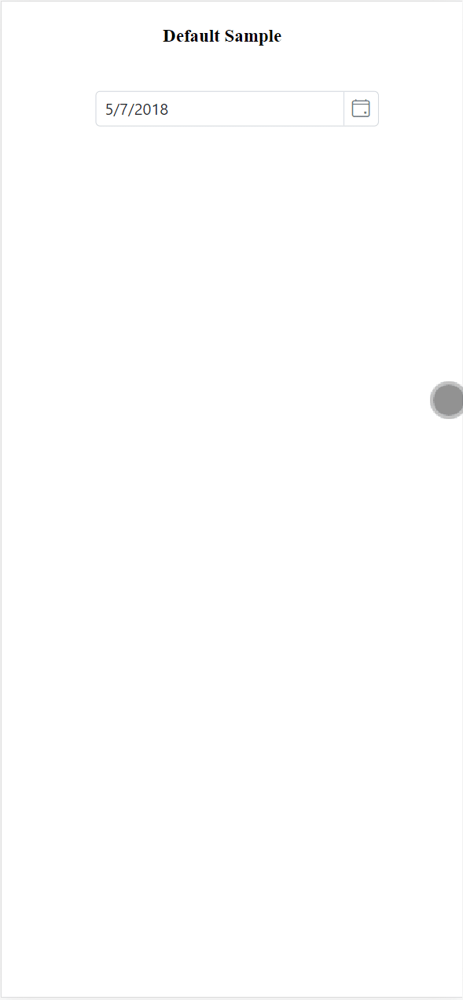

# Style Appearance in ##Platform_Name## DatePicker

The following content provides the exact CSS structure that can be used to modify the control's appearance based on the user preference.

## Customizing the appearance of DatePicker wrapper element

Use the following CSS to customize the appearance of the wrapper element.

```
/* To specify height and font size */
.e-input-group input.e-input, .e-input-group.e-control-wrapper input.e-input {
        height: 40px;
        font-size: 20px;
}
```

## Customizing the DatePicker icon element

Use the following CSS to customize the DatePicker icon element.

```
/* To specify background color and font size */
.e-input-group .e-input-group-icon:last-child, .e-input-group.e-control-wrapper .e-input-group-icon:last-child {
        font-size: 12px;
        background-color: darkgray;
}
```

## Customizing the Calendar popup of the DatePicker

To customize the style and appearance of the Calendar component, refer to the below section.

[Customizing Calendar's style and appearance](../calendar/style-appearance)

## Full screen mode support in mobiles and tablets

The DatePicker component's full-screen mode feature enables the popup element to be viewed in full-screen mode on mobile devices with improved visibility and a better experience. This feature is exclusively available for mobile and tablet devices in both landscape and portrait orientations. To activate the full screen mode within the DatePicker component, set the [fullScreenMode](../api/datepicker#fullScreenMode) API value to `true`. This action extends the calendar element to occupy the entire screen on mobile devices.

```typescript
import { DatePicker } from '@syncfusion/ej2-calendars';
// creates a datepicker with fullScreenMode property
let datepickerObject: DatePicker = new DatePicker({
    // Enable Full Screen Mode
    fullScreenMode: true,
});
datepickerObject.appendTo('#element');
```


