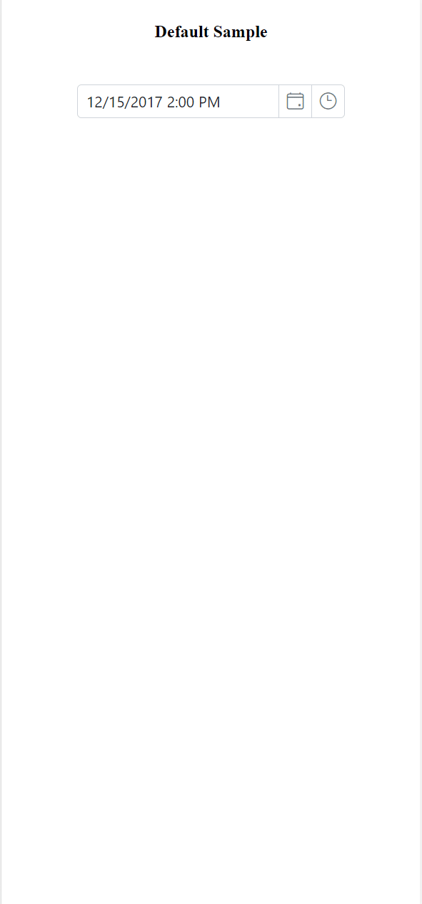

# Style Appearance in ##Platform_Name## DateTime Picker

The following content provides the exact CSS structure that can be used to modify the control's appearance based on the user preference.

## Customizing the appearance of DateTime Picker wrapper element

Use the following CSS to customize the appearance of the wrapper element.

```
/* To specify height and font size */
.e-input-group input.e-input, .e-input-group.e-control-wrapper input.e-input {
        font-size: 20px;
        height: 40px;
    }
```

## Customizing the DateTime Picker icons element

Use the following CSS to customize the DateTime Picker icons element.

```
/* To specify background color and font size */
.e-datetime-wrapper .e-input-group-icon.e-date-icon, .e-datetime-wrapper .e-input-group-icon.e-time-icon {
        font-size: 16px;
        background-color: blanchedalmond;
    }
```

## Customizing the time picker popup in the DateTime Picker

Use the following CSS to customize the time picker popup in the DateTime Picker.

```
/* To specify height */
.e-datetimepicker.e-popup {
        height: 100px;
}
```

## Customizing the Calendar popup of the DateTime Picker

To customize the style and appearance of the Calendar component in the DateTime Picker, refer to the below section.

[Customizing Calendar's style and appearance](../calendar/style-appearance/)

## Full screen mode support in mobiles and tablets

The DateTime Picker component's full-screen mode feature enables the popup element to be viewed in full-screen mode on mobile devices with improved visibility and a better experience. This feature is exclusively available for mobile and tablet devices in both landscape and portrait orientations. To activate the full screen mode within the DateTime Picker component, set the [fullScreenMode](../api/datetimepicker#fullScreenMode) API value to `true`. This action will extend the calendar and time popup element to occupy the entire screen on mobile devices.

```typescript
import { DateTimePicker } from '@syncfusion/ej2-calendars';
// creates a datetimepicker with fullScreenMode property
let datetimepickerObject: DateTimePicker = new DateTimePicker({
    // Enable Full Screen Mode
    fullScreenMode: true,
});
datetimepickerObject.appendTo('#element');
```

