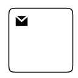
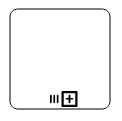
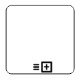
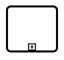
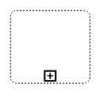

# BPMN activity in ##Platform_Name## Diagram control

## Activity

The [`activity`](../api/diagram/bpmnActivity#BpmnActivity) is the task that is performed in a business process. It is represented by a rounded rectangle.

There are two types of activities. They are listed as follows:

* Task: Occurs within a process and it is not broken down to a finer level of detail.
* Subprocess: Occurs within a process and it is broken down to a finer level of detail.

To create a BPMN activity, set the shape as **activity**. You also need to set the type of the BPMN activity by using the activity property of the node. By default, the type of the activity is set as **task**. The following code example illustrates how to create an activity.



 







        
















The different activities of BPMN process are listed as follows.

### Tasks

The [`task`](../api/diagram/bpmnTask#BpmnTask) property of the [`bpmn activity`](../api/diagram/bpmnactivitymodel/) allows you to define the type of task such as sending, receiving, user based task, etc. By default, the type property of task is set as **none**. The following code illustrates how to create different types of
BPMN tasks.



 







        
















The various types of BPMN tasks are tabulated as follows.

| Shape | Image |
| -------- | -------- |
| Service |  |
| Send |  |
| Receive |  |
| Instantiating Receive |  |
| Manual | |
| Business Rule |  |
| User |  |
| Script |  |

### Collapsed Subprocess

A [`Collapsed Sub-Process`](../api/diagram/bpmnSubProcessModel/#collapsed) is a group of tasks, which is used to hide or reveal details of additional levels. The following code explains how to create a Collapsed Sub-Process.


 







        
















#### Loop

[`Loop`](../api/diagram/bpmnTask#loop) is a task that is internally being looped. The loop property of `bpmn activity` allows you to define the type of loop. The default value for `loop` is **none**. You can define the loop property in subprocess BPMN shape as shown in the following code.



 







        
















The following table contains various types of BPMN loops.

| Loops | Task | Subprocess |
| -------- | -------- | --------|
| Standard |   |  |
| SequenceMultiInstance |  |  |
| ParallelMultiInstance |  |  |

#### Compensation

[`Compensation`](../api/diagram/bpmnTask#compensation-boolean) is triggered, when operation is partially failed and enabled it with the compensation property of the `bpmn activity`.
By default, the `compensation` is set to false.



 







        
















#### Call

A [`call`](../api/diagram/bpmnTask#call-boolean) activity is a global subprocess that is reused at various points of the business flow and set it with the call property of the task.
By default, the call property is false.



 







        
















N> This Property is only applicable for task Type activity. 

#### Adhoc

An adhoc subprocess is a group of tasks that are executed in any order or skipped in order to fulfill the end condition and set it with the [`adhoc`](../api/diagram/bpmnSubProcess#adhoc-boolean) property of subprocess. By default, the adhoc property is false.



 







        
















#### Boundary

Boundary represents the type of task that is being processed. The [`boundary`](../api/diagram/bpmnSubProcess#boundary-bpmnboundary) property of subprocess allows you to define the type of boundary. By default, it is set as **default**.



 







        
















The following table contains various types of BPMN boundaries.

| Boundary | Image |
| -------- | -------- |
| Call |  |
| Event |  |
| Default |  |

#### SubProcess types

The different types of subprocess are as follows:

    * Event subprocess
    * Transaction

##### Event subprocess

A subprocess is defined as an event subprocess, when it is triggered by an event. An event subprocess is placed within another subprocess which is not part of the normal flow of its parent process. You can set event to a subprocess with the [`event`](../api/diagram/bpmnEvent##BpmnEvent) and [`trigger`](../api/diagram/bpmnEvent#trigger) property of the subprocess. The [`type`](../api/diagram/bpmnSubProcess#type) property of subprocess allows you to define the type of subprocess whether it should be event subprocess or transaction subprocess.



 







        
















##### Transaction subprocess

* [`transaction`](../api/diagram/bpmnSubProcess/#transaction) is a set of activities that logically belong together, in which all contained activities must complete their parts of the transaction; otherwise the process is undone. The execution result of a transaction is one of Successful Completion, Unsuccessful Completion (Cancel), and Hazard (Exception). The [`events`](../api/diagram/bpmnSubProcess/#events) property of subprocess allows to represent these results as an event attached to the subprocess.

* The event object allows you to define the type of event by which the subprocess will be triggered. The name of the event can be defined to identify the event at runtime.

* The event’s offset property is used to set the fraction/ratio (relative to parent) that defines the position of the event shape.

* The trigger property defines the type of the event trigger.

* You can also use define ports and labels to subprocess events by using event’s ports and labels properties.



 







        
















