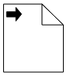

# BPMN Data object in ##Platform_Name## Diagram control

## Data Object

A data object represents information flowing through the process, such as data placed into the process, data resulting from the process, data that needs to be collected, or data that must be stored. To define a [`data object`](../api/diagram/bpmnDataObject), set the shape as **DataObject** and the [`type`](../api/diagram/bpmnDataObjects/) property defines whether data is an input or an output. You can create multiple instances of data object with the collection property of data.



 







        
















The following table contains various representation of BPMN data object.

| Boundary | Image |
| -------- | -------- |
| Collection Data Object |  |
| Data Input |  |
| Data Output |  |
