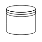
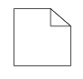

# Bpmn shapes in ##Platform_Name## Diagram control

BPMN shapes are used to represent the internal business procedure in a graphical notation and enable you to communicate the procedures in a standard manner. To create a BPMN shape, in the node property shape, type should be set as “bpmn” and its shape should be set as any one of the built-in shapes. The following code example illustrates how to create a simple business process.

N> If you want to use BPMN shapes in diagram, you need to inject BpmnDiagrams in the diagram.



 







        
















>Note : The default value for the property `shape` is “event”.

The list of BPMN shapes are as follows:

| Shape | Image |
| -------- | -------- |
| Event |  |
| Gateway |  |
| Task |  |
| Message |  |
| DataSource |  |
| DataObject |  |
| Group |  |

The BPMN shapes and its types are explained as follows.

<!-- markdownlint-disable MD033 -->

