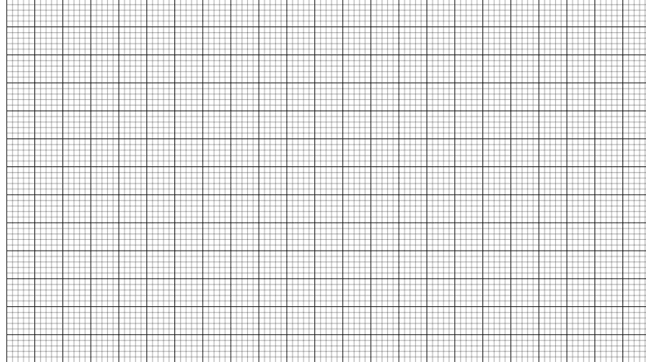
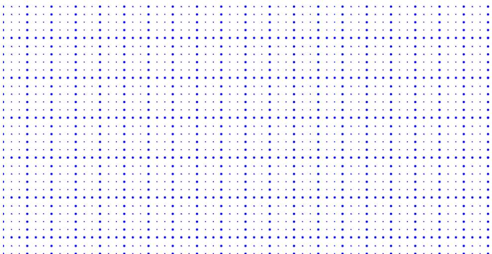
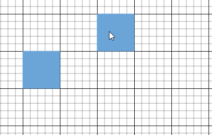

# Grid lines in ##Platform_Name## Diagram control

Gridlines are crisscross lines drawn in diagram page like the lines on traditional graph paper. It helps to position the diagram elements on the diagram page.

The [`snapSettings`](../api/diagram/#snapsettings) property is used to customize the gridlines and control the snapping behavior in the diagram.

## Customize the gridlines visibility

The [`snapConstraints`](../api/diagram/snapSettings#constraints-SnapConstraints) enables you to show/hide the gridlines. The following code example illustrates how to show the gridlines.



 







        
















N>If you want to enable snapping, then inject snapping module into the diagram.

To show only horizontal/vertical gridlines or to hide gridlines, refer to [`Constraints`](../api/diagram/snapSettings#constraints-SnapConstraints).

## Appearance

The appearance of the gridlines can be customized by using a set of predefined properties.

* The [`horizontalGridLines`](../api/diagram/snapSettings/#horizontalgridlines) and the [`verticalGridLines`](../api/diagram/snapSettings/#verticalgridlines) properties allow you to customize the appearance of the horizontal and vertical gridlines respectively.

* The horizontal gridlines [`lineColor`](../api/diagram/gridlines#linecolor-string) and [`lineDashArray`](../api/diagram/gridlines#linedasharray-string) properties are used to customizes the line color and line style of the horizontal gridlines.

* The vertical gridlines [`lineColor`](../api/diagram/gridlines#linecolor-string) and [`lineDashArray`](../api/diagram/gridlines#linedasharray-string) properties are used to customizes the line color and line style of the vertical gridlines.

The following code example illustrates how to customize the appearance of gridlines.



 







        
















## Line intervals

Thickness and the space between gridlines can be customized by using horizontal gridlines’s [`linesInterval`](../api/diagram/gridlines#lineintervals-number) and vertical gridlines’s [`linesInterval`](../api/diagram/gridlines#lineintervals-number) properties. In the lines interval collections, values at the odd places are referred as the thickness of lines and values at the even places are referred as the space between gridlines.

The following code example illustrates how to customize the thickness of lines and the line intervals.



 







        
















## Dot grid patterns

The appearance of the grid lines can be changed into dots by settings [`gridType`](../api/diagram/gridType/) of `snapSettings` as Dots.  By default, the grid type is **Lines**.

The following code illustrates how to render grid patterns as Dots.



 







        
















## Snapping

When you draw, resize, or move a diagram element on the page, you can set it to align or snap to the nearest intersection, regardless of whether the grid is visible.

## Snap to lines

This feature allows diagram objects to snap to the nearest intersection of gridlines while being dragged or resized, facilitating easier alignment during layout or design.

Snapping to gridlines can be enabled or disabled using the [`snapConstraints`](../api/diagram/snapSettings#constraints-SnapConstraints) property of the SnapSettings class. The default value is All.



 







        
















## Snap to objects

The snap-to-object feature provides visual cues to assist with aligning and spacing diagram elements. A node can snap to its neighboring objects based on specific alignments, such as the same size and position. These alignments are visually represented by smart guide lines in a cyan shade, with the color code '#07EDE1'.

The [`snapObjectDistance`](../api/diagram/snapSettings/#snapobjectdistance) property allows you to define minimum distance between the selected object and the nearest object. By default, the snap object distance is set to 5.



 







        
















## Snap Angle

The [`snapAngle`](../api/diagram/snapSettings/#snapangle) property defines the increments by which an object can be rotated within a diagram. 

For example, if the snapAngle is set to 15 degrees, an object can only be rotated to angles that are multiples of 15 degrees, such as 15°, 30°, 45°, and so on. This ensures precise angle alignment and consistent object positioning, enhancing the overall design accuracy. By default, the snap angle is set to 5"

The following code example demonstrates how to set the `snapAngle` property and update it dynamically.



 







        
















## Snap line color

The [`snapLineColor`](../api/diagram/snapSettings/#snaplinecolor) property allows you to define the color of the snapline used in the diagram. By customizing the snapline color, you can enhance the visual contrast and visibility of these guides, making it easier to achieve accurate alignment. 

This property accepts color values in various formats, such as hexadecimal, RGB, or predefined color names, providing flexibility in how you choose to represent the snaplines in your diagramming application. By default the snap line color is set to `'#07EDE1'`.

The following code example demonstrates how to set the `snapLineColor` property and update it dynamically.



 







        
















## Customization of snap intervals

By default, the objects are snapped towards the nearest gridline. The gridline or position towards where the diagram object snaps can be customized with the horizontal gridlines’s [`snapInterval`](../api/diagram/gridlines/#snapintervals) and the vertical gridlines’s [`snapInterval`](../api/diagram/gridlines/#snapintervals) properties.



 







        
















## Snap constraints

The [`snapConstraints`](../api/diagram/snapSettings/#constraints) property allows you to enable or disable the certain features of the snapping, for detailed information refer to [`constraints`](./constraints).