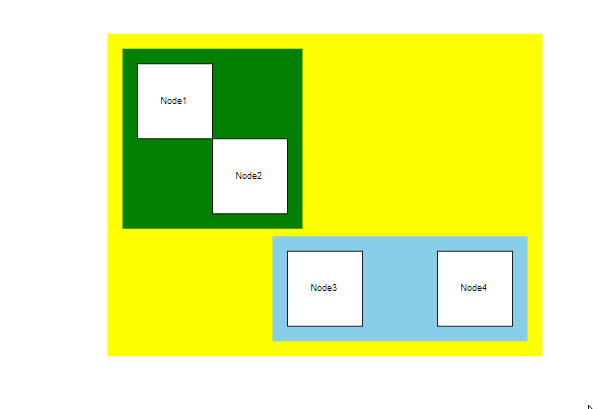

# Group in ##Platform_Name## Diagram control

## Create group

Group is used to cluster multiple nodes and connectors into a single element. It acts like a container for its children (nodes, groups, and connectors). Every change made to the group also affects the children. Child elements can be edited individually.


## Add group when initializing diagram

A group can be added to the diagram model through [`nodes`](../api/diagram#nodes-NodeModel) collection. To define an object as group, add the child objects to the [`children`](../api/diagram/node#children-string) collection of the group. The following code illustrates how to create a group node.

* While creating group, its child node need to be declared before the group declaration.




 







        
















## Group nodes at runtime

Groups can be dynamically created during runtime in the diagram by invoking the [`diagram.group`](../api/diagram/#group) method. To initiate this process, first, select the nodes that you intend to include within the group. Subsequently, by utilizing the [`diagram.group`](../api/diagram/#group) method, the selected nodes will be encapsulated within a newly formed group node.

The following code illustrates how a group  at runtime.



 







        
















## UnGroup nodes at runtime

Group node can be unGrouped dynamically, by using the [`diagram.unGroup`](../api/diagram/#unGroup) method. The following code example shows how to unGroup group node at runtime.



 







        
















## Add group node at runtime

A group node can be added at runtime by using the diagram method [`add`](../api/diagram/#add).

The following code illustrates how a group node is added at runtime.



 







        
















## Add collection of group nodes at runtime

* The collection of group nodes can be dynamically added using 'addElements' method.Each time an element is added to the diagram canvas, the 'collectionChange' event will be triggered.

The following code illustrates how to add a group nodes collection at runtime.



 
























## Add/Remove children from group

### Add children To group at runtime

A child node can be added to the specified Group at runtime by utilizing the diagram method [`addChildToGroup`](../api/diagram/#addchildtogroup).

This functionality is achieved by passing the group and existing children as arguments to the method.

The following code illustrates how a child node and a group node can be passed as arguments to the method and executed at runtime.

```JavaScript

diagram.addChildToGroup(groupNode, childNode); 

```

### Remove children from group at runtime

A specific child from a group node can be removed at runtime by utilizing the diagram method [`removeChildFromGroup`](../api/diagram/#removeChildFromGroup).

This functionality is achieved by passing the group and its children as arguments to the method.

The following code illustrates how a child node is removed from a group at runtime.

```JavaScript

diagram.removeChildFromGroup (groupNode, childNode); 

```



 







        
















## Group padding

The [`Padding`](../api/diagram/node/#padding) property of a group node defines the spacing between the group node’s edges and its children.

The following code illustrates how to add Padding to the node group.



 







        
















## Nested group

Nested groups are essentially groups within groups, where a group can contain other groups as its children, creating a hierarchy that helps manage complexity and relationships between different elements. The following code illustrates how to create nested group node.



 







        


















## Add Group in palette

Group node can be added in symbol palette like the normal nodes.  The following code illustrates how to render group node in palette.



 







        
















## Update group node at runtime

Group can be updated dynamically similar to the normal nodes.  The following code illustrates how to update group node at runtime.



 







        

















## Container

Containers are used to automatically measure and arrange the size and position of the child elements in a predefined manner. There are two types of containers available.

***Canvas***

* The canvas panel supports absolute positioning and provides the least layout functionality to its contained diagram elements.

* Canvas allows you to position its contained elements by using the margin and alignment properties.

* Rendering alone possible in canvas container.

* It allows elements to be either vertically or horizontally aligned.

* Child can be defined with the collection [`canvas.children`](../api/diagram/canvas#children-DiagramElement) property.

* Basic element can be defined with the collection of [`basicElements`](../api/diagram#basicElements-DiagramElement).

The following code illustrates how to add canvas panel.



 







        
















***Stack***

* Stack panel is used to arrange its children in a single line or stack order, either vertically or horizontally.

* It controls spacing by setting margin properties of child and padding properties of group. By default, a stack panel’s [`orientation`](../api/diagram/stackPanel#orientation-Orientation) is vertical.

The following code illustrates how to add a stack panel.



 







        
















## Difference between a basic group and containers

| Group | Container |
| -------- | -------- |
| It arranges the child elements based on the child elements position and size properties. | Each container has a predefined behavior to measure and arrange its child elements. Canvas and stack containers are supported in the diagram. |
| The Min, and Max Size properties are not applicable for basic group. | It is applicable for container. |
| The Children’s margin and alignment properties are not applicable for basic group. |  It is applicable for container. |

## Interaction

Group node interactions can be performed similarly to normal nodes. Fundamental diagram interactions like selecting, dragging, resizing, and rotating apply equally to group nodes. For more informatation refer to the [`nodes interactions`](./nodes-interaction)

### Selecting a Node Group

When a child element within a node group is clicked, the entire contained node group is selected instead of the individual child element. Subsequent clicks on the selected element change the selection from top to bottom within the hierarchy, moving from the parent node group to its children.


## Events

The events triggered when interacting with group nodes are similar to those for individual nodes. For more information, refer to the [`nodes events`](./nodes-events)

## See Also

* [How to add annotations to the node](./node-labels)
* [How to add ports to the node](./ports)
* [How to enable/disable the behavior of the node](./constraints)
* [How to add nodes to the symbol palette](./symbol-palette)
* [How to create diagram nodes using drawing tools](./tools)
* [How to perform the interaction on the group](./interaction#selecting-a-group)