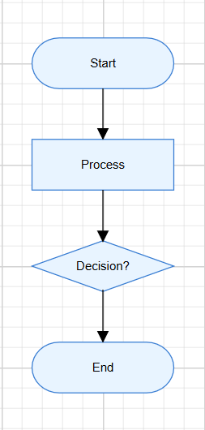

# ES5 getting started with ##Platform_Name## Diagram control

Essential<sup style="font-size:70%">&reg;</sup> JS 2 (global script) is an ES5-formatted, pure JavaScript framework that can be used directly in modern web browsers.

> **Ready to streamline your Syncfusion<sup style="font-size:70%">&reg;</sup> JavaScript development?** Discover the full potential of Syncfusion<sup style="font-size:70%">&reg;</sup> JavaScript controls with Syncfusion<sup style="font-size:70%">&reg;</sup> AI Coding Assistant. Effortlessly integrate, configure, and enhance your projects with intelligent, context-aware code suggestions, streamlined setups, and real-time insights—all seamlessly integrated into your preferred AI-powered IDEs like VS Code, Cursor, Syncfusion<sup style="font-size:70%">&reg;</sup> CodeStudio and more. [Explore Syncfusion<sup style="font-size:70%">&reg;</sup> AI Coding Assistant](https://ej2.syncfusion.com/javascript/documentation/mcp-server/ai-coding-assistant/getting-started)

## Component Initialization

The Essential® JS 2 components can be initialized in two ways:
- Using local script and style references in an HTML page or using CDN links for scripts and styles.

### Using local script and style references in a HTML page

**Step 1:**Create an application folder named **my-diagram-app** for Essential® JS 2 JavaScript components.

**Step 2:** You can get the global scripts and styles from the [Essential Studio<sup style="font-size:70%">&reg;</sup> JavaScript (Essential<sup style="font-size:70%">&reg;</sup> JS 2)](https://www.syncfusion.com/downloads/essential-js2) build installed location.

**Syntax:**
> Script: `**(installed location)**/Syncfusion/Essential Studio/{RELEASE_VERSION}/Web(Essential JS 2)/javascript/{PACKAGE_NAME}/dist/global/{PACKAGE_NAME}.min.js`
>
> Styles: `**(installed location)**/Syncfusion/Essential Studio/{RELEASE_VERSION}/Web(Essential JS 2)/javascript/{PACKAGE_NAME}/styles/tailwind3.css`

**Example:**

> Script: `C:/Program Files (x86)/Syncfusion/Essential Studio/32.1.19/Web(Essential JS 2)/javascript/ej2-diagrams/dist/global/ej2-diagrams.min.js`
>
> Styles: `C:/Program Files (x86)/Syncfusion/Essential Studio/32.1.19/Web(Essential JS 2)/javascript/ej2-diagrams/styles/tailwind3.css`

**Step 3:** Create a **my-diagram-app/resources** folder and copy the required global scripts and styles from the installation location into this folder.

**Step 4:** Create an HTML page (**index.html**) in my-diagram-app and include the required script and style references (either from the local resources folder or CDN). Add a container element (for example, <div id="element">) and initialize the Essential<sup style="font-size:70%">&reg;</sup> JS 2 Diagram component using the example code below.

```html
<!DOCTYPE html>
<html xmlns="http://www.w3.org/1999/xhtml">
<head>
     <title>Essential® JS 2</title>
     <!-- Essential® JS 2 tailwind3 theme -->
     <link href="https://cdn.syncfusion.com/ej2/ej2-diagrams/styles/tailwind.css" rel="stylesheet" type="text/css" />

     <!-- Essential® JS 2 Diagram's global script -->
     <script src="https://cdn.syncfusion.com/ej2/32.1.19/dist/ej2.min.js" type="text/javascript"></script>
</head>
<body>
</body>
</html>
```

**Step 5:** Now, create a simple flowchart by adding nodes, customizing their appearance, and connecting them using connectors.

The following example creates a flowchart with four nodes: Start, Process, Decision, and End. It also applies common node and connector settings using the getNodeDefaults and getConnectorDefaults properties.

```html
<!DOCTYPE html>
<html xmlns="http://www.w3.org/1999/xhtml">

<head>
     <title>Essential® JS 2</title>
     <!-- Essential® JS 2 tailwind3 theme -->
     <link href="https://cdn.syncfusion.com/ej2/ej2-diagrams/styles/tailwind.css" rel="stylesheet" type="text/css" />

     <!-- Essential® JS 2 Diagram's global script -->
     <script src="https://cdn.syncfusion.com/ej2/32.1.19/dist/ej2.min.js" type="text/javascript"></script>
</head>

<body>
     <!-- Add the HTML <div> element  -->
     <div id="element">Diagram</div>
     <script>
          // initialize diagram component

          // Node defaults function
          function nodeDefaults(node) {
               node.width = 140;
               node.height = 50;
               node.style = {
                    fill: '#E8F4FF',
                    strokeColor: '#357BD2'
               };
               return node;
          }

          // Connector defaults function
          function connectorDefaults(connector) {
               connector.type = 'Orthogonal';
               connector.targetDecorator = {
                    shape: 'Arrow',
                    width: 10,
                    height: 10
               };
               return connector;
          }

          // Initialize the Diagram control
          let diagram = new ej.diagrams.Diagram({
               width: '100%',
               height: '580px',
               getNodeDefaults: nodeDefaults,
               getConnectorDefaults: connectorDefaults,
               nodes: [
                    {
                         id: 'node1',
                         offsetX: 300,
                         offsetY: 100,
                         shape: {
                              type: 'Flow',
                              shape: 'Terminator'
                         },
                         annotations: [{
                              content: 'Start'
                         }]
                    },
                    {
                         id: 'node2',
                         offsetX: 300,
                         offsetY: 200,
                         shape: {
                              type: 'Flow',
                              shape: 'Process'
                         },
                         annotations: [{
                              content: 'Process'
                         }]
                    },
                    {
                         id: 'node3',
                         offsetX: 300,
                         offsetY: 300,
                         shape: {
                              type: 'Flow',
                              shape: 'Decision'
                         },
                         annotations: [{
                              content: 'Decision?'
                         }]
                    },
                    {
                         id: 'node4',
                         offsetX: 300,
                         offsetY: 400,
                         shape: {
                              type: 'Flow',
                              shape: 'Terminator'
                         },
                         annotations: [{
                              content: 'End'
                         }]
                    }
               ],
               connectors: [
                    {
                         id: 'connector1',
                         sourceID: 'node1',
                         targetID: 'node2'
                    },
                    {
                         id: 'connector2',
                         sourceID: 'node2',
                         targetID: 'node3'
                    },
                    {
                         id: 'connector3',
                         sourceID: 'node3',
                         targetID: 'node4'
                    }
               ]
          });

          // Render initialized Diagram
          diagram.appendTo('#element');
     </script>
</body>
</html>
```

**Step 6:** Now, run the **index.html** in web browser, it will render the **Essential<sup style="font-size:70%">&reg;</sup> JS 2 Diagram** component and the output will be like below.


