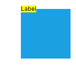

# Node annotations in ##Platform_Name## Diagram control

Diagram allows you to customize the position and appearance of the annotation efficiently. Annotation can be aligned relative to the node boundaries. It has Margin, Offset, Horizontal, and Vertical alignment properties. It is quite tricky when all four alignments are used together but gives more control over alignments properties of the ShapeAnnotation class. Annotations of a node can be positioned using the following properties of ShapeAnnotation.

* Offset
* HorizontalAlignment
* VerticalAlignment
* Margin

## Set annotation offset and size

The [`offset`](../api/diagram/pointModel/) property of an annotation is used to align annotations based on fractional values. The offset can be customized by modifying the x and y values of the offset property. By default, the annotation offset is set to 0.5 on both the x and y axes.

By default, the size of the annotation is calculated based on its content. If you want to set the size externally, you can do so using the [`width`](../api/diagram/annotationModel/#width) and [`height`](../api/diagram/annotationModel/#height) properties of annotation.

The following code shows how to set offset, height and width for the annotation.









        


### Update annotation offset at runtime

The annotation offset can be updated dynamically at runtime. To update the annotation offset, fetch the annotation you want to update and modify its offset.









        


N> Call [`dataBind()`](../api/diagram/#databind) after property change to reflect the changes instantly.

The following table shows the position of annotation with different offsets.

offset|image|
|-----|-----|
|Top Left {x:0,y:0} ||
|Middle left {x:0,y:0.5}||
|Bootom left {x:0,y:1}||
|Middle Top {x:0.5,y:0}||
|Center {x:0.5,y:0.5}||
|Middle Bottom {x:0.5,y:1}||
|Top right {x:1,y:0}||
|Middle right {x:1,y:0.5}||
|Bottom right {x:1,y:1}||

## Annotation alignment

The [`horizontalAlignment`](../api/diagram/annotationModel/#horizontalalignment) property of annotation is used to set how the annotation is horizontally aligned at the annotation position determined from the fraction values. The [`verticalAlignment`](../api/diagram/annotationModel/#verticalalignment) property is used to set how annotation is vertically aligned at the annotation position.

The following codes illustrates how to align annotations.









        


The following tables illustrates all the possible alignments visually with 'offset (0, 0)'.

| Horizontal Alignment | Vertical Alignment | Output with Offset(0,0) |
| -------- | -------- | -------- |
| Left | Top |  |
| Center | Top |  |
| Right | Top |   |
| Left | Center |  |
| Center | Center|  |
| Right | Center |  |
| Left | Bottom |  |
| Center | Bottom |  |
| Right |Bottom | |

### Update annotation alignment at runtime

Annotation alignment can be updated dynamically at runtime. The following code example shows how to update annotation alignment at runtim.









        

