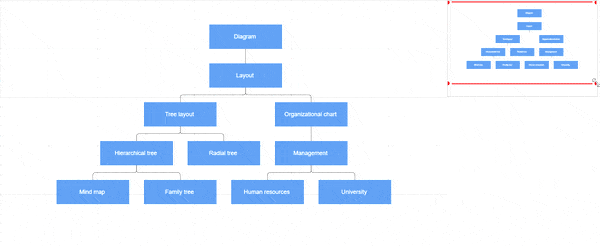

# Overview in ##Platform_Name## Diagram control

The Overview control allows you to see a preview or an overall view of the entire content of a diagram. This helps you to grasp the overall picture of a large diagram and navigate, pan, or zoom to a specific position on the page.

## Usage scenario

When working on a very large diagram, it can be challenging to know which part you are actually focusing on or to navigate from one section to another. One solution for navigation is to zoom out to view the entire diagram and locate your position. Then, you can zoom in on the specific area you need. However, this method is not ideal for frequent navigation.

The Overview control addresses these issues by providing a preview, or overall view, of the entire diagram. A rectangle indicates the viewport of the diagram, making navigation easy by dragging this rectangle to the desired section.

## Create overview

To create an overview, the [`sourceID`](../api/overview/overviewModel/#sourceid) property of the overview should be set with the corresponding diagram Id for the overall view.

The [`width`](../api/overview/overviewModel/#width) and [`height`](../api/overview/overviewModel/#height) properties of the overview allow you to define its size.

The following code illustrates how to create an overview:



 







        
















### Overview interactions

In the overview, the viewport of the diagram is highlighted with a red color rectangle. You can zoom and pan the diagram by interacting with this rectangle.

You can interact with the overview as follows:

* Resize the rectangle: Zooms in/out of the diagram.
* Drag the rectangle: Pans the diagram.
* Click on a position: Navigates to the clicked region.
* Select a specific region by clicking and dragging: Navigates to the specified region.



 







        
















The following Gif image displays the interactions with overview.

