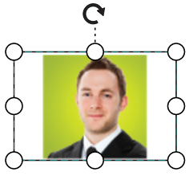
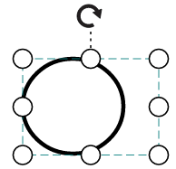
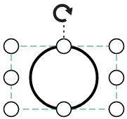
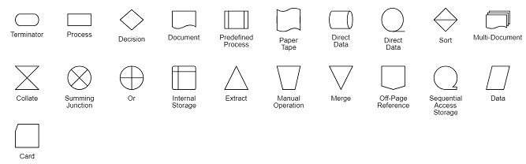

# Shapes in ##Platform_Name## Diagram control

Diagram provides support to add different kind of nodes. They are as follows:

* Text node
* Image node
* HTML node
* Native node
* Basic shapes
* Flow shapes

<!-- markdownlint-disable MD033 -->
<!-- markdownlint-disable MD010 -->

## Text

Texts can be added to the diagram as [`text`](../api/diagram/node#shape-shapemodel) nodes. The shape property of the node allows you to set the type of node and for text nodes, it should be set as **text**. In addition, define the content object that is used to define the text to be added and style is used to customize the appearance of that text. The following code illustrates how to create a text node.



 







        
















## Image

Diagram allows to add images as [`image`](../api/diagram/node#shape-shapemodel) nodes. The shape property of node allows you to set the type of node and for image nodes, it should be set as **image**. In addition, the source property of shape enables you to set the image source.

The following code illustrates how an image node is created.



 







        
















**Base64 Encoded Image Into The Image Node:**

The following code illustrates how add Base64 image into image node.



 







        
















>Note: Deploy your HTML file in the web application and export the diagram (image node) or else the image node will not be exported in the Chrome and Firefox due to security issues. Refer to the following link.

Link 1: `http://asked.online/draw-images-on-canvas-locally-using-chrome/2546077/`

Link 2: `http://stackoverflow.com/questions/4761711/local-image-in-canvas-in-chrome`

## Image alignment

Stretch and align the image content anywhere but within the node boundary.

The scale property of the node allows to stretch the image as you desired (either to maintain proportion or to stretch). By default, the [`scale`](../api/diagram/image#scale-scale) property of the node is set as **meet**.

The following code illustrates how to scale or stretch the content of the image node.



 







        
















The following table illustrates all the possible scale options for the image node.

| Values | Images |
|-------- | -------- |
| None |  |
| Meet | |
| Slice | |
| Stretch | |

## HTML

Html elements can be embedded in the diagram through [`Html`](../api/diagram/node#shape-shapemodel) type node. The shape property of node allows you to set the type of node and to create a HTML node it should be set as `HTML`. The following code illustrates how an Html node is created.



 







        
















>Note: HTML node cannot be exported to image format, like JPEG, PNG, and BMP. It is by design, while exporting the diagram is drawn in a canvas. Further, this canvas is exported into image formats. Currently, drawing in a canvas equivalent from all possible HTML is not feasible. Hence, this limitation.

## HTML Node With Template

Html elements can be embedded in the diagram using [`Html`](../api/diagram/node#shape-shapemodel) type node. The shape property of the node allows you to set the type of node. The following code shows how an Html node is created with a template.



 







        
















## Native

Diagram provides support to embed SVG element into a node. The shape property of node allows you to set the type of node. To create a [`native`](../api/diagram/node#shape-shapemodel) node, it should be set as **native**. The following code illustrates how a native node is created.



 







        
















>Note: Like HTML node, the native node also cannot be exported to image format. Fill color of native node can be overridden by the inline style or fill of the SVG element specified in the template.

## SVG content alignment

Stretch and align the svg content anywhere but within the node boundary.

The scale property of the node allows to stretch the svg content as you desired (either to maintain proportion or to stretch). By default, the `scale` property of node is set as **meet**.

The following code illustrates how to scale or stretch the content of the node.

The following tables illustrates all the possible scale options for the node.

| Values | Images |
|-------- | -------- |
| None |  |
| Meet |  |
| Slice |  |
| Stretch | |

## Basic shapes

* The [`Basic`](../api/diagram/node#shape-shapemodel) shapes are common shapes that are used to represent the geometrical information visually. To create basic shapes, the type of the shape should be set as **basic**. Its shape property can be set with any one of the built-in shape.

* To render a rounded rectangle, you need to set the type as basic and shape as rectangle. Set the [`cornerRadius`](../api/diagram/shapeStyleModel#cornerRadius-string) property to specify the radius of rounded rectangle.

The following code example illustrates how to create a basic shape.



 







        
















>Note: By default, the `shape` property of the node is set as **basic**.

Default property for shape is Rectangle.

>Note: When the `shape` is not set for a basic shape, it is considered as a **rectangle**.

The list of basic shapes are as follows.

## Path

The [`Path`](../api/diagram/node#shape-shapemodel) node is a commonly used basic shape that allows visually to represent the geometrical information. To create a path node, specify the shape as **path**. The path property of node allows you to define the path to be drawn. The following code illustrates how a path node is created.



 







        
















## Flow Shapes

The [`flow`](../api/diagram/node#shape-shapemodel) shapes are used to represent the process flow. It is used for analyzing, designing, and managing for documentation process. To create a flow shape, specify the shape type as **flow**. Flow shapes and by default, it is considered as **process**. The following code example illustrates how to create a flow shape.



 







        
















The list of flow shapes are as follows.

