# UML diagram in ##Platform_Name## Diagram control

## UML Class Diagram

A class diagram visually depicts the static structure of an application and is extensively employed in modeling object-oriented systems. It holds a unique position in UML diagrams, as it directly aligns with object-oriented languages. The diagram also facilitates the automatic generation of class diagram shapes based on business logic, streamlining the translation from conceptual models to practical implementation.

## UML Class Diagram Shapes

The UML class diagram shapes are explained as follows.

### Class

* A class defines a group of objects that share common specifications, features, constraints, and semantics. To create a class object, the classifier should be defined using the [class] (../api/diagram/umlClassifierShapeModel#class)notation. This notation serves as a foundational element in object-oriented programming, encapsulating the essential characteristics and behavior that objects belonging to the class will exhibit.

* Also, define the [`name`](../api/diagram/umlClassModel/#name), [`attributes`](../api/diagram/umlClassModel/#attributes), and [`methods`](../api/diagram/umlClassModel/#methods) of the class using the class property of node.

* The attribute’s [`name`](../api/diagram/umlClassAttributeModel/#name), [`type`](../api/diagram/umlClassAttributeModel/#type), and [`scope`](../api/diagram/umlClassAttributeModel/#scope) properties allow you to define the name, data type, and visibility of the attribute.

* The method’s [`name`](../api/diagram/umlClassMethodModel/#name), [`parameters`](../api/diagram/umlClassMethodModel/#parameters), [`type`](../api/diagram/umlClassMethodModel/#type), and [`scope`](../api/diagram/umlClassMethodModel/#scope) properties allow you to define the name, parameter, return type, and visibility of the methods.

* The method parameters object properties allow you to define the name and type of the parameter.

* The following code example illustrates how to create a class.



 







        
















### Interface

* An interface is a specific type of classifier that signifies a declaration of a cohesive set of public features and obligations. When creating an interface, involves defining the classifier property using the [interface](../api/diagram/umlClassifierShapeModel/#interface) notation. This essential concept in object-oriented programming outlines a contract for classes to adhere to, specifying the required methods and behaviors without delving into the implementation details.

* Also, define the [`name`](../api/diagram/umlInterfaceModel/#name), [`attributes`](../api/diagram/umlInterfaceModel/#attributes), and [`methods`](../api/diagram/umlInterfaceModel/#methods) of the interface using the interface property of the node.

* The attribute’s name, type, and scope properties allow you to define the name, data type, and visibility of the attribute.

* The method’s name, parameter, type, and scope properties allow you to define the name, parameter, return type, and visibility of the methods.

* The method parameter object properties of name and type allow you to define the name and type of the parameter.

* The following code example illustrates how to create an interface.



 







        
















### Enumeration

* To establish an enumeration, designate the classifier property of the node as [enumeration](../api/diagram/umlClassifierShapeModel/#enumeration). Additionally, define the name and enumerate the members of the enumeration using the appropriate enumeration property of the node. This process encapsulates a set of distinct values within the enumeration, allowing for a clear representation of specific, and named constants within a system.

* You can set a name for the enumeration members collection using the name property of the members collection.

* The following code example illustrates how to create an enumeration.



 







        

















## UML Class Relationships

* A class may be involved in one or more relationships with other classes. A relationship can be one of the following types:


| Shape       | Image                                |
| ----------- | ------------------------------------ |
| Association | 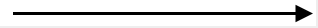 |
| Aggregation | 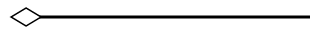  |
| Composition | 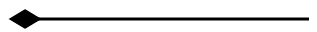 |
| Inheritance | 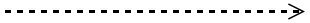   |
| Dependency  | 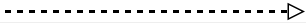 |

### Association

Association is basically a set of links that connects elements of a UML model. The type of association is as follows.

    1. Directional
    2. BiDirectional

The association property allows you to define the type of association. The default value of association is “Directional”. The following code example illustrates how to create an association.



 







        
















### Aggregation

Aggregation is a binary association between a property and one or more composite objects that group together a set of instances. Aggregation is decorated with a hollow diamond. To create an aggregation shape, define the relationship as “aggregation”.

The following code example illustrates how to create an aggregation.



 







        
















### Composition

Composition is a “strong” form of “aggregation”. The composition is decorated with a black diamond. To create a composition shape, define the relationship property of the connector as “composition”.

The following code example illustrates how to create a composition.



 







        
















### Dependency

Dependency is a directed relationship, which is used to show that some UML elements need or depend on other model elements for specifications. Dependency is shown as a dashed line with an opened arrow. To create a dependency, define the relationship property of the connector as “dependency”.

The following code example illustrates how to create a dependency.



 







        
















### Inheritance

Inheritance is also called a “generalization”. Inheritance is a binary taxonomic directed relationship between a more general classifier (superclass) and a more specific classifier (subclass). Inheritance is shown as a line with a hollow triangle.

To create an inheritance, define the relationship as “inheritance”.

The following code example illustrates how to create an inheritance.



 







        
















### Multiplicity

Multiplicity is a definition of an inclusive interval of non-negative integers to specify the allowable number of instances of a described element. The type of multiplicity are as follows.

    1. OneToOne
    2. ManyToOne
    3. OneToMany
    4. ManyToMany

* By default the multiplicity will be considered as “OneToOne”.

* The multiplicity property in UML allows you to specify large number of elements or some collection of elements.

* The shape multiplicity’s source property is used to set the source label to the connector and the target property is used to set the target label to the connector.

* To set an optionality or cardinality for the connector source label, use the optional property.

* The [`lowerBounds`](../api/diagram/multiplicityLabelModel/#lowerBounds) and [`upperBounds`](../api/diagram/multiplicityLabelModel/#upperBounds) could be natural constants or constant expressions evaluated to a natural (non negative) number. The upper bound could also be specified as an asterisk ‘\*’ which denotes an unlimited number of elements. The upper bound should be greater than or equal to the lower bound.

* The following code example illustrates how to customize the multiplicity.



 







        
















## How to add UML child at runtime

In UML nodes, child elements such as members, methods and attributes can be added either programmatically or interactively.

### Adding UML child through code

The [addChildToUmlNode](../api/diagram/#addchildtoumlnode) method is employed for dynamically adding a child to the UML node during runtime, providing flexibility in modifying the diagram structure programmatically.

The following code illustrates how to add methods to UML nodes in the diagram.

```ts
let node = diagram.selectedItems.nodes[0];
let methods = { name: 'getHistory', style: { color: "red", }, parameters: [{ name: 'Date', style: {} }], type: 'History' };
diagram.addChildToUmlNode(node, methods, 'Methods');

```

The following code illustrates how to add attributes to UML nodes in the diagram.

```ts
let node = diagram.selectedItems.nodes[0];
let attributes = { name: 'accepted', type: 'Date', style: { color: "red", } };
diagram.addChildToUmlNode(node, attributes, "Attributes");

```

The following code illustrates how to add members to UML nodes in the diagram.

```ts
let node = diagram.selectedItems.nodes[0];
let members = { name: 'Checking new', style: { color: "red", }, isSeparator: true };
diagram.addChildToUmlNode(node, members, "Members");

```

### Adding UML child through user interaction

To include a child, select a node, move the mouse outside it, and position the pointer near the right side. A highlighter emerges between the two child elements. Click the highlighter to add a child type to the chosen UML node seamlessly. The following gif illustrates how to add a Child through user interaction.

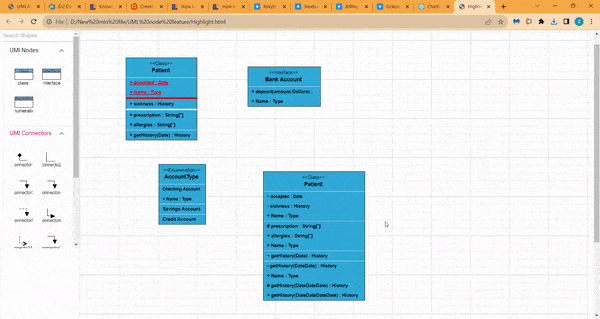

## Adding UML Nodes in Symbol palette

UML built-in shapes are efficiently rendered in a symbol palette. The `symbols` property is utilized to define UML symbols with the necessary classes and methods. By incorporating this feature, you can seamlessly augment the palette with a curated collection of predefined UML symbols, thereby enhancing the versatility of your UML diagramming application.

The following code example showcases the rendering of UML built-in shapes in a symbol palette



 







        
















## Editing in UML nodes

You can edit the name, attributes, and methods of the class diagram shapes just double clicking, similar to editing a node annotation.

The following image illustrates how the text editor looks in an edit mode.

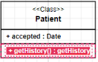

## UML Activity diagram

An Activity diagram functions as a visual flowchart, illustrating the progression from one activity to the next within a system. Each activity corresponds to a system operation, providing a clear depiction of the sequential flow in a dynamic process..

The purpose of an activity diagram can be described as follows.

    1. Draw the activity flow of a system.

    2. Describe the sequence from one activity to another.

    3. Describe the parallel, branched, and concurrent flow of the system.

## UML Activity diagram Shapes

To create a UmlActivity, define the type as "UmlActivity" and the list of built-in shapes as demonstrated as follows and it should be set in the "shape" property.

| Shape          | Image                                    |
| -------------- | ---------------------------------------- |
| Action         | 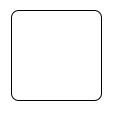          |
| Decision       | 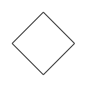         |
| MergeNode      | 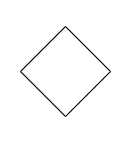       |
| InitialNode    | 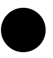       |
| FinalNode      | 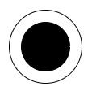      |
| ForkNode       |        |
| JoinNode       | 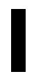       |
| TimeEvent      | 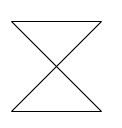      |
| AcceptingEvent | 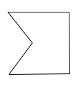 |
| SendSignal     | 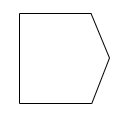     |
| ReceiveSignal  | 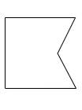  |
| StructuredNode | 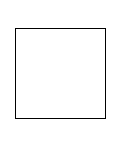 |
| Note           | 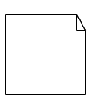           |

The following code illustrates how to create a UmlActivity shapes.



 







        
















### UML Activity connector

To establish a UML Activity connector, specify the type as "UmlActivity" and define the flow as either "Exception," "Control," or "Object." This configuration delineates the nature of the connection, allowing for a precise representation of the interaction within the activity diagram.

The following code illustrates how to create a UmlActivity connector.



 







        














