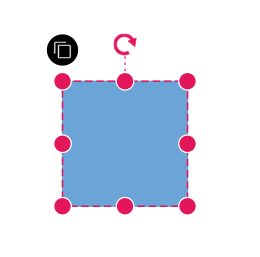

# User handle in ##Platform_Name## Diagram control

User handles are used to add frequently used commands around the selector. 

## Create user handle

To create user handles, define and add them to the [`userHandles`](../api/diagram/userHandleModel/) collection of the [`selectedItems`](../api/diagram/selectorModel/) property. The [`name`](../api/diagram/userHandleModel/#name) property of userHandles is used to define the name of the user handle, which can then be used at runtime for identification and customization. The [`pathData`](../api/diagram/userHandleModel/#pathdata) property is used to define the path data of userhandle. 

The following example shows how to render user handle.



 







        
















## Customize User handle click

When the user handle is clicked, the [`onUserHandleMouseDown`](../api/diagram/#onuserhandlemousedown) event allows us to identify which user handle was clicked using the name property of userHandle. Based on this name, we can customize the diagram elements accordingly. Several events are triggered while interacting with a user handle. In the following example, we use the [`onUserHandleMouseDown`](../api/diagram/#onuserhandlemousedown) event to clone nodes on user handle click.



 







        
















## Alignment

User handles can be aligned relative to the node boundaries. It has [`margin`](../api/diagram/marginModel/), [`offset`](../api/diagram/userHandleModel/#offset), [`side`](../api/diagram/side/), [`horizontalAlignment`](../api/diagram/horizontalAlignment/), and [`verticalAlignment`](../api/diagram/verticalAlignment/) properties to align user handle based on user's needs.

### Offset

The [`offset`](../api/diagram/userHandleModel/#offset), property of [`userHandles`](../api/diagram/userHandleModel/) aligns the user handle based on fractions. For example, 0 represents the top-left corner, 1 represents the top-right corner, and 0.5 represents the top-center.

### Side

The [`side`](../api/diagram/side/) property of [`userHandles`](../api/diagram/userHandleModel/) aligns the user handle using the following options: [`Top`](../api/diagram/side#top), [`Bottom`](../api/diagram/side#bottom), [`Left`](../api/diagram/side#left), and [`Right`](../api/diagram/side#right).

### Horizontal and vertical alignments

The [`horizontalAlignment`](../api/diagram/horizontalAlignment/) property of [`userHandles`](../api/diagram/userHandleModel/) is used to set how the user handle is horizontally aligned at the position based on the [`offset`](../api/diagram/userHandleModel/#offset). The [`verticalAlignment`](../api/diagram/verticalAlignment/) property is used to set how user handle is vertically aligned at the position.

### Margin for the user handle

The [`margin`](../api/diagram/marginModel/) property adds blank space to any of the four sides of the user handle, allowing for precise displacement.

In the following example, the user handle is aligned to the bottom-right corner of the node.



 







        
















The following table shows all the possible alignments of user handle around the node.

| Offset | side | Output |
| -------- | -------- | -------- |
| 0 | Left ||
| 0 | Right ||
| 0 | Top ||
| 0 | Bottom ||
| 1 | Left ||
| 1 | Right ||
| 1 | Top ||
| 1 | Bottom ||

## User handle tooltip

The diagram provides support to show a tooltip when the mouse hovers over any user handle. To show the tooltip on mouse hover, set the [`tooltip`](../api/diagram/userHandleModel/#tooltip) property of the user handle with the tooltip [`content`](../api/diagram/diagramTooltipModel/#content) as shown in the following example.



 







        
















You can also customize other properties of the tooltip, such as [`position`](../api/diagram/diagramTooltipModel/#position), [`width`](../api/diagram/diagramTooltipModel/#width), [`height`](../api/diagram/diagramTooltipModel/#height), etc. For more information refer to the [`tooltip`](./tool-tip) section.

## Appearance

The appearance of the user handle can be customized by using the [`size`](../api/diagram/userHandleModel/#size), [`borderColor`](../api/diagram/userHandleModel/#bordercolor), [`backgroundColor`](../api/diagram/userHandleModel/#backgroundcolor), [`borderWidth`](../api/diagram/userHandleModel/#borderwidth), [`visible`](../api/diagram/userHandleModel/#visible), and [`pathColor`](../api/diagram/userHandleModel/#pathcolor) properties of the userHandles. 

The following example demonstrates, how to use these properties to customize the appearance of user handle



 







        
















## Multiple user handle

Multiple user handles can be rendered for the selected objects (nodes/connectors) at a time to perform different operations.

### Disable Nodes and disable Connectors

User handles are typically defined within the [`selectedItems`](../api/diagram/selectorModel/) property of the diagram, applying them universally to both nodes and connectors. However, in some scenarios, specific user handles may need to be excluded from connectors or nodes selectively. To address this, the disableNodes and disableConnectors properties come into play. These properties allow certain user handles to be disabled based on the type of selected item.

In the example below, multiple user handles are utilized for various functionalities, with some handles hidden selectively for nodes or connectors depending on their intended functionality.



 







        
















## Different types of user handle

Diagram provides support to render different types of user handles:

* `Source`: Renders an image as a user handle using an image source.
* `Content`: Renders a user handle using SVG content.
* `pathData`: Renders a user handle using custom path data.
* `template`: Renders a user handle using a predefined template ([`userHandleTemplate`](../api/diagram/#userhandletemplate)) defined in the diagram.

The precedence order for user handles is as follows:

1. pathData
2. Content
3. Source
4. userHandleTemplate

This means that if multiple options are used for the user handle, the one with higher precedence will be rendered.

The below example code demonstrating different types of user handles.



 







        
















## User handle events

When interacting with user handles, certain events are triggered that can be used to customize the appearance and functionality of the handles. The user handle events are explained below.

* [`click`](../api/diagram/iclickeventargs/) - Triggered when the user handle is clicked.

* [`onUserHandleMouseEnter`](../api/diagram/#onuserhandlemouseenter) - Triggered when the mouse enters the user handle region.
* [`onUserHandleMouseDown`](../api/diagram/#onuserhandlemousedown) - Triggered when the mouse is pressed down on the user handle.
* [`onUserHandleMouseUp`](../api/diagram/#onuserhandlemouseup) - Triggered when the mouse is released on the user handle.
* [`onUserHandleMouseLeave`](../api/diagram/#onuserhandlemouseleave) - Triggered when the mouse leaves the user handle region.

In the following example, the above events are used to customize the appearance of user handles.



 







        
















## Fixed user handles

Fixed user handles are used to perform specific actions when interacted with. Unlike regular user handles, [`fixedUserHandles`](../api/diagram/nodeFixedUserHandleModel/) are defined within the node/connector object, allowing different fixed user handles to be added to different nodes.

### Create fixed user handles

To create the [`fixedUserHandles`](../api/diagram/nodeFixedUserHandleModel/), define and add them to the collection of [`nodes`](../api/diagram/nodeModel/) and [`connectors`](../api/diagram/connectorModel/). The [`pathData`](../api/diagram/nodeFixedUserHandleModel/#pathdata) property of [`fixedUserHandles`](../api/diagram/nodeFixedUserHandleModel/) is used to define the path data for the fixed user handle. The [`id`](../api/diagram/nodeFixedUserHandleModel/#id) property in `fixedUserHandles` assigns a unique identifier to each handle. This identifier helps locate and modify fixed user handles during runtime. You can handle the click event of a fixed user handle using the [`fixedUserHandleClick`](../api/diagram/fixedUserHandleClickEventArgs/) event. This event allows customization based on the type of fixed user handle clicked.

The following code example demonstrates how to create fixed user handles for nodes and connectors and how to handle fixed user handle click:



 







        
















 N> The fixed user handle id need to be unique.

### Alignment

Fixed user handles can be aligned relative to the node boundaries. It has [`margin`](../api/diagram/marginModel/), [`offset`](../api/diagram/nodeFixedUserHandleModel/#offset), [`padding`](../api/diagram/marginModel/) properties to align them based on user's needs.

#### Margin

Margin is an absolute value used to add some blank space in any one of its four sides. The fixed user handle can be displaced with the [`margin`](../api/diagram/marginModel/) property.

#### Offset

The  [`offset`](../api/diagram/nodeFixedUserHandleModel/#offset) property of fixed user handle is used to align the user handle based on the `x` and `y` points. (0,0) represents the top-left corner and (1,1) represents the bottom-right corner.

#### Padding

The [`padding`](../api/diagram/marginModel/) is used to leave the space that is inside the fixed user handle between the icon and border.

The following example demonstrates how to align fixed user handle for both node and connector.



 







        
















The following table shows all the possible alignments of fixed user handle around the node.

| Offset | Margin | Output |
| -------- | -------- | -------- |
| (0,0) | Right = 20 ||
| (0.5,0) | Bottom = 20 ||
| (1,0) | Left = 20 ||
| (0,0.5) | Right = 20 ||
| (0,1) | Left = 20 ||
| (0,1) | Right = 20 ||
| (0.5,1) | Top = 20 ||
| (1,1) | Left = 20 ||

N> Both `displacement` and `alignment` are applicable only to connector fixed user handles.

#### Customizing the connector fixed user handle

The connector fixed user handle can be aligned relative to the connector boundaries. It has alignment, displacement and offset settings. The [`displacement`](../api/diagram/pointModel/) property displaces the handle from its aligned position and its functioning only when the [`alignment`](../api/diagram/fixedUserHandleAlignment/) property is set to 'After' or 'Before'.

##### Offset

The [`offset`](../api/diagram/connectorFixedUserHandleModel/#offset), property of fixed user handle aligns the fixed user handle based on fractions. For example, 0 represents the left or top corner, 1 represents the bottom or right corner, and 0.5 represents the center.

##### Alignment

The connector’s fixed user handle can be aligned over its segment path using the [`alignment`](../api/diagram/fixedUserHandleAlignment/) property of fixed user handle.

The following table shows all the possible offset and alignment combinations of connector fixed user handle.

| Offset | Alignment | Output |
| -------- | -------- | -------- |
| 0 | Before ||
| 0.5 | Before ||
| 1 | Before ||
| 0 | Center ||
| 0.5 | Center ||
| 1 | Center ||
| 0 | After ||
| 0.5 | After ||
| 1 | After ||

##### Displacement

The [`displacement`](../api/diagram/pointModel/) property displaces the handle from its aligned position based on the provided x and y value.

The following table shows all the possible alignment and displacement combinations of fixed user handle.

| Displacment | Alignment | Output |
| -------- | -------- | -------- |
| x=10 | Before ||
| x=10 | After ||
| y=10 | Before ||
| y=10 | After ||

N> Displacement will not be done if the alignment is set to be center.

The following code explains how to customize the alignment of connector fixed user handle.



 







        
















### Fixed user handle tooltip

The diagram provides support to show a tooltip when the mouse hovers over any fixed user handle. To show the tooltip on mouse hover, set the [`tooltip`](../api/diagram/nodeFixedUserHandleModel/#tooltip) property of the fixed user handle with the tooltip [`content`](../api/diagram/diagramTooltipModel/#content) as shown in the following example.



 







        
















You can also customize other properties of the tooltip, such as [`position`](../api/diagram/diagramTooltipModel/#position), [`width`](../api/diagram/diagramTooltipModel/#width), [`height`](../api/diagram/diagramTooltipModel/#height), etc. For more information refer to the [`tooltip`](./tool-tip) section.

### Appearance

The appearance of the fixed user handle can be customized by using the [`cornerRadius`](../api/diagram/nodeFixedUserHandleModel/#cornerradius), [`fill`](../api/diagram/nodeFixedUserHandleModel/#fill), [`handleStrokeColor`](../api/diagram/nodeFixedUserHandleModel/#handlestrokecolor), [`handleStrokeWidth`](../api/diagram/nodeFixedUserHandleModel/#handlestrokewidth), [`iconStrokeColor`](../api/diagram/nodeFixedUserHandleModel/#iconstrokecolor), [`iconStrokeWidth`](../api/diagram/nodeFixedUserHandleModel/#iconstrokewidth) and [`visibility`](../api/diagram/nodeFixedUserHandleModel/#visibility) properties of the fixed user handles.

#### Size

The [`height`](../api/diagram/nodeFixedUserHandleModel/#height) and [`width`](../api/diagram/nodeFixedUserHandleModel/#width) properties of fixed user handle is used to define the size of the fixed user handle.

#### Style

The fixed user handle's  [`iconStrokeColor`](../api/diagram/nodeFixedUserHandleModel/#iconstrokecolor) and [`iconStrokeWidth`](../api/diagram/nodeFixedUserHandleModel/#iconstrokewidth) property used to change the stroke color and stroke width of the given `pathData`.

The fixed user handle's [`handleStrokeColor`](../api/diagram/nodeFixedUserHandleModel/#handlestrokecolor) and [`handleStrokeWidth`](../api/diagram/nodeFixedUserHandleModel/#handlestrokewidth), properties are used to define the stroke color and stroke width of the fixed user handle and the [`fill`](../api/diagram/nodeFixedUserHandleModel/#fill), property is used to define the fill color of fixed user handle.

The [`cornerRadius`](../api/diagram/nodeFixedUserHandleModel/#cornerradius) property of the fixed user handle is used to apply border radius for the fixed user handle.

The [`visibility`](../api/diagram/nodeFixedUserHandleModel/#visibility) property of the fixed user handle enables or disables the visibility of fixed user handle.

The following example demonstrates, how to use these properties to customize the appearance of the fixed user handle.



 







        
















#### Customizing Fixed User Handles with HTML Templates

Fixed user handles are interactive elements added to nodes and connectors. Their appearance can be customized using HTML templates. To render fixed user handle with HTML templates, we need to create an HTML element inside a `<script>` tag then add the template reference using the [`fixedUserHandleTemplate`](../api/diagram/userHandle#fixeduserhandletemplate) property in the diagram model.



 







        
















### Fixed user handle events

When interacting with fixed user handles, certain events are triggered that can be used to customize the appearance and functionality of the handles. The fixed user handle events are explained below.

* [`click`](../api/diagram/iclickeventargs/) - Triggered when the fixed user handle is clicked.
* [`onFixedUserHandleMouseEnter`](../api/diagram/#onfixeduserhandlemouseenter) - Triggered when the mouse enters the fixed user handle region.
* [`onFixedUserHandleMouseDown`](../api/diagram/#onfixeduserhandlemousedown) - Triggered when the mouse is pressed down on the fixed user handle.
* [`onFixedUserHandleMouseUp`](../api/diagram/#onfixeduserhandlemouseup) - Triggered when the mouse is released on the fixed user handle.
* [`onFixedUserHandleMouseLeave`](../api/diagram/#onfixeduserhandlemouseleave) - Triggered when the mouse leaves the fixed user handle region.
* [`fixedUserHandleClick`](../api/diagram/fixedUserHandleClickEventArgs/) - Triggered when the fixed user handle is clicked.

In the following example, the above events are used to customize the appearance of fixed user handles.



 







        














