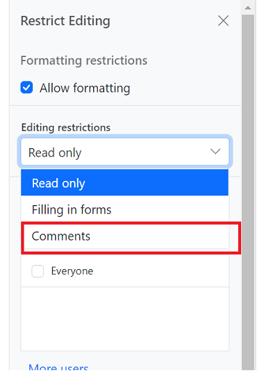

# Comments in ##Platform_Name## Document editor control

Document Editor allows you to add comments to documents. You can add, navigate and remove comments in code and from the UI.

## Add a new comment

Comments can be inserted to the selected text.

```ts
//Add new commnt in the document.
documentEditor.editor.insertComment("Test comment");
```

## Comment navigation

Next and previous comments can be navigated using the below code snippet.

```ts
//Navigate to next comment
documentEditor.selection.navigateNextComment();

//Navigate to previous comment
documentEditor.selection.navigatePreviousComment();
```

## Delete comment

Current comment can be be deleted using the below code snippet.

```ts
//Delete the selected comment.
documentEditor.editor.deleteComment();
```

## Delete all comment

All the comments in the document can be deleted using the below code snippet.

```ts
//Delete all the comments present in the current document.
documentEditor.editor.deleteAllComments();
```

## Protect the document in comments only mode

Document Editor provides support for protecting the document with `CommentsOnly` protection. In this protection, user allowed to add or edit comments alone in the document.

Document editor provides an option to protect and unprotect document using [`enforceProtection`](../api/document-editor/editor/#enforceprotection) and [`stopProtection`](../api/document-editor/editor/#stopprotection) API.

The following example code illustrates how to enforce and stop protection in Document editor container.

```ts
let container: DocumentEditorContainer = new DocumentEditorContainer({
  enableToolbar: true,
  height: '590px',
});
DocumentEditorContainer.Inject(Toolbar);
container.serviceUrl =
  'http://localhost:5000/api/documenteditor/';
container.appendTo('#container');

//enforce protection
container.documentEditor.editor.enforceProtection('123', 'CommentsOnly');

//stop the document protection
container.documentEditor.editor.stopProtection('123');
```

Comment only protection can be enabled in UI by using [Restrict Editing pane](../document-editor/document-management#restrict-editing-pane)



>Note: In enforce Protection method, first parameter denotes password and second parameter denotes protection type. Possible values of protection type are `NoProtection |ReadOnly |FormFieldsOnly |CommentsOnly`. In stop protection method, parameter denotes the password.