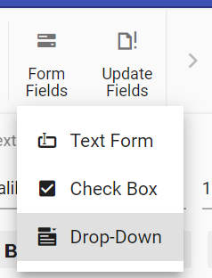

# Form fields in ##Platform_Name## Document editor control

DocumentEditorContainer component provide support for inserting Text, CheckBox, DropDown form fields through in-built toolbar.



## Insert form field

Form fields can be inserted using [`insertFormField`](../api/document-editor/editor/#insertformfield) method in editor module.

```ts
//Insert Text form field
documentEditor.editor.insertFormField('Text');
//Insert Checkbox form field
documentEditor.editor.insertFormField('CheckBox');
//Insert Drop down form field
documentEditor.editor.insertFormField('Dropdown');
```

## Get form field names

All the form fields names form current document can be retrieved using [`getFormFieldNames()`](../api/document-editor/#getformfieldnames).

```ts
let formFieldsNames: string[] = documentEditor.getFormFieldNames();
```

## Get form field properties

Form field properties can be retrieved using [`getFormFieldInfo()`](../api/document-editor/#getformfieldinfo).

```ts
//Get Text form field by using bookmark name.
let textfieldInfo: TextFormFieldInfo = documentEditor.getFormFieldInfo('Text1') as TextFormFieldInfo;
//Checkbox form field by using bookmark name.
let checkboxfieldInfo: CheckBoxFormFieldInfo = documentEditor.getFormFieldInfo('Check1') as CheckBoxFormFieldInfo;
//Dropdown form field by using bookmark name.
let dropdownfieldInfo: DropDownFormFieldInfo = documentEditor.getFormFieldInfo('Drop1') as DropDownFormFieldInfo;
```

## Set form field properties

Form field properties can be modified using [`setFormFieldInfo`](../api/document-editor/#setformfieldinfo).

```ts
// Set text form field properties
let textfieldInfo: TextFormFieldInfo = documentEditor.getFormFieldInfo('Text1') as TextFormFieldInfo;
textfieldInfo.defaultValue = "Hello";
textfieldInfo.format = "Uppercase";
textfieldInfo.type = "Text";
textfieldInfo.name = "Text2";
documentEditor.setFormFieldInfo('Text1', textfieldInfo);

// Set checkbox form field properties
let checkboxfieldInfo: CheckBoxFormFieldInfo = documentEditor.getFormFieldInfo('Check1') as CheckBoxFormFieldInfo;
checkboxfieldInfo.defaultValue = true;
checkboxfieldInfo.name = "Check2";
documentEditor.setFormFieldInfo('Check1', checkboxfieldInfo);

// Set checkbox form field properties
let dropdownfieldInfo: DropDownFormFieldInfo = documentEditor.getFormFieldInfo('Drop1') as DropDownFormFieldInfo;
dropdownfieldInfo.dropDownItems = ['One', 'Two', 'Three']
dropdownfieldInfo.name = "Drop2";
documentEditor.setFormFieldInfo('Drop1', dropdownfieldInfo);
```

>Note:If a form field already exists in the document with the new name specified, the old form field name property will be cleared and it will not be accessible. Ensure the new name is unique.

## Export form field data

Data of the all the Form fields in the document can be exported using [`exportFormData`](../api/document-editor/#exportformdata).

```ts
let formFieldDate: FormFieldData[] = documentEditor.exportFormData();
```

## Import form field data

Form fields can be prefilled with data using [`importFormData`](../api/document-editor/#importformdata).

```ts
let textformField: FormFieldData = { fieldName: 'Text1', value: 'Hello World' };
let checkformField: FormFieldData = { fieldName: 'Check1', value: true };
let dropdownformField: FormFieldData = { fieldName: 'Drop1', value: 1 };
//Import form field data
this.container.documentEditor.importFormData([textformField, checkformField, dropdownformField]);
```

## Reset form fields

Reset all the form fields in current document to default value using [`resetFormFields`](../api/document-editor/#resetformfields).

```ts
documentEditor.resetFormFields();
```

## Protect the document in form filling mode

Document Editor provides support for protecting the document with `FormFieldsOnly` protection. In this protection, user can only fill form fields in the document.

Document editor provides an option to protect and unprotect document using [`enforceProtection`](../api/document-editor/editor/#enforceprotection) and [`stopProtection`](../api/document-editor/editor/#stopprotection) API.

The following example code illustrates how to enforce and stop protection in Document editor container.

```ts
let container: DocumentEditorContainer = new DocumentEditorContainer({
  enableToolbar: true,
  height: '590px',
});
DocumentEditorContainer.Inject(Toolbar);
container.serviceUrl =
  'https://services.syncfusion.com/js/production/api/documenteditor/';
container.appendTo('#container');

//enforce protection
container.documentEditor.editor.enforceProtection('123', 'FormFieldsOnly');

//stop the document protection
container.documentEditor.editor.stopProtection('123');
```

>Note: In enforce Protection method, first parameter denotes password and second parameter denotes protection type. Possible values of protection type are `NoProtection |ReadOnly |FormFieldsOnly |CommentsOnly`. In stop protection method, parameter denotes the password.