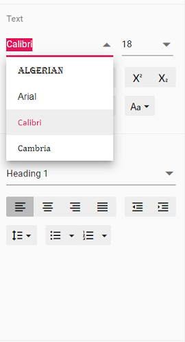

# Customize font family drop down in ##Platform_Name## Document editor control

Document editor provides an options to customize the font family drop down list values using [`fontfamilies`](../../api/document-editor/documentEditorSettingsModel/#fontfamilies) in Document editor settings. Fonts which are added in fontFamilies of [`documentEditorSettings`](../../api/document-editor-container/#documenteditorsettings) will be displayed on font drop down list of text properties pane and font dialog.

Similarly, you can use [`documentEditorSettings`](../../api/document-editor#documenteditorsettings) property for DocumentEditor also.

The following example code illustrates how to change the font families in Document editor container.

```ts
let container: DocumentEditorContainer = new DocumentEditorContainer({ enableToolbar: true,height: '590px',
// Add required font families to list it in font drop down
  documentEditorSettings: {
    fontFamilies: ['Algerian', 'Arial', 'Calibri', 'Windings'],
  }
});
DocumentEditorContainer.Inject(Toolbar);
container.serviceUrl = 'https://ej2services.syncfusion.com/production/web-services/api/documenteditor/';
container.appendTo('#container');
```

Output will be like below:

