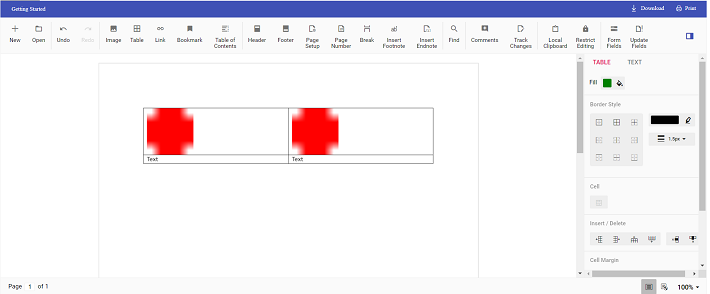

# Insert text or image in table programmatically in ##Platform_Name## Document editor control

Using Document editor API's, you can insert [`text`](../../document-editor/how-to/insert-text-in-current-position/#insert-text-in-current-cursor-position) or [`image`](../../document-editor/image/#images) in [`table`](../../document-editor/table/#create-a-table) programmatically based on your requirement.

Use [`selection`](../../document-editor/how-to/move-selection-to-specific-position/#selects-content-based-on-start-and-end-hierarchical-index) API's to navigate between rows and cells.

The following example illustrates how to create 2*2 table and then add text and image programmatically.

```ts
import { DocumentEditorContainer, Toolbar } from '@syncfusion/ej2-documenteditor';

DocumentEditorContainer.Inject(Toolbar);

let container: DocumentEditorContainer = new DocumentEditorContainer({ enableToolbar: true, height: '590px' });

container.serviceUrl = 'https://services.syncfusion.com/js/production/api/documenteditor/';

container.appendTo('#container');
// To insert the table in cursor position
container.documentEditor.editor.insertTable(2,2);
// To insert the image at table first cell
container.documentEditor.editor.insertImage("data:image/png;base64,iVBORw0KGgoAAAANSUhEUgAAAAUAAAAFCAYAAACNbyblAAAAHElEQVQI12P4    //8/w38GIAXDIBKE0DHxgljNBAAO9TXL0Y4OHwAAAABJRU5ErkJggg==");
// To move the cursor to next cell
moveCursorToNextCell();
// To insert the image at table second cell
container.documentEditor.editor.insertImage("data:image/png;base64,iVBORw0KGgoAAAANSUhEUgAAAAUAAAAFCAYAAACNbyblAAAAHElEQVQI12P4    //8/w38GIAXDIBKE0DHxgljNBAAO9TXL0Y4OHwAAAABJRU5ErkJggg==");
// To move the cursor to next row
moveCursorToNextRow();
// To insert text in cursor position
container.documentEditor.editor.insertText('Text');
// To move the cursor to next cell
moveCursorToNextCell();
// To insert text in cursor position
container.documentEditor.editor.insertText('Text');

function moveCursorToNextCell() {
// To get current selection start offset
var startOffset=container.documentEditor.selection.startOffset;
// Increasing cell index to consider next cell
var cellIndex= parseInt(startOffset.substring(6, 7)) + 1;
// Changing start offset
startOffset = startOffset.substring(0, 6) + cellIndex.toString() + startOffset.substring(7, startOffset.length);
// Navigating selection using select method
container.documentEditor.selection.select(startOffset, startOffset);
}

function moveCursorToNextRow() {
// To get current selection start offset
var startOffset=container.documentEditor.selection.startOffset;
// Increasing row index to consider next row
var rowIndex= parseInt(startOffset.substring(4, 5)) + 1;
var cellIndex= parseInt(startOffset.substring(6,7)) != 0? parseInt(startOffset.substring(6,7)) - 1:0;
// Changing start offset
startOffset = startOffset.substring(0, 4) + rowIndex.toString() + startOffset.substring(5, 6) + cellIndex + startOffset.substring(7, startOffset.length);
// Navigating selection using select method
container.documentEditor.selection.select(startOffset, startOffset);
}
```

The output will be like below.

