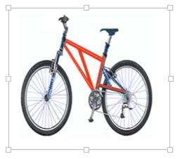

# Image in ##Platform_Name## Document editor control

Document Editor supports common raster format images like PNG, BMP, JPEG, SVG and GIF. You can insert an image file or online image in the document using the [`insertImage()`](../api/document-editor/editor/#insertimage) method. Refer to the following sample code.



 







        
















N> 1. Image files will be internally converted to base64 string. Whereas, online images are preserved as URL. N> 2. EMF and WMF images can't be inserted, but these types of images will be preserved in Document Editor when using ASP.NET MVC Web API.

## Alternate text

Document Editor expose API to get or set the alternate text of the selected image. Refer to the following sample code.

```ts
documenteditor.selection.imageFormat.alternateText = 'Adventure Cycle';
```

## Image resizing

Document Editor provides built-in image resizer that can be injected into your application based on the requirements. This allows you to resize the image by dragging the resizing points using mouse or touch interactions. This resizer appears as follows.



## Changing size

Document Editor expose API to get or set the size of the selected image. Refer to the following sample code.

```ts
documenteditor.selection.imageFormat.width = 800;
documenteditor.selection.imageFormat.height = 800;
```

>Note: Images are stored and processed(read/write) as base64 string in DocumentEditor. The online image URL is preserved as a URL in DocumentEditor upon saving.

## Text wrapping style

Text wrapping refers to how images fit with surrounding text in a document. Please [refer to this page](../document-editor/text-wrapping-style) for more information about text wrapping styles available in Word documents.

## Positioning the image

DocumentEditor preserves the position properties of the image and displays the image based on position properties. It does not support modifying the position properties. Whereas the image will be automatically moved along with text edited if it is positioned relative to the line or paragraph.

## See Also

* [Feature modules](../document-editor/feature-module/)
