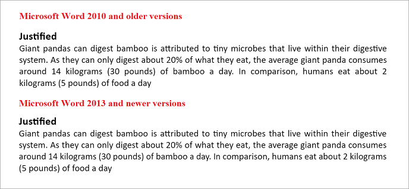

# Paragraph format in ##Platform_Name## Document editor control

Document Editor supports various paragraph formatting options such as text alignment, indentation, paragraph spacing, and more.

## Indentation

You can modify the left or right indentation of selected paragraphs using the following sample code.

```ts
documenteditor.selection.paragraphFormat.leftIndent = 24;
documenteditor.selection.paragraphFormat.rightIndent = 24;
```

## Special indentation

You can define special indent for first line of the paragraph using the following sample code.

```ts
documenteditor.selection.paragraphFormat.firstLineIndent = 24;
```

## Increase indent

You can increase the left indent of selected paragraphs by a factor of 36 points using the following sample code.

```ts
documenteditor.editor.increaseIndent()
```

## Decrease indent

You can decrease the left indent of selected paragraphs by a factor of 36 points using the following sample code.

```ts
documenteditor.editor.decreaseIndent()
```

## Text alignment

You can get or set the text alignment of selected paragraphs using the following sample code.

```ts
documenteditor.selection.paragraphFormat.textAlignment = 'Center' | 'Left' | 'Right' | 'Justify';
```

>Note: Starting from `v19.4.0.x`, the text justification of Document editor component matches alignment of Microsoft Word 2013 and newer versions based on the compatibility mode present in the document. The DOCX document created using Microsoft Word 2013 and newer versions will have the compatibility mode `Word2013` and follows a special behavior in justifying the text. You can retain the text justification behavior like old versions by modifying the compatibility mode as `Word2010`.

```ts
documenteditor.documentSettings.compatibilityMode = 'Word2010';
```

>Note: The Document editor component assumes the compatibility mode as `Word2013` by default, if it is not defined for a document.



You can toggle the text alignment of selected paragraphs by specifying a value using the following sample code.

```ts
documenteditor.editor.toggleTextAlignment('Center' | 'Left' | 'Right' | 'Justify');
```

## Line spacing and its type

You can define the line spacing and its type for selected paragraphs using the following sample code.

```ts
documenteditor.selection.paragraphFormat.lineSpacingType = 'AtLeast';
documenteditor.selection.paragraphFormat.lineSpacing = 6;
```

## Paragraph spacing

You can define the spacing before or after the paragraph by using the following sample code.

```ts
documenteditor.selection.paragraphFormat.beforeSpacing = 24;
documenteditor.selection.paragraphFormat.afterSpacing = 24;
```

You can also set automatic spacing before and after the paragraph by using the following sample code.

```ts
documenteditor.selection.paragraphFormat.spaceBeforeAuto = true;
documenteditor.selection.paragraphFormat.spaceAfterAuto = true;
```

>Note: If auto spacing property is enabled, then value defined in the `beforeSpacing` and `afterSpacing` property will not be considered.

## Pagination properties

You can enable or disable the following pagination properties for the paragraphs in a Word document.

* Widow/Orphan control - whether the first and last lines of the paragraph are to remain on the same page as the rest of the paragraph when paginating the document.
* Keep with next - whether the specified paragraph remains on the same page as the paragraph that follows it while paginating the document.
* Keep lines together - whether all lines in the specified paragraphs remain on the same page while paginating the document.

The following example code illustrates how to enable or disable these pagination properties for the selected paragraphs.

```ts
documenteditor.selection.paragraphFormat.widowControl = false;
documenteditor.selection.paragraphFormat.keepWithNext = true;
documenteditor.selection.paragraphFormat.keepLinesTogether = true;
```

## Paragraph Border

You can apply borders to the paragraphs in a Word document. Using borders, decorate the paragraphs to set them apart from other paragraphs in the document.

The following example code illustrates how to apply box border for the selected paragraphs.

```ts
// left
documenteditor.selection.paragraphFormat.borders.left.lineStyle = 'Single';
documenteditor.selection.paragraphFormat.borders.left.lineWidth = 3;
documenteditor.selection.paragraphFormat.borders.left.color = "#000000";

//right
documenteditor.selection.paragraphFormat.borders.right.lineStyle = 'Single';
documenteditor.selection.paragraphFormat.borders.right.lineWidth = 3;
documenteditor.selection.paragraphFormat.borders.right.color = "#000000";

//top
documenteditor.selection.paragraphFormat.borders.top.lineStyle = 'Single';
documenteditor.selection.paragraphFormat.borders.top.lineWidth = 3;
documenteditor.selection.paragraphFormat.borders.top.color = "#000000";

//bottom
documenteditor.selection.paragraphFormat.borders.bottom.lineStyle = 'Single';
documenteditor.selection.paragraphFormat.borders.bottom.lineWidth = 3;
documenteditor.selection.paragraphFormat.borders.bottom.color = "#000000";
```

Note: At present, the Document editor component displays all the border styles as single line. But you can apply any border style and get the proper display in Microsoft Word app when opening the exported Word document.

## Show or Hide Paragraph marks

You can show or hide the hidden formatting symbols like spaces, tab, paragraph marks, and breaks in Document editor component. These marks help identify the start and end of a paragraph and all the hidden formatting symbols in a Word document.

The following example code illustrates how to show or hide paragraph marks.

```ts
documenteditor.documentEditorSettings.showHiddenMarks = true;
```

## Toolbar with paragraph formatting options

The following sample demonstrates the paragraph formatting options using a toolbar.



 







        
















## See Also

* [Feature modules](../document-editor/feature-module)
* [Paragraph dialog](../document-editor/dialog#paragraph-dialog)
* [Keyboard shortcuts](../document-editor/keyboard-shortcut#paragraph-formatting)
