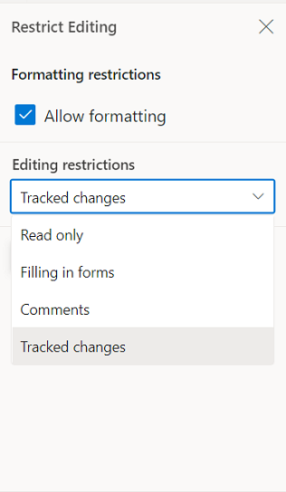

# Track changes in ##Platform_Name## Document editor control

Track Changes allows you to keep a record of changes or edits made to a document. You can then choose to accept or reject the modifications. It is a useful tool for managing changes made by several reviewers to the same document. If track changes option is enabled, all editing operations are preserved as revisions in Document Editor.

## Enable track changes in Document Editor

The following example demonstrates how to enable track changes.

```ts
let container: DocumentEditorContainer = new DocumentEditorContainer({ enableTrackChanges: true });
container.appendTo('#container');
```

## Get all tracked revisions

The following example demonstrate how to get all tracked revision from current document.

```ts
let container: DocumentEditorContainer = new DocumentEditorContainer({ enableTrackChanges: true });
container.appendTo('#container');

/**
 * Get revisions from the current document
 */
let revisions: RevisionCollection = container.documentEditor.revisions;
```

## Accept or Reject all changes programmatically

The following example demonstrates how to accept/reject all changes.

```ts
let container: DocumentEditorContainer = new DocumentEditorContainer({ enableTrackChanges: true });
container.appendTo('#container');
/**
 * Get revisions from the current document
 */
let revisions: RevisionCollection = container.documentEditor.revisions;

/**
 * Accept all tracked changes
 */
revisions.acceptAll();

/**
 * Reject all tracked changes
 */
revisions.rejectAll();
```

## Accept or reject a specific revision

The following example demonstrates how to accept/reject specific revision in the Document Editor.

```ts
/**
 * Get revisions from the current document
 */
let revisions: RevisionCollection = container.documentEditor.revisions;
/**
 * Accept specific changes
 */
revisions.get(0).accept();
/**
 * Reject specific changes
 */
revisions.get(1).reject();
```

## Navigate between the tracked changes

The following example demonstrates how to navigate tracked revision programmatically.

```ts
let container: DocumentEditorContainer = new DocumentEditorContainer({ enableTrackChanges: true });
container.appendTo('#container');
/**
 * Navigate to next tracked change from the current selection.
 */
container.documentEditor.selection.navigateNextRevision();

/**
 * Navigate to previous tracked change from the current selection.
 */
container.documentEditor.selection.navigatePreviousRevision();
```

## Filtering changes based on user

In DocumentEditor, we have built-in review panel in which we have provided support for filtering changes based on the user.


## Protect the document in track changes only mode

Document Editor provides support for protecting the document with `RevisionsOnly` protection. In this protection, all the users are allowed to view the document and do their corrections, but they cannot accept or reject any tracked changes in the document. Later, the author can view their corrections and accept or reject the changes.

Document editor provides an option to protect and unprotect document using [`enforceProtection`](../api/document-editor/editor/#enforceprotection) and [`stopProtection`](../api/document-editor/editor/#stopprotection) API.

The following example code illustrates how to enforce and stop protection in Document editor container.

```ts
let container: DocumentEditorContainer = new DocumentEditorContainer({
  enableToolbar: true,
  height: '590px',
});
DocumentEditorContainer.Inject(Toolbar);
container.serviceUrl =
  'http://localhost:5000/api/documenteditor/';
container.appendTo('#container');

//enforce protection
container.documentEditor.editor.enforceProtection('123', 'RevisionsOnly');

//stop the document protection
container.documentEditor.editor.stopProtection('123');
```

Tracked changes only protection can be enabled in UI by using [Restrict Editing pane](../document-editor/document-management#restrict-editing-pane)



>Note: In enforce Protection method, first parameter denotes password and second parameter denotes protection type. Possible values of protection type are `NoProtection |ReadOnly |FormFieldsOnly |CommentsOnly |RevisionsOnly`. In stop protection method, parameter denotes the password.