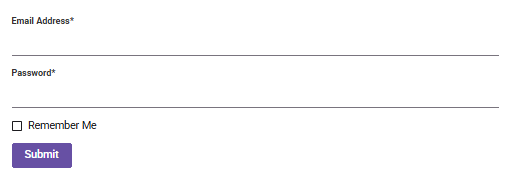

# Getting started with TypeScript Form Renderer control

The Form Renderer is a powerful, schema-driven component that enables you to build and render complex forms with ease using a structured JSON schema definition. It streamlines form creation, customization, and data capture by letting you declaratively define form layouts, fields, and validation, and then render the form through a simple component property binding.

This section explains the steps required to create the Form Renderer control in TypeScript and configure its properties using the Essential<sup style="font-size:70%">&reg;</sup> JS 2 [quickstart](https://github.com/SyncfusionExamples/ej2-quickstart-webpack-) seed repository. This seed repository is pre-configured with the Essential<sup style="font-size:70%">&reg;</sup> JS 2 package.

> This application is integrated with the `webpack.config.js` configuration and uses the latest version of the [webpack-cli](https://webpack.js.org/api/cli/#commands). It requires Node.js `v14.15.0` or higher. For more information about webpack and its features, refer to the [webpack documentation](https://webpack.js.org/guides/getting-started/).

## Prerequisites

Ensure the following tools are installed on your machine:

* [Git](https://git-scm.com/downloads)
* [Node.js](https://nodejs.org/en/)
* [Visual Studio Code](https://code.visualstudio.com/)

## Set up the development environment

Clone the Syncfusion<sup style="font-size:70%">&reg;</sup> Essential JS 2 quickstart application project from [GitHub](https://github.com/SyncfusionExamples/ej2-quickstart-webpack) using the following command line prompt.

```
git clone https://github.com/SyncfusionExamples/ej2-quickstart-webpack ej2-quickstart
```

Navigate to the project folder in the command prompt:

```
cd ej2-quickstart
```

## Adding Syncfusion<sup style="font-size:70%">&reg;</sup> TypeScript Form Renderer package

Syncfusion<sup style="font-size:70%">&reg;</sup> TypeScript (Essential<sup style="font-size:70%">&reg;</sup> JS 2) packages are available on the [npmjs.com](https://www.npmjs.com/~syncfusionorg) public registry. You can install all Syncfusion<sup style="font-size:70%">&reg;</sup> TypeScript (Essential<sup style="font-size:70%">&reg;</sup> JS 2) controls in a single [@syncfusion/ej2](https://www.npmjs.com/package/@syncfusion/ej2) package or individual packages for each control.

Use the following command to install the `@syncfusion/ej2-form-renderer` package:

```
npm install @syncfusion/ej2-form-renderer --save
```

Then, install the remaining dependent npm packages using the following command:

```
npm install
```

> For more information about individual package and alternative installation methods, see the [installation guide](https://ej2.syncfusion.com/documentation/installation-and-upgrade/installation).

## Adding Form Renderer CSS reference

Themes for Syncfusion<sup style="font-size:70%">&reg;</sup> TypeScript components can be applied using CSS files provided through [npm theme packages](https://www.npmjs.com/package/@syncfusion/ej2-material3-theme). For more information, refer to the [themes documentation](https://ej2.syncfusion.com/documentation/appearance/theme).

To install the [Material3](https://www.npmjs.com/package/@syncfusion/ej2-material3-theme) theme package, use the following command:




npm install @syncfusion/ej2-material3-theme --save




Then add the following CSS reference to the **src/styles/styles.css** file:




@import "../../node_modules/@syncfusion/ej2-material3-theme/styles/material3.css";




## Adding Syncfusion<sup style="font-size:70%">&reg;</sup> Form Renderer control to the application

Add an HTML `<div>` element to the `~/src/index.html` file to act as the root element of the Form Renderer control.

```html
<!DOCTYPE html>
<html lang="en">

<head>
    <title>Essential JS 2</title>
    <meta charset="utf-8" />
    <meta name="viewport" content="width=device-width, initial-scale=1.0, user-scalable=no" />
    <meta name="description" content="Essential JS 2" />
    <meta name="author" content="Syncfusion" />
    <link rel="shortcut icon" href="resources/favicon.ico" />
    <link href="https://maxcdn.bootstrapcdn.com/bootstrap/3.3.7/css/bootstrap.min.css" rel="stylesheet" />
</head>

<body>
    <div>
        <!--Element where the Form Renderer will be rendered-->
        <div id="formrenderer"></div>
    </div>
</body>

</html>
```

The Form Renderer is a schema-driven component. To render the control, pass a JSON schema with the form definitions to the `schema` property of the Form Renderer, and retrieve the submitted form data through the `submit` event.

To render the Form Renderer control, add the following TypeScript code to the **~/src/app/app.ts** file.

```ts
import { FormRenderer } from '@syncfusion/ej2-form-renderer';

// Initialize Form Renderer control.
let formRenderer: FormRenderer = new FormRenderer({
    schema: {
        "version": "0.1.0",
        "properties": {
            "emailAddress": {
                "id": "textbox_1785491685456_167",
                "name": "emailAddress",
                "type": "string",
                "label": "Email Address",
                "textboxType": "email",
                "required": true,
                "widget": "textbox"
            },
            "password": {
                "id": "textbox_1785491685456_537",
                "name": "password",
                "type": "string",
                "label": "Password",
                "textboxType": "password",
                "required": true,
                "minLength": 6,
                "widget": "textbox"
            },
            "rememberMe": {
                "id": "checkbox_1785491685456_262",
                "name": "rememberMe",
                "type": "boolean",
                "label": "Remember Me",
                "widget": "checkbox"
            },
            "submit": {
                "id": "submit_button_initial",
                "name": "defaultFormsubmit",
                "type": "button",
                "label": "Submit",
                "buttonType": "submit",
                "widget": "button",
                "style": "primary",
                "disabled": false
            }
        },
        "layout": [
            {
                "type": "field",
                "propertyId": "emailAddress"
            },
            {
                "type": "field",
                "propertyId": "password"
            },
            {
                "type": "field",
                "propertyId": "rememberMe"
            },
            {
                "type": "field",
                "propertyId": "submit"
            }
        ],
        "settings": {
            "name": "Untitled Form"
        }
    }
});

// Render the initialized Form Renderer.
formRenderer.appendTo('#formrenderer');
```

## Run the application

Now, run the application in the browser using the following command.

```
npm run start
```

The output will appear as follows:



## Registering Syncfusion license

The Syncfusion® Form Renderer requires a valid license key to be registered in the application. To prevent license validation warnings, refer to the [Syncfusion licensing](https://ej2.syncfusion.com/documentation/licensing/overview) documentation.

## See Also

* [Form Renderer API Reference](https://ej2.syncfusion.com/javascript/documentation/api/form-renderer/)
