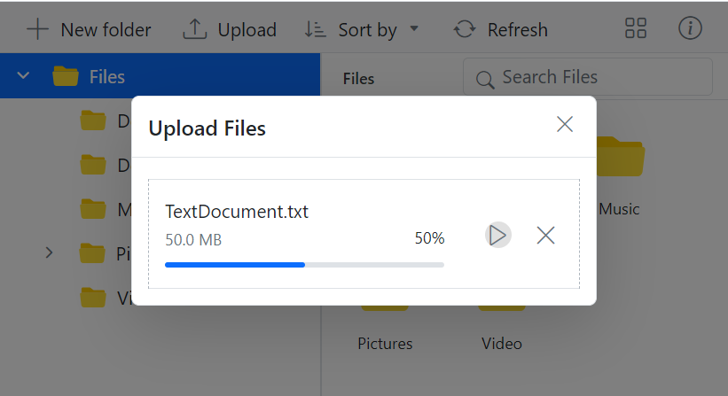

# Upload in ##Platform_Name## File Manager control

The ##Platform_Name## File Manager control provides an [`uploadSettings`](../api/file-manager/#uploadsettings) property with various options to customize file uploads, including controlling file size, restricting file types, checking for excessively large and empty files, and enabling chunk uploads.

## Directory Upload

The [`directoryUpload`](../api/file-manager/uploadSettingsModel/#directoryupload) property controls whether users can browse and upload entire directories (folders) in the Syncfusion&reg; ##Platform_Name## File Manager control.

To enable directory upload, set the [`directoryUpload`](../api/file-manager/uploadSettingsModel/#directoryupload) property to `true` in the [`uploadSettings`](../api/file-manager/#uploadsettings) configuration.

When set to `true`, this property enables directory upload in the File Manager, allowing users to upload entire folders. If set to `false`, only individual files can be uploaded. 






























        



>**Note:** When [`directoryUpload`](../api/file-manager/uploadSettingsModel/#directoryupload) is set to `true`, only folders can be uploaded. When it is set to `false`, only individual files can be uploaded. Simultaneous uploading of files and folders is not supported.

To learn more about folder upload actions, refer to this [link](https://ej2.syncfusion.com/documentation/file-manager/file-operations#folder-upload-support)

## Sequential Upload

The [`sequentialUpload`](../api/file-manager/uploadSettingsModel/#sequentialupload) property controls whether users can upload files one by one in a sequential manner.

To enable sequential upload, set the [`sequentialUpload`](../api/file-manager/uploadSettingsModel/#sequentialupload) property to `true` in the [`uploadSettings`](../api/file-manager/#uploadsettings) configuration.

When set to `true`, the selected files will process sequentially (one after the other) to the server. If the file uploaded successfully or failed, the next file will upload automatically in this sequential upload. This feature helps to reduce the upload traffic and reduce the failure of file upload.






























        



The screenshot below shows that each file begins uploading only after the previous one completes. This demonstrates how the `sequentialUpload` property works in the File Manager control.

To learn more about folder upload actions, refer to this [link](https://ej2.syncfusion.com/documentation/file-manager/file-operations#folder-upload-support)

## Chunk Upload

The [`chunkSize`](../api/file-manager/uploadSettingsModel/#chunksize) property specifies the size of each chunk when uploading large files. It divides the file into smaller parts, which are uploaded sequentially to the server.

This property allows you to enable chunked uploads for large files by specifying a [`chunkSize`](../api/file-manager/uploadSettingsModel/#chunksize).

By specifying a [`chunkSize`](../api/file-manager/uploadSettingsModel/#chunksize), the large file is divided into smaller parts, reducing the load on the network and making the upload process more efficient.

In the following example, the chunkSize is set to 5 MB (5,242,880 bytes), and the maxFileSize is set to 70 MB (73,728,000 bytes). This means files that are up to 70 MB will be uploaded in 5 MB chunks.






























        



Chunk upload provides pause and resume options, offering users enhanced control over the file upload process.

>**Note:**
>1. Chunk upload will function when the selected file size is greater than the specified chunk size. Otherwise, it uploads files normally.
>2. The pause and resume features are available only when the chunk upload is enabled.

## Auto Upload

The [`autoUpload`](../api/file-manager/uploadSettingsModel/#autoupload) property controls whether files are automatically uploaded when they are added to the upload queue in the File Manager control.

The default value is `true`, meaning the File Manager will automatically upload files as soon as they are added to the upload queue. If set to `false`, the files will not be uploaded automatically, giving you a chance to manipulate the files before uploading them to the server.


































## Auto Close

The [`autoClose`](../api/file-manager/uploadSettingsModel/#autoclose) property controls whether the upload dialog automatically closes after all the files have been uploaded.

The default value is `false`, meaning the upload dialog remains open even after the upload process is complete. If [`autoClose`](../api/file-manager/uploadSettingsModel/#autoclose) is set to `true`, the upload dialog will automatically close after all the files in the upload queue are uploaded.


































## Prevent upload based on file extensions

The [`allowedExtensions`](../api/file-manager/uploadSettingsModel/#allowedextensions) property specifies which file types are allowed for upload in the File Manager control by defining their extensions.

This property lets you define which file types can be uploaded by specifying allowed extensions, separated by commas. For example, to allow only image files, you would set the [`allowedExtensions`](../api/file-manager/uploadSettingsModel/#allowedextensions) property to .jpg,.png.

By setting the [`allowedExtensions`](../api/file-manager/uploadSettingsModel/#allowedextensions) property, you restrict the file types that can be uploaded. Only files with the specified extensions will be accepted.

If you want to allow only image files like .jpg and .png, you should set the property as follows:


































## Restrict drag and drop upload

The File Manager control provides support for external drag-and-drop functionality for uploading files by dragging them from the local file system to File Manager.

To completely prevent the external drag-and-drop upload functionality (i.e., disallowing users from dragging and dropping files from outside into the File Manager), you can set the [`dropArea`](../api/uploader#droparea) property to null. This can be done by accessing the File Manager instance via its class methods.

>**Note:** Setting the [`allowDragAndDrop`](../api/file-manager#allowdraganddrop) property to false will not prevent the file upload operation through external drag and drop. It will only prevent drag-and-drop actions within the File Manager control.

The following example demonstrates how to prevent the external drag-and-drop upload actions for all types of files in the File Manager control.


































## See also

* [Set min and max file size in upload](https://ej2.syncfusion.com/documentation/file-manager/customization#upload-customization)
