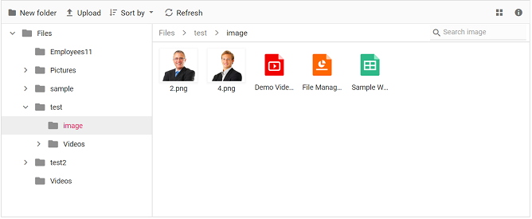

# User interface in ##Platform_Name## File Manager control

The File Manager UI is comprised of several sections like view, toolbar, breadcrumb, context menu, and more. The UI of the File Manager is enhanced with injectable modules such as `Details View` for browsing files and folders in a grid, `Navigation Pane` for folder navigation, and `Toolbar` for file operations. The File Manager with all feature modules includes the following sections in its UI:

* [Toolbar](#toolbar) (For direct access to file operations)
* [Navigation Pane](#navigation-pane) (For easy navigation between folders)
* [Breadcrumb](#breadcrumb) (For parent folder navigation)
* [View](#view) (For browsing files and folders using large icon view or details view)
* [Context Menu](#context-menu) (For accessing file operations)

The basic File Manager is a lightweight control with all the basic functions. The basic File Manager includes the following sections in its UI to browse files and folders and manage them with file operations:

* [Breadcrumb](#breadcrumb) (For parent folder navigation)
* [View](#view) (Large Icons view for browsing files and folders)
* [Context Menu](#context-menu) (For accessing file operations)

## Toolbar

The `Toolbar` provides easy access to the file operations using different buttons and is located at the top of the File Manager.

If the toolbar items exceed the available space, they will be moved to a toolbar popup accessible via a dropdown button at the end of the toolbar.

*Refer to the [Toolbar](./file-operations#toolbar) section in file operations to learn more about the buttons present in the toolbar*.

## Files and folders navigation

The File Manager provides navigation between files and folders using the following options:

* [Navigation Pane](#navigation-pane)
* [Breadcrumb](#breadcrumb)

### Navigation pane

The Navigation Pane is an injectable module, so it should be injected before rendering the File Manager to use its functionality. It displays the folder hierarchy of the file system and provides easy navigation to the desired folder. Using [`navigationPaneSettings`](../api/file-manager/index-default#navigationpanesettings), the minimum and maximum width of the Navigation Pane can be changed. The Navigation Pane can be shown or hidden using the `visible` option in the [`navigationPaneSettings`](../api/file-manager/index-default#navigationpanesettings).

You can customize the appearance of the navigation pane by using the `navigationPaneTemplate` property. This enables you to modify icons, display text, and include additional elements to suit your application's requirements.

### BreadCrumb

The File Manager provides a breadcrumb for navigating to parent folders. The breadcrumb in the File Manager is responsible for resizing. Whenever the path length exceeds the breadcrumb length, a dropdown button will be added at the start of the breadcrumb to hold the parent folders adjacent to the root.

## View

View is the section where the files and folders are displayed for the user to browse. The File Manager has two types of views to display the files and folders:

* [Large Icons View](#large-icons-view)
* [Details View](#details-view)

The `large icons view` is the default starting view in the File Manager. The view can be changed by using the [toolbar](#toolbar) view button or the view menu in the [context menu](#context-menu). The [`view`](../api/file-manager/index-default#view) API can also be used to change the initial view of the File Manager.

### Large icons view

In the large icons view, the thumbnail icons are shown in a larger size, which displays the data in a form that best suits their content. For image and video type files, a **preview** will be displayed. Extension thumbnails will be displayed for other file types.

The `largeIconsTemplate` property enables complete customization of how folders and files are rendered in the `Large Icons View`. It allows you to enhance the layout by adding background images, custom file-type icons, and actions such as dropdown menus.

### Details view

Details View is an injectable module in the File Manager, so it should be injected before rendering the File Manager to use its functionality. In the Details View, the files are displayed in a sorted list order. This file list comprises several columns of information about the files such as **Name**, **Date Modified**, **Type**, and **Size**. Each file has its own small icon representing the file type. Additional columns can be added using the [`detailsViewSettings`](../api/file-manager/index-default#detailsviewsettings) API. The Details View allows you to perform sorting using the column header.

## Context menu

The context menu appears on user interactions such as right-clicks. The File Manager is provided with context menu support to perform a list of file operations with the files and folders. The context menu appears with varying menu items based on the targets such as file, folder (including navigation pane folders), and layout (empty area in view).

The context menu can be customized using [`contextMenuSettings`](../api/file-manager/index-default#contextmenusettings), [`menuOpen`](../api/file-manager/index-default#menuopen), and [`menuClick`](../api/file-manager/index-default#menuclick) events.

*Refer to the [Context Menu](./file-operations#context-menu) section in file operations to learn more about the menu items present in the context menu*.

### Upload Files or Folders via context menu

File Manager control allows to perform the files or folder [upload](https://ej2.syncfusion.com/javascript/documentation/file-manager/file-operations#upload) operations with the help of Context Menu items by switching between the Files or Folder from Upload menu item.

