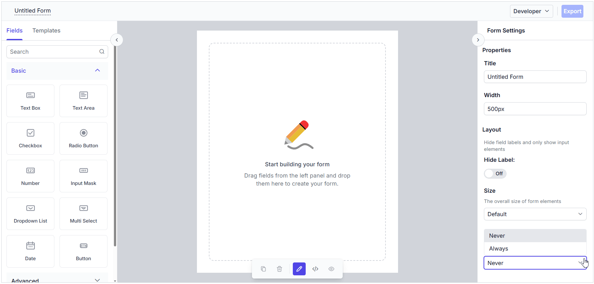

# Getting started with TypeScript Form Builder control

The Form Builder is an intuitive, visual form designer that lets you create and customize forms interactively by dragging and dropping fields — no code required. You can visually design forms, configure field properties, and preview the generated form in real time. The Form Builder also allows you to export the form schema for use with the Form Renderer control.

This section explains the steps required to create the Form Builder control in TypeScript and configure its properties using the Essential<sup style="font-size:70%">&reg;</sup> JS 2 [quickstart](https://github.com/SyncfusionExamples/ej2-quickstart-webpack-) seed repository. This seed repository is pre-configured with the Essential<sup style="font-size:70%">&reg;</sup> JS 2 package.

> This application is integrated with the `webpack.config.js` configuration and uses the latest version of the [webpack-cli](https://webpack.js.org/api/cli/#commands). It requires Node.js `v14.15.0` or higher. For more information about webpack and its features, refer to the [webpack documentation](https://webpack.js.org/guides/getting-started/).

## Prerequisites

Ensure the following tools are installed on your machine:

* [Git](https://git-scm.com/downloads)
* [Node.js](https://nodejs.org/en/)
* [Visual Studio Code](https://code.visualstudio.com/)

## Set up the development environment

Clone the Syncfusion<sup style="font-size:70%">&reg;</sup> Essential JS 2 quickstart application project from [GitHub](https://github.com/SyncfusionExamples/ej2-quickstart-webpack) using the following command in the command prompt.

```
git clone https://github.com/SyncfusionExamples/ej2-quickstart-webpack ej2-quickstart
```

Navigate to the project folder in the command prompt:

```
cd ej2-quickstart
```

## Adding Syncfusion<sup style="font-size:70%">&reg;</sup> TypeScript Form Builder package

Syncfusion<sup style="font-size:70%">&reg;</sup> TypeScript (Essential<sup style="font-size:70%">&reg;</sup> JS 2) packages are available on the [npmjs.com](https://www.npmjs.com/~syncfusionorg) public registry. You can install all Syncfusion<sup style="font-size:70%">&reg;</sup> TypeScript (Essential<sup style="font-size:70%">&reg;</sup> JS 2) controls in a single [@syncfusion/ej2](https://www.npmjs.com/package/@syncfusion/ej2) package or individual packages for each control.

Use the following command to install the `@syncfusion/ej2-form-builder` package:

```
npm install @syncfusion/ej2-form-builder --save
```

Then, install the remaining dependent npm packages using the following command:

```
npm install
```

> For more information about individual packages and alternative installation methods, see the [installation guide](https://ej2.syncfusion.com/documentation/installation-and-upgrade/installation).

## Adding Form Builder CSS reference

Themes for Syncfusion<sup style="font-size:70%">&reg;</sup> TypeScript components can be applied using CSS files provided through [npm theme packages](https://www.npmjs.com/package/@syncfusion/ej2-material3-theme). For more information, refer to the [themes documentation](https://ej2.syncfusion.com/documentation/appearance/theme).

To install the [Material3](https://www.npmjs.com/package/@syncfusion/ej2-material3-theme) theme package, use the following command:




npm install @syncfusion/ej2-material3-theme --save




Then add the following CSS reference to the **src/styles/styles.css** file:




@import "../../node_modules/@syncfusion/ej2-material3-theme/styles/material3.css";




## Adding Syncfusion<sup style="font-size:70%">&reg;</sup> Form Builder control to the application

Add an HTML `<div>` element to the `~/src/index.html` file to act as the root element of the Form Builder control.

```html
<!DOCTYPE html>
<html lang="en">

<head>
    <title>Essential JS 2</title>
    <meta charset="utf-8" />
    <meta name="viewport" content="width=device-width, initial-scale=1.0, user-scalable=no" />
    <meta name="description" content="Essential JS 2" />
    <meta name="author" content="Syncfusion" />
    <link rel="shortcut icon" href="resources/favicon.ico" />
    <link href="https://maxcdn.bootstrapcdn.com/bootstrap/3.3.7/css/bootstrap.min.css" rel="stylesheet" />
</head>

<body>
    <div>
        <!--Element where the Form Builder will be rendered-->
        <div id="formbuilder"></div>
    </div>
</body>

</html>
```

To render the Form Builder control, add the following TypeScript code to the **~/src/app/app.ts** file.

```ts
import { FormBuilder } from '@syncfusion/ej2-form-builder';

// Initialize Form Builder control.
let formBuilder: FormBuilder = new FormBuilder();

// Render the initialized Form Builder.
formBuilder.appendTo('#formbuilder');
```

## Run the application

Now, run the application in the browser using the following command.

```
npm run start
```

The output will appear as follows:


## Registering Syncfusion license

The Syncfusion® Form Builder requires a valid license key to be registered in the application. To prevent license validation warnings, refer to the [Syncfusion licensing](https://ej2.syncfusion.com/documentation/licensing/overview) documentation.

## Basic components of the Form Builder

The Form Builder control consists of the following sections:

1. **Left Pane / Toolbox** — Displays all the supported form fields, which can be dragged and dropped.
2. **Central design canvas** — Holds the dropped form fields to construct the form.
3. **Right Pane** — Provides options to customize the form settings as well as the selected form fields.
4. **Code view** — Displays the form schema during the form design process.
5. **Form Preview** — Allows you to preview and interact with the generated form in real time once it is created.

## Adding form fields to the design canvas

Form fields can be added to the central design canvas in the following ways:

* **Form Components Panel** — A toolbox of form fields is available in the left-side pane to drag and drop them onto the design canvas.
* **Context Menu in the Design Canvas** — After the first form field is dropped, a button at the end of the central canvas can be used to add additional form fields using a context menu that appears when the button is clicked.


