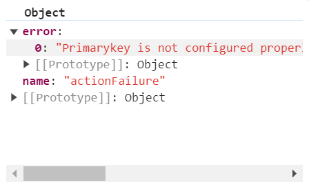

# Getting started in ##Platform_Name## Gantt Chart control

This section explains the steps required to create a simple Essential<sup style="font-size:70%">&reg;</sup> JS 2 Gantt Chart and demonstrate the basic usage of the Gantt Chart control in a JavaScript application.

## Prerequisites

To get started, ensure the following software is installed on the machine.

* [Essential Studio<sup style="font-size:70%">&reg;</sup> JavaScript (Essential<sup style="font-size:70%">&reg;</sup> JS 2)](https://www.syncfusion.com/downloads/essential-js2)

* [Visual Studio Code](https://code.visualstudio.com)
> Check out the [download and installation](https://ej2.syncfusion.com/javascript/documentation/installation-and-upgrade/download) section of **Essential Studio<sup style="font-size:70%">&reg;</sup> JavaScript**. If you are using Syncfusion<sup style="font-size:70%">&reg;</sup> CDN resources to build your web application, you can skip the Essential Studio<sup style="font-size:70%">&reg;</sup> JavaScript prerequisite.

## Setup for local environment

Refer to the following steps to set up your local environment.

**Step 1:** Create a root folder named **my-app** for your application.

**Step 2:** Create a **my-app/resources** folder to store local scripts and styles files.

**Step 3:** Open Visual Studio Code and create **my-app/index.js** and **my-app/index.html** files to initialize the Essential<sup style="font-size:70%">&reg;</sup> JS 2 Gantt Chart control.

## Adding Syncfusion<sup style="font-size:70%">&reg;</sup> resources

The Essential<sup style="font-size:70%">&reg;</sup> JS 2 Gantt Chart control can be initialized by using either of the following ways.

* [Using local scripts and styles](#using-local-scripts-and-styles)

* [Using CDN link for scripts and styles](#using-cdn-link-for-scripts-and-styles)

### Using local scripts and styles

To use local scripts and styles for Syncfusion<sup style="font-size:70%">&reg;</sup> Gantt, you can follow these steps:

**1. Download Essential<sup style="font-size:70%">&reg;</sup> Studio<sup style="font-size:70%">&reg;</sup> JavaScript (Essential<sup style="font-size:70%">&reg;</sup> JS 2):** Obtain the global scripts and styles from the [Essential Studio<sup style="font-size:70%">&reg;</sup> JavaScript (Essential<sup style="font-size:70%">&reg;</sup> JS 2)](https://www.syncfusion.com/downloads/essential-js2) build installation location.

**2. Copy Files to Resources Folder:** After installing the Essential<sup style="font-size:70%">&reg;</sup> JS 2 product build, copy the Gantt Chart's scripts, and dependencies scripts and style file into the designated folders:

* **Scripts:** Copy the scripts to the **resources/scripts** folder.
* **Styles:** Copy the styles to the **resources/styles** folder.

**3. Locate Script and Style Files:** Identify the location of the Gantt Chart's script and style files. The syntax for the file paths are as follows:

**Syntax:**
> * Script: `**(installed location)**/Syncfusion/Essential Studio/{RELEASE_VERSION}/Essential JS 2/{PACKAGE_NAME}/dist/global/{PACKAGE_NAME}.min.js`
> * Styles: `**(installed location)**/Syncfusion/Essential Studio/{RELEASE_VERSION}/Essential JS 2/{PACKAGE_NAME}/styles/tailwind3.css`


**Example:**

> * Script: `C:/Program Files (x86)/Syncfusion/Essential Studio/33.1.44/Essential JS 2/ej2-gantt/dist/global/ej2-gantt.min.js`
> * Styles: `C:/Program Files (x86)/Syncfusion/Essential Studio/33.1.44/Essential JS 2/ej2-gantt/styles/tailwind3.css`

**4. Referencing in HTML File:** Once the files are copied, reference the Gantt's scripts and styles into the **index.html** file.

Here's an example of referencing the Gantt's scripts and styles in an HTML file:

```html
<!DOCTYPE html>
  <html xmlns="http://www.w3.org/1999/xhtml">
       <head>
            <title>Essential JS 2 Gantt</title>
             <!-- Essential JS 2 gantt's dependent tailwind3 theme -->
            <link href="resources/base/styles/tailwind3.css" rel="stylesheet" type="text/css"/>
            <link href="resources/buttons/styles/tailwind3.css" rel="stylesheet" type="text/css"/>
            <link href="resources/popups/styles/tailwind3.css" rel="stylesheet" type="text/css"/>
            <link href="resources/navigations/styles/tailwind3.css" rel="stylesheet" type="text/css"/>
            <link href="resources/notifications/styles/tailwind3.css" rel="stylesheet" type="text/css"/>
            <link href="resources/lists/styles/tailwind3.css" rel="stylesheet" type="text/css"/>
            <link href="resources/dropdowns/styles/tailwind3.css" rel="stylesheet" type="text/css"/>
            <link href="resources/inputs/styles/tailwind3.css" rel="stylesheet" type="text/css"/>
            <link href="resources/calendars/styles/tailwind3.css" rel="stylesheet" type="text/css"/>
            <link href="resources/layouts/styles/tailwind3.css" rel="stylesheet" type="text/css"/>
            <link href="resources/richtexteditor/styles/tailwind3.css" rel="stylesheet" type="text/css"/>
            <link href="resources/grids/styles/tailwind3.css" rel="stylesheet" type="text/css"/>
            <link href="resources/treegrid/styles/tailwind3.css" rel="stylesheet" type="text/css"/>
            <!-- Essential JS 2 tailwind3 theme -->
            <link href="resources/gantt/styles/tailwind3.css" rel="stylesheet" type="text/css"/>

            <!-- Essential JS 2 Gantt's dependent scripts -->
            <script src="resources/scripts/ej2-base.min.js" type="text/javascript"></script>
            <script src="resources/scripts/ej2-data.min.js" type="text/javascript"></script>
            <script src="resources/scripts/ej2-buttons.min.js" type="text/javascript"></script>
            <script src="resources/scripts/ej2-popups.min.js" type="text/javascript"></script>
            <script src="resources/scripts/ej2-navigations.min.js" type="text/javascript"></script>
            <script src="resources/scripts/ej2-notifications.min.js" type="text/javascript"></script>
            <script src="resources/scripts/ej2-lists.min.js" type="text/javascript"></script>
            <script src="resources/scripts/ej2-dropdowns.min.js" type="text/javascript"></script>
            <script src="resources/scripts/ej2-inputs.min.js" type="text/javascript"></script>
            <script src="resources/scripts/ej2-calendars.min.js" type="text/javascript"></script>
            <script src="resources/scripts/ej2-layouts.min.js" type="text/javascript"></script>
            <script src="resources/scripts/ej2-richtexteditor.min.js" type="text/javascript"></script>
            <script src="resources/scripts/ej2-grids.min.js" type="text/javascript"></script>
            <script src="resources/scripts/ej2-treegrid.min.js" type="text/javascript"></script>
            <script src="resources/scripts/ej2-excel-export.min.js" type="text/javascript"></script>
            <script src="resources/scripts/ej2-file-utils.min.js" type="text/javascript"></script>
            <script src="resources/scripts/ej2-compression.min.js" type="text/javascript"></script>
            <script src="resources/scripts/ej2-pdf-export.min.js" type="text/javascript"></script>
            <script src="resources/scripts/ej2-splitbuttons.min.js" type="text/javascript"></script>
            <!-- Essential JS 2 Gantt's global script -->
            <script src="resources/scripts/ej2-gantt.min.js" type="text/javascript"></script>
       </head>
       <body>
           <!-- Add the HTML <div> element for Gantt  -->
             <div id="Gantt"></div>
             <script src="index.js" type="text/javascript"></script>
       </body>
  </html>
```

### Using CDN link for scripts and styles

Using CDN links, you can directly refer the Gantt Chart control's script and style into the `index.html`.

Refer the Gantt Chart's CDN links as below

**Syntax:**

> * Script: `http://cdn.syncfusion.com/ej2/{PACKAGE_NAME}/dist/global/{PACKAGE_NAME}.min.js`
> * Styles: `http://cdn.syncfusion.com/ej2/{PACKAGE_NAME}/styles/material.css`

**Example:**

> * Script: [https://cdn.syncfusion.com/ej2/ej2-gantt/dist/global/ej2-gantt.min.js](http://cdn.syncfusion.com/ej2/ej2-gantt/dist/global/ej2-gantt.min.js)
> * Styles: [https://cdn.syncfusion.com/ej2/ej2-gantt/styles/material.css](http://cdn.syncfusion.com/ej2/ej2-gantt/styles/material.css)

Here's an example of referencing the Gantt Chart's scripts and styles in an HTML file using CDN links:

```html
<!DOCTYPE html>
  <html xmlns="http://www.w3.org/1999/xhtml">
       <head>
            <title>Essential JS 2 Gantt</title>
            <!-- Essential JS 2 gantt's dependent tailwind3 theme -->
            <link href="http://cdn.syncfusion.com/ej2/33.1.44/ej2-base/styles/tailwind3.css" rel="stylesheet" type="text/css"/>
            <link href="http://cdn.syncfusion.com/ej2/33.1.44/ej2-buttons/styles/tailwind3.css" rel="stylesheet" type="text/css"/>
            <link href="http://cdn.syncfusion.com/ej2/33.1.44/ej2-popups/styles/tailwind3.css" rel="stylesheet" type="text/css"/>
            <link href="http://cdn.syncfusion.com/ej2/33.1.44/ej2-navigations/styles/tailwind3.css" rel="stylesheet" type="text/css"/>
            <link href="http://cdn.syncfusion.com/ej2/33.1.44/ej2-notifications/styles/tailwind3.css" rel="stylesheet" type="text/css"/>
            <link href="http://cdn.syncfusion.com/ej2/33.1.44/ej2-lists/styles/tailwind3.css" rel="stylesheet" type="text/css"/>
            <link href="http://cdn.syncfusion.com/ej2/33.1.44/ej2-dropdowns/styles/tailwind3.css" rel="stylesheet" type="text/css"/>
            <link href="http://cdn.syncfusion.com/ej2/33.1.44/ej2-inputs/styles/tailwind3.css" rel="stylesheet" type="text/css"/>
            <link href="http://cdn.syncfusion.com/ej2/33.1.44/ej2-calendars/styles/tailwind3.css" rel="stylesheet" type="text/css"/>
            <link href="http://cdn.syncfusion.com/ej2/33.1.44/ej2-layouts/styles/tailwind3.css" rel="stylesheet" type="text/css"/>
            <link href="http://cdn.syncfusion.com/ej2/33.1.44/ej2-richtexteditor/styles/tailwind3.css" rel="stylesheet" type="text/css"/>
            <link href="http://cdn.syncfusion.com/ej2/33.1.44/ej2-grids/styles/tailwind3.css" rel="stylesheet" type="text/css"/>
            <link href="http://cdn.syncfusion.com/ej2/33.1.44/ej2-treegrid/styles/tailwind3.css" rel="stylesheet" type="text/css"/>
            <!-- Essential JS 2 tailwind3 theme -->
            <link href="http://cdn.syncfusion.com/ej2/33.1.44/ej2-gantt/styles/tailwind3.css" rel="stylesheet" type="text/css"/>

            <!-- Essential JS 2 Gantt's dependent scripts -->
            <script src="http://cdn.syncfusion.com/ej2/33.1.44/ej2-base/dist/global/ej2-base.min.js" type="text/javascript"></script>
            <script src="http://cdn.syncfusion.com/ej2/33.1.44/ej2-data/dist/global/ej2-data.min.js" type="text/javascript"></script>
            <script src="http://cdn.syncfusion.com/ej2/33.1.44/ej2-buttons/dist/global/ej2-buttons.min.js" type="text/javascript"></script>
            <script src="http://cdn.syncfusion.com/ej2/33.1.44/ej2-popups/dist/global/ej2-popups.min.js" type="text/javascript"></script>
            <script src="http://cdn.syncfusion.com/ej2/33.1.44/ej2-navigations/dist/global/ej2-navigations.min.js" type="text/javascript"></script>
            <script src="http://cdn.syncfusion.com/ej2/33.1.44/ej2-notifications/dist/global/ej2-notifications.min.js" type="text/javascript"></script>
            <script src="http://cdn.syncfusion.com/ej2/33.1.44/ej2-lists/dist/global/ej2-lists.min.js" type="text/javascript"></script>
            <script src="http://cdn.syncfusion.com/ej2/33.1.44/ej2-dropdowns/dist/global/ej2-dropdowns.min.js" type="text/javascript"></script>
            <script src="http://cdn.syncfusion.com/ej2/33.1.44/ej2-inputs/dist/global/ej2-inputs.min.js" type="text/javascript"></script>
            <script src="http://cdn.syncfusion.com/ej2/33.1.44/ej2-calendars/dist/global/ej2-calendars.min.js" type="text/javascript"></script>
            <script src="http://cdn.syncfusion.com/ej2/33.1.44/ej2-layouts/dist/global/ej2-layouts.min.js" type="text/javascript"></script>
            <script src="http://cdn.syncfusion.com/ej2/33.1.44/ej2-richtexteditor/dist/global/ej2-richtexteditor.min.js" type="text/javascript"></script>
            <script src="http://cdn.syncfusion.com/ej2/33.1.44/ej2-grids/dist/global/ej2-grids.min.js" type="text/javascript"></script>
            <script src="http://cdn.syncfusion.com/ej2/33.1.44/ej2-treegrid/dist/global/ej2-treegrid.min.js" type="text/javascript"></script>
            <script src="https://cdn.syncfusion.com/ej2/33.1.44/ej2-splitbuttons/dist/global/ej2-splitbuttons.min.js" type="text/javascript"></script>
            <script src="http://cdn.syncfusion.com/ej2/33.1.44/ej2-excel-export/dist/global/ej2-excel-export.min.js" type="text/javascript"></script>
            <script src="http://cdn.syncfusion.com/ej2/33.1.44/ej2-file-utils/dist/global/ej2-file-utils.min.js" type="text/javascript"></script>
            <script src="http://cdn.syncfusion.com/ej2/33.1.44/ej2-compression/dist/global/ej2-compression.min.js" type="text/javascript"></script>
            <script src="http://cdn.syncfusion.com/ej2/33.1.44/ej2-pdf-export/dist/global/ej2-pdf-export.min.js" type="text/javascript"></script>
            <!-- Essential JS 2 Gantt's global script -->
            <script src="http://cdn.syncfusion.com/ej2/33.1.44/ej2-gantt/dist/global/ej2-gantt.min.js" type="text/javascript"></script>
       </head>
       <body>
           <!-- Add the HTML <div> element for Gantt  -->
             <div id="Gantt"></div>
             <script src="index.js" type="text/javascript"></script>
       </body>
  </html>
```

**Single script and style CDN reference for all controls:**

You can also refer to a single script and style CDN link that contains all Syncfusion<sup style="font-size:70%">&reg;</sup> JavaScript control resources as follows:

> * Script reference for all controls: [https://cdn.syncfusion.com/ej2/33.1.44/dist/ej2.min.js](https://cdn.syncfusion.com/ej2/33.1.44/dist/ej2.min.js)
> * Style reference for all controls: [https://cdn.syncfusion.com/ej2/33.1.44/tailwind3.css](https://cdn.syncfusion.com/ej2/33.1.44/tailwind3.css)

## Create sample data

Define a simple task list with hierarchical relationships. Each task must have a `StartDate` and either a `Duration` or `EndDate` to render properly.

```javascript
data = [
    {TaskID: 1, TaskName: 'Project initiation', StartDate: new Date('2024-04-01'), EndDate: new Date('2024-04-15')},
    {TaskID: 2, TaskName: 'Identify site location', StartDate: new Date('2024-04-01'), Duration: 4, ParentID: 1},
    {TaskID: 3, TaskName: 'Perform site survey', StartDate: new Date('2024-04-01'), Duration: 4, ParentID: 1},
    {TaskID: 4, TaskName: 'Soil testing', StartDate: new Date('2024-04-01'), Duration: 3, ParentID: 1},
    {TaskID: 5, TaskName: 'Project estimation', StartDate: new Date('2024-04-15'), EndDate: new Date('2024-04-25')},
    {TaskID: 6, TaskName: 'Develop floor plan', StartDate: new Date('2024-04-15'), Duration: 5, ParentID: 5},
    {TaskID: 7, TaskName: 'Estimate project cost', StartDate: new Date('2024-04-15'), Duration: 5, ParentID: 5}
];
```

## Configure task fields

Map your data fields to Gantt Chart properties using [taskFields](https://ej2.syncfusion.com/javascript/documentation/api/gantt#taskfields):

```javascript
taskSettings = {
    id: 'TaskID',
    name: 'TaskName',
    startDate: 'StartDate',
    duration: 'Duration',
    parentID: 'ParentID'
};
```

### Field mapping reference

| Property | Description | Required |
|----------|-------------|----------|
| `id` | Unique task identifier | Yes |
| `name` | Task display name | Yes |
| `startDate` | Task start date | Yes |
| `duration` | Task duration in days | Yes* |
| `parentID` | Parent task ID for hierarchy | No |

*Either `duration` or `endDate` is required for a task to render properly.

## Render the Gantt component

Add a container element in the **index.html** file to render the Gantt component. Then, reference the **index.js** file in the **index.html** file.

In this documentation, the **ej2.min.js** script and **tailwind3.css** theme file are used, which include all Essential<sup style="font-size:70%">&reg;</sup> JS 2 components and their dependent scripts and styles.

### index.html

Add the following HTML element to the `index.html` file. This element acts as the container for rendering the Gantt Chart component.

```html
<!DOCTYPE html>
  <html xmlns="http://www.w3.org/1999/xhtml">
       <head>
            <title>Essential JS 2 Gantt</title>
            <!-- Essential JS 2 all tailwind3 theme -->
            <link href="https://cdn.syncfusion.com/ej2/33.1.44/tailwind3.css" rel="stylesheet" type="text/css"/>
             <!-- Essential JS 2 all script -->
            <script src="http://cdn.syncfusion.com/ej2/dist/ej2.min.js" type="text/javascript"></script>
       </head>
       <body>
           <!-- Add the HTML <div> element for Gantt  -->
             <div id="Gantt"></div>
             <script src="index.js" type="text/javascript"></script>
       </body>
  </html>
```

### app.ts

Place the following code in the `index.js` file to create and configure the Gantt Chart component.

```javascript

var ganttChart = new ej.gantt.Gantt({
    dataSource: [
        {TaskID: 1, TaskName: 'Project initiation', StartDate: new Date('2024-04-01'), EndDate: new Date('2024-04-15')},
        {TaskID: 2, TaskName: 'Identify site location', StartDate: new Date('2024-04-01'), Duration: 4, ParentID: 1},
        {TaskID: 3, TaskName: 'Perform site survey', StartDate: new Date('2024-04-01'), Duration: 4, ParentID: 1},
        {TaskID: 4, TaskName: 'Soil testing', StartDate: new Date('2024-04-01'), Duration: 3, ParentID: 1},
        {TaskID: 5, TaskName: 'Project estimation', StartDate: new Date('2024-04-15'), EndDate: new Date('2024-04-25')},
        {TaskID: 6, TaskName: 'Develop floor plan', StartDate: new Date('2024-04-15'), Duration: 5, ParentID: 5},
        {TaskID: 7, TaskName: 'Estimate project cost', StartDate: new Date('2024-04-15'), Duration: 5, ParentID: 5} 
    ],
    taskFields: {
        id: 'TaskID',
        name: 'TaskName',
        startDate: 'StartDate',
        duration: 'Duration',
        parentID: 'ParentID'
    }
});
ganttChart.appendTo('#Gantt');

```

## Run the application

Run the **index.html** file in a web browser to view the Essential<sup style="font-size:70%">&reg;</sup> JS 2 Gantt component.

## Output









        


## Deploy the application

The Essential<sup style="font-size:70%">&reg;</sup> JS 2 Gantt control features are segregated into individual feature-wise modules. The [Essential Studio<sup style="font-size:70%">&reg;</sup> JavaScript (Essential<sup style="font-size:70%">&reg;</sup> JS 2)](https://www.syncfusion.com/downloads/essential-js2) build and `CDN` scripts contains code for all features used in Gantt and hence you should avoid to use them in production. You are strongly recommend to generate script files to use in production using the Syncfusion<sup style="font-size:70%">&reg;</sup> **Custom Resource Generator**[(CRG)](https://crg.syncfusion.com) for Essential<sup style="font-size:70%">&reg;</sup> JS 2. CRG will allow you generate the bundled script for the currently enabled features in Gantt.

## Error handling

Error handling is used to identify errors, display them and develop recovery strategies to handle errors from gantt. In Gantt, error handling is done by using the [actionFailure](https://ej2.syncfusion.com/javascript/documentation/api/gantt#actionfailure) event. Some of the scenarios that this event handles are:
* Invalid duration : The [duration](https://ej2.syncfusion.com/javascript/documentation/api/gantt/taskFields#duration) field accepts only numerical values with an optional decimal point. Entering non-numerical values triggers the `actionFailure` event and displays issue information in the event argument.
* Invalid dependency: The [dependency](https://ej2.syncfusion.com/javascript/documentation/api/gantt/taskFields#dependency) field accepts only a number followed by a predecessor type (FS, FF, SS, SF).  Entering invalid values, such as special characters or incorrect predecessor types, triggers the `actionFailure` event and displays issue information in the event argument.
* Invalid offset : The [offset](https://ej2.syncfusion.com/javascript/documentation/api/gantt/iPredecessor#offset) accepts only numerical values or their word equivalents followed by a unit. Entering invalid values, such as special characters triggers `actionFailure` event and displays issue information in the event argument.
* Failure to map task fields : The data source fields necessary for rendering tasks should be mapped to the Gantt control using the [taskFields](https://ej2.syncfusion.com/javascript/documentation/api/gantt/taskFields) property. Failure to map `taskFields` in the sample triggers `actionFailure` event and displays issue information in the event argument.
* Failure to map resource fields : To assign resources to a task, resource fields should be mapped to the Gantt control using the [resourceFields](https://ej2.syncfusion.com/javascript/documentation/api/gantt/resourceFields). Failure to map `resourceFields` in the sample triggers `actionFailure` event and displays issue information in the event argument.
* Failure to map `isPrimaryKey` : [isPrimaryKey](https://ej2.syncfusion.com/javascript/documentation/api/gantt/column#isprimarykey) field is crucial for CRUD operations. Failure to map [id](https://ej2.syncfusion.com/javascript/documentation/api/gantt/taskFields#id) column in gantt column collection or [isPrimaryKey](https://ej2.syncfusion.com/javascript/documentation/api/gantt/column#isprimarykey) field in one of the columns will trigger `actionFailure` event and display issue information in the event argument.
* Invalid date format : [format](https://ej2.syncfusion.com/javascript/documentation/api/gantt/iTimelineFormatter) property under `topTier` and `bottomTier` determines how the timelines are displayed in the top tier and bottom tier of the Gantt chart timeline. If the `format` does not contain a valid standard [date format](https://developer.mozilla.org/en-US/docs/Web/JavaScript/Reference/Global_Objects/Date), it triggers the `actionFailure` event, displaying issue information in the event argument.
* Failure to map `hasChildMapping` : [hasChildMapping](https://ej2.syncfusion.com/javascript/documentation/api/gantt/taskFields#haschildmapping) property should configured for [load-on-demand](https://ej2.syncfusion.com/javascript/documentation/gantt/data-binding#load-child-on-demand). Ensure it properly configured in the [taskFields](https://ej2.syncfusion.com/javascript/documentation/api/gantt/taskFields). Failure to map `hasChildMapping` in the `load-on-demand` sample triggers `actionFailure` event and displays issue information in the event argument.
* Invalid day in event markers : [day](https://ej2.syncfusion.com/javascript/documentation/api/gantt/eventMarker#day) should configured in [eventMarkers](https://ej2.syncfusion.com/javascript/documentation/api/gantt/eventMarker) to render striplines in a particular day. Failure to configure the `day` in `eventMarkers` triggers `actionFailure` event and displays issue information in the event argument.

>Additionally, TreeGrid side error handling information is also displayed from the Gantt `actionFailure` event. For more details on TreeGrid side error handling, refer [here](https://ej2.syncfusion.com/javascript/documentation/treegrid/getting-started#handling-errors).

The following code example shows how to use the [actionFailure](https://ej2.syncfusion.com/javascript/documentation/api/gantt#actionfailure) event in the Gantt control to display an exception when `isPrimaryKey` is not configured properly in the Gantt Chart column.









        


The following screenshot represents the Gantt Exception handling in `actionFailure` event.

