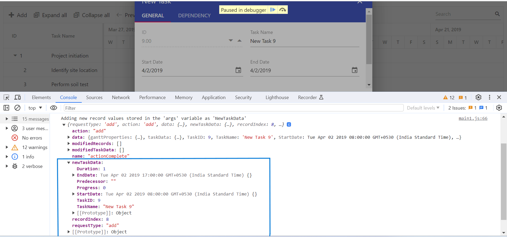
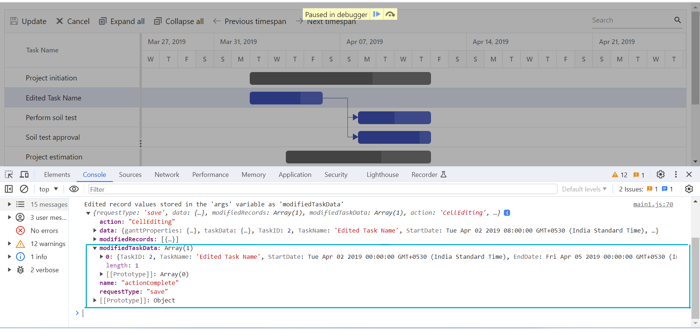
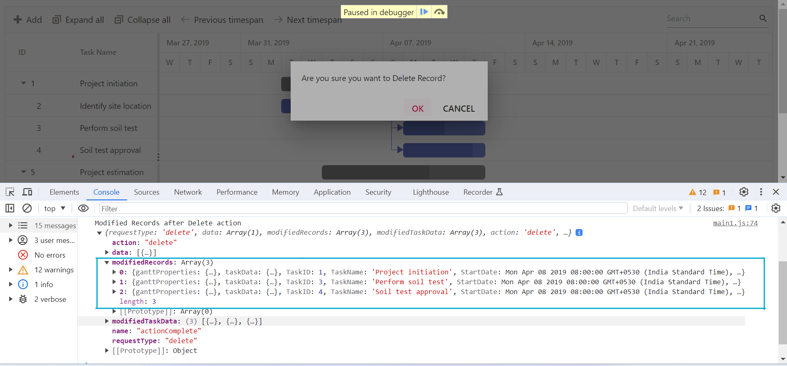

# Editing tasks in ##Platform_Name## Gantt control

The editing feature can be enabled in the Gantt control by enabling the [`editSettings.allowEditing`](../../api/gantt/editSettings/#allowediting) and [`editSettings.allowTaskbarEditing`](../../api/gantt/editSettings/#allowtaskbarediting) properties.

The following editing options are available to update the tasks in the Gantt chart:
* Cell
* Dialog
* Taskbar
* Dependency links

## Cell editing

By setting the edit mode to auto using the [`editSettings.mode`](../../api/gantt/editSettings/#mode) property, the tasks can be edited through TreeGrid cells by double-clicking.

`Note:` If the [`Edit`](../../api/gantt/#editmodule) module is not injected, you cannot edit the tasks through TreeGrid cells.

The following code example shows you how to enable the cell editing in Gantt control.



 







        
















`Note:` When the edit mode is set to `Auto`, on performing double-click action on TreeGrid side, the cells will be changed to editable mode and on performing double-click action on chart side, the edit dialog will appear for editing the task details.

## Dialog editing

Modify the task details through the edit dialog by setting the edit [`mode`](../../api/gantt/editSettings/#mode) to `Dialog`.



 







        
















`Note:` In dialog editing mode, the edit dialog appears when performing double-click action on both TreeGrid or Gantt chart sides.

## Sections or tabs in dialog

In the Gantt dialog, you can define the required tabs or editing sections using the [`addDialogFields`](../../api/gantt/#adddialogfields) and [`editDialogFields`](../../api/gantt/#editdialogfields) properties. Every tab is defined using the [`type`](../../api/gantt/dialogFieldType/) property.



 







        
















## Limiting data fields in general tab

In the Gantt dialog, you can make only specific data source fields visible for editing by using the [`addDialogFields`](../../api/gantt/#adddialogfields) and [`editDialogFields`](../../api/gantt/#editdialogfields) properties. The data fields are defined with [`type`](../../api/gantt/addDialogFieldSettings/#type) and [`fields`](../../api/gantt/addDialogFieldSettings/#fields) properties.

`Note:` You can also define the custom fields in the add/edit dialog General tab using the [`fields`](../../api/gantt/addDialogFieldSettings/#fields) property.



 







        
















## Capture the modified records in gantt component

In the EJ2 Gantt chart, modified records can be conveniently retrieved after adding, editing, or deleting data by utilizing the [`actionComplete`] (../../api/gantt/actionCompleteArgs/) event.

The following code example serves as a practical illustration of how to effectively capture the modified records within the Gantt control.











        
















The following screenshots represent sample add, edit, and delete record actions using the gantt `args`.

The data of the newly added record can be obtained from actionComplete event by requestType of [`args.requestType`] (../../api/gantt/iActionBeginEventArgs/#requesttype) to the action `add` and the following screenshot shows that the added record's data is available in [`args.newTaskData`] (../../api/gantt/actionCompleteArgs/#newtaskdata) property.

The data of the edited record can be obtained from actionComplete event by requestType of [`args.requestType`] (../../api/gantt/iActionBeginEventArgs/#requesttype) to the action `save` and the following screenshot shows that the edited record's data is available in [`args.modifiedTaskData`] (../../api/gantt/iActionBeginEventArgs/#modifiedtaskdata) property.

The data of the deleted record can be obtained from actionComplete event by requestType of [`args.requestType`] (../../api/gantt/iActionBeginEventArgs/#requesttype) to the action `delete` and the following screenshot shows that the deleted record's data is available in [`args.modifiedRecords`] (../../api/gantt/iActionBeginEventArgs/#modifiedrecords) property.

