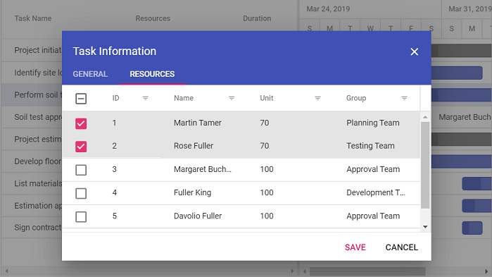

# Resources in ##Platform_Name## Gantt Chart Control

Resources in the  ##Platform_Name## Gantt Chart control represent people, equipment, or materials allocated to tasks, visualized in taskbars and labels for clear utilization tracking. Assigned via the [resources](../api/gantt#resources) property, resources map to tasks using [resourceFields](../api/gantt#resourcefields) for ID, name, unit, and group. This enables display of resource names in columns or labels with [labelSettings](../api/gantt/labelSettings), highlighting workloads and overallocation. The [queryTaskbarInfo](../gantt/events#querytaskbarinfo) event customizes taskbar styles based on resources, such as color-coding. Resources include ARIA labels for accessibility, ensuring screen reader compatibility, and adapt to responsive designs, though narrow screens may truncate names for multiple assignments. By default, resources allocate 100% unit if unspecified.

## Configure resource collection

The resource collection defines available resources as JSON objects with ID, name, unit, and group, mapped via [resourceFields](../api/gantt#resourcefields):

- **id**: Maps to a unique identifier for task assignment.
- **name**: Maps to the resource name displayed in labels or columns.
- **unit**: Maps to the work capacity percentage (0-100%) per day.
- **group**: Maps to categories for grouping resources.

The following code demonstrates resource collection setup:



```ts
var projectResources: Object[] = [
    { resourceId: 1, resourceName: 'Martin Tamer', resourceGroup: 'Planning Team', resourceUnit: 50 },
    { resourceId: 2, resourceName: 'Rose Fuller', resourceGroup: 'Testing Team', resourceUnit: 70 },
    { resourceId: 3, resourceName: 'Margaret Buchanan', resourceGroup: 'Approval Team' },
    { resourceId: 4, resourceName: 'Fuller King', resourceGroup: 'Development Team' },
    { resourceId: 5, resourceName: 'Davolio Fuller', resourceGroup: 'Approval Team' },
    { resourceId: 6, resourceName: 'Van Jack', resourceGroup: 'Development Team', resourceUnit: 40 }
];

var resourceFields: ResourceFieldsModel = {
    id: 'resourceId',
    name: 'resourceName',
    unit: 'resourceUnit',
    group: 'resourceGroup'
};
```



```js
var projectResources = [
    { resourceId: 1, resourceName: 'Martin Tamer', resourceGroup: 'Planning Team', resourceUnit: 50 },
    { resourceId: 2, resourceName: 'Rose Fuller', resourceGroup: 'Testing Team', resourceUnit: 70 },
    { resourceId: 3, resourceName: 'Margaret Buchanan', resourceGroup: 'Approval Team' },
    { resourceId: 4, resourceName: 'Fuller King', resourceGroup: 'Development Team' },
    { resourceId: 5, resourceName: 'Davolio Fuller', resourceGroup: 'Approval Team' },
    { resourceId: 6, resourceName: 'Van Jack', resourceGroup: 'Development Team', resourceUnit: 40 }
];

var resourceFields = {
  id: "resourceId",
  name: "resourceName",
  unit: "resourceUnit",
  group: "resourceGroup",
};
```



This configuration maps resources for assignment and display.

## Assign resources to tasks

Resources are assigned to tasks using resource IDs in the data source, mapped via [taskFields.resourceInfo](../api/gantt/taskFields#resourceinfo). Assignments can be added or edited dynamically via cell or dialog editing, triggered by double-clicking.

**Single resource assignment:**

Assign a single resource without unit for default 100% allocation.

```typescript
{
    TaskID: 2,
    TaskName: 'Identify site location',
    StartDate: new Date('04/02/2019'),
    Duration: 0,
    Progress: 50,
    resources: [1]
}
```

**Multiple resources with custom units:**

Assign multiple resources with specific units.

```typescript
{
    TaskID: 2,
    TaskName: 'Identify site location',
    StartDate: new Date('03/29/2019'),
    Duration: 2,
    Progress: 30,
    resources: [{ resourceId: 1, unit: 70 }, 6]
}
```

Units from the resource collection apply unless overridden at the task level.

The following example shows resource assignment:




























## Manage resource assignments

Add or remove resources via cell or dialog editing. Cell editing modifies assignments by double-clicking the resource cell, while dialog editing uses the resource tab in the edit dialog.


_Alt text: Resource cell editing in the Gantt grid for assignment modifications._


_Alt text: Resource dialog editing tab for multiple allocations and units._

## Customize resource styling

Customize resource display using column templates for the resource column and the [queryTaskbarInfo](../gantt/events#querytaskbarinfo) event for taskbar styling based on assigned resources.

The following example demonstrates custom resource styling:




























This configuration applies background colors to resource columns and taskbars, with the `queryTaskbarInfo` event modifying taskbar properties dynamically.

## Restrict resource selection to a single resource in the edit dialog

By default, the **Resources tab** in the Gantt edit dialog allows users to select multiple resources for a task. You can restrict resource assignment to a single resource by customizing the resource grid displayed in the edit dialog.

To achieve this requirement:

- Remove the checkbox column from the **Resources tab** using the [actionBegin](../gantt/events#actionbegin) event with the `requestType` of  `beforeOpenEditDialog`.
- Configure the resource grid selection behavior using the [actionComplete](../gantt/events#actioncomplete) event with `requestType` of `openEditDialog` by,
    - Setting `checkboxOnly` to `false` to allow row selection without requiring a checkbox click.
    - Setting the resource grid selection type to `Single` to allow only one resource selection at a time.
    - Disabling persistent selection by setting `persistSelection` to `false`.

The following example demonstrates how to restrict resource selection to a single resource in the **Resources tab** of the edit dialog. Additionally, a custom condition is applied to disable resource selection in the **Resources tab** when editing **Task 3**.




























With this configuration, users can assign only a single resource to a task through the **Resources tab** of the Gantt edit dialog.

## See also

- [How to configure resource view?](../gantt/resource-view)
- [How to manage task dependencies?](../gantt/task-dependency)
- [How to customize taskbars?](../gantt/taskbar)
