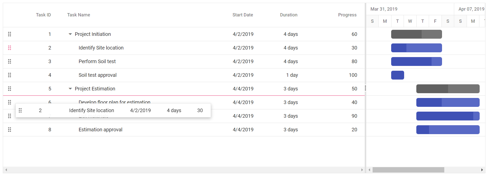
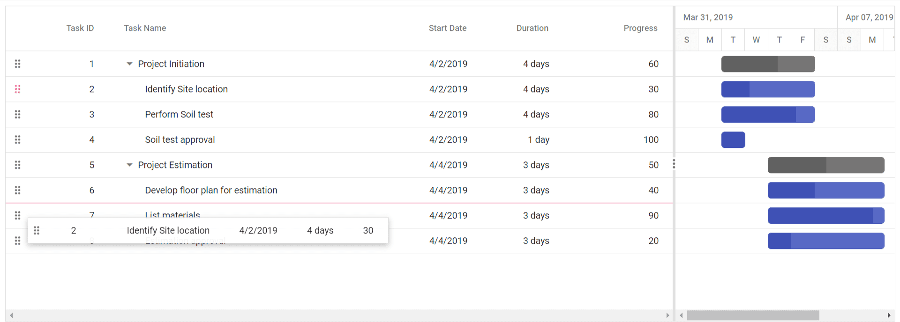
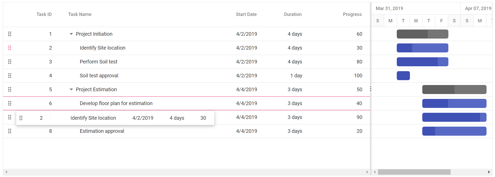

# Row Drag and Drop in ##Platform_Name## Gantt Chart Control

The Syncfusion&reg; ##Platform_Name## Gantt Chart control includes built-in support for row drag and drop, enabling rows to be rearranged within the Gantt Chart or dropped into custom components. 

To enable this feature, inject the `RowDD` module in Gantt. Once injected, enable the functionality by setting the [allowRowDragAndDrop](../api/gantt#allowrowdraganddrop) property.

## Drag and drop within the Gantt Chart

The Gantt component allows you to rearrange rows using a drag icon. To enable this feature, set the [allowRowDragAndDrop](../api/gantt#allowrowdraganddrop) property to **true**.











        
















## Different drop positions

In a Gantt chart, drag and drop functionality allows rearranging rows to adjust their position. You can drop rows in the following positions:

1. Above
2. Below
3. Child

**Above**

If the border line appears at the top of the target row (e.g., Task ID: 6) while dropping, the row will be placed `above` the target row as a sibling.

**Below**

If the border line appears at the bottom of the target row (e.g., Task ID: 6) while dropping, the row will be placed `below` the target row as a sibling.

**Child**

If the border line appears at both the top and bottom of the target row (e.g., Task ID: 6) while dropping, the row will be added as a `child` to the target row.

## Drag and drop to custom component 

You can drag rows from the Gantt component into custom components for seamless data transfer. To enable this feature, set the [allowRowDragAndDrop](../api/gantt#allowrowdraganddrop) property to **true**, and configure the `targetID` property within the `rowDropSettings` object of the `treeGrid` in the Gantt instance, inside the [load](../api/gantt#load) event. The value of `targetID` must match the ID of the destination component. You can use the [rowDrop](../api/gantt#rowdrop) event to handle the drop and perform necessary actions.











        
















## Drag and drop multiple rows together

You can drag and drop multiple rows simultaneously in the Gantt component. To enable this functionality, set the [selectionSettings.type](../api/gantt/selectionSettings#type) property to **Multiple** , and set the [allowRowDragAndDrop](../api/gantt#allowrowdraganddrop) property is set to **true**.











        
















## Taskbar drag and drop between rows

You can rearrange rows in the Gantt component by dragging the taskbar element. This functionality is enabled by setting the [allowTaskbarDragAndDrop](../api/gantt#allowtaskbardraganddrop) property to **true**, allowing taskbars to be repositioned across rows for improved scheduling control.











        
















## Perform row drag and drop action programmatically

To rearrange rows programmatically in the Gantt component, use the [reorderRows](../api/gantt#reorderrows) method. This method accepts the following parameters: 

- **fromIndexes**: Indexes of the rows to be moved.  
- **toIndex**: Target index for placement.  
- **position**: Placement relative to the target (e.g., above or below).

In the example, a [click](..api/button#click) event on an external button moves the row at index 1 **below** the row at index 2.











        
















## Customize the drag and drop action

Customize the drag and drop behavior in the Gantt component using the [rowDragStartHelper](../api/gantt#rowdragstarthelper), [rowDragStart](../api/gantt#rowdragstart), [rowDrag](../api/gantt#rowdrag), and [rowDrop](../api/gantt#rowdrop) events. These events provide control over the drag lifecycle, allowing precise handling of row interactions.

In this example, drag and drop actions are customized using event hooks. The `rowDragStartHelper` event prevents dragging for the row where **TaskID** is 2, while the `rowDrop` event cancels the drop action for the row where **TaskID** is 4. Additionally, `rowDragStart` and `rowDrag` apply background styling based on the values in the **Progress** column.











        
















### Prevent reordering a row as child to another row

To prevent rows from being reordered as children, set `args.cancel` to **true** in the [rowDrop](../api/gantt#rowdrop) event. After canceling the default drop action, use the [reorderRows](../api/gantt#reorderrows) method to reposition the row at a specific index. 
 
In the example, the drop action in **Child** position is blocked, and the dragged row is reordered **above** the target row.











        














