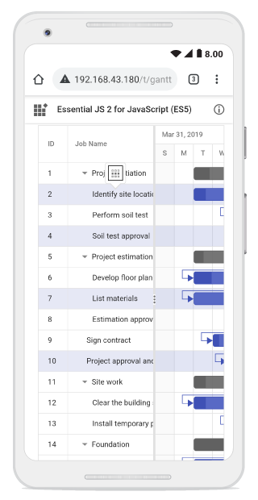

# Selection in ##Platform_Name## Gantt Chart Control

The Selection feature provides the ability to highlight a row or cell in the Gantt Chart control. Selection can be performed using arrow keys or mouse clicks.

To disable selection, set the [allowSelection](../../api/gantt#allowselection) property to **false**.

To enable selection functionality, inject the [Selection](../../api/gantt#selectionmodule) module in the `providers` section of your  ##Platform_Name## application.

The Gantt Chart control supports two types of selection that can be set by using the [selectionSettings.type](../../api/gantt/selectionSettings#type) property. They are:

* **Single:** Allows selection of only one row or cell at a time. This is the default behavior.
* **Multiple:** Enables selection of multiple rows or cells. To perform multi-selection, press and hold the **Ctrl** key (on Windows/Linux) or **Cmd** key (on macOS) while clicking the desired rows or cells.

## Selection mode

The Gantt Chart control supports three types of selection modes, which can be set using the [selectionSettings.mode](../../api/gantt/selectionSettings#mode) property: 

* **Row:** Allows selection of rows only. This is the default mode.
* **Cell:** Allows selection of cells only.
* **Both:** Allows selection of both rows and cells at the same time.











        
















## Toggle selection

Toggle selection allows you to select or deselect a specific row or cell with repeated clicks. To enable this feature, set the [enableToggle](../../api/gantt/selectionSettings#enabletoggle) property of `selectionSettings` to **true**.

When enabled, clicking a selected row or cell will deselect it, and clicking it again will reselect it. By default, the `enableToggle` property is set to **false**.











        
















## Persist selection

Persist Selection retains selected tasks even after performing actions such as sorting, filtering, or refreshing the data. To enable this, set `selectionSettings.persistSelection` to **true**.  

> Cell selection is not supported by the persistence feature.











        
















## Hover highlighting

The hover highlighting feature in the Syncfusion&reg;  ##Platform_Name## Gantt Chart enhances usability by visually highlighting **tree grid rows**, **chart task bars**, **header cells**, and **timeline cells** on hover. This makes it easier to follow tasks in complex project timelines.

To enable this feature, set the `enableHover` property to **true** in the control. By default, this property is set to **false**.

The following code example shows how to enable the hover highlighting in Gantt.











        
















## Clear selection

To clear selected rows and cells in the Gantt Chart control, use the [clearSelection](../../api/gantt#clearselection) method.











        
















## Touch interaction

The touch interaction feature in the Gantt control allows you to easily interact with the Gantt chart on touch screen devices. This feature is particularly useful for enhancing usability on mobile devices and tablets, making it easier to navigate and interact with the Gantt chart's content using touch gestures.

[Single Row Selection](selection#selection-mode) : When you tap on a row using a touch screen, the tapped row is automatically selected. This offers a straightforward way to select single rows with a touch interface.

[Multiple Row Selection](selection#multiple-row-selection) : To select multiple rows, you can utilize the multi-row selection feature. When you tap on a row, a popup is displayed, indicating the option for multi-row selection. Tap on the popup, and then proceed to tap on the desired rows you want to select. This allows you to select and interact with multiple rows simultaneously, as shown in the following image:

