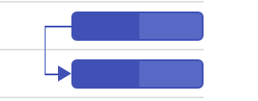
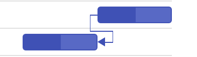
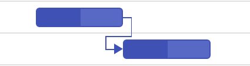
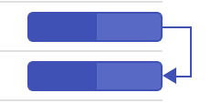

# Task dependency in ##Platform_Name## Gantt control

Task dependency or task relationship can be established between two tasks in Gantt. This dependency affects the project schedule. If you change the predecessor of a task, it will affect the successor task, which will affect the next task, and so on. Relationship can be established between parent-parent tasks, child-child tasks, parent-child and child-parent task.

In Gantt, you can enable or disable the parent predecessor using [`allowParentDependency`](../api/gantt/#allowparentdependency) property.

By default, the `allowParentDependency` property will be `true`.

## Task relationship types

Task relationships are categorized into four types based on the start and finish dates of the task.

### Start to Start (SS)

You cannot start a task until the dependent task also starts.

### Start to Finish (SF)

You cannot finish a task until the dependent task is started.

### Finish to Start (FS)

You cannot start a task until the dependent task is completed.

### Finish to Finish (FF)

You cannot finish a task until the dependent task is completed.

## Define task relationship

Task relationship is defined in the data source as a string value, and this value is mapped to the Gantt control by using the [`taskFields.dependency`](../api/gantt/taskFields/#dependency) property. The following code example demonstrates how to enable the predecessor in the Gantt control.



 







        
















## Predecessor offset with duration units

In the Gantt control, the predecessor offset can be defined with the following duration units:

* Day
* Hour
* Minute

You can define an offset with various offset duration units for predecessors by using the following code example.



 







        
















## Disabling automatic dependency offset updates

By default, the dependency offsets are automatically updated in the Gantt chart whenever a task's start or end date is changed. However, if you want to disable this feature, you can do so by disabling the [`updateOffsetOnTaskbarEdit`](../api/gantt/#updateOffsetOnTaskbarEdit) property. Once this property is disabled, you can only update the offset value by editing the predecessor column cell or the offset column in the dependency tab of the edit dialog.



 







        
















## Validate predecessor links on editing

In Gantt, task relationship link can be broken by editing the start date, end date and duration value of task. When the task relationship broken on any edit action. This can be handled in Gantt in two ways.
* Using actionBegin event
* Using predecessor validation dialog

### Using actionBegin event

When the task relationship link is broken on any edit action, then the [`actionBegin`](../api/gantt/#actionbegin) event will be triggered with `requestType` argument as `validateLinkedTask`. You can validate the editing action within the actionBegin event using the `validateMode` event argument. The `validateMode` event argument has the following properties:

Argument |Default value |Description
-----|-----|-----
args.validateMode.respectLink | false | In this validation mode, the predecessor links get high priority. With this mode enabled, when the successor task is moved before the predecessor task’s end date, the editing will be reverted, and dates will be validated based on the dependency links.
args.validateMode.removeLink | false | In this validation mode, the taskbar editing gets high priority. For inappropriate task dates, the dependency links will be removed and tasks will be moved to the edited date.
args.validateMode.preserveLinkWithEditing | true | In this validation mode, the taskbar editing will be considered along with the dependency links. This relationship will be maintained by updating the offset value of predecessors.

By default, the `preserveLinkWithEditing` validation mode will be enabled, so the predecessors are updated with offset values.

The following sample explains enabling the `respectLink` validation mode while editing the linked tasks in the [`actionBegin`](../api/gantt/#actionbegin) event.



 







        
















### Using validation dialog

When disabling all the validation modes in the [`actionBegin`](../api/gantt/#actionbegin) event, a validation pop-up will be displayed prompting users to select the validation mode to validate taskbar editing.

This validation pop-up will display different options based on the successor task’s start date after editing.

If you move the successor task that starts after the predecessor task’s end date, then a dialog will be rendered with the following options:

* Cancel, Keep the existing link.
* Remove the link and move the task to start on edited date.
* Move the task to start on edited date and keep the link.

If you move the successor task that starts before the predecessor task’s end date, then a dialog will be rendered with the following options:

* Cancel, Keep the existing link.
* Remove the link and move the task to start on edited date.

The following code example shows how to enable the predecessor validation dialog in Gantt.



 







        
















## Dynamically show/hide the dependency line

By default, mapping the dependency field in taskFields displays dependency lines in the Gantt chart. To hide the dependency line upon button click, set `visibility` style to hidden for the CSS class name `.e-gantt-dependency-view-container`.


























