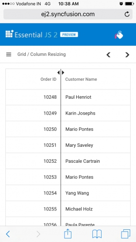

# Column resizing in ##Platform_Name## Grid control

Grid control provides an intuitive user interface for resizing columns to fit their content. This feature allows users to easily adjust the width of the columns to improve readability and aesthetics of the data presented. To enable column resizing, set the [allowResizing](../../api/grid/#allowresizing) property of the grid to **true**.

Once column resizing is enabled, columns width can be resized by clicking and dragging at the right edge of the column header. While dragging the column, the width of the respective column will be resized immediately.

To use the column resize, inject **Resize** module in the grid.



 







        
















>* You can disable Resizing for a particular column, by specifying [columns->allowResizing](../../api/grid/columnDirective/#allowresizing) to **false**.
>* In RTL mode, you can click and drag the left edge of header cell to resize the column.
>* The `width` property of the column can be set initially to define the default width of the column. However, when column resizing is enabled, you can override the default width by manually resizing the columns.

## Restrict the resizing based on minimum and maximum width

The Grid control allows you to restrict the column width resizing between a minimum and maximum width. This can be useful when you want to ensure that your grid's columns stay within a certain range of sizes.

To enable this feature, you can define the [columns->minWidth](../../api/grid/columnDirective/#minwidth) and [columns->maxWidth](../../api/grid/columnDirective/#maxwidth) properties of the columns directive for the respective column.

In the below code, **OrderID**, **Ship Name** and **Ship Country** columns are defined with minimum and maximum width. The **OrderID** column is set to have a minimum width of 100 pixels and a maximum width of 200 pixels. Similarly, the **ShipName** column is set to have a minimum width of 150 pixels and a maximum width of 300 pixels. The **ShipCountry** column is set to have a minimum width of 120 pixels and a maximum width of 280 pixels.



 







        
















>* The [columns->minWidth](../../api/grid/columnDirective/#minwidth) and [columns->maxWidth](../../api/grid/columnDirective/#maxwidth) properties will be considered only when the user resizes the column. When resizing the window, these properties will not be considered. This is because columns cannot be re-rendered when resizing the window.
>* When setting the `minWidth` and `maxWidth` properties, ensure that the values are appropriate for your data and layout requirements.
>* The specified `minWidth` and `maxWidth` values take precedence over any user-initiated resizing attempts that fall outside the defined range.

## Prevent resizing for particular column

The Grid control provides the ability to prevent resizing for a particular column. This can be useful if you want to maintain a consistent column width or prevent users from changing the width of a column.

You can disable resizing for a particular column by setting the [allowResizing](../../api/grid/columnDirective/#allowresizing) property of the column to **false**. The following example demonstrates, how to disable resizing for the **Customer ID** column.



 







        
















> You can also prevent resizing by setting `args.cancel` to **true** in the [resizeStart](../../api/grid/#resizestart) event.

## Resize stacked header column

Grid control allows to resize stacked columns by clicking and dragging the right edge of the stacked column header. During the resizing action, the width of the child columns is resized at the same time. You can disable resize for any particular stacked column by setting [allowResizing](../../api/grid/columnDirective/#allowresizing) as **false** to its columns.

In this below code, we have disabled resize for **Ship City** column.



 







        
















## Resizing modes

The Syncfusion Grid control provides a [ResizeSettingsModel](../../api/grid/resizeSettingsModel/#resizesettingsmodel) interface for configuring the resizing behavior of grid columns. The interface includes a property named [mode](../../api/grid/resizeSettings/#mode) which is of the type [ResizeMode](../../api/grid/resizeMode). The `ResizeMode` is an enum that determines the available resizing modes for the grid columns. There are two resizing modes available for grid columns in Grid:

1. `Normal Mode`: This mode does not adjust the columns to fit the remaining space. When the sum of column width is less than the grid's width, empty space will be present to the right of the last column. When the sum of column width is greater than the grid's width, columns will overflow, and a horizontal scrollbar will appear.

2. `Auto Mode`: This mode automatically resizes the columns to fill the remaining space. When the sum of column width is less than the grid's width, the columns will be automatically expanded to fill the empty space. Conversely, when the sum of column width is greater than the grid's width, the columns will be automatically contracted to fit within the available space.

The following example demonstrates how to set the [resizeSettings->mode](/../../api/grid/resizeSettings/#mode) property to **Normal** and **Auto** on changing the dropdown value using the [change](../../api/drop-down-list/#change) event of the DropDownList control.



 







        
















> When the [autoFit](../../api/grid/#autofit) property is set to **true**, the Grid will automatically adjust its column width based on the content inside them. In `normal` resize mode, if the `autoFit` property is set to **true**, the Grid will maintain any empty space that is left over after resizing the columns. However, in `auto` resize mode, the Grid will ignore any empty space.

## Touch interaction

Grid control provides support for touch interactions to enable users to interact with the grid using their mobile devices. Users can resize columns in the grid by tapping and dragging the floating handler, and can also use the Column menu to autofit columns.

**Resizing Columns on Touch Devices**

To resize columns on a touch device:

1.Tap on the right edge of the header cell of the column that you want to resize.

2.A floating handler will appear over the right border of the column.

3.Tap and drag the floating handler to resize the column to the desired width.

The following screenshot represents the column resizing on the touch device.

## Resizing column externally

Grid provides the ability to resize columns using an external button click. This can be achieved by changing the [width](../../api/grid/columnDirective/#width) property of the column and refreshing the grid using the [refreshColumns](../../api/grid#refreshcolumns) method in the external button click function.

The following example demonstrates how to resize the columns in a grid. This is done by using the [change](../../api/drop-down-list/#change) event of the DropDownList control by changing the [width](../../api/grid/columnDirective/#width) property of the selected column. This is accomplished using the  [getColumnByField](../../api/grid/#getcolumnbyfield) on external button click. Then, the [refreshColumns](../..api/grid#refreshcolumns) method is called on the grid control to update the displayed columns based on user interaction.



 







        
















>  The [refreshColumns](../../api/grid#refreshcolumns) method is used to refresh the grid after the column widths are updated. Column resizing externally is useful when you want to provide a custom interface to the user for resizing columns.

## Resizing events

During the resizing action, the grid control triggers the below three events.

1.The [resizeStart](../../api/grid/#resizestart) event triggers when column resize starts. This event can be used to perform actions when the user begins to resize a column. 

2.The [resizing](../../api/grid/#resizing) event triggers when column header element is dragged (moved) continuously. This event is useful when you want to perform certain actions during the column resize process.

3.The [resizeStop](../../api/grid/#resizestop) event triggers when column resize ends. This event can be used to perform actions after the column is resized.

The following is an example of using the resizing events, the [resizeStart](../../api/grid/#resizestart) event is used to cancel the resizing of the **OrderID** column. The [resizeStop](../../api/grid/#resizestop) event is used to apply custom CSS attributes to the resized column.



 







        
















>The ResizeArgs object passed to the events contains information such as the current column width, new column width, column index, and the original event. The [resizing](../../api/grid/#resizing) event is triggered multiple times during a single resize operation, so be careful when performing heavy operations in this event.