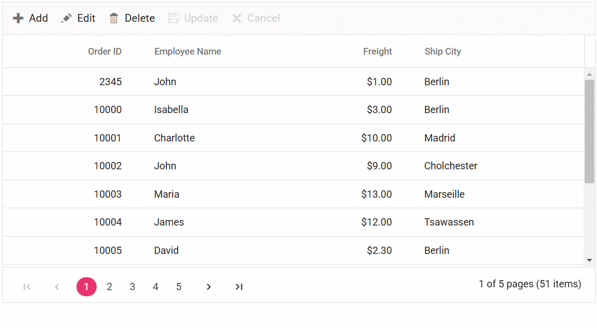

# Foreign key column in ##Platform_Name## Grid control

The Foreign key column in the Syncfusion<sup style="font-size:70%">&reg;</sup> Grid control allows you to display related data from a foreign key data source in a column within the grid. This feature is particularly useful when you have a column in the grid that represents a foreign key relationship with another data source.

To enable and integrate the foreign key column in the ##Platform_Name## Grid control, follow these steps:

 1.Inject the ForeignKeyService in the Grid

 
  
 ```typescript
 import { ForeignKey } from '@syncfusion/ej2-grids';

 Grid.Inject(ForeignKey);
```


  
```js
 ej.grids.Grid.Inject(ej.grids.ForeignKey);
```  
 

2.Define the foreign key column in the grid using the following properties:

* [dataSource](../../api/grid/column/#datasource): Specifies the foreign data source that  contains the related data.

* [foreignKeyField](../../api/grid/column/#foreignkeyfield): Maps the column name in the grid to the field in the foreign data source that represents the foreign key relationship.

* [foreignKeyValue](../../api/grid/column/#foreignkeyvalue): Specifies the field from the foreign data source that should be displayed in the grid as the related data.

```typescript

{field: 'EmployeeID', headerText: 'Employee ID', width: 150, foreignKeyValue: 'FirstName', foreignKeyField: 'EmployeeID', dataSource: employeeData}
                
```

>The `foreignKeyField` property should match the name of the field in the foreign data source that represents the foreign key relationship, and the `foreignKeyValue` property should specify the field from the foreign data source that should be displayed in the grid as the related data.

## Binding local data

The Syncfusion<sup style="font-size:70%">&reg;</sup> Grid control provides a convenient way to bind local data to a foreign key column. This allows you to display related data from a local data source within the grid. Here's an example of how to bind local data to a Foreign Key column in Syncfusion<sup style="font-size:70%">&reg;</sup> Grid:

In this example, **data** is the local data source for the Grid, and **employeeData** is the local data source for the foreign key column. The `field` property of the column is set to **EmployeeID** which represents the foreign key value in the **data**. The `foreignKeyValue` property is set to **FirstName** which represents the field name in the **employeeData** that you want to display in the foreign key column.



 







        
















## Binding remote data

The Foreign key column in Syncfusion<sup style="font-size:70%">&reg;</sup> Grid allows you to bind remote data for a foreign key column. You can assign the service data as an instance of `DataManager` to the `dataSource` property, and provide the endpoint `URL` as the data source URL.

This example demonstrates how to use the foreign key column with remote data binding using the [ODataV4Adaptor](../../grid/data-binding/remote-data#odata-v4-adaptor---binding-odata-v4-service) in the grid:



 







        
















> * For remote data, the sorting and grouping is done based on [column.foreignKeyField](../../api/grid/column/#foreignkeyfield) instead of [column.foreignKeyValue](../../api/grid/column/#foreignkeyvalue).
> * If [column.foreignKeyField](../../api/grid/column/#foreignkeyfield) is not defined, then the column uses [column.field](../../api/grid/column/#field).

## Use edit template in foreignkey column

The Syncfusion<sup style="font-size:70%">&reg;</sup> Grid provides support for using an edit template in a foreign key column. By default, a dropdown control is used for editing foreign key column. However, you can render a different control for editing by using the [column.edit](../../api/grid/column/#edit) property. Here's an example that demonstrates how to use an edit template in a foreign key column:


 
In this example, an [AutoComplete](https://ej2.syncfusion.com/demos/#/bootstrap5/auto-complete/default.html) control is rendered as the edit template for the **"EmployeeID"** foreign key column. The [dataSource](../../api/auto-complete/#datasource) property of the `AutoComplete` control is set to the employees data, and the fields property is configured to display the **"FirstName"** field as the value.


 
In this example, an [AutoComplete](https://ej2.syncfusion.com/javascript/demos/#/bootstrap5/auto-complete/default.html) control is rendered as the edit template for the **"EmployeeID"** foreign key column. The [dataSource](../../api/auto-complete/#datasource) property of the `AutoComplete` control is set to the employees data, and the fields property is configured to display the **"FirstName"** field as the value.  




 







        
















## Customize filter UI in foreignkey column

The Syncfusion<sup style="font-size:70%">&reg;</sup> Grid allows you to customize the filtering user interface (UI) for foreign key columns by using the [column.filter](../../api/grid/column/#filter) property. By default, a dropdown control is used for filtering foreign key columns. However, you can create your own custom filtering UI by specifying a template function for the `column.filter` property. Here's an example that demonstrates how to create a custom filtering UI in a foreign key column:


 
In this example, a [DropDownList](https://ej2.syncfusion.com/demos/#/bootstrap5/drop-down-list/default.html) control is rendered as the filter UI for the **"EmployeeID"** foreign key column. The [dataSource](../../api/drop-down-list#datasource) property of the DropDownList control is set to the employees data, and the fields property is configured to display the **FirstName** field as the [text](../../api/drop-down-list#text) and **EmployeeID** field as the [value](../../api/drop-down-list#value). The `value` property is set to the current filter value of the column.

 
 
In this example, a [DropDownList](https://ej2.syncfusion.com/javascript/demos/#/bootstrap5/drop-down-list/default.html) control is rendered as the filter UI for the **"EmployeeID"** foreign key column. The [dataSource](../../api/drop-down-list#datasource) property of the DropDownList control is set to the employees data, and the fields property is configured to display the **FirstName** field as the [text](../../api/drop-down-list#text) and **EmployeeID** field as the [value](../../api/drop-down-list#value). The `value` property is set to the current filter value of the column.





 







        
















## Use filter bar template in foreignkey column

You can use the filter bar template in a foreign key column in Grid by defining the [column.filterBarTemplate](../../api/grid/column/#filterbartemplate) property. This allows you to customize the filter bar for the foreign key column with a custom control or HTML template. Here's an example that demonstrates how to use a filter bar template in a foreign key column:

In this example, the **"EmployeeID"** column is a foreign key column, and the **filter** function is used as the filter bar template for this column. The `filter` function can be defined in your control code and should return the desired control or HTML template for the filter bar. The column header shows the custom filter bar template and you can select filter value by using the **DropDown** options.



 







        
















## Perform aggregation in foreignkey column

By default, aggregations are not supported in a foreign key column in the Syncfusion<sup style="font-size:70%">&reg;</sup> Grid. However, you can achieve aggregation for a foreign key column by using [customAggregate](../../api/grid/aggregateColumn/#customaggregate).

To perform aggregation in a foreign key column, follow these steps:

1.Define a foreign key column in the Grid.
2.Implement a custom aggregate function to calculate the aggregation for the foreign key column.
3.Set the [customAggregate](../../api/grid/aggregateColumn/#customaggregate) property of the column to the custom aggregate function.

Here's an example that demonstrates how to perform aggregation in a foreign key column:

In the provided example, the `customAggregateFn` function is used to filter the data based on the **FirstName** field of the foreign key column, using the `getForeignData` internal function. The function then counts the occurrences of **Margaret**. The result is displayed in the grid's footer template using the `footerTemplate`.



 







        
















## Render foreign key value in column template

The Syncfusion<sup style="font-size:70%">&reg;</sup> ##Platform_Name## Grid allows for rendering foreign key values within a column template, enhancing the display of related data in a clear format. This feature is particularly useful when you want to show a more meaningful representation of a foreign key instead of its underlying value.

To render foreign key values in a column template, you need to define a [template](../../api/grid/column/#template) for the column using the template property. The `template` property can accept either an HTML element or a function that returns the desired HTML element.

The following example demonstrates how to render foreign key values in a column template within the Grid:











        
















## Enable multiple foreign key columns

The Syncfusion<sup style="font-size:70%">&reg;</sup> Grid control supports the feature of enabling multiple foreign key columns with editing options. This allows users to display columns from foreign data sources in the Grid control.

In the following example, **Customer Name** and **Ship City** are foreign key columns that display the **ContactName** and **City** columns from foreign data.



 







        
















## Edit template in foreign key column using remote data

The Syncfusion<sup style="font-size:70%">&reg;</sup> ##Platform_Name## Grid allows you to customize the edit template for foreign key columns when using remote data. By default, a [DropDownList](../../drop-down-list/getting-started) control is used for editing foreign key column. However, you can render a different control by configuring the [column.edit](../../api/grid/column/#edit) property. 

This example demonstrates how to use an edit template in a foreign key column with remote data. In this case, an [AutoComplete](../../auto-complete/getting-started) control is rendered as the edit template for the **EmployeeID** foreign key column. The [dataSource](../../api/auto-complete/#datasource) property of the **AutoComplete** control is set to the employees data, and the [field](../../api/grid/column/#field) property is configured to display the **FirstName** field as the value. Follow the steps below to achieve this:



**Step 1:** Open Visual Studio and create an project using following [link](https://ej2.syncfusion.com/documentation/grid/connecting-to-adaptors/web-api-adaptor#creating-an-api-service) and named **EditTemplate**.

**Step 2 :** Create a simple Syncfusion<sup style="font-size:70%">&reg;</sup> ##Platform_Name## Grid by following the [Getting Started](../../grid/getting-started.md) documentation link.

**Step 3:**  In your ##Platform_Name## control HTML file (e.g., **index.html**), define the  Grid and include the necessary Syncfusion<sup style="font-size:70%">&reg;</sup> styles:

```html
<!DOCTYPE html>
<html lang="en">
<head>
    <title>EJ2 Grid</title>
    <meta charset="utf-8" />
    <meta name="viewport" content="width=device-width, initial-scale=1.0" />
    <meta name="description" content="Typescript Grid Control" />
    <meta name="author" content="Syncfusion" />
    <link href="https://cdn.syncfusion.com/ej2/{{ site.ej2version }}/ej2-base/styles/bootstrap5.css" rel="stylesheet" />
    <link href="https://cdn.syncfusion.com/ej2/{{ site.ej2version }}/ej2-grids/styles/bootstrap5.css" rel="stylesheet" />
    <link href="https://cdn.syncfusion.com/ej2/{{ site.ej2version }}/ej2-buttons/styles/bootstrap5.css" rel="stylesheet" />
    <link href="https://cdn.syncfusion.com/ej2/{{ site.ej2version }}/ej2-popups/styles/bootstrap5.css" rel="stylesheet" />
    <link href="https://cdn.syncfusion.com/ej2/{{ site.ej2version }}/ej2-richtexteditor/styles/bootstrap5.css" rel="stylesheet" />
    <link href="https://cdn.syncfusion.com/ej2/{{ site.ej2version }}/ej2-navigations/styles/bootstrap5.css" rel="stylesheet" />
    <link href="https://cdn.syncfusion.com/ej2/{{ site.ej2version }}/ej2-dropdowns/styles/bootstrap5.css" rel="stylesheet" />
    <link href="https://cdn.syncfusion.com/ej2/{{ site.ej2version }}/ej2-lists/styles/bootstrap5.css" rel="stylesheet" />
    <link href="https://cdn.syncfusion.com/ej2/{{ site.ej2version }}/ej2-inputs/styles/bootstrap5.css" rel="stylesheet" />
    <link href="https://cdn.syncfusion.com/ej2/{{ site.ej2version }}/ej2-calendars/styles/bootstrap5.css" rel="stylesheet" />
    <link href="https://cdn.syncfusion.com/ej2/{{ site.ej2version }}/ej2-notifications/styles/bootstrap5.css" rel="stylesheet" />
    <link href="https://cdn.syncfusion.com/ej2/{{ site.ej2version }}/ej2-splitbuttons/styles/bootstrap5.css" rel="stylesheet" />
    <script src="https://cdnjs.cloudflare.com/ajax/libs/systemjs/0.19.38/system.js"></script>
    <script src="https://cdn.syncfusion.com/ej2/syncfusion-helper.js" type="text/javascript"></script>
</head>
<body>
    <div id='container'>
        <div id='Grid'></div>
    </div>
</body>
</html>
```
**Step 4:** In your ##Platform_Name## control (e.g., **index.ts**), define the Syncfusion<sup style="font-size:70%">&reg;</sup> React Grid with the necessary configurations, including a foreign key column for **EmployeeID**:

```ts
import { Grid, Toolbar, Edit, Page, ForeignKey, ActionEventArgs, EditMode } from '@syncfusion/ej2-grids';
import { DataManager, UrlAdaptor } from '@syncfusion/ej2-data';
import { AutoComplete, ChangeEventArgs, FieldSettingsModel } from '@syncfusion/ej2-dropdowns';
import { createElement } from '@syncfusion/ej2-base';

Grid.Inject(Toolbar, Edit, Page, ForeignKey);

let data: DataManager = new DataManager({
    url: 'https://localhost:****/api/Grid', // Replace your hosted link.
    insertUrl: 'https://localhost:****/api/Grid/Insert',
    updateUrl: 'https://localhost:****/api/Grid/Update',
    removeUrl: 'https://localhost:****/api/Grid/Remove',
    adaptor: new UrlAdaptor(),
     crossDomain: true
});
let employeeData: DataManager = new DataManager({
    url: 'https://localhost:****/api/Grid/employees', 
    adaptor: new UrlAdaptor(),
    crossDomain: true,
});

let editSettings = { allowEditing: true, allowAdding: true, allowDeleting: true, mode: 'Normal' as EditMode };
let toolbar: string[] = ['Add', 'Edit', 'Delete', 'Update', 'Cancel'];
let orderIDRules = { required: true };
let autoComplete: AutoComplete;
let editTemplate = {
    create: (args: any): HTMLInputElement => {
        return createElement('input') as HTMLInputElement;
    },
    destroy: (args: any): void => {
        if (autoComplete) autoComplete.destroy();
    },
    read: (args: any): any => {
        return autoComplete?.value;
    },
    write: (args: any): void => {
        let selectedValue: string = args.rowData ? args.rowData.EmployeeID : '';

        autoComplete = new AutoComplete({
            dataSource: employeeData,
            fields: { value: 'EmployeeID', text: 'FirstName' } as FieldSettingsModel,
            value: selectedValue,
            change: (e: ChangeEventArgs) => {
                if (e.itemData) {
                    args.rowData.EmployeeID = ((e.itemData) as any).EmployeeID;
                }
            }
        });
        autoComplete.appendTo(args.element);
    }
};

let grid: Grid = new Grid({
    dataSource: data,
    editSettings: editSettings,
    toolbar: toolbar,
    height: 250,
    columns: [
        { field: 'OrderID', headerText: 'Order ID', isPrimaryKey: true, width: 100, textAlign: 'Right', validationRules: orderIDRules },
        { field: 'EmployeeID', headerText: 'Employee Name', foreignKeyValue: 'FirstName', foreignKeyField: 'EmployeeID', dataSource: employeeData, edit: editTemplate, width: 120 },
        { field: 'Freight', headerText: 'Freight', format: 'C2', editType: 'numericedit', width: 100 },
        { field: 'ShipCity', headerText: 'Ship City', width: 150 }
    ],
    allowPaging: true
});

grid.appendTo('#Grid');
```



**Step 1:** Open Visual Studio and create an project using following [link](https://ej2.syncfusion.com/javascript/documentation/grid/connecting-to-adaptors/web-api-adaptor#creating-an-api-service) and named **EditTemplate**.

**Step 2 :** Create a simple Syncfusion<sup style="font-size:70%">&reg;</sup> ##Platform_Name## Grid by following the [Getting Started](../../grid/getting-started.md) documentation link.

**Step 3:**  In your ##Platform_Name## control HTML file (e.g., **index.html**), define the  Grid and include the necessary Syncfusion<sup style="font-size:70%">&reg;</sup> styles:

```html
<!DOCTYPE html>
<html lang="en">
<head>
    <title>EJ2 Grid</title>
    <meta charset="utf-8">
    <meta name="viewport" content="width=device-width, initial-scale=1.0">
    <meta name="description" content="Javascript Grid Control">
    <meta name="author" content="Syncfusion">
    <link href="css/index.css" rel="stylesheet">
    <link href="https://cdn.syncfusion.com/ej2/{{ site.ej2version }}/ej2-base/styles/bootstrap5.css" rel="stylesheet">
    <link href="https://cdn.syncfusion.com/ej2/{{ site.ej2version }}/ej2-grids/styles/bootstrap5.css" rel="stylesheet">
    <link href="https://cdn.syncfusion.com/ej2/{{ site.ej2version }}/ej2-buttons/styles/bootstrap5.css" rel="stylesheet">
    <link href="https://cdn.syncfusion.com/ej2/{{ site.ej2version }}/ej2-popups/styles/bootstrap5.css" rel="stylesheet">
    <link href="https://cdn.syncfusion.com/ej2/{{ site.ej2version }}/ej2-richtexteditor/styles/bootstrap5.css" rel="stylesheet">
    <link href="https://cdn.syncfusion.com/ej2/{{ site.ej2version }}/ej2-navigations/styles/bootstrap5.css" rel="stylesheet">
    <link href="https://cdn.syncfusion.com/ej2/{{ site.ej2version }}/ej2-dropdowns/styles/bootstrap5.css" rel="stylesheet">
    <link href="https://cdn.syncfusion.com/ej2/{{ site.ej2version }}/ej2-lists/styles/bootstrap5.css" rel="stylesheet">
    <link href="https://cdn.syncfusion.com/ej2/{{ site.ej2version }}/ej2-inputs/styles/bootstrap5.css" rel="stylesheet">
    <link href="https://cdn.syncfusion.com/ej2/{{ site.ej2version }}/ej2-calendars/styles/bootstrap5.css" rel="stylesheet">
    <link href="https://cdn.syncfusion.com/ej2/{{ site.ej2version }}/ej2-notifications/styles/bootstrap5.css" rel="stylesheet">
    <link href="https://cdn.syncfusion.com/ej2/{{ site.ej2version }}/ej2-splitbuttons/styles/bootstrap5.css" rel="stylesheet">
    <script src="https://cdn.syncfusion.com/ej2/{{ site.ej2version }}/dist/ej2.min.js" type="text/javascript"></script>
    <script src="https://cdn.syncfusion.com/ej2/syncfusion-helper.js" type="text/javascript"></script>
</head>
<body>
    <div id="container">
        <div id="Grid"></div>
    </div>
    <script src="js/index.js" type="text/javascript"></script>
</body>
</html>
```
**Step 4:** In your ##Platform_Name## control (e.g., **index.js**), define the Syncfusion<sup style="font-size:70%">&reg;</sup> React Grid with the necessary configurations, including a foreign key column for **EmployeeID**:

```js
ej.grids.Grid.Inject(ej.grids.Toolbar, ej.grids.Edit, ej.grids.Page, ej.grids.ForeignKey);

var dataManager = new ej.data.DataManager({
    url: 'https://localhost:****/api/Grid', // Replace your hosted link.
    insertUrl: 'https://localhost:****/api/Grid/Insert',
    updateUrl: 'https://localhost:****/api/Grid/Update',
    removeUrl: 'https://localhost:****/api/Grid/Remove',
    adaptor: new ej.data.UrlAdaptor(),
    crossDomain: true,
});

var employeeData = new ej.data.DataManager({
    url: 'https://localhost:****/api/Grid/employees',
    adaptor: new ej.data.UrlAdaptor(),
    crossDomain: true,
});

var editSettings = { allowEditing: true, allowAdding: true, allowDeleting: true, mode: 'Normal' };
var toolbar = ['Add', 'Edit', 'Delete', 'Update', 'Cancel'];
var orderIDRules = { required: true };
var autoComplete;
var grid = new ej.grids.Grid({
    dataSource: dataManager,
    editSettings: editSettings,
    toolbar: toolbar,
    height: 250,
    columns: [
        { field: 'OrderID', headerText: 'Order ID', isPrimaryKey: true, width: 100, textAlign: 'Right', validationRules: orderIDRules },
        { field: 'EmployeeID', headerText: 'Employee Name', foreignKeyValue: 'FirstName', foreignKeyField: 'EmployeeID', dataSource: employeeData, edit: {
                create: function (args) {
                    return ej.base.createElement('input', { className: 'e-input' });
                },
                destroy: function (args) {
                    if (autoComplete) autoComplete.destroy();
                },
                read: function (args) {
                    return autoComplete.value;
                },
                write: function (args) {
                    let selectedValue = args.rowData ? args.rowData.EmployeeID : ''; 
                    autoComplete = new ej.dropdowns.AutoComplete({
                        dataSource: employeeData,
                        fields: { value: 'EmployeeID', text: 'FirstName' },
                        value: selectedValue,
                        change: function (e) {
                            args.rowData.EmployeeID = e.value; 
                        }
                    });
                    autoComplete.appendTo(args.element);
                },
            }, width: 120
        },
        { field: 'Freight', headerText: 'Freight', format: 'C2', editType: 'numericedit', width: 100 },
        { field: 'ShipCity', headerText: 'Ship City', width: 150 }
    ],
    allowPaging: true
});
grid.appendTo('#Grid');
```


**Step 5:** On the server side, create a controller named **GridController.cs** under the **Controllers** folder to handle API requests:

```cs
using Microsoft.AspNetCore.Http;
using Microsoft.AspNetCore.Mvc;
using Syncfusion.EJ2.Base;
using EditTemplate.Models;

namespace EditTemplate.Controllers
{
    [ApiController]
    public class GridController : Controller
    {
        [HttpGet("employees")]
        public ActionResult<List<Employee>> GetEmployees()
        {
            return Employee.GetAllEmployees();
        }
        [HttpPost]
        [Route("api/[controller]")]
        public object Post([FromBody] DataManagerRequest DataManagerRequest)
        {
            // Retrieve data from the data source (e.g., database).
            IQueryable<OrdersDetails> DataSource = GetOrderData().AsQueryable();
            QueryableOperation queryableOperation = new QueryableOperation(); // Initialize DataOperations instance.
            // Handling searching operation.
            if (DataManagerRequest.Search != null && DataManagerRequest.Search.Count > 0)
            {
                DataSource = queryableOperation.PerformSearching(DataSource, DataManagerRequest.Search);
            }
            // Handling filtering operation.
            if (DataManagerRequest.Where != null && DataManagerRequest.Where.Count > 0)
            {
                foreach (var condition in DataManagerRequest.Where)
                {
                    foreach (var predicate in condition.predicates)
                    {
                        DataSource = queryableOperation.PerformFiltering(DataSource, DataManagerRequest.Where, predicate.Operator);
                    }
                }
            }
            // Handling sorting operation.
            if (DataManagerRequest.Sorted != null && DataManagerRequest.Sorted.Count > 0)
            {
                DataSource = queryableOperation.PerformSorting(DataSource, DataManagerRequest.Sorted);
            }
            // Get the total count of records.
            int totalRecordsCount = DataSource.Count();
            // Handling paging operation.
            if (DataManagerRequest.Skip != 0)
            {
                DataSource = queryableOperation.PerformSkip(DataSource, DataManagerRequest.Skip);
            }
            if (DataManagerRequest.Take != 0)
            {
                DataSource = queryableOperation.PerformTake(DataSource, DataManagerRequest.Take);
            }
            // Return data based on the request.
            return new { result = DataSource, count = totalRecordsCount };
        }

        [HttpPost]
        [Route("api/[controller]/employees")]
        public ActionResult<List<Employee>> employees()
        {
            return Employee.GetAllEmployees();
        }
        [HttpGet]
        [Route("api/[controller]")]
        public List<OrdersDetails> GetOrderData()
        {
            var data = OrdersDetails.GetAllRecords().ToList();
            return data;
        }
        [HttpPost]
        [Route("api/[controller]/Insert")]
        public void Insert([FromBody] CRUDModel<OrdersDetails> newRecord)
        {
            if (newRecord.value != null)
            {
                OrdersDetails.GetAllRecords().Insert(0, newRecord.value);
            }
        }
        /// <summary>
        /// Update a existing data item from the data collection.
        /// </summary>
        /// <param name="Order">It contains the updated record detail which is need to be updated.</param>
        /// <returns>Returns void.</returns>
        [HttpPost]
        [Route("api/[controller]/Update")]
        public void Update([FromBody] CRUDModel<OrdersDetails> Order)
        {
            var updatedOrder = Order.value;
            if (updatedOrder != null)
            {
                var data = OrdersDetails.GetAllRecords().FirstOrDefault(or => or.OrderID == updatedOrder.OrderID);
                if (data != null)
                {
                    // Update the existing record.
                    data.OrderID = updatedOrder.OrderID;
                    data.CustomerID = updatedOrder.CustomerID;
                    data.EmployeeID = updatedOrder.EmployeeID;
                    data.ShipCity = updatedOrder.ShipCity;
                    data.ShipCountry = updatedOrder.ShipCountry;
                }
            }
        }
        public class CRUDModel<T> where T : class
        {
            public string? action { get; set; }
            public string? keyColumn { get; set; }
            public object? key { get; set; }
            public T? value { get; set; }
            public List<T>? added { get; set; }
            public List<T>? changed { get; set; }
            public List<T>? deleted { get; set; }
            public IDictionary<string, object>? @params { get; set; }
        }
    }
}

```

**Step 6:** Create a model class named **OrdersDetails.cs** under the **Models** folder in the server-side project to represent the order data and employee data:

```cs
namespace EditTemplate.Models
{
    public class OrdersDetails
    {
        private static List<OrdersDetails> order = new List<OrdersDetails>();

        public OrdersDetails() { }

        public OrdersDetails(
            int OrderID, string CustomerId, int EmployeeId, double Freight, bool Verified,
            DateTime OrderDate, string ShipCity, string ShipName, string ShipCountry,
            DateTime ShippedDate, string ShipAddress)
        {
            this.OrderID = OrderID;
            this.CustomerID = CustomerId;
            this.EmployeeID = EmployeeId;
            this.Freight = Freight;
            this.ShipCity = ShipCity;
            this.Verified = Verified;
            this.OrderDate = OrderDate;
            this.ShipName = ShipName;
            this.ShipCountry = ShipCountry;
            this.ShippedDate = ShippedDate;
            this.ShipAddress = ShipAddress;
        }

        public static List<OrdersDetails> GetAllRecords()
        {
            if (order.Count == 0)
            {
                int code = 10000;
                List<Employee> employees = Employee.GetAllEmployees();
                int employeeCount = employees.Count;

                for (int i = 1; i < 10; i++)
                {
                    order.Add(new OrdersDetails(code++, "ALFKI", employees[(code + 0) % employeeCount].EmployeeID, 2.3 * i, false, new DateTime(1991, 05, 15), "Berlin", "Simons bistro", "Denmark", new DateTime(1996, 7, 16), "Kirchgasse 6"));
                    order.Add(new OrdersDetails(code++, "ANATR", employees[(code + 1) % employeeCount].EmployeeID, 3.3 * i, true, new DateTime(1990, 04, 04), "Madrid", "Queen Cozinha", "Brazil", new DateTime(1996, 9, 11), "Avda. Azteca 123"));
                    order.Add(new OrdersDetails(code++, "ANTON", employees[(code + 2) % employeeCount].EmployeeID, 4.3 * i, true, new DateTime(1957, 11, 30), "Cholchester", "Frankenversand", "Germany", new DateTime(1996, 10, 7), "Carrera 52 con Ave. Bolívar #65-98 Llano Largo"));
                    order.Add(new OrdersDetails(code++, "BLONP", employees[(code + 3) % employeeCount].EmployeeID, 5.3 * i, false, new DateTime(1930, 10, 22), "Marseille", "Ernst Handel", "Austria", new DateTime(1996, 12, 30), "Magazinweg 7"));
                    order.Add(new OrdersDetails(code++, "BOLID", employees[(code + 4) % employeeCount].EmployeeID, 6.3 * i, true, new DateTime(1953, 02, 18), "Tsawassen", "Hanari Carnes", "Switzerland", new DateTime(1997, 12, 3), "1029 - 12th Ave. S."));
                }
            }
            return order;
        }

        public int? OrderID { get; set; }
        public string? CustomerID { get; set; }
        public int? EmployeeID { get; set; }
        public double? Freight { get; set; }
        public string? ShipCity { get; set; }
        public bool? Verified { get; set; }
        public DateTime OrderDate { get; set; }
        public string? ShipName { get; set; }
        public string? ShipCountry { get; set; }
        public DateTime ShippedDate { get; set; }
        public string? ShipAddress { get; set; }
    }
    public class Employee
    {
        public int EmployeeID { get; set; }
        public string? FirstName { get; set; }
        public string? LastName { get; set; }
        public string? Department { get; set; }
        public string? Email { get; set; }
        public string? PhoneNumber { get; set; }

        public static List<Employee> GetAllEmployees()
        {
            return new List<Employee>
        {
            new Employee { EmployeeID = 1, FirstName = "John", LastName = "Doe", Department = "Sales", Email = "john.doe@example.com", PhoneNumber = "123-456-7890" },
            new Employee { EmployeeID = 2, FirstName = "David", LastName = "Smith", Department = "Marketing", Email = "david.smith@example.com", PhoneNumber = "987-654-3210" },
            new Employee { EmployeeID = 3, FirstName = "Maria", LastName = "Gonzalez", Department = "HR", Email = "maria.gonzalez@example.com", PhoneNumber = "456-789-0123" },
            new Employee { EmployeeID = 4, FirstName = "Sophia", LastName = "Brown", Department = "Finance", Email = "sophia.brown@example.com", PhoneNumber = "321-654-0987" },
            new Employee { EmployeeID = 5, FirstName = "James", LastName = "Wilson", Department = "IT", Email = "james.wilson@example.com", PhoneNumber = "654-321-7654" },
            new Employee { EmployeeID = 6, FirstName = "Emma", LastName = "Taylor", Department = "Operations", Email = "emma.taylor@example.com", PhoneNumber = "213-546-8790" },
            new Employee { EmployeeID = 7, FirstName = "Daniel", LastName = "Anderson", Department = "Logistics", Email = "daniel.anderson@example.com", PhoneNumber = "789-654-3210" },
            new Employee { EmployeeID = 8, FirstName = "Olivia", LastName = "Thomas", Department = "Procurement", Email = "olivia.thomas@example.com", PhoneNumber = "567-890-1234" },
            new Employee { EmployeeID = 9, FirstName = "Michael", LastName = "Harris", Department = "R&D", Email = "michael.harris@example.com", PhoneNumber = "890-123-4567" },
            new Employee { EmployeeID = 10, FirstName = "Lucas", LastName = "Martin", Department = "Customer Service", Email = "lucas.martin@example.com", PhoneNumber = "345-678-9012" },
            new Employee { EmployeeID = 11, FirstName = "Elijah", LastName = "Clark", Department = "Support", Email = "elijah.clark@example.com", PhoneNumber = "741-852-9630" },
            new Employee { EmployeeID = 12, FirstName = "Isabella", LastName = "Hall", Department = "Legal", Email = "isabella.hall@example.com", PhoneNumber = "963-852-7410" },
            new Employee { EmployeeID = 13, FirstName = "Ethan", LastName = "Young", Department = "Administration", Email = "ethan.young@example.com", PhoneNumber = "258-963-1470" },
            new Employee { EmployeeID = 14, FirstName = "Charlotte", LastName = "Scott", Department = "Design", Email = "charlotte.scott@example.com", PhoneNumber = "147-258-3690" },
            new Employee { EmployeeID = 15, FirstName = "Alexander", LastName = "Allen", Department = "Engineering", Email = "alexander.allen@example.com", PhoneNumber = "369-147-2580" }
        };
        }
    }
}

```

**Step 7:** In the **Program.cs** file, add the following code:

```cs
var builder = WebApplication.CreateBuilder(args);
builder.Services.AddControllers();
builder.Services.AddEndpointsApiExplorer();
builder.Services.AddSwaggerGen();
builder.Services.AddControllers().AddJsonOptions(options =>
{
    options.JsonSerializerOptions.PropertyNamingPolicy = null;
});
var app = builder.Build();
if (app.Environment.IsDevelopment())
{
    app.UseSwagger();
    app.UseSwaggerUI();
}
app.UseDefaultFiles();
app.UseStaticFiles();
app.UseHttpsRedirection();
app.UseAuthorization();
app.MapControllers();
app.Run();
```

