# CustomAdaptor in Syncfusion ##Platform_Name## Grid

The `CustomAdaptor` in the Syncfusion ##Platform_Name## Grid allows to create their own custom adaptors by extending the built-in adaptors. The custom adaptor involves handling the query process, requests, and responses of the built-in adaptor. The `CustomAdaptor` can be used to extend OData V4 services, enabling efficient data fetching and manipulation. By default, there are three built-in methods available for `CustomAdaptor`.

## Types of CustomAdaptor methods

There are three types of methods in custom adaptors.

### ProcessQuery

The `ProcessQuery` method handles the execution of a query sent to a [dataSource](../../api/grid/#datasource), such as a database or custom data service. This query is responsible for performing operations like data retrieval, insertion, updating, or deletion. The `ProcessQuery` method accepts two arguments: 

* `DataManager`: Used to modify the URL dynamically.

* `Query`: Allows setting additional parameter values or modifying queries such as sorting, filtering, and grouping, etc.

**DataManager**

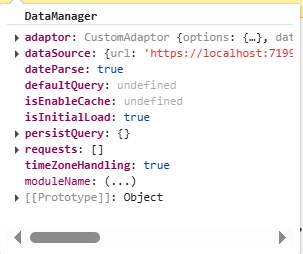

**Query**

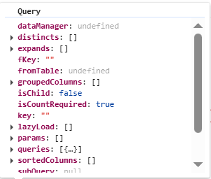



```ts
public override processQuery(dm: DataManager, query: Query): Object {
    dm.dataSource.url = 'https://localhost:xxxx/odata/orders'; // Here xxxx represents the port number.
    query.addParams('Syncfusion in ##Platform_Name## Grid', 'true'); // Add the additional parameter.
    return super.processQuery.apply(this, arguments as any);
}
```



```js
public override processQuery(dm, query) {
    dm.dataSource.url = 'https://localhost:xxxx/odata/orders'; // Here xxxx represents the port number.
    query.addParams('Syncfusion in ##Platform_Name## Grid', 'true'); // Add the additional parameter.
    return super.processQuery.apply(this, arguments);
}
```



### beforeSend

The `beforeSend` method is executed before a request is sent to the server. This function allows modifying parameters, request headers, and data, or performing validation before the request is processed. It accepts three arguments:

* `DataManager`: Provides the [dataSource](../../api/grid/#datasource) and `adaptor` value.

* `Request`: Used to send custom headers, such as setting the `Authorization` header.

* `Settings`: An optional argument that allows additional configurations.

**DataManager**


**Request**

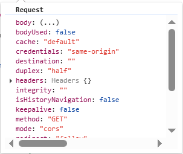

**Settings**

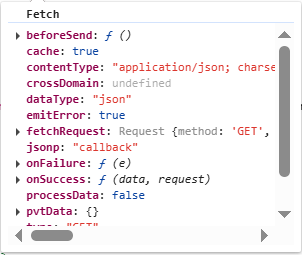



```ts
public override beforeSend(dm: DataManager, request: Request, settings?: any) {
  request.headers.set('Authorization', `true`);
  super.beforeSend(dm, request, settings);
}
```



```js
public override beforeSend(dm, request, settings) {
  request.headers.set('Authorization', `true`);
  super.beforeSend(dm, request, settings);
}
```



### processResponse

The `processResponse` method handles the response received from the server after an asynchronous request. It is responsible for parsing the response data, managing errors, and preparing the data for further processing. This method can accept multiple optional arguments, allowing customization based on specific requirements.



```ts
public override processResponse() {
   let i = 0;
    const original: any = super.processResponse.apply(this, arguments as any);
    // Adding serial number.
    if (original.result) {
      original.result.forEach((item: any) => setValue('SNo', ++i, item));
    }
    return original;
}
```


```js
public override processResponse() {
   let i = 0;
    const original= super.processResponse.apply(this, arguments);
    // Adding serial number.
    if (original.result) {
      original.result.forEach((item) => ej.base.setValue('SNo', ++i, item));
    }
    return original;
}
```



This guide provides detailed instructions on binding data and performing CRUD (Create, Read, Update, Delete) actions using the `CustomAdaptor` by extending the `ODataV4Adaptor` in your Syncfusion ##Platform_Name## Grid.

## Creating an Custom service

To configure a server with Syncfusion ##Platform_Name## Grid, you need to follow the below steps:



**Step 1:** Set up your development environment:

Before you start, make sure you have the following installed:

- .NET Core SDK
- Node.js
- Visual Studio or any other preferred code editor

**Step 2:** Create a new ASP.NET Core project:

Open Visual Studio and create an ASP.NET Core Web API project named **CustomAdaptor**.

**Step 3:** Install NuGet packages:

Using the NuGet package manager in Visual Studio (Tools → NuGet Package Manager → Manage NuGet Packages for Solution), install the **Microsoft.AspNetCore.OData** NuGet package.

**Step 4:** Add the Microsoft.TypeScript.MSBuild NuGet package to the project:

Using the NuGet package manager in Visual Studio (Tools → NuGet Package Manager → Manage NuGet Packages for Solution), install the [Microsoft.TypeScript.MSBuild](https://www.nuget.org/packages/Microsoft.TypeScript.MSBuild/) NuGet package.

**Step 5:** Configure the server:

In the `Program.cs` file of your project, configure the server to serve static files by adding the following code.

```cs
var app = builder.Build();

app.UseDefaultFiles();
app.UseStaticFiles();
```

Comment out the below line in `launchSettings.json`:

```json
    "https": {
      "commandName": "Project",
      "dotnetRunMessages": true,
      "launchBrowser": true,
     // "launchUrl": "swagger",
      "applicationUrl": "https://localhost:xxxx;http://localhost:xxxx",
      "environmentVariables": {
        "ASPNETCORE_ENVIRONMENT": "Development"
      }
    },
```
This configuration enables the server to locate and serve the `index.html` file.

**Step 6:** Model class creation:

Create a model class named **OrdersDetails.cs** in the server-side **Models** folder to represent the order data.




using System.ComponentModel.DataAnnotations;

namespace CustomAdaptor.Models
{
 public class OrdersDetails
    {
        public static List<OrdersDetails> order = new List<OrdersDetails>();
        public OrdersDetails()
        {

        }
        public OrdersDetails(
        int OrderID, string CustomerId, int EmployeeId, string ShipCountry)
        {
            this.OrderID = OrderID;
            this.CustomerID = CustomerId;
            this.EmployeeID = EmployeeId;
            this.ShipCountry = ShipCountry;
        }

        public static List<OrdersDetails> GetAllRecords()
        {
            if (order.Count() == 0)
            {
                int code = 10000;
                for (int i = 1; i < 10; i++)
                {
                    order.Add(new OrdersDetails(code + 1, "ALFKI", i + 0,  "Denmark"));
                    order.Add(new OrdersDetails(code + 2, "ANATR", i + 2, "Brazil"));
                    order.Add(new OrdersDetails(code + 3, "ANTON", i + 1, "Germany"));
                    order.Add(new OrdersDetails(code + 4, "BLONP", i + 3, "Austria"));
                    order.Add(new OrdersDetails(code + 5, "BOLID", i + 4, "Switzerland"));
                    code += 5;
                }
            }
            return order;
        }
        [Key]
        public int? OrderID { get; set; }
        public string? CustomerID { get; set; }
        public int? EmployeeID { get; set; }
        public string? ShipCountry { get; set; }
    }
}





**Step 7:** Build the entity data model:

To construct the entity data model for your ODataV4 service, utilize the `ODataConventionModelBuilder` to define the model's structure. Start by creating an instance of the `ODataConventionModelBuilder`, then register the entity set **Orders** using the `EntitySet<T>` method, where `OrdersDetails` represents the CLR type containing order details. 

```cs
[program.cs]
using Microsoft.OData.ModelBuilder;

// Create an ODataConventionModelBuilder to build the OData model.
var modelBuilder = new ODataConventionModelBuilder();

// Register the orders entity set with the OData model builder.
modelBuilder.EntitySet<OrdersDetails>("Orders");
```

**Step 8:** Register the ODataV4 services:

Once the entity data model is built, you need to register the ODataV4 services in your ASP.NET Core application. Here's how:

```cs
[program.cs]

// Add controllers with OData support to the service collection.
builder.Services.AddControllers().AddOData(
    options => options
        .Count()
        .AddRouteComponents("odata", modelBuilder.GetEdmModel()));
```

**Step 9:** Add controllers:

Finally, add controllers to expose the OData endpoints. Here's an example:

```cs
using CustomAdaptor.Models;
using Microsoft.AspNetCore.Mvc;
using Microsoft.AspNetCore.OData.Query;

namespace CustomAdaptor.Controllers
{
    [Route("[controller]")]
    [ApiController]
    public class OrdersController : ControllerBase
    {
        /// <summary>
        /// Retrieves all orders.
        /// </summary>
        /// <returns>The collection of orders.</returns>
        [HttpGet]
        [EnableQuery]
        public IActionResult Get()
        {
            var data = OrdersDetails.GetAllRecords().AsQueryable();
            return Ok(data);
        }
    }
}
```

**Step 10:** Run the application:

Run the application in Visual Studio. It will be accessible on a URL like **https://localhost:xxxx**. 

After running the application, you can verify that the server-side API controller is successfully returning the order data in the URL(https://localhost:xxxx/odata/Orders). Here **xxxx** denotes the port number.

## Connecting Syncfusion ##Platform_Name## Grid to an custom service extending the ODataV4 service

To integrate the Syncfusion ##Platform_Name## Grid into your TypeScript and ASP.NET Core project using Visual Studio, follow these steps:

**Step 1:** Create a package.json file:

Run the following command in the project root to create a `package.json` file.

```bash
npm init -y
```

**Step 2:** Install webpack and other dependencies:

```bash
npm i -D -E clean-webpack-plugin css-loader html-webpack-plugin mini-css-extract-plugin ts-loader typescript webpack webpack-cli
```

**Step 3:** Configure package.json scripts:

Replace the **scripts** property of `package.json` file with the following code.

```JSON
"scripts": {
  "build": "webpack --mode=development --watch",
  "release": "webpack --mode=production",
  "publish": "npm run release && dotnet publish -c Release"
},
```

**Step 4:** Create wwwroot folder:

Create a folder named `wwwroot` in the project root directory. This folder will contain static files served by the web server.

**Step 5:** Create webpack.config.js:

Create a file named `webpack.config.js` in the project root, with the following code to configure the Webpack compilation process.

```js
const path = require("path");
const HtmlWebpackPlugin = require("html-webpack-plugin");
const { CleanWebpackPlugin } = require("clean-webpack-plugin");
const MiniCssExtractPlugin = require("mini-css-extract-plugin");

module.exports = {
    entry: "./src/index.ts",
    output: {
        path: path.resolve(__dirname, "wwwroot"),
        filename: "[name].[chunkhash].js",
        publicPath: "/",
    },
    resolve: {
        extensions: [".js", ".ts"],
    },
    module: {
        rules: [
            {
                test: /\.ts$/,
                use: "ts-loader",
            },
            {
                test: /\.css$/,
                use: [MiniCssExtractPlugin.loader, "css-loader"],
            },
        ],
    },
    plugins: [
        new CleanWebpackPlugin(),
        new HtmlWebpackPlugin({
            template: "./src/index.html",
        }),
        new MiniCssExtractPlugin({
            filename: "css/[name].[chunkhash].css",
        }),
    ],
};
```

**Step 6:** Create a new directory named `src` in the project root for the client code.

**Step 7:** Install Syncfusion packages:

Open your terminal in the project’s root folder and install the required Syncfusion packages using npm.

```bash
npm install @syncfusion/ej2-grids --save
npm install @syncfusion/ej2-data --save
```

**Step 8:** Create `src/index.html` and add the following code:

```html
<!DOCTYPE html>
<html lang="en">
<head>
    <title>EJ2 Grid</title>
    <meta charset="utf-8" />
    <meta name="viewport" content="width=device-width, initial-scale=1.0" />
    <meta name="description" content="Typescript Grid Control" />
    <meta name="author" content="Syncfusion" />
    <link href="https://cdn.syncfusion.com/ej2/{{ site.ej2version }}/ej2-base/styles/bootstrap5.css" rel="stylesheet" />
    <link href="https://cdn.syncfusion.com/ej2/{{ site.ej2version }}/ej2-grids/styles/bootstrap5.css" rel="stylesheet" />
    <link href="https://cdn.syncfusion.com/ej2/{{ site.ej2version }}/ej2-buttons/styles/bootstrap5.css" rel="stylesheet" />
    <link href="https://cdn.syncfusion.com/ej2/{{ site.ej2version }}/ej2-popups/styles/bootstrap5.css" rel="stylesheet" />
    <link href="https://cdn.syncfusion.com/ej2/{{ site.ej2version }}/ej2-richtexteditor/styles/bootstrap5.css" rel="stylesheet" />
    <link href="https://cdn.syncfusion.com/ej2/{{ site.ej2version }}/ej2-navigations/styles/bootstrap5.css" rel="stylesheet" />
    <link href="https://cdn.syncfusion.com/ej2/{{ site.ej2version }}/ej2-dropdowns/styles/bootstrap5.css" rel="stylesheet" />
    <link href="https://cdn.syncfusion.com/ej2/{{ site.ej2version }}/ej2-lists/styles/bootstrap5.css" rel="stylesheet" />
    <link href="https://cdn.syncfusion.com/ej2/{{ site.ej2version }}/ej2-inputs/styles/bootstrap5.css" rel="stylesheet" />
    <link href="https://cdn.syncfusion.com/ej2/{{ site.ej2version }}/ej2-calendars/styles/bootstrap5.css" rel="stylesheet" />
    <link href="https://cdn.syncfusion.com/ej2/{{ site.ej2version }}/ej2-notifications/styles/bootstrap5.css" rel="stylesheet" />
    <link href="https://cdn.syncfusion.com/ej2/{{ site.ej2version }}/ej2-splitbuttons/styles/bootstrap5.css" rel="stylesheet" />

    <script src="https://cdnjs.cloudflare.com/ajax/libs/systemjs/0.19.38/system.js"></script>

    <script src="https://cdn.syncfusion.com/ej2/syncfusion-helper.js" type="text/javascript"></script>
</head>
<body>
    <div id='container'>
        <div id='Grid'></div>
    </div>
</body>
</html>
```

**Step 9:** Create `src/tsconfig.json` in the project and add the following content:

```json
{
  "compilerOptions": {
    "noImplicitAny": true,
    "noEmitOnError": true,
    "removeComments": false,
    "sourceMap": true,
    "target": "es5"
  },
  "exclude": [
    "node_modules",
    "wwwroot"
  ]
}
```

**Step 10:** Adding custom adaptor:

Create `src/CustomAdaptor.ts` file. Then, import `DataManager` and `ODataV4Adaptor` from `@syncfusion/ej2-data`. Extend the `ODataV4Adaptor` class to define custom adaptor. This adaptor implements three key methods: `processQuery`, `beforeSend`, and `processResponse`.

* The `processQuery` method modifies the API endpoint URL and sets additional parameters required for executing the query.

* The `beforeSend` method adds custom headers, such as the `Authorization` header, before sending the request.

* The `processResponse` method customizes the response by modifying data, such as adding a new field (`SNo`) to the dataset.




import {DataManager, ODataV4Adaptor, Query} from '@syncfusion/ej2-data';
import { setValue } from '@syncfusion/ej2-base';

export class CustomAdaptor extends ODataV4Adaptor {
    public override processQuery(dm: any, query: any): Object {
        dm.dataSource.url = 'https://localhost:xxxx/odata/orders'; // Here xxxx represents the port number.
        query.addParams('Syncfusion Grid', 'true'); // Add the additional parameter.
        return super.processQuery.apply(this, arguments as any);
   }

    public override beforeSend(dm: any, request: any, settings: any): void {
      request.headers.set('Authorization', `true`);
      super.beforeSend(dm, request, settings);
    }

    public override processResponse() {
        let i = 0;
        const original: any = super.processResponse.apply(this, arguments as any);

        // Adding serial number.
        if (original.result) {
        original.result.forEach((item: any) => setValue('SNo', ++i, item));
        }
        return original;
    }
}




**Step 11:** Adding Syncfusion Component:

Create `src/index.ts` file. In this file, import `DataManager` and `UrlAdaptor` from `@syncfusion/ej2-data`. Create a [DataManager](../../data/getting-started) instance specifying the URL of your API endpoint(https://localhost:xxxx/odata/Orders) using the `url` property. Then, set `CustomAdaptor` as the adaptor to handle data requests.




import { Grid, Page, Sort, Filter, Edit, Toolbar } from '@syncfusion/ej2-grids';
import { DataManager, ODataV4Adaptor } from '@syncfusion/ej2-data';
import { CustomAdaptor } from './CustomAdaptor';

Grid.Inject(Page, Sort, Filter, Edit, Toolbar);

let data: DataManager = new DataManager({
    url: 'https://localhost:xxxx/odata/Orders', // Here xxxx represents the port number.
    adaptor: new CustomAdaptor()
});


let grid: Grid = new Grid({
    dataSource: data,
    allowPaging: true,
    allowSorting: true,
    allowFiltering: true,
    toolbar:['Add','Edit','Update','Delete','Cancel','Search'],
    editSettings: { allowAdding: true, allowDeleting: true, allowEditing: true },
    columns: [
        { field: 'OrderID', headerText: 'Order ID', textAlign: 'Right', width: 120, isPrimaryKey: true, type: 'number' },
        { field: 'CustomerID', width: 140, headerText: 'Customer ID', type: 'string' },
        { field: 'EmployeeID', headerText: 'Employee ID', width: 140 },
        { field: 'ShipCountry', headerText: 'ShipCountry', width: 140 }
    ]
});

grid.appendTo('#Grid');





> Replace https://localhost:xxxx/odata/Orders with the actual **URL** of your API endpoint that provides the data in a consumable format (e.g., JSON).

**Step 12:** Install additional packages and build the project:

```bash
npm i @types/node
npm run build
```

**Step 13:** Run the project:

Run the project in Visual Studio.

The `wwwroot/index.html` file is served at **https://localhost:xxxx**.

With these steps, you have integrated the Syncfusion ##Platform_Name## Grid control with your ASP.NET Core project and set up the necessary client-side configuration using Webpack and TypeScript. This will allow the Grid to fetch data from your API and display it accordingly.




**Step 1:** Create a new ASP.NET Core project:

To create a new ASP.NET Core Web API project named CustomAdaptor, follow these steps:

* Open Visual Studio.
* Select "Create a new project"
* Choose **ASP.NET Core Web API** project template.
* Name the project **CustomAdaptor**.
* Click "Create"

**Step 2:** Install NuGet packages:

Using the NuGet package manager in Visual Studio (Tools → NuGet Package Manager → Manage NuGet Packages for Solution), install the Microsoft.AspNetCore.OData NuGet package.

**Step 3:** Configure the server:

In the `Program.cs` file of your project, configure the server to serve static files by adding the following code.

```cs
var app = builder.Build();

app.UseDefaultFiles();
app.UseStaticFiles();
```

Additionally, comment out the following line in the `launchSettings.json` file:

```json
    "https": {
      "commandName": "Project",
      "dotnetRunMessages": true,
      "launchBrowser": true,
     // "launchUrl": "swagger",
      "applicationUrl": "https://localhost:xxxx;http://localhost:xxxx",
      "environmentVariables": {
        "ASPNETCORE_ENVIRONMENT": "Development"
      }
    },
```

This configuration enables the server to locate and serve the `index.html` file.

**Step 4:** Model class creation:

Create a model class named **OrdersDetails.cs** in the server-side **Models** folder to represent the order data.




using System.ComponentModel.DataAnnotations;

namespace CustomAdaptor.Models
{
    public class OrdersDetails
    {
        public static List<OrdersDetails> order = new List<OrdersDetails>();
        public OrdersDetails()
        {

        }
        public OrdersDetails(
        int OrderID, string CustomerId, int EmployeeId, string ShipCountry)
        {
            this.OrderID = OrderID;
            this.CustomerID = CustomerId;
            this.EmployeeID = EmployeeId;
            this.ShipCountry = ShipCountry;
        }

        public static List<OrdersDetails> GetAllRecords()
        {
            if (order.Count() == 0)
            {
                int code = 10000;
                for (int i = 1; i < 10; i++)
                {
                    order.Add(new OrdersDetails(code + 1, "ALFKI", i + 0, "Denmark"));
                    order.Add(new OrdersDetails(code + 2, "ANATR", i + 2, "Brazil"));
                    order.Add(new OrdersDetails(code + 3, "ANTON", i + 1, "Germany"));
                    order.Add(new OrdersDetails(code + 4, "BLONP", i + 3, "Austria"));
                    order.Add(new OrdersDetails(code + 5, "BOLID", i + 4, "Switzerland"));
                    code += 5;
                }
            }
            return order;
        }
        [Key]
        public int? OrderID { get; set; }
        public string? CustomerID { get; set; }
        public int? EmployeeID { get; set; }
        public string? ShipCountry { get; set; }
    }
}





**Step 5:** Build the entity data model:

To construct the entity data model for your ODataV4 service, utilize the `ODataConventionModelBuilder` to define the model's structure. Start by creating an instance of the `ODataConventionModelBuilder`, then register the entity set **Orders** using the `EntitySet<T>` method, where `OrdersDetails` represents the CLR type containing order details. 

```cs
[program.cs]
using Microsoft.OData.ModelBuilder;

// Create an ODataConventionModelBuilder to build the OData model.
var modelBuilder = new ODataConventionModelBuilder();

// Register the orders entity set with the OData model builder.
modelBuilder.EntitySet<OrdersDetails>("Orders");
```

**Step 6:** Register the ODataV4 services:

Once the entity data model is built, you need to register the ODataV4 services in your ASP.NET Core application. Here's how:

```cs
// Add controllers with OData support to the service collection.
builder.Services.AddControllers().AddOData(
    options => options
        .Count()
        .AddRouteComponents("odata", modelBuilder.GetEdmModel()));
```
**Step 7:** Add controllers:

Finally, add controllers to expose the OData endpoints. Here's an example:

```cs
using CustomAdaptor.Models;
using Microsoft.AspNetCore.Mvc;
using Microsoft.AspNetCore.OData.Query;

namespace CustomAdaptor.Controllers
{
    [Route("[controller]")]
    [ApiController]
    public class OrdersController : ControllerBase
    {
        /// <summary>
        /// Retrieves all orders.
        /// </summary>
        /// <returns>The collection of orders.</returns>
        [HttpGet]
        [EnableQuery]
        public IActionResult Get()
        {
            var data = OrdersDetails.GetAllRecords().AsQueryable();
            return Ok(data);
        }
    }
}
```

**Step 8:** Run the Application 

Run the application in Visual Studio. It will be accessible on a URL like **https://localhost:xxxx**. 

After running the application, you can verify that the server-side API controller is successfully returning the order data in the URL(https://localhost:xxxx/odata/Orders). Here **xxxx** denotes the port number.

## Connecting Syncfusion ##Platform_Name## Grid to an custom service extending the ODataV4 service

To integrate the Syncfusion ##Platform_Name## Grid into your Javascript and ASP.NET Core project using Visual Studio, follow these steps:

**Step 1:** Create wwwroot folder:

Create a folder named `wwwroot` in the project root directory. This folder will contain static files served by the web server.

**Step 2:** Create JS folder:

Inside the wwwroot folder, create js folder to hold script file, respectively.

**Step 3:** Create index.html file:

Create an `index.html` file under the `wwwroot` folder and add the necessary HTML structure along with CSS and javaScript links to include Syncfusion ##Platform_Name## Grid dependencies.

```html
<!DOCTYPE html>
<html lang="en">
<head>
    <title>EJ2 Grid</title>
    <meta charset="utf-8">
    <meta name="viewport" content="width=device-width, initial-scale=1.0">
    <meta name="description" content="Javascript Grid Control">
    <meta name="author" content="Syncfusion">
    <link href="css/index.css" rel="stylesheet">
    <link href="https://cdn.syncfusion.com/ej2/{{ site.ej2version }}/ej2-base/styles/bootstrap5.css" rel="stylesheet">
    <link href="https://cdn.syncfusion.com/ej2/{{ site.ej2version }}/ej2-grids/styles/bootstrap5.css" rel="stylesheet">
    <link href="https://cdn.syncfusion.com/ej2/{{ site.ej2version }}/ej2-buttons/styles/bootstrap5.css" rel="stylesheet">
    <link href="https://cdn.syncfusion.com/ej2/{{ site.ej2version }}/ej2-popups/styles/bootstrap5.css" rel="stylesheet">
    <link href="https://cdn.syncfusion.com/ej2/{{ site.ej2version }}/ej2-richtexteditor/styles/bootstrap5.css" rel="stylesheet">
    <link href="https://cdn.syncfusion.com/ej2/{{ site.ej2version }}/ej2-navigations/styles/bootstrap5.css" rel="stylesheet">
    <link href="https://cdn.syncfusion.com/ej2/{{ site.ej2version }}/ej2-dropdowns/styles/bootstrap5.css" rel="stylesheet">
    <link href="https://cdn.syncfusion.com/ej2/{{ site.ej2version }}/ej2-lists/styles/bootstrap5.css" rel="stylesheet">
    <link href="https://cdn.syncfusion.com/ej2/{{ site.ej2version }}/ej2-inputs/styles/bootstrap5.css" rel="stylesheet">
    <link href="https://cdn.syncfusion.com/ej2/{{ site.ej2version }}/ej2-calendars/styles/bootstrap5.css" rel="stylesheet">
    <link href="https://cdn.syncfusion.com/ej2/{{ site.ej2version }}/ej2-notifications/styles/bootstrap5.css" rel="stylesheet">
    <link href="https://cdn.syncfusion.com/ej2/{{ site.ej2version }}/ej2-splitbuttons/styles/bootstrap5.css" rel="stylesheet">

    <script src="https://cdn.syncfusion.com/ej2/{{ site.ej2version }}/dist/ej2.min.js" type="text/javascript"></script>
    <script src="https://cdn.syncfusion.com/ej2/syncfusion-helper.js" type="text/javascript"></script>
</head>
<body>
    <div id="container">
        <div id="Grid"></div>
    </div>
    <script type="module" src="js/index.js"></script>
</body>
</html>
```


**Step 4:** Adding custom adaptor:

Create a `CustomAdaptor.js` file under the `wwwroot/js` folder. Then extend the `ej.data.ODataV4Adaptor` class to define custom adaptor. This adaptor implements three key methods: `processQuery`, `beforeSend`, and `processResponse`.

* The `processQuery` method modifies the API endpoint URL and sets additional parameters required for executing the query.

* The `beforeSend` method adds custom headers, such as the `Authorization` header, before sending the request.

* The `processResponse` method customizes the response by modifying data, such as adding a new field (`SNo`) to the dataset.




export class CustomAdaptor extends ej.data.ODataV4Adaptor {
    processQuery(dm, query) {
        dm.dataSource.url = 'https://localhost:xxxx/odata/orders'; // Here xxxx represents the port number.
        query.addParams('Syncfusion Grid', 'true'); // Add the additional parameter.
        return super.processQuery.apply(this, arguments);
    }

    beforeSend(dm, request, settings) {
        request.headers.set('Authorization', `true`);
        super.beforeSend(dm, request, settings);
    }

    processResponse() {
        let i = 0;
        const original = super.processResponse.apply(this, arguments);
        // Adding serial number.
        if (original.result) {
            original.result.forEach((item) => ej.base.setValue('SNo', ++i, item));
        }
        return original;
    }
}




**Step 5:** Adding Syncfusion Component:

Create a `index.js` file under the `wwwroot/js` folder. Create a [DataManager](../../data/getting-started) instance specifying the URL of your API endpoint(https://localhost:xxxx/odata/Orders) using the `url` property. Then, set `CustomAdaptor` as the adaptor to handle data requests.

```js
import { CustomAdaptor } from './CustomAdaptor.js';

var data = new ej.data.DataManager({
    url: 'https://localhost:xxxx/odata/orders', // Here xxxx represents the port number.
    adaptor: new CustomAdaptor()
});

var grid = new ej.grids.Grid({
    dataSource: data,
    columns: [
        { field: 'OrderID', headerText: 'Order ID', textAlign: 'Right', width: 120, type: 'number' },
        { field: 'CustomerID', width: 140, headerText: 'Customer ID', type: 'string' },
        { field: 'EmployeeID', headerText: 'Employee ID', width: 140 },
        { field: 'ShipCountry', headerText: 'ShipCountry', width: 140 }
    ]
});

grid.appendTo('#Grid');
```

**Step 5:** Run the project:

Now, run the project to see the Syncfusion ##Platform_Name## Grid connected to the API service in action.




## Handling filtering operation

To enable filtering in your web application using the custom adaptor, extend the OData support in your service configuration. This involves adding the `Filter` method within the OData setup, allowing data to be filtered based on specified criteria. Once configured, clients can use the **$filter** query option in requests to retrieve specific data entries.




// Create a new instance of the web application builder.
var builder = WebApplication.CreateBuilder(args);

// Create an ODataConventionModelBuilder to build the OData model.
var modelBuilder = new ODataConventionModelBuilder();

// Register the orders entity set with the OData model builder.
modelBuilder.EntitySet<OrdersDetails>("Orders");

// Add controllers with OData support to the service collection.
builder.Services.AddControllers().AddOData(
    options => options
        .Count()
        .Filter() // Use Filter method for filtering.
        .AddRouteComponents("odata", modelBuilder.GetEdmModel()));






import { Grid, Filter } from '@syncfusion/ej2-grids';
import { DataManager } from '@syncfusion/ej2-data';
import { CustomAdaptor } from './CustomAdaptor';

Grid.Inject(Filter);

let data: DataManager = new DataManager({
    url: 'https://localhost:xxxx/odata/Orders', // Here xxxx represents the port number.
    adaptor: new CustomAdaptor()
});

let grid: Grid = new Grid({
    dataSource: data,
    allowFiltering: true,
    columns: [
        { field: 'OrderID', headerText: 'Order ID', textAlign: 'Right', width: 120, type: 'number' },
        { field: 'CustomerID', width: 140, headerText: 'Customer ID', type: 'string' },
        { field: 'EmployeeID', headerText: 'Employee ID', width: 140 },
        { field: 'ShipCountry', headerText: 'ShipCountry', width: 140 }
    ]
});

grid.appendTo('#Grid');






import { CustomAdaptor } from './CustomAdaptor.js';

ej.grids.Grid.Inject(ej.grids.Filter);

var data = new ej.data.DataManager({
    url: 'https://localhost:xxxx/odata/orders', // Here xxxx represents the port number.
    adaptor: new CustomAdaptor()
});

var grid = new ej.grids.Grid({
    dataSource: data,
    allowFiltering: true,
    columns: [
        { field: 'OrderID', headerText: 'Order ID', textAlign: 'Right', width: 120, type: 'number' },
        { field: 'CustomerID', width: 140, headerText: 'Customer ID', type: 'string' },
        { field: 'EmployeeID', headerText: 'Employee ID', width: 140 },
        { field: 'ShipCountry', headerText: 'ShipCountry', width: 140 }
    ]
});

grid.appendTo('#Grid');





**Single column filtering**

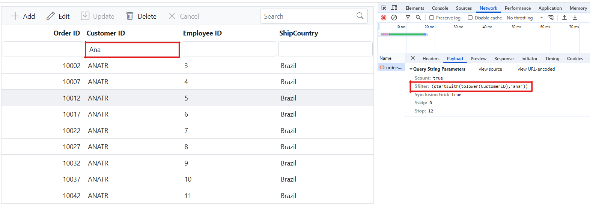

**Multi column filtering**

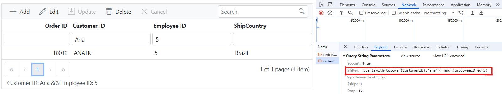

## Handling searching operation

To enable search functionality in your web application using the custom adaptor, extend the OData support in your service configuration. This requires adding the `Filter` method within the OData setup, allowing data to be filtered based on specified criteria. Once configured, clients can use the **$filter** query option in their requests to search for specific data entries.




// Create a new instance of the web application builder.
var builder = WebApplication.CreateBuilder(args);

// Create an ODataConventionModelBuilder to build the OData model.
var modelBuilder = new ODataConventionModelBuilder();

// Register the orders entity set with the OData model builder.
modelBuilder.EntitySet<OrdersDetails>("Orders");

// Add controllers with OData support to the service collection.
builder.Services.AddControllers().AddOData(
    options => options
        .Count()
        .Filter() // Use Filter method for searching.
        .AddRouteComponents("odata", modelBuilder.GetEdmModel()));






import { Grid, Toolbar } from '@syncfusion/ej2-grids';
import { DataManager } from '@syncfusion/ej2-data';
import { CustomAdaptor } from './CustomAdaptor';

Grid.Inject(Toolbar);

let data: DataManager = new DataManager({
    url: 'https://localhost:xxxx/odata/Orders', // Here xxxx represents the port number.
    adaptor: new CustomAdaptor()
});

let grid: Grid = new Grid({
    dataSource: data,
    toolbar:['Search']
    columns: [
        { field: 'OrderID', headerText: 'Order ID', textAlign: 'Right', width: 120, type: 'number' },
        { field: 'CustomerID', width: 140, headerText: 'Customer ID', type: 'string' },
        { field: 'EmployeeID', headerText: 'Employee ID', width: 140 },
        { field: 'ShipCountry', headerText: 'ShipCountry', width: 140 }
    ]
});

grid.appendTo('#Grid');







import { CustomAdaptor } from './CustomAdaptor.js';

ej.grids.Grid.Inject(ej.grids.Toolbar)

var data = new ej.data.DataManager({
    url: 'https://localhost:xxxx/odata/orders', // Here xxxx represents the port number.
    adaptor: new CustomAdaptor()
});

var grid = new ej.grids.Grid({
    dataSource: data,
    toolbar: ['Search'],
    columns: [
        { field: 'OrderID', headerText: 'Order ID', textAlign: 'Right', width: 120, type: 'number' },
        { field: 'CustomerID', width: 140, headerText: 'Customer ID', type: 'string' },
        { field: 'EmployeeID', headerText: 'Employee ID', width: 140 },
        { field: 'ShipCountry', headerText: 'ShipCountry', width: 140 }
    ]
});

grid.appendTo('#Grid');





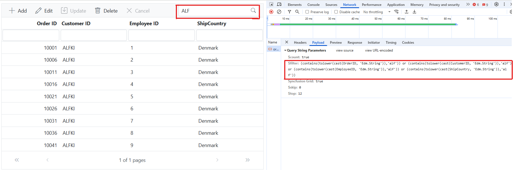

## Handling sorting operation

To enable sorting operations in your web application using the custom adaptor, first configure the custom adaptor to extend OData support in your service collection. This involves adding the `OrderBy` method within the OData setup, allowing data to be sorted based on specified criteria. Once enabled, clients can use the **$orderby** query option in their requests to sort data entries by desired attributes.




// Create a new instance of the web application builder. 
var builder = WebApplication.CreateBuilder(args);

// Create an ODataConventionModelBuilder to build the OData model.
var modelBuilder = new ODataConventionModelBuilder();

// Register the orders entity set with the OData model builder.
modelBuilder.EntitySet<OrdersDetails>("Orders");

// Add controllers with OData support to the service collection.
builder.Services.AddControllers().AddOData(
    options => options
        .Count()
        .OrderBy() // Use this method for sorting.
        .AddRouteComponents("odata", modelBuilder.GetEdmModel()));






import { Grid, Sort } from '@syncfusion/ej2-grids';
import { DataManager } from '@syncfusion/ej2-data';
import { CustomAdaptor } from './CustomAdaptor';

Grid.Inject(Sort);

let data: DataManager = new DataManager({
    url: 'https://localhost:xxxx/odata/Orders', // Here xxxx represents the port number.
    adaptor: new CustomAdaptor()
});

let grid: Grid = new Grid({
    dataSource: data,
    allowSorting: true,
    columns: [
        { field: 'OrderID', headerText: 'Order ID', textAlign: 'Right', width: 120, type: 'number' },
        { field: 'CustomerID', width: 140, headerText: 'Customer ID', type: 'string' },
        { field: 'EmployeeID', headerText: 'Employee ID', width: 140 },
        { field: 'ShipCountry', headerText: 'ShipCountry', width: 140 }
    ]
});

grid.appendTo('#Grid');






import { CustomAdaptor } from './CustomAdaptor.js';

ej.grids.Grid.Inject(ej.grids.Sort);

var data = new ej.data.DataManager({
    url: 'https://localhost:xxxx/odata/orders', // Here xxxx represents the port number.
    adaptor: new CustomAdaptor()
});

var grid = new ej.grids.Grid({
    dataSource: data,
    allowSorting: true,
    columns: [
        { field: 'OrderID', headerText: 'Order ID', textAlign: 'Right', width: 120, type: 'number' },
        { field: 'CustomerID', width: 140, headerText: 'Customer ID', type: 'string' },
        { field: 'EmployeeID', headerText: 'Employee ID', width: 140 },
        { field: 'ShipCountry', headerText: 'ShipCountry', width: 140 }
    ]
});

grid.appendTo('#Grid');





**Single column sorting**

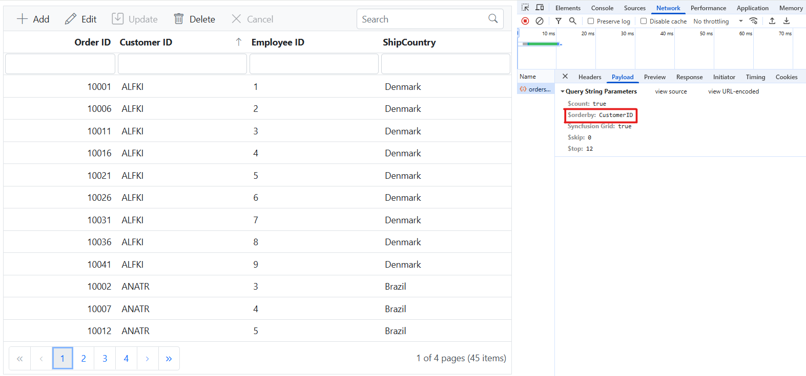

**Multi column sorting**

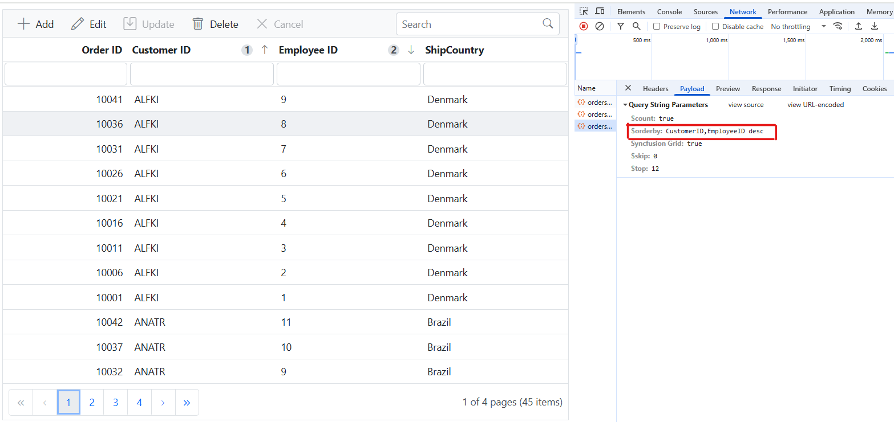

## Handling paging operation

To implement paging in your web application using the CustomAdaptor with OData, use the `SetMaxTop` method in your OData setup to define the maximum number of records returned per request. Once configured, clients can utilize the **$skip** and **$top** query options to specify the number of records to skip and retrieve, respectively. 




// Create a new instance of the web application builder.
var builder = WebApplication.CreateBuilder(args);

// Create an ODataConventionModelBuilder to build the OData model.
var modelBuilder = new ODataConventionModelBuilder();

// Register the orders entity set with the OData model builder.
modelBuilder.EntitySet<OrdersDetails>("Orders");

// Add controllers with OData support to the service collection.
builder.Services.AddControllers().AddOData(
    options => options
        .Count()
        .SetMaxTop(null)
        .AddRouteComponents("odata", modelBuilder.GetEdmModel()));






import { Grid, Page } from '@syncfusion/ej2-grids';
import { DataManager } from '@syncfusion/ej2-data';
import { CustomAdaptor } from './CustomAdaptor';

Grid.Inject(Page);

let data: DataManager = new DataManager({
    url: 'https://localhost:xxxx/odata/Orders', // Here xxxx represents the port number.
    adaptor: new CustomAdaptor()
});

let grid: Grid = new Grid({
    dataSource: data,
    allowPaging: true,
    columns: [
        { field: 'OrderID', headerText: 'Order ID', textAlign: 'Right', width: 120, type: 'number' },
        { field: 'CustomerID', width: 140, headerText: 'Customer ID', type: 'string' },
        { field: 'EmployeeID', headerText: 'Employee ID', width: 140 },
        { field: 'ShipCountry', headerText: 'ShipCountry', width: 140 }
    ]
});

grid.appendTo('#Grid');






import { CustomAdaptor } from './CustomAdaptor.js';

ej.grids.Grid.Inject(ej.grids.Page);

var data = new ej.data.DataManager({
    url: 'https://localhost:xxxx/odata/orders', // Here xxxx represents the port number.
    adaptor: new CustomAdaptor()
});

var grid = new ej.grids.Grid({
    dataSource: data,
    allowPaging:true,
    columns: [
        { field: 'OrderID', headerText: 'Order ID', textAlign: 'Right', width: 120, type: 'number' },
        { field: 'CustomerID', width: 140, headerText: 'Customer ID', type: 'string' },
        { field: 'EmployeeID', headerText: 'Employee ID', width: 140 },
        { field: 'ShipCountry', headerText: 'ShipCountry', width: 140 }
    ]
});

grid.appendTo('#Grid');





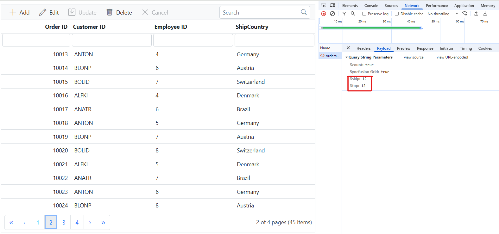

## Handling CRUD operations

To manage CRUD (Create, Read, Update, and Delete) operations using `CustomAdaptor`, follow the provided guide for configuring the Syncfusion ##Platform_Name## Grid for [editing](../../grid/editing/edit) and utilize the sample implementation of the `OrdersController` in your server application. This controller processes HTTP requests for CRUD operations, including GET, POST, PATCH, and DELETE.

To enable CRUD operations in the Syncfusion ##Platform_Name## Grid within an Angular application, follow the below steps:





import { Grid, Edit, Toolbar } from '@syncfusion/ej2-grids';
import { DataManager } from '@syncfusion/ej2-data';
import { CustomAdaptor } from './CustomAdaptor';

Grid.Inject( Edit, Toolbar);

let data: DataManager = new DataManager({
    url: 'https://localhost:xxxx/odata/Orders', // Here xxxx represents the port number.
    adaptor: new CustomAdaptor()
});

let grid: Grid = new Grid({
    dataSource: data,
    toolbar:['Add','Edit','Update','Delete','Cancel',],
    editSettings: { allowAdding: true, allowDeleting: true, allowEditing: true },
    columns: [
        { field: 'OrderID', headerText: 'Order ID', textAlign: 'Right', width: 120, isPrimaryKey: true, type: 'number' },
        { field: 'CustomerID', width: 140, headerText: 'Customer ID', type: 'string' },
        { field: 'EmployeeID', headerText: 'Employee ID', width: 140 },
        { field: 'ShipCountry', headerText: 'ShipCountry', width: 140 }
    ]
});

grid.appendTo('#Grid');







import { CustomAdaptor } from './CustomAdaptor.js';

ej.grids.Grid.Inject(ej.grids.Toolbar,ej.grids.Edit);

var data = new ej.data.DataManager({
    url: 'https://localhost:xxxx/odata/orders', // Here xxxx represents the port number.
    adaptor: new CustomAdaptor()
});

var grid = new ej.grids.Grid({
    dataSource: data,
    toolbar: ['Add', 'Edit', 'Update', 'Delete', 'Cancel'],
    editSettings: { allowAdding: true, allowDeleting: true, allowEditing: true },
    columns: [
        { field: 'OrderID', headerText: 'Order ID', textAlign: 'Right', width: 120, isPrimaryKey: true, type: 'number' },
        { field: 'CustomerID', width: 140, headerText: 'Customer ID', type: 'string' },
        { field: 'EmployeeID', headerText: 'Employee ID', width: 140 },
        { field: 'ShipCountry', headerText: 'ShipCountry', width: 140 }
    ]
});

grid.appendTo('#Grid');





> Normal/Inline editing is the default edit [mode](../../api/grid/editSettings/#mode) for the Syncfusion ##Platform_Name## Grid. To enable CRUD operations, ensure that the [isPrimaryKey](../../api/grid/column/#isprimarykey) property is set to **true** for a specific Grid column, ensuring that its value is unique.

**Insert Record**

To insert a new record into your Syncfusion ##Platform_Name## Grid, you can utilize the `HttpPost` method in your server application. Below is a sample implementation of inserting a record using the **OrdersController**:

```cs
/// <summary>
/// Inserts a new order to the collection.
/// </summary>
/// <param name="addRecord">The order to be inserted.</param>
/// <returns>It returns the newly inserted record detail.</returns>
[HttpPost]
[EnableQuery]
public IActionResult Post([FromBody] OrdersDetails addRecord)
{
    if (order == null)
    {
        return BadRequest("Null order");
    }

    OrdersDetails.GetAllRecords().Insert(0, addRecord);
    return Ok(addRecord);
}
```

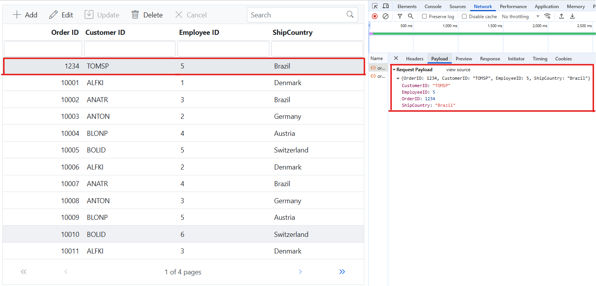

**Update Record**

Updating a record in the Syncfusion ##Platform_Name## Grid can be achieved by utilizing the `HttpPatch` method in your controller. Here's a sample implementation of updating a record:

```cs
/// <summary>
/// Updates an existing order.
/// </summary>
/// <param name="key">The ID of the order to update.</param>
/// <param name="updateRecord">The updated order details.</param>
/// <returns>It returns the updated order details.</returns>
[HttpPatch("{key}")]
public IActionResult Patch(int key, [FromBody] OrdersDetails updatedOrder)
{
    if (updatedOrder == null)
    {
        return BadRequest("No records");
    }
    var existingOrder = OrdersDetails.GetAllRecords().FirstOrDefault(o => o.OrderID == key);
    if (existingOrder != null)
    {
        // If the order exists, update its properties.
        existingOrder.CustomerID = updatedOrder.CustomerID ?? existingOrder.CustomerID;
        existingOrder.EmployeeID = updatedOrder.EmployeeID ?? existingOrder.EmployeeID;
        existingOrder.ShipCountry = updatedOrder.ShipCountry ?? existingOrder.ShipCountry;
    }
    return Ok(existingOrder);
}
```
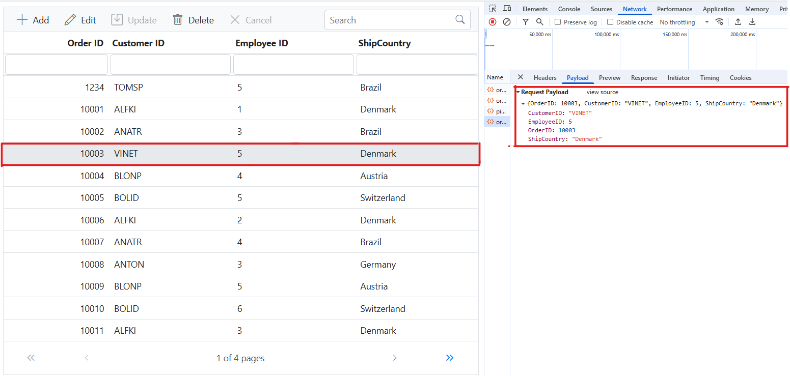

**Delete Record**

To delete a record from your Syncfusion ##Platform_Name## Grid, you can utilize the `HttpDelete` method in your controller. Below is a sample implementation:

```cs
/// <summary>
/// Deletes an order.
/// </summary>
/// <param name="key">The key of the order to be deleted.</param>
/// <returns>The deleted order.</returns>
[HttpDelete("{key}")]
public IActionResult Delete(int key)
{
    var order = OrdersDetails.GetAllRecords().FirstOrDefault(o => o.OrderID == key);
    if (order != null)
    {
        OrdersDetails.GetAllRecords().Remove(order);
    }
    return Ok(order);
}
```

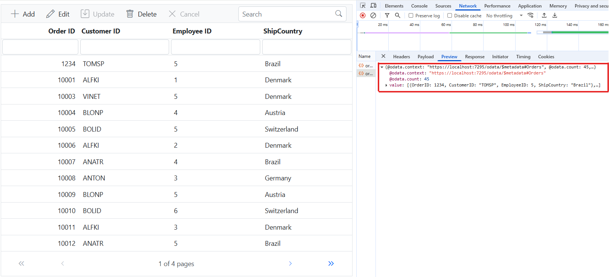